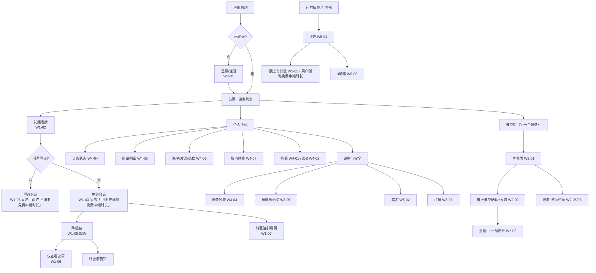

# 低保真线框稿 · 索引与 UI 需求清单

> 版本：2026-09-15 · 状态：**待评审**（低保真阶段）
> 产出：`docs/design/wireframe/`（本 README + `index.html` + **8 份线框页** + 1 份可点击原型）
> 定位：本文是 `商业化与计费设计` §13、`账号与管理系统设计` §4/§5、`需求规划-v2-P0P3重构` §1·§2·§3 的**界面落点**。
> 🔴 **本稿不新增任何产品决策**；出现的额度 / 设备数 / 价格等数值全部来自 SSOT `成本测算表` §0，并在界面标注「必须后端下发，不得硬编码」。

---

## 0. 本轮交付的是「低保真」，先划清边界

| | 低保真（本稿） | 高保真（本稿不做） |
|---|---|---|
| 解决 | 有哪些界面 · 每屏放什么 · 层级 · 流程 · 状态 · 异常 | 好不好看 · 品牌 · 视觉语言 |
| 内容 | 灰阶方块 + 灰条 + 交叉框 + 编号标注 | 颜色 / 字号 / 间距 / 圆角 / 阴影 / 图标 / 动效 |
| 用途 | **能不能过评审：有没有漏屏、有没有违规屏、流程断没断** | 交给前端按稿还原 |
| 交付物 | 8 份 HTML 线框 + 本清单 | Design Token + 组件规格 |

⚠️ 线框内**一律灰阶**；文档中的暗红只用于标注，**不是 UI 颜色**。

---

## 1. 结论先行：这个项目一共有 **53 个需要 UI 的位置**

判定标准沿用 `商业化与计费设计` §13.1 的四类区分，本稿把它从"计费"扩展到全部端：

| 层 | 判据 | 处理 | 数量 |
|---|---|---|---|
| **① UI = 已拍板决策的执行体** 🔴 | 没有这个界面，**已拍板的决策/合规项就被违反**（例：禁止静默降码率 ⇒ 必须有「码率已降」明示） | **P0 必做**，且**不参与 ROI 排序** | 36 |
| **② UI = 主主张的可见化** 🔑 | 主张只能靠界面被相信（例：「直连不消耗免费时长」⇒ 只能靠连接模式指示器） | **P0 必做** | 3 |
| **③ UI = 常规商业化 / 管理界面** | 缺了不影响合规，只影响转化与效率 | P0 粗糙版 → P1 完整版 | 14 |
| **④ 明确不做的界面** ⚠️ | 做了会把资产变负债 | **不做**，写进红线 | 7（不做） |

> ⚠️ 上表数值为 **2026-09-15 实测值**；旧版本曾写作 ① 24 / ② 6 / ③ 13，与清单不符，已订正。
> 2026-09-15 补稿①：**外接大屏 / 桌面模式** 出 4 帧（W6-05 ~ W6-08，均为 P1）⇒ ① +2 / ③ +2。
> 2026-09-15 补稿②：**全屏 / 沉浸式会话** 出 2 帧（`[D22]`，均为 P0）⇒ ① +1（[W1-11](w1-控制端-连接与额度.html#w1-11)）/ ③ +1（[W6-09](w6-移动端手持.html#w6-09)）。
> 2026-09-15 补稿③：**账号自助管理** 出 4 帧（`[D23]`，均为 P0）⇒ ① +3（[W3-07](w3-账号与设备管理.html#w3-07) / [W3-08](w3-账号与设备管理.html#w3-08) / [W3-09](w3-账号与设备管理.html#w3-09)）/ ③ +1（[W3-10](w3-账号与设备管理.html#w3-10)）。

🔴 **关键纪律（继承 §13.1）**：第 ①② 类界面**不是"体验优化"而是"决策的执行体"**。
**不得以「购买页更像商业化 / 更能转化」为由，把购买页排在连接模式指示器之前。**

---

## 2. 全量 UI 清单（按端 × 模块）

> 「层」= 上表分类；「帧」= 本稿线框编号，可点击跳转。
> 共 **53 个界面条目 ⇒ 56 张线框图**，层分布 **① 36 / ② 3 / ③ 14**，优先级 **P0 45 / P1 8**。
> 图比条目多 **3 张**，原因只有一个：<b>W1-05「降级链」一屏拆四态</b>（1 条目 → 4 图）。
> （W1-06 / W1-06b 是**两个独立条目**，各占一图；🔴 **W1-10 / W2-08 为 `[新增·D19]` 的音频两帧**，也是独立条目 9b / 15c；🔴 **W1-11 / W6-09 为 `[新增·D22]` 的全屏沉浸两帧**，是独立条目 9c / 44；🔴 **W3-07 ~ W3-10 为 `[新增·D23]` 的账号自助管理四帧**，是独立条目 21b / 21c / 21d / 21e。）

### 2.1 控制端（Windows / macOS）

| # | 界面 | 层 | 优先级 | 归属文档 | 帧 |
|---|---|---|---|---|---|
| 1 | 主界面（设备列表 + **常驻**连接模式指示器） | ② | P0 | v2 §1 · 商业化 §13.2#1 | [W1-01](w1-控制端-连接与额度.html#w1-01) |
| 2 | 连接中（先中继秒连 → 后台静默升级直连） | ② | P0 | v2 §1 连接建立策略 | [W1-02](w1-控制端-连接与额度.html#w1-02) |
| 3 | 会话窗口（窗口化 + 等比缩放 + 黑边 + 工具栏） | ① | P0 | v2 §1 D9 | [W1-03](w1-控制端-连接与额度.html#w1-03) |
| 4 | 免费中继余量（**默认折叠**，80% 才现） | ① | P0 | 商业化 §13.2#2 | [W1-04](w1-控制端-连接与额度.html#w1-04) |
| 5 | 降级链四态（预警 → 转直连 → 🔴降码率明示 → 终止前告知） | ① | P0 | 商业化 §13.2#3 · §8 · D11-5 | [W1-05a](w1-控制端-连接与额度.html#w1-05a) [b](w1-控制端-连接与额度.html#w1-05b) [c](w1-控制端-连接与额度.html#w1-05c) [d](w1-控制端-连接与额度.html#w1-05d) |
| 6 | 「仅查看」遮罩 · **资源式**（中继用尽且直连失败 ⇒ 画面冻结在最后一帧） | ① | P0 | 商业化 §13.2#4 | [W1-06](w1-控制端-连接与额度.html#w1-06) |
| 6b | 「仅查看」遮罩 · **权限式**（链路正常，对方收回操作权 ⇒ 画面仍在实时更新） | ① | P0 | v2 §2.3 观察模式 | [W1-06b](w1-控制端-连接与额度.html#w1-06b) |
| 7 | **「转直连」引导页** 🔴（本文唯一被称为"产品价值点"的一步） | ② | P0 | 商业化 §13.2#5 · §8② | [W1-07](w1-控制端-连接与额度.html#w1-07) |
| 8 | 显示设置（适应窗口 / 1:1 / 拉伸 + 缩放模式） | ① | P0 | v2 §1 D9 | [W1-08](w1-控制端-连接与额度.html#w1-08) |
| 9 | 断连后（中性说明；⚠️ **无促销弹窗**） | ① | P0 | 商业化 §13.4 红线⑤ | [W1-09](w1-控制端-连接与额度.html#w1-09) |
| 9b | 🔴 **音频控制条**（声音回传 / 按住说话对讲 / 纯音频模式三态）`[新增·D19]` | ① | P0 | v2 §1 **D19** · §4.4 · 商业化 §13.2**#9** | [W1-10](w1-控制端-连接与额度.html#w1-10) |
| 9c | 🔴 **全屏 / 沉浸式会话**（工具条自动隐藏 + 顶边悬停/快捷键唤出；🔴 **指示器降级为角标、不得消失**）`[新增·D22]` | ① | P0 | v2 §2.4.1 **D22** 红线 3 · 商业化 §13.2#1 · §13.5 | [W1-11](w1-控制端-连接与额度.html#w1-11) |

### 2.2 被控端（Windows / macOS / Android 免 Root）

| # | 界面 | 层 | 优先级 | 归属文档 | 帧 |
|---|---|---|---|---|---|
| 10 | 被控端主界面（本机 ID / 临时密码 / 状态） | ① | P0 | v2 §3.1 | [W2-01](w2-被控端.html#w2-01) |
| 11 | 首次被控确认页（**含反诈风险提示位，不得折叠**） | ① | P0 | v2 §1 E6 **A8** · §6.5 D17 | [W2-02](w2-被控端.html#w2-02) |
| 12 | 会话中 + **一键断开**（无挽留式二次确认） | ① | P0 | v2 §1 E6 **C3** | [W2-03](w2-被控端.html#w2-03) |
| 13 | 🔴 仅查看时的中性提示（**无金额/余额/充值**） | ① | P0 | 商业化 §13.4 红线② | [W2-04](w2-被控端.html#w2-04) |
| 14 | 资源档位（节能/均衡/高性能）+ 隐私屏 | ① | P0 | v2 §1 被控端 | [W2-05](w2-被控端.html#w2-05) |
| 15 | 设置总览（自启 / 无人值守 / 权限 / 更新） | ③ | P0 | v2 §3 | [W2-06](w2-被控端.html#w2-06) |
| 15b | 🔴 对方请求恢复操作（**原型跑出后补帧**：缺了它，控制端「请求控制」是死按钮） | ① | P0 | 可点击原型断点 #8 | [W2-07](w2-被控端.html#w2-07) |
| 15c | 🔴 **采音提示 + 一键静音**（🔴 **不得静默采音**；静音不得成为降级惩罚）`[新增·D19]` | ① | P0 | v2 §4.4 · 商业化 §13.4 **红线⑥** | [W2-08](w2-被控端.html#w2-08) |

### 2.3 账号（全端通用）

| # | 界面 | 层 | 优先级 | 归属文档 | 帧 |
|---|---|---|---|---|---|
| 16 | 登录 / 注册（含生物识别快捷登录） | ③ | P0 | v2 §1 认证 | [W3-01](w3-账号与设备管理.html#w3-01) |
| 17 | 找回密码 + **恢复码**（🔴 两种语义必须分开） | ① | P0 | 账号 §2 · v2 §6.2 | [W3-02](w3-账号与设备管理.html#w3-02) |
| 18 | 双重验证（2FA） | ① | P0 | v2 §1 认证 | [W3-03](w3-账号与设备管理.html#w3-03) |
| 19 | 设备列表（**三态** + 踢下线 + 「最久未连接」排序） | ① | P0 | 账号 §2.3/§2.4 · D12-1 | [W3-04](w3-账号与设备管理.html#w3-04) |
| 20 | 解绑两种语义（取消授权 ≠ 移除设备） | ① | P0 | 账号 §7 D12 铁律 | [W3-05](w3-账号与设备管理.html#w3-05) |
| 21 | 一键解绑全部 + **注销（3 步内可达 + 30 天可撤销）** | ① | P0 | v2 §1 E6 **A3** | [W3-06](w3-账号与设备管理.html#w3-06) |
| 21b | 🔴 **账号与安全（中转页）**（🔴 它是 A3「注销 3 步内可达」的界面证据，此前只有文字声明） `[新增·D23]` | ① | P0 | v2 §1 E6 **A3** · 账号 §2.1/§3.2 | [W3-07](w3-账号与设备管理.html#w3-07) |
| 21c | 🔴 **修改密码（已登录态）**（🔴 改密后其他设备全部重登 + 恢复码作废；**与「重置密码」不是同一入口**） `[新增·D23]` | ① | P0 | 账号 §2.1 · v2 §6.2 | [W3-08](w3-账号与设备管理.html#w3-08) |
| 21d | 🔴 **登录设备管理（账号维度）**（登录地 / 时间 / 活跃 + 「退出所有设备」+ 新设备登录通知；🔴 **与 W3-04「我的设备」不是同一列表**） `[新增·D23]` | ① | P0 | 账号 **§3.2** · v2 §6.2 | [W3-09](w3-账号与设备管理.html#w3-09) |
| 21e | **邮箱注册 / 绑定与换绑**（可选第二入口，🔴 不替代手机号；验证后才算绑定） `[新增·D23]` | ③ | P0 | 账号 §2.1 · v2 §6.2 | [W3-10](w3-账号与设备管理.html#w3-10) |

### 2.4 计费与个人中心

| # | 界面 | 层 | 优先级 | 归属文档 | 帧 |
|---|---|---|---|---|---|
| 22 | 购买页 · 最小版（非 iOS，只需跑通一条路径） | ③ | P0 | 商业化 §13.2#7 | [W4-01](w4-计费与个人中心.html#w4-01) |
| 23 | 购买页 · **iOS 版对照**（🔴 零站外支付引导） | ① | P0 | §13.4 红线④ · E6 **A5** | [W4-02](w4-计费与个人中心.html#w4-02) |
| 24 | 权益对比表（4 档 × N 权益；🔴 免费项显式写「免费」） | ③ | P1 | 商业化 §13.3 | [W4-03](w4-计费与个人中心.html#w4-03) |
| 25 | 个人中心 · 订阅状态（🔴 iOS / 非 iOS 两套） | ③ | P1 | 账号 §4.1 | [W4-04](w4-计费与个人中心.html#w4-04) |
| 26 | 用量明细页（🔑 反客诉主体） | ③ | P1 | 账号 §4.2 · 商业化 §13.3 | [W4-05](w4-计费与个人中心.html#w4-05) |
| 27 | 账单 / 发票 / 退款状态（含 §4.3.1 五条联动） | ③ | P1 | 账号 §4.3 | [W4-06](w4-计费与个人中心.html#w4-06) |
| 28 | 取消续费路径（🔴 不得比开通更难、不得藏深菜单） | ① | P0 | 账号 §4.4 | [W4-07](w4-计费与个人中心.html#w4-07) |
| 29 | 续费前 5 日提醒（🔴 合规硬项） | ① | P0 | 商业化 §13.2#8 · E6 **A4** | [W4-08](w4-计费与个人中心.html#w4-08) |

### 2.5 合规（跨端）

| # | 界面 | 层 | 优先级 | 归属文档 | 帧 |
|---|---|---|---|---|---|
| 30 | 首次连接隐私告知（中继会转发 + 直连只报起止） | ① | P0 | v2 §1 E6 **A2** | [W5-01](w5-合规实名与运营台.html#w5-01) |
| 31 | 实名认证入口 + **三类触发事件** | ① | P0 | v2 §1 E6 **A6** · §6.5 D17 | [W5-02](w5-合规实名与运营台.html#w5-02) |
| 32 | 未实名降级路径（不是拦截，是降级） | ① | P0 | v2 §6.5 | [W5-03](w5-合规实名与运营台.html#w5-03) |

### 2.6 运营操作台（内部工具，非用户可见）

| # | 界面 | 层 | 优先级 | 归属文档 | 帧 |
|---|---|---|---|---|---|
| 33 | 操作台首页 · **3 查** | ③ | P0 | 账号 §5.1 · D12-6 | [W5-04](w5-合规实名与运营台.html#w5-04) |
| 34 | 查额度与计量明细（🔴 **与用户侧同源同一份数据**）<br /><span class="tiny">⚠️「额度」是本台内部用词；用户侧（W4-05）同一份数据叫「免费中继时长」</span> | ① | P0 | 账号 §5.1#2 · §4.2 | [W5-05](w5-合规实名与运营台.html#w5-05) |
| 35 | **3 动作**（调额度 / 封禁加白 / 退款跳转）+ 权限与审计 | ① | P0 | 账号 §5.1 · §5.4 | [W5-06](w5-合规实名与运营台.html#w5-06) |

### 2.7 移动端（Android 控制端 + 外接大屏）

| # | 界面 | 层 | 优先级 | 归属文档 | 帧 |
|---|---|---|---|---|---|
| 36 | 设备列表（移动端） | ③ | P0 | v2 §2.3.1 | [W6-01](w6-移动端手持.html#w6-01) |
| 37 | 手持会话（放大镜 / 双模指针 / 焦点跟随） | ① | P0 | v2 §2.3.1 | [W6-02](w6-移动端手持.html#w6-02) |
| 38 | 纯观察模式 | ③ | P0 | v2 §2.3.1 | [W6-03](w6-移动端手持.html#w6-03) |
| 39 | PC→手机（帮父母排障）控制端 | ① | P0 | v2 §1 **D10** | [W6-04](w6-移动端手持.html#w6-04) |
| 40 | 🔴 **检测到外接显示器 · 进入大屏布局的确认**（必须可拒绝 + 可记住）`[新增·2026-09-15]` | ① | P1 | v2 §2.3.2 · **D5/D6** | [W6-05](w6-移动端手持.html#w6-05) |
| 41 | **大屏布局会话**（多窗口 / 可见光标 / 远端右键菜单 / 拖拽调整）<br /><span class="tiny">⚠️ 状态、层、优先级、红线同向；不得与 D9 混用</span> | ③ | P1 | v2 §2.3.2 布局·输入 | [W6-06](w6-移动端手持.html#w6-06) |
| 42 | **外接模式设置**（跨系统快捷键换算 / 组合键直通 / 缩放） | ③ | P1 | v2 §2.3.2 输入 | [W6-07](w6-移动端手持.html#w6-07) |
| 43 | 🔴 **机型不支持 DP Alt Mode 时的中性说明**（🔴 **不得引导付费**） | ① | P1 | v2 §2.3.2 机型前提 | [W6-08](w6-移动端手持.html#w6-08) |
| 44 | 🔴 **沉浸式手持**（隐藏系统栏 + 边缘手势唤出 + 指针/键盘切换 + 🔴 **退出两条路径**）`[新增·D22]`<br /><span class="tiny">⚠️ 内容归属**手持组**（W6-01 ~ W6-04），只因此为补稿而编号排后</span> | ③ | P0 | v2 §2.4.1 **D22** 红线 3 · §2.3.1 移动端 | [W6-09](w6-移动端手持.html#w6-09) |

> ⚠️ **编号口径**：W6-05 ~ W6-08 是 **2026-09-15 补稿**（原列在 §7「未出稿」表，属 P1 增强路径）。
> **#44 / W6-09** 是 **`[D22]` 补稿**（全屏 / 沉浸式），P0，内容归属手持组。
> 以下 §2.8 的「不做」项原用 #40–#44，与本节编号冲突，已改为 **N1–N5**（它们不是 UI 清单条目，不应占用清单编号）。

### 2.8 明确**不做**的界面（红线，共 7 项 · 编号 N1–N7）

| # | 不做的界面 | 理由 | 出处 |
|---|---|---|---|
| N1 | ⚠️ 断连瞬间的**促销弹窗** | 把 D1 透明度资产直接转成「他就是在卖我流量」的负债 | §13.4 红线⑤ |
| N2 | ⚠️ 被控端任何**金额 / 余额 / 充值**字样 | 帮爸妈调手机时弹出「余额不足」= 摧毁手机被控免费钩子 | §13.4 红线② |
| N3 | ⚠️ iOS 版任何**站外支付引导** | App Store 3.1.1 拒审 | §13.4 红线④ |
| N4 | ⚠️ 常驻贴脸的**余量催费 UI** | 指示器从「告知」变「催费」，透明度资产降级为广告位 | §13.4 红线① |
| N5 | ⚠️ 用户端任何**推广位 / 活动中心 / 弹窗运营位** | P0 不做，本轮明确排除 | 本稿决定 |
| N6 | ⚠️ **外接大屏机型不支持时的任何购买引导** | 与 N2 同源：硬件能力问题不得包装成计费问题 | v2 §2.3.2 · [W6-08](w6-移动端手持.html#w6-08) |
| N7 | ⚠️ 远控画面**「无线投屏」入口 / 承诺** | Miracast 多一跳编码 + 两跳传输，D5 只承诺 USB-C 有线直出 | v2 §2.3.2 · D5 |

> ⚠️ **2026-09-15 变更**：原编号 #40–#44 与 §2.7 新补稿条目冲突，改为 **N1–N5**；同时新增 **N6 / N7**（外接大屏补稿带出的两条同源红线）。
> 本表**不计入** UI 清单（§1 / §2 的 47 条目不含「不做」项）。

---

## 3. 信息架构（IA）



---

## 4. 五条关键用户流（评审时按流走，比按屏走更容易发现断点）

### 流 1 · 首次连接（含主主张落地）——最关键
```
点「连接」→ 连接中（先中继秒连，W1-02）
→ 连上后顶部一次性提示：本次「直连」或「中继」（W1-03）
→ 若中继：常驻指示器显示「中继 · 本次剩余免费中继时长 xx 分钟」（W1-01/W1-04）
→ 首次连接前必须过隐私告知（W5-01）
```
🔴 断点检查：**若不显示「本次连接方式」，D1/D8 主主张就没有任何执行体**。

### 流 2 · 免费中继时长消耗到降级到终止（四态链）
```
余量 80% → 常驻指示器变为可见（W1-04 态 B）
→ 余量 20% → 预警横幅（W1-05 态 A）
→ 余量 0 → 转直连引导页（W1-07）+ 中止中继
→ 若直连不可用 → 🔴「画质已降低，因为中继时长用尽」明示（W1-05 态 C）
→ 仍不可用 → 终止前告知 + 转「仅查看」（W1-05 态 D / W1-06）
```
🔴 铁律：**四态一个都不能省**。省掉「码率已降」= 违反「禁止静默降码率」已拍板决策。

### 流 3 · 被控端授权（含反诈）
```
对方发起 → 本机弹「首次被控确认页」（W2-02）
→ 页面必须同时呈现：谁在连、能做什么、反诈提示 3 句（不得折叠）
→ 同意 → 会话中（W2-03），可一键断开（点一次即断，无挽留）
→ 对方进入仅查看 → 本机收中性提示（W2-04，🔴 无金额）
→ 对方请求恢复操作 → 本机收「允许操作 / 保持仅查看」（W2-07，🔴 默认保持仅查看）
```

### 流 4 · 退款（§4.3.1 五条联动）
```
订单列表 → 申请退款 → 系统硬判定「7 天内 且 中继用量 = 0」
→ 通过 → 🔴 立即回收（订阅终止 + 未用完的免费中继时长作废）
→ 查看退款状态（渠道后台回填）
→ 同账号 180 天内第 2 次 → 转人工
```

### 流 5 · 注销（3 步内可达）
```
我的 → 设置 → 账号与安全 → 注销账号（≤3 步）
→ 告知 30 天冷静期 + 期间可撤销
→ 30 天内：仅标记不删
→ 期满：级联删身份数据 + 匿名化计量/审计流水（🔴 自动任务）
```

---

## 5. 🔴 红线在界面上的落点（评审自检表）

| 红线 / 阻塞项 | 出处 | 执行体（本稿） | 缺失后果 |
|---|---|---|---|
| 禁止静默降码率 | D11-5 | W1-05 态 C | 已拍板决策被违反 |
| 全站「端到端加密」字样清零 | E6 A2 | W5-01 文案 | 合规风险 |
| 中继转发 + 直连只报起止，须明示 | E6 A2 | W5-01 | 合规风险 |
| 技术状态 ≠ 商业计数 | §13.4① | W1-01 / W1-04（状态常驻、余量折叠） | 透明度资产→广告位 |
| 🔴 计费 UI 只在控制端 | §13.4② | W2-04 全帧 | 手机被控钩子失效 |
| 🔴 免费项显式标「免费」 | §13.4③ | W4-03 表 | 钩子反向失效 |
| 🔴 iOS 零站外支付引导 | §13.4④ | W4-02 | 拒审 |
| ⚠️ 无断连促销弹窗 | §13.4⑤ | W1-09 | 资产→负债 |
| 注销 3 步内 + 30 天可撤销 | E6 A3 | W3-06 | 合规 |
| 🔴 A3「注销 3 步内可达」须有**界面证据** | `[D23]` | [W3-07](w3-账号与设备管理.html#w3-07)（我的 → 设置 → 账号与安全 → 注销 = 3 步） | 只有文字声明、无界面 ⇒ 合规声明无法自证 |
| 🔴 已登录态**改密入口存在**（≠ 忘记密码） | `[D23-1]` | [W3-08](w3-账号与设备管理.html#w3-08) | 全稿只有「忘记密码」（未登录、凭持有物）⇒ **已登录用户主动改密无处可去** |
| 🔴 改密后**其他设备全部强制重新登录 + 恢复码作废** | `[D23-1]` | [W3-08](w3-账号与设备管理.html#w3-08) | 改密 = 秘密泄露的自救动作，旧会话不失效则自救无效 |
| 🔴 **登录设备（账号维度）≠ 我的设备（被控端硬件）** | `[D23]` / 账号 §3.2 | [W3-09](w3-账号与设备管理.html#w3-09) ↔ [W3-04](w3-账号与设备管理.html#w3-04) | 同一套「设备」话术指两件事 ⇒ 用户与客服相互误解（🔴 **两表不得合并**） |
| 🔴 新设备登录**必须通知已有设备** | `[D23]` / 账号 §3.2 | [W3-09](w3-账号与设备管理.html#w3-09) | 发现账号被盗的关键；🔴 **与 2FA 不可互相替代** |
| 🔴 邮箱**不得解绑最后一个可用的身份入口** | `[D23-2]` / 账号 §2.1 | [W3-10](w3-账号与设备管理.html#w3-10) | 否则账号会变成**无法找回**（永久锁死且无客服通道） |
| 续费前 5 日提醒 | E6 A4 | W4-08 | 合规 |
| 取消续费不得比开通更难 | 账号 §4.4 | W4-07 | 暗黑模式投诉 |
| 实名触发链路可用 | E6 A6 / D17 | W5-02 / W5-03 | 合规 |
| 反诈提示位不得折叠 | E6 A8 | W2-02 | 合规 |
| 一键断开无挽留 | E6 C3 | W2-03 | 体验红线 |
| 🔴 恢复控制需被控端应答 | 原型断点 #8 | W2-07 | 控制端「请求控制」成为死按钮 |
| 设备数 150 台 = **免费版优势行** | D15 | W4-03 | 会被截图打脸 |
| 🔴 全屏 / 沉浸式期间**连接模式指示器不得消失** | `[D22]` 红线 3 | [W1-11](w1-控制端-连接与额度.html#w1-11) / [W6-09](w6-移动端手持.html#w6-09) | 为了沉浸感顺手删掉指示器 ⇒ D1 主主张在**使用时间最长的状态下**失效 |
| 数值不得硬编码 | §13.5 | 全帧标注「后端下发」 | ✅ **`[D18]` 已降低该风险**：报价到手 = **录一个成本参数**（非改代码 / 改文档）+ 系统自动重算下游 ⇒ 返工面从「整环境」收窄到「一次参数录入」（`成本测算表` §3.4） |

---

## 6. 低保真规范（本轮约定）

| 项 | 约定 |
|---|---|
| 颜色 | 灰阶（`#2b2b2b` / `#bdbdbd` / `#f5f5f5`）；标注层暗红仅说明 |
| 画布 | 标准尺寸：桌面 `830×500`、窗口 `760×440`、移动 `330×620`、面板 `430×470` / `430×300`。**单帧可因内容加高**（如 W5-06 `700`、W6-07 `560`、W6-02 `640`、W6-04 `474`、**W5-03 `530`**、**W1-08 `530`**、W4-05 `460`、W1-04 `346`、🔴 **W3-07 `560`**、W3-08 `480`、W3-10 `470`、W3-01 `464`、W3-06 `460`），以帧内 inline `height` 为准；改稿后由 `tools/wireframe-selfcheck.mjs` 校验无裁切 |
| 文字 | 灰条 = 正文；交叉框 = 图形/画面；短标签用真字（低保真允许真文案，便于评审） |
| 标注 | 屏内红圈数字 ①②③ ↔ 下方说明列表，一一对应 |
| 状态 | 每屏必须标出「正常 / 空态 / 异常 / 权限不足」中**至少覆盖到的那一种** |
| 命名 | `W{端}-{序号}`，例 `W1-05` = 控制端第 5 帧 |
| 交付 | 单页 HTML，双击可看，不依赖构建 |
| 几何 | ⚠️ `.screen` 固定高度 + `overflow:hidden` ⇒ 子元素超界是**静默裁切**。改稿后必须跑 `node tools/wireframe-selfcheck.mjs`（画布裁切 / 横向溢出 / 锚点可达 / 原型 JS 报错，退出码 `0` 才能提交；明细同时落盘到 `tools/selfcheck-report.json`，已 gitignore） |
| 交互态 | **本稿一律不含** `:hover` / `:focus` / `:disabled`，且伪按钮用 `<span>` 而非 `<button>` ⇒ **高保真阶段必须补齐**，否则键盘用户与无障碍评审过不了 |

### 6.1 术语表（全稿强制）

| 场合 | 用词 |
|---|---|
| **用户可见界面 · 免费档配额** | 用「**免费中继时长**」 |
| **用户可见界面 · 付费买到的 / 通用场合** | 用「**中继时长**」（加「免费」会削弱付费理由；退款场景还会被读成"免费的东西凭什么不退"） |
| **运营台 / 开发文档**（内部工具） | 可用「额度」（财务语言，用户侧不得出现） |
| **被控端**（Windows / macOS / Android 面板） | **任何位置不得出现「额度」**，且不得出现金额 / 催费 / 推销字样（红线①②的执行面） |

> ⚠️ **2026-09-15 修订**：原规则是「用户可见一律写免费中继时长」，结果**付费时长也被叫成"免费"**
> （[W4-01](w4-计费与个人中心.html#w4-01) 「更大的**免费**中继时长」、[W4-06](w4-计费与个人中心.html#w4-06)
> 「未用完的**免费**中继时长立即作废」、[W3-06](w3-账号与设备管理.html#w3-06) 同）——
> 属术语**反向漂移**（为了统一而不统一），已按上表分档。

---

## 7. 本轮未出稿的部分（有意为之）

| 未出稿 | 原因 | 何时做 |
|---|---|---|
| 文件传输面板 / 剪贴板 | P0 但属"照抄行业惯例"的常规界面，无争议 | P1 视觉阶段补 |
| 多显示器切换（**被控端**多屏「同时显示」，P1 部分） | P0 基础已在 [W1-08](w1-控制端-连接与额度.html#w1-08) 出稿；P1 的「同时显示」未出稿 | 与 D9 一起进视觉阶段 |
| **智能眼镜桥接**（显示型眼镜 = 显示 + 音频输出） | **P2**，且是「旗帜」不是「引擎」（受众窄 + 硬件前提苛刻）⇒ P0 阶段出图 ROI 低 | P2 排期 |
| Web 控制端 | P0 但为"一次性授权码免登录"单页；🔴 **沉浸式有硬天花板**（Fullscreen API **仅用户手势可触发** · **ESC 提示浏览器强制保留、页面不得拦截** · **F11 页面拿不到按键**）⇒ 🔴 **不得对外承诺「与客户端一致的沉浸感」**（`[D22]`，见 §11.6） | 单独一稿，建议与授权码流程一起设计 |
| 弱网自动降级 P1 项 | P1 | P1 |
| 邀请 / 家庭互助白名单的用户侧入口 | 与 §9.3 政策绑定，需先定运营口径 | 待政策定稿 |
| 🔴 **账号被锁的应急通道**（账号设计 §2.5 有完整规格） | 触发概率低；🔴 **`[D23]` 补稿时已登记但未出稿** | 与客服工单流程一起设计 |
| 🔴 **关闭 2FA 的二次验证**（[W3-03](w3-账号与设备管理.html#w3-03) note ③ 自称未画） | 高风险动作的**反向路径**（开启画了、关闭未画） | 与 W3-03 一起进视觉阶段 |
| 🔴 **恢复码「注册时首次展示」**（账号设计 §2.2 要求） | [W3-02](w3-账号与设备管理.html#w3-02) 只画了「查看 / 重新生成」；🔴 **首次展示（注册成功后唯一一次）未出稿** | 高保真阶段补 |
| 🔴 **头像 / 昵称 / 个人资料页** | **P0 有意不做**（`[D23]` 拍板）：本产品是**工具**不是社交产品，资料页无转化价值；P0 的「用户信息」= **手机号 + 邮箱 + 密码 三件**（`账号与管理系统设计` §2.8） | P1（若做） |

> ✅ **已移出本表（2026-09-15）**：**外接大屏 / 桌面模式**原列在此表，现已补稿 4 帧 ——
> [W6-05](w6-移动端手持.html#w6-05) 切换确认 · [W6-06](w6-移动端手持.html#w6-06) 大屏布局会话 ·
> [W6-07](w6-移动端手持.html#w6-07) 键鼠与显示设置 · [W6-08](w6-移动端手持.html#w6-08) 机型不支持的中性说明（见 §2.7 编号 #40–#43）。
>
> ✅ **已从缺口变为已出稿（2026-09-15 · `[D23]`）**：**修改密码**·**账号与安全中转页**·**登录设备管理**·**邮箱注册与绑定** 四件
> 此前**全部不在任何清单里**，现已出稿 [W3-07](w3-账号与设备管理.html#w3-07) ~ [W3-10](w3-账号与设备管理.html#w3-10)（见 §11.7）。
> ⚠️ **仍剩一个技术债**：[W3-01](w3-账号与设备管理.html#w3-01) 登录 label 写「手机号 / 邮箱」—— 本帧已补邮箱注册路径使其不再悬空，
> 但 **v2 §6.2 三层模型的入口口径仍是 密码 / 短信 / 恢复码**，邮箱只作可达性补充（`[D23-2]`）。
>
> ⚠️ **智能眼镜仍不出稿**（本轮决定）：它是 P2 的「旗帜」而非「引擎」，且硬件前提（DP Alt Mode / BLE HID / A2DP）
> 与受众规模都不支持在 P0 阶段投入视觉资源；需求侧口径已冻结在 v2 §4.1–4.4，出图时不再重新决策。

---

## 8. 六个低保真问题 · ✅ 已定案（2026-09-14，用户「按你的建议来」）

| # | 问题 | 结论 | 落点 |
|---|---|---|---|
| 1 | 「免费中继时长」还是「免费时长」？ | **统一用「免费中继时长」** | 全稿已统一（W1-04 / W2 / W6） |
| 2 | 首连提示：Toast 3 秒 vs 会话内常驻一行？ | **会话窗口内常驻一行**（Toast 会消失，主主张需要被反复看到） | W1-03 顶部提示行 |
| 3 | 余量折叠态是否显示百分比？ | **不显示百分比**，只给「约剩 xx 分钟」这类粗粒度 | W1-04 态 B |
| 4 | 仅查看时被控端是否也提示？ | **显示中性提示**（否则被控端不懂为什么操作不动了） | W2-04 |
| 5 | 运营台调额度是否强制填原因？ | **强制填写 + 超阈值需第二人复核** | W5-06 |
| 6 | 是否先把 W1/W2 做成可点击 HTML 原型？ | **✅ 已做** | `proto-流程原型.html`（见 §9） |

**顺带的措辞纪律**（来自第 1 问）：对外只用「免费中继时长」；**不用「额度」**
（额度是财务语言，会让用户以为在管钱包）。

---

## 9. 可点击原型（2026-09-14 新增）

文件：`docs/design/wireframe/proto-流程原型.html`（双击即可，仍无构建 / 无依赖）。

把 W1 + W2 的静态帧接成一条能走通的流程，**左右双端同步**：点左边控制端，右边被控端跟着变
—— 用来回答静态帧答不了的那个问题：**「按键点下去之后，下一步在哪儿？」**

内置两条自动化纪律（每次界面变化都跑一次）：

- 🔴 **被控端红线断言**：被控端面板任一时刻出现**金额或催费语言**，页面顶部立刻报警。
  判定不看死词表，而是**两级语义**：先试**金额模式**（`¥/￥/$ + 数字`、`X 元`、`X 元/月`、`售价|价格|定价|报价|立减|满减|返现|限时|促销`），
  再试**计费模式**（`余额|充值|续费|付费|支付|钱包|账单|发票|订单|购买|订购|订阅|套餐|会员|计费|扣费|欠费|额度|权益|收费|优惠|折扣`）。
- 🔴 **控制端禁用词断言**：控制端只要不在初始列表页，就再套一层**转化词模式**
  （`余额|充值|续费|付费|支付|钱包|账单|发票|购买|订购|订阅|套餐|会员|升级可|开通|限时|优惠|折扣|立减|满减`）。
- ✅ **两侧都有白名单与反例区**：短语「不需要付费 / 无需付费 / 不额外收费 / 免费中继时长 / 免费版」不算违规；
  `<code>.no-zone</code>` 里的内容（评审用的「反面例子」）不参与判定。
- ✅ **断言本身被反例验证过**：8 例正对照（该报的 4 例全报、该放行的 4 例全放行）见 §11。

**实测结论（2026-09-15）**：auto 一键跑完 ①→⑩ 全部步骤，落到「已断开」；**红线告警 0 次**；
JS 报错 0；横向溢出 0；画布静默裁切 0（八页全部通过 `tools/wireframe-selfcheck.mjs`）。

### 9.1 这条流程跑出来的 9 个断点

| # | 断点 | 处置 |
|---|---|---|
| 1 | 余量耗尽 ≠ 必须打扰用户：直连可用时只该看到一条横幅消失，**引导页只能在「直连也失败」时出现** | 已固化进原型 |
| 2 | 「已切换为直连」后又回退 ⇒ 同一行先后说两句相反的话，用户会怀疑前一句是假消息 | 待定：宣布直连前先稳定 ~10 秒，或文案改为「当前为直连（网络变化时会自动回退）」 |
| 3 | 引导页打开时画面必须是**冻结的最后一帧**（不能黑屏、不能继续动） | 需后端能力：冻结帧 + 文案告知 |
| 4 | 首连提示行：常驻 vs 淡出 | 建议：首连后常驻 ~15 秒淡出，**底部指示器常驻**（技术状态常驻、商业说明不必常驻） |
| 5 | 降码率时被控端**不告知**（画质是控制端的事，让被帮助的一方读 1080p 只会联想到「是不是要花钱」） | ✅ 已回写 W2-04 说明 |
| 6 | 「总是允许此设备」与「90 天未连接」的信任降级耦合（记住设备后是否重弹确认页） | 需与 D12-2 一起定案 |
| 7 | 对方先断开时，控制端不得模态拦人（只给一条非阻塞提示 + 重连按钮） | 已进原型 |
| 8 | 🔴 **W2 缺「允许恢复操作」**：恢复控制需双方同意，被控端原先只有「断开」⇒ 控制端「请求控制」是永远没应答的死按钮 | ✅ **已补帧 [W2-07](w2-被控端.html#w2-07)**（原型右面板可现场验证：先点「⑨b」走权限式，再点「请求恢复控制」） |
| 8b | 🔴 **「仅查看」有两种成因，不能共用一个说法**：①**资源式** = 中继用尽 + 直连失败 ⇒ 没有通道，画面冻结在最后一帧，**不得出现「请求恢复控制」**（点了也没用）；②**权限式** = 链路正常，对方主动收回操作权 ⇒ 画面仍在实时更新，「请求恢复控制」才是有效按钮 | ✅ **已拆图**：[W1-06](w1-控制端-连接与额度.html#w1-06)（资源式）/ [W1-06b](w1-控制端-连接与额度.html#w1-06b)（权限式）；原型里资源式点该按钮会主动打警告日志 |

### 9.2 边界（本原型不是高保真）

- 仍是灰阶低保真，**不含**视觉设计；数值全为示意，**真实值必须后端下发**。
- 只覆盖流 1（首次连接）、流 2（降级四态）、流 3（被控端授权）；
  **退款（流 4）与注销（流 5）未做原型**。

---

## 10. 快速开始

直接双击 `index.html`，或用浏览器打开：
`docs/design/wireframe/index.html`

想直接看流程，打开可点击原型：
`docs/design/wireframe/proto-流程原型.html`

（本稿为纯静态 HTML + CSS，无构建、无依赖、可离线查看。）

---

## 11. UI/UX 评审结论与修复状态（2026-09-15）

评审范围：本目录全部 8 个页面（`index.html` + `w1`~`w6` + `proto-流程原型.html`）。
共 **22 条 P0**（缺了就是违反已拍板决策或缺了关键状态）+ **11 条 P1**（体验完善项），已全部处置。

### 11.1 P0 六类问题（已修）

| 类别 | 问题 | 处置 |
|---|---|---|
| **① 红线执行体缺失** | 控制端会话内无「已降画质」执行体；被控端无「不得出现额度」的视觉约束 | 补齐 W1-05 四态、W2 全页措辞收紧 |
| **② 面板状态机不完整** | 被控端缺「允许恢复操作」⇒ 控制端请求控制是死按钮 | 补 [W2-07](w2-被控端.html#w2-07) |
| **③ 一个说法覆盖两种成因** | 「仅查看」把「没通道」和「对方收回操作权」混为一谈 ⇒ 假承诺 + 死按钮 | 拆成 W1-06（资源式）/ W1-06b（权限式） |
| **④ 静默裁切** | `.screen` 固定高度 + `overflow:hidden` ⇒ 5 处画面被裁掉且看不出来 | 修 5 处 + 建 `tools/wireframe-selfcheck.mjs` 永久把关（复测又揪出 7 处，含 2 个完全跑出画布的标注红圈） |
| **⑤ 计数与编号不一致** | 页面自称条目数与 `index.html` / 本 README 不一致 | 统一为 **43 个界面条目 ⇒ 46 张线框图**（2026-09-15 三轮补稿后为 **53 ⇒ 56**，见 §2 与 §11.7） |
| **⑥ 术语漂移** | 「额度」「免费时长」「免费中继时长」三种写法混用；被控端出现「额度」 | 全稿统一（见 §6.1） |

### 11.2 P1（已修）

锚点可单独引用（`W1-05a`~`d`、`W1-06b`、`W2-07` 等）· 长页锚点跳转留出顶栏高度（`scroll-margin-top`）· 鼠标滚轮平滑滚动 ·
音频四态（关 / 开 / 对讲 / 纯音频）在被控端一并可见 · 被控端「一键静音」双向同步 ·
「纯音频模式画面已停传」的明示 · 原型 `auto()` 一键跑全部步骤 · 断言词表的反例自检。

### 11.3 断言的自我验证（8 例正对照，全部符合预期）

| 输入 | 期望 | 实测 |
|---|---|---|
| `余额不足` | 报警 | ✅ 报警 |
| `¥25/月 限时优惠` | 报警 | ✅ 报警 |
| `会员专享` | 报警 | ✅ 报警 |
| `1080p/30 售价 158 元/年` | 报警 | ✅ 报警 |
| `升级可享更高画质` | 报警 | ✅ 报警 |
| `免费中继时长` | 放行 | ✅ 放行 |
| `不需要付费，直连即可` | 放行 | ✅ 放行 |
| `新增一个元素` | 放行 | ✅ 放行 |

### 11.4 仍然存在的缺口（已登记，高保真阶段收）

| # | 缺口 | 原因 |
|---|---|---|
| 1 | 全稿无 `:focus` / `:hover` / `:disabled`，伪按钮是 `<span>` 不可聚焦 | 低保真阶段有意省略 ⇒ 视觉阶段必须改用 `<button>` 并补键盘态 |
| 2 | 面板开关的状态覆盖矩阵（W2-08 三开关 ⇒ 2³ 组合）未逐格出图 | 组合爆炸，建议在组件层用状态图收 |
| 3 | 低对比度标注文字（`.tiny.muted`）仅供评审 | 高保真阶段按 WCAG AA 重定色值 |
| 4 | 退款（流 4）与注销（流 5）无原型 | 只覆盖流 1~3，见 §9.2 |

---

## 11.5 第二轮 UI/UX + 业务评审（2026-09-15 · 增量）

范围：8 份线框页 + `proto-流程原型.html`。上一轮 22 条 P0 + 11 条 P1 已在 §11.1–§11.2 收口；
本轮**不再发现「漏屏」**，问题集中在四类：**① 跨帧一致性冲突 ② 计量口径没有对外答案 ③ 钩子闭环缺一环 ④ 本稿自己的规范没被执行**。
🔴 **其中 ②③ 已在同日升级为正式决策 `[D20]` / `[D21]` 并回写上游文档 + 全稿线框**（见 §11.5.3），R15 随之关闭。

### 11.5.1 本轮已就地修复

| # | 位置 | 问题 | 修法 |
|---|---|---|---|
| R1 | W4-01 / W4-06 / W3-06 | **术语反向漂移**：上一轮为消除漂移定成「用户可见一律写**免费**中继时长」，结果**付费买到的时长也被叫成"免费"**（「更大的**免费**中继时长」「未用完的**免费**中继时长不会退款 / 立即作废」）—— 削弱付费理由，且在退款 / 注销这两个情绪最差的场景放大客诉 | 术语分两档：**免费档配额 = 「免费中继时长」；付费 / 通用 = 「中继时长」**。§6.1 已改，4 处文案已订正 |
| R2 | W4-01 | 页脚统一写「开通即表示同意《自动续费服务协议》」，但**年付并不自动续费**（同页右侧已写明"不会自动扣费"）⇒ 自动续费告知与商品不一致（与 A4 同类合规风险） | 改为**随档位两套协议文案**（年付 / 月付各一套），并标注"开发按档位取用，不得一套通用" |
| R3 | W6-04 | **同帧自相矛盾**：屏内「为什么这一屏最重要」写「竞品把"手机被控"卖 ¥25/月」，同一帧底部又写「本屏不得出现任何金额」⇒ 红线自我失效，前端实现时无所适从 | 该块标为**评审说明块 · 不是 UI 文案**；红线措辞收窄为「**UI 文案区**不得出现任何金额 / 余额 / 充值 / 会员**入口**」 |
| R4 | W4-03 | ① 权益表把**内部待办**写进了用户页面（「通道数 / 会话数 ⚠️ 未定案 —— 定案前此格不得填数」）② 「画质档位 4 Mbps / 30fps / 1080p ×4」与 SSOT 五档（720p30→4K60）不符，会被读成"最高只能 1080p30" ③ 「（对手 ¥25/月）」不指名、无核查日期 | ① 保留对齐中提示 ② 改为"自适应，最高档位以后端下发为准；旧值**不是上限承诺**" ③ 加「⚠️ 来源待核实，核实前不得对外引用」 |
| R5 | W1-06b | 页面会显示**字面反斜杠**：`任何\"开通会员可继续操作\"的措辞` | 改为中文引号 |
| R6 | 本文档 | §2.8 标题写「共 5 项 · N1–N5」而表内实为 **N1–N7**；§6 画布行未覆盖实稿尺寸；首行版本仍是 09-14、页数写 6 | 标题改 **7 项 · N1–N7**；画布行注明"单帧可因内容加高"；版本改 09-15 / **8 份线框页 + 1 原型** |
| R7 | W3-04 | 表格只列 4 行但计数标「6 / 150」，无省略行（W4-05 是有的）⇒ 评审者会当成矛盾 | 补一行 `…（共 6 台…计数与上限均由后端下发）` |

### 11.5.2 已登记、待高保真阶段收

| # | 位置 | 缺口 | 建议 |
|---|---|---|---|
| R8 | 全稿 56 帧 | **缺三类系统状态**：加载中 / 请求失败 / 服务端不可达。而核心动作几乎全是网络动作（连接、登录、支付、实名核验、导出、调额度）；**连接失败**（设备离线 / 密码错 / 网络不可达）尚无帧 | 出一套通用「加载 / 空 / 错误 + 重试」组件规格，不必逐屏出图 |
| R9 | W1-01 / W3-04 | **空态只在注释里，没有成帧**。而"注册后 0 台设备"是**首日必现**状态 —— 装完看上去是空的，是最容易卸载的一刻 | 按 W1-05 拆态做法补一张空态帧（说清"被控设备装并登录" + 三步引导 + **无购买入口**） |
| R10 | W2-05 / W2-06 | **音频隐私只有"事后静音"，没有事前开关**。红线⑥是"不得静默采音"，但用户在设置里找不到"是否允许对方听到本机声音" | W2-05 增一行默认策略，W2-06 总览增一行 |
| R11 | W2-01 / W2-03 / W2-05 | **同一个开关出现在三处**（键鼠 / 文件 / 隐私屏），未定义唯一来源 | 定：W2-05 = 默认偏好；W2-03 = 仅本会话临时（明示"不改变默认设置"） |
| R12 | W6-05 | **「记住我的选择」无撤销路径**：勾选后弹层不再出现，而 W6-07 里没有这项设置 ⇒ 用户被锁在自己改不掉的选择里（"可拒绝" ≠ "可撤销"） | W6-07 增「外接显示器」组：自动进入大屏布局 [开 / 关 / 每次问我] |
| R13 | W6-06 | 侧栏已画出**「文件传输」「剪贴板同步」**，而 §7 明确这两项"本轮未出稿" ⇒ **死入口**，且与 [W2-08](w2-被控端.html#w2-08) note⑤"不做假按钮"的自家纪律冲突 | 标禁用灰 + 「P1」，或移除 |
| R14 | W6-01/02/03/05/07/08 | **移动端触控目标过小**：`.btn.sm` min-height 20px（[W6-02](w6-移动端手持.html#w6-02) 底部 4 个按钮挤在 330px 内） | 移动端可点元素**命中区 ≥ 44px**（可扩命中区不改视觉），尤其「断开」与 W6-05 两个模态按钮 |
| R15 | W4-05 | 汇总卡**单位不统一**（中继用"分钟"、直连用"小时"），且**缺"下次重置日"** | ✅ **已关闭（2026-09-15）**：规格层由 `商业化与计费设计` §13.3「单位纪律（原 R15）」收口，线框层已改（直连改分钟 + 补下次重置日 + 注明 GB 为权威计量） |
| R16 | W4-02 / W4-06 / W3-06 / W3-04 / W4-07 / W6-04 | **规格块（给开发的说明）与 UI 内容混在一起**，用 `.box` / `.box--fill` / 虚线框随机表达，无统一约定 ⇒ 高保真阶段有把规格块做成真 UI 的风险 | 引入统一 `.spec` 样式（灰底 + 「规格」角标），并在 self-check 里断言"UI 区内无 `.spec`" |
| R17 | W6 全页 | **违反本稿自己的规范**：首行 + §5 要求"全帧标注『必须后端下发，不得硬编码』"，W6 只有 W6-08 有；[W6-01](w6-移动端手持.html#w6-01) 的「6 / 150」（含 SSOT **P15**）与 [W6-05](w6-移动端手持.html#w6-05) 的「1920×1080 / USB-C」均无标注 | W6-01 补"设备数上限由后端下发"；W6-05 补"分辨率 / 接口能力由设备上报" |
| R18 | W3-04 | 表格声明"按最久未连接排序"，实际首行是"正在被连接"（在线）⇒ 排序与声明不符 | 改声明，或改为真正的最久未连接倒序 |

### 11.5.3 ✅ 已拍板：Q1 → `[D20]`、Q2 → `[D21]`（2026-09-15，同日收口）

> 上一版本节标题为「待拍板（会反向改上游文档，本轮不擅自改）」。**两项已于同日拍板并落地**（含上游文档回写）。
> 下面先保留**历史记录**（当时为何是「待拍板」），再给出正式条目与回写位置。

**历史记录（原文保留）**

| # | 问题（当时描述） | 影响面 | 需谁定 |
|---|---|---|---|
| Q1 | **计量口径对外没有答案**：免费额度按 **2 GB / 月**（流量）计，界面却全部按**"分钟"**展示，且 [W1-01](w1-控制端-连接与额度.html#w1-01) 自己注明"2 GB / 分钟换算随画质 / 报价可能变"。4 Mbps 与 20 Mbps 的"剩余分钟"相差 **5 倍** ⇒ 同一账号降画质后**剩余分钟会突然变多**，用户必然理解为"你们偷偷改数" | W1-04 / W4-05 / W5-05 三处展示口径；**不定则高保真无法开工** | 产品 |
| Q2 | **实名与白名单边界**：W5-03 表写"手机被控 ✅完全可用" + "跨账号连接 △需实名"，而「帮爸妈调手机」正是**跨账号**场景 ⇒ 钩子实际会被实名拦一次；同页 note① 又写"手机被控绝对不能设实名门槛"。另：**家庭互助白名单在 [W5-06](w5-合规实名与运营台.html#w5-06)（内部台）是唯一落点**，用户侧无自助入口 ⇒ 现实中要"找客服加白" | D17 口径 + 钩子闭环的最后一公里 | 产品 + 法务 |

#### ✅ 正式条目

| 编号 | 名称 | 一句话结论 | 主文档（SSOT） |
|---|---|---|---|
| **`[D20]`** | **计量展示口径**（分钟必须带注脚 · 折算取码率地板 · 纯音频不参与分钟折算 · 扣减永远按 GB） | 免费额度**仍然**是 2 GB（`[D11-1]` 不变）；对外「分钟」一律按 `max(实际码率, 2 Mbps)` 折算，**只随画质升高而变小，永不因降级而虚增** | `商业化与计费设计` **§5.1.1**（四条硬规则 D20-1~D20-4）· `成本测算表` §0 **P18** / P7 / P17 修订 |
| **`[D21]`** | **实名闸门迁移与家庭互助白名单** | 跨账号连接的通行证由「控制端实名」改为「**被控端二次确认 + 展示控制端可识别信息**」；中继实名改**阈值 + 频次**双条件；白名单主路径改为**用户侧双边标记**（不新造绑定系统） | `需求规划-v2-P0P3重构` **§6.5.1**（+ §6.5 / A6 修订）· `商业化与计费设计` **§9.3.1** · `账号与管理系统设计` §5.1 |

> 🔴 **两项的关键差别**：`[D20]` 是**展示规则**（不动计费，扣减永远按 GB）；`[D21]` 是**风控规则**（不动 D17 的“延迟实名”原则，只动**阈值与主体**）。
> ⇒ 两者都**没有**推翻原有已拍板决策，属于**修订**，不是逆转。

#### ✅ 线框回写（已落地）

| 帧 | 回写内容 |
|---|---|
| [W1-04](w1-控制端-连接与额度.html#w1-04) | 态 B/态 C 加注脚「按当前画质估算 · 切换画质会变」；明细页加「下次重置 x 月 x 日」；note ④~⑥ 写死 D20-1/D20-2（地板 2 Mbps · 纯音频改显示 GB）与 D20-3（切换画质要主动提示） |
| [W4-05](w4-计费与个人中心.html#w4-05) | 🔴 **本页是 GB 唯一合法出现处**；补「下次重置 x 月 x 日」；**单位统一为分钟**（原 R15 关闭）；「扣除」列改 GB |
| [W5-05](w5-合规实名与运营台.html#w5-05) | 补「必须显示折算所依据的码率」「权威计量是字节数列」；「扣除量」列改 GB |
| [W5-03](w5-合规实名与运营台.html#w5-03) | 表新增「已建立「可信配对」⇒ 豁免」行；中继行写死阈值（50% ≈ 1 GB/月）与频次（7 天内 ≥ 3 台）；跨账号行主体改「被控端确认」；降级界面要求增加**自助加白入口** |
| [W5-02](w5-合规实名与运营台.html#w5-02) | 三类触发事件块改为 D21 口径，并新增强反向纪律：**两条都不命中 ⇒ 不得提示实名** |
| [W5-06](w5-合规实名与运营台.html#w5-06) | 「加白」从「唯一落点」降为「**例外处理兜底**」；note 改「若加白是本台最常点的按钮 = 产品没做完」 |
| [W2-02](w2-被控端.html#w2-02) | 补 note ④⑤：本屏就是跨账号闸门（D21-1）；建立受信任控制端必须再确认反诈（D21-4） |
| [W2-06](w2-被控端.html#w2-06) | 设置总览新增「**受信任的控制端** 2 个」行（安全分组），即用户侧自助加白入口 |

> 🔴 **P0 不做自研后端也能开工**：D20 / D21 锁的是**口径与入口位置**，数值仍全部由后端下发（§13.5）。
> ⚠️ D21 涉及的文案（实名提示、受信任控制端声明）**仍须法务复核**（未关闭）。

---

## 11.6 第三轮：全屏 / 沉浸式（`[D22]`，2026-09-15 新增）

触发问题（原话）：「浏览器、PC、手机远程连接 PC，全屏时，可以实现沉浸式体验，这个 UI 设计有没有？」
**结论：没有。** 而且不是画漏了一张图，是**四处独立缺口**，根因只有一个：**这条需求从未被提出过**。

| # | 缺口 | 为什么是问题 |
|---|---|---|
| 1 | `[D9]` 只写了「不得静默降码率」的**禁令**，从未定义**全屏这一状态**，也没定义快捷键 | 全屏是本产品**使用时间最长**的状态，红线最该在这里落地，反而是空白 |
| 2 | 全屏天然要把工具条让给画面 ⇒ **连接模式指示器 + 余量一起消失** | 🔴 与 `商业化与计费设计` **§13.2 #1** 及 **D1**（直连不消耗中继时长）**直接冲突**：主张的可见化载体在最常用状态下没了 |
| 3 | 手机作控制端**完全没有任何沉浸式机制**（系统栏 / 边缘手势 / 虚拟键盘与指针切换 / 退出路径） | 手机的沉浸收益**最大**（屏小、系统栏占屏比高），却完全空白 |
| 4 | 浏览器（Web 控制端）**有能力天花板**，而此前无任何文字记录 | 会被销售话术写成"和客户端一样沉浸" ⇒ 对外承诺做不到的事 |

### ✅ 拍板：`[D22]` 全屏 / 沉浸式会话

| 编号 | 名称 | 一句话结论 | 主文档（SSOT） |
|---|---|---|---|
| **`[D22]`** | **全屏 / 沉浸式会话**（工具条自动隐藏 + 指示器降级为角标且不得消失 + 仅用户显式触发 + 退出恢复窗口位置 + 多显示器拼接） | 🔴 **沉浸感靠减法（隐藏工具条）实现，绝不靠删掉连接模式指示器**；Web 控制端**允许做不到与原生一致的沉浸感，但必须明文写清天花板** | `需求规划-v2-P0P3重构` **§2.4.1**（红线 3 + `[D22-1]`~`[D22-4]`）· `商业化与计费设计` §13.2 **#1** 例外条款 / §13.5 |

> 🔴 **核心红线（红线 3）**：全屏期间连接模式指示器**不得消失**，只允许**降级为极简角标**（`● 直连` / `● 中继` 二字 + 一个连接质量点，占屏比 < 0.5%，淡化下限不低于 WCAG AA）。
> ⇒ 这是 `[D22]` 里**唯一不允许被"沉浸感"讨价还价**的一条；工具条可隐藏、指示器不可隐藏。

### ✅ 线框回写（已落地）

| 帧 | 回写内容 |
|---|---|
| 🆕 [W1-11](w1-控制端-连接与额度.html#w1-11) | **全屏 / 沉浸式会话**：工具条静止 3 s 淡出 + 顶边悬停 / 快捷键两种唤出 + 右上角极简角标 + 退出恢复窗口尺寸位置 + 多显示器全屏拼接；note 写明浏览器天花板三条 |
| 🆕 [W6-09](w6-移动端手持.html#w6-09) | **沉浸式手持**：隐藏系统栏 + 边缘手势唤出 + 指针/虚拟键盘切换 + 🔴 **退出两条路径**（否则用户会被困在沉浸态） |
| [W1-08](w1-控制端-连接与额度.html#w1-08) | 设置页新增「**全屏快捷键** `Ctrl + Alt + F`」一行，🔴 标注**可见可改**（`[D22-1]`）；画布 470 → `530` |
| [W1-03](w1-控制端-连接与额度.html#w1-03) | 会话底部「全屏」按钮加注，指向 [W1-11](w1-控制端-连接与额度.html#w1-11) |
| [W6-02](w6-移动端手持.html#w6-02) | 底部「全屏」按钮加注，指向 [W6-09](w6-移动端手持.html#w6-09)（含退出两条路径要求） |
| [w1 页首](w1-控制端-连接与额度.html) | 新增「🔴 **全屏 / 沉浸式纪律（`[D22]`）**」提示块，指向 W1-11 |

> 🔴 **计数影响**：新增 **2 个 P0 条目**（[W1-11](w1-控制端-连接与额度.html#w1-11) = 条目 9c · [W6-09](w6-移动端手持.html#w6-09) = 条目 **44**）
> ⇒ 全项目 **49 个界面条目 ⇒ 52 张线框图**，层分布 **① 33 / ② 3 / ③ 13**，优先级 **P0 41 / P1 8**（见 §1 / §2）。
> ⚠️ **该计数已于同日被 §11.7（第四轮 `[D23]`）更新为 53 ⇒ 56**。
> ⚠️ **未做（有意）**：**Web 控制端仍不出稿**（§7 保留），本轮只登记它的**能力天花板约束**，不承诺沉浸感对齐。
> ⚠️ **仍须产品/真机确认**：多显示器全屏拼接在**混合 DPI**下的行为（高保真阶段需要真机验证）。

---

## 11.7 第四轮：账号自助管理（`[D23]`，2026-09-15 新增）

触发问题（原话）：「用户注册，登录，忘记密码，修改密码，修改用户信息等，是否都有 UI 设计？」
**结论：五件事里三件有、两件完全没有。** 而且顺着这条线又挖出 **4 个同属账号类、此前零登记**的缺口。

### 11.7.1 五件事的覆盖结论

| 用户问的项 | 结论 | 依据 |
|---|---|---|
| 注册 | ✅ 有 | [W3-01](w3-账号与设备管理.html#w3-01) 右半（手机号 + 短信验证码 + 设置密码 + 协议勾选 + 「注册不需要实名」） |
| 登录 | ✅ 有 | [W3-01](w3-账号与设备管理.html#w3-01) 左半（手机号 / 邮箱 + 密码；验证码登录 / 忘记密码；生物识别快捷登录） |
| 忘记密码 | ✅ 有 | [W3-02](w3-账号与设备管理.html#w3-02) 左半「① 重置密码」+ 右半「② 用恢复码登录」 |
| **修改密码** | ❌ **没有** | 全稿 grep `修改密码` = **0 命中**；§2.3 无此条目。W3-02 是**未登录态**（凭短信），两者风险不同 |
| **修改用户信息** | ❌ **没有** | 无帧、**无字段定义**；`账号与管理系统设计.md` 全篇无「个人资料」章节 |

### 11.7.2 额外拓出的 4 个缺口

| # | 缺口 | 缺失后果 |
|---|---|---|
| 1 | **登录设备管理 / 退出所有设备 / 新设备登录通知** —— 账号设计 **§3.2 已有完整规格**，线框**无帧** | 🔴 易混：W3-04 的「踢下线」是**设备维度**，§3.2 的是**账号维度**；二者长期无区分 |
| 2 | **「账号与安全」中转页从未出稿** —— 被 W3-03 / W3-06 chrome 及 W3-06 路径演示引用 **3 处** | A3「3 步可达」一直是**文字声明而非界面证据** |
| 3 | **换绑手机号无帧** —— 账号设计 §2.1 定为高风险动作（须两入口交叉验证） | 高风险动作无执行体 |
| 4 | **W3-01 登录 label 的「邮箱」是虚假入口** —— 注册侧只有手机号；v2 §6.2 三层模型入口已定为 密码 / 短信 / 恢复码 | 界面上存在的入口在流程上不可达 |

### ✅ 拍板：`[D23]` 账号自助管理

| 编号 | 名称 | 一句话结论 | 主文档（SSOT） |
|---|---|---|---|
| **`[D23]`** | **账号自助管理**（账号与安全中转页 + 登录设备管理 + 邮箱可选第二入口） | 🔴 **个人资料的「用户信息」在 P0 = 手机号 + 邮箱 + 密码 三件**，全部在**账号与安全中转页**可达；🔴 **登录设备（Token 维度）与设备授权（硬件维度）不得合并命名** | `账号与管理系统设计` §2.1 / **§2.8** / §3.2 · `需求规划-v2-P0P3重构` §1 / §6.2 |
| **`[D23-1]`** | **改密连带策略** | 🔴 改密后**其他设备全部强制重新登录 + 恢复码作废（需重新生成）**；🔴 **已建立中的远控会话不中断**（不得借改密踢断救援会话）；🔴 旧密码错必须返回 **400 业务错误，不得 401**（否则清 token 跳登录页 = 「改密失败被登出」） | `账号与管理系统设计` §2.1 |
| **`[D23-2]`** | **邮箱 = 可选第二入口** | 🔴 邮箱**不替代手机号**，手机号仍是**主身份根**；🔴 与短信 / 恢复码同属「持有物」⇒ **不得单独解锁**高敏感动作；🔴 **不得解绑最后一个可用的身份入口** | `账号与管理系统设计` §2.1 |

> 🔴 **核心红线**：「修改密码」（已登录态、凭**已知秘密**）与「重置密码」（未登录态、凭**持有物**）是**同一条链路的两个入口**，
> ⇒ **不得合并为一个界面**，也不得因为写了「重置密码」就认为已覆盖「修改密码」。

### ✅ 线框回写（已落地）

| 帧 | 回写内容 |
|---|---|
| 🆕 [W3-07](w3-账号与设备管理.html#w3-07) | **账号与安全（中转页）**：账号卡（手机号为主身份根 + 已绑邮箱）+ 登录与安全 4 行 + 设备与授权 3 行；🔴 **它是 A3「注销 3 步内可达」的界面证据**（此前只有文字声明） |
| 🆕 [W3-08](w3-账号与设备管理.html#w3-08) | **修改密码（已登录态）**：当前密码 + 新密码 + 确认 + 短信二次验证；右栏明写**改密后连带影响 5 条**（含 `[D23-1]` 全端重登 / 恢复码作废 / 远控会话不中断） |
| 🆕 [W3-09](w3-账号与设备管理.html#w3-09) | **登录设备管理（账号维度）**：设备 / 客户端 / 登录地 / 登录时间 / 状态 / 操作 6 列 + 「退出该设备」；底栏「退出所有设备」（🔴 核弹按钮须交叉验证）+ 🔴 新设备登录须通知已有设备 |
| 🆕 [W3-10](w3-账号与设备管理.html#w3-10) | **邮箱注册 / 绑定与换绑**：左栏邮箱注册（🔴 **仍不需实名**，但中继 / 跨账号 / 风控时仍须补绑手机号）+ 右栏绑定 / 换绑 / 解绑（验证后才生效） |
| [W3-01](w3-账号与设备管理.html#w3-01) | 新增「想用邮箱注册？」字样链接指向 W3-10（🔴 **修正该 label 此前是「虚假入口」的不一致**）；画布 444 → `464` |
| [w3 页首](w3-账号与设备管理.html) | 导语 6 帧 → **10 帧**，注明新增 4 帧来自 `[D23]` 补稿 |

> 🔴 **计数影响**：新增 **4 个 P0 条目**（[W3-07](w3-账号与设备管理.html#w3-07) = 条目 21b · [W3-08](w3-账号与设备管理.html#w3-08) = 21c · [W3-09](w3-账号与设备管理.html#w3-09) = 21d · [W3-10](w3-账号与设备管理.html#w3-10) = 21e）
> ⇒ 全项目 **53 个界面条目 ⇒ 56 张线框图**，层分布 **① 36 / ② 3 / ③ 14**，优先级 **P0 45 / P1 8**（见 §1 / §2）。
> ⚠️ **未做（已拍板）**：**头像 / 昵称 / 个人资料页 P0 不出稿**（P1）——本产品是**工具**不是社交产品，资料页无转化价值；P0 的「用户信息」= **手机号 + 邮箱 + 密码**三件（见 `账号与管理系统设计` §2.8）。
> ⚠️ **登记仍未出稿**：账号被锁的应急通道（账号设计 §2.5 有规格）· 关闭 2FA 的二次验证（W3-03 note ③ 自称未画）· 恢复码**注册时首次展示**（§2.2 要求，W3-02 只画了「查看 / 重新生成」）。
