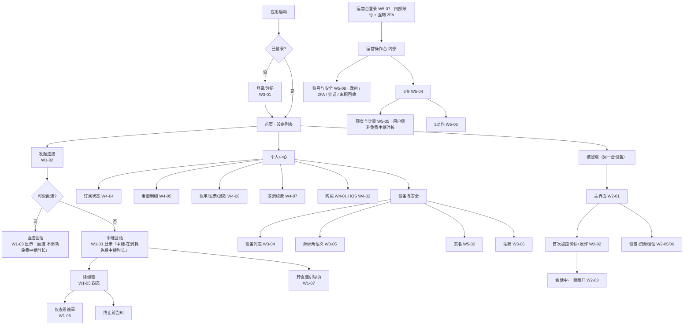

# 低保真线框稿 · 索引与 UI 需求清单

> 版本：2026-09-15 · 状态：**待评审**（低保真阶段）
> 产出：`docs/design/wireframe/`（本 README + `index.html` + **8 份线框页** + 1 份可点击原型）
> 定位：本文是 `商业化与计费设计` §13、`账号与管理系统设计` §4/§5、`需求规划-v2-P0P3重构` §1·§2·§3 的**界面落点**。
> 🔴 **本稿不新增任何产品决策**；出现的额度 / 设备数 / 价格等数值全部来自 SSOT `成本测算表` §0，并在界面标注「必须后端下发，不得硬编码」。

---

## 0. 本轮交付的是「低保真」，先划清边界

| | 低保真（本稿） | 高保真（本稿不做） |
|---|---|---|
| 解决 | 有哪些界面 · 每屏放什么 · 层级 · 流程 · 状态 · 异常 | 好不好看 · 品牌 · 视觉语言 |
| 内容 | 灰阶方块 + 灰条 + 交叉框 + 编号标注 | 颜色 / 字号 / 间距 / 圆角 / 阴影 / 图标 / 动效 |
| 用途 | **能不能过评审：有没有漏屏、有没有违规屏、流程断没断** | 交给前端按稿还原 |
| 交付物 | 8 份 HTML 线框 + 本清单 | Design Token + 组件规格 |

⚠️ 线框内**一律灰阶**；文档中的暗红只用于标注，**不是 UI 颜色**。

---

## 1. 结论先行：这个项目一共有 **76 个需要 UI 的位置**

判定标准沿用 `商业化与计费设计` §13.1 的四类区分，本稿把它从"计费"扩展到全部端：

| 层 | 判据 | 处理 | 数量 |
|---|---|---|---|
| **① UI = 已拍板决策的执行体** 🔴 | 没有这个界面，**已拍板的决策/合规项就被违反**（例：禁止静默降码率 ⇒ 必须有「码率已降」明示） | **P0 必做**，且**不参与 ROI 排序** | 58 |
| **② UI = 主主张的可见化** 🔑 | 主张只能靠界面被相信（例：「直连不消耗免费时长」⇒ 只能靠连接模式指示器） | **P0 必做** | 3 |
| **③ UI = 常规商业化 / 管理界面** | 缺了不影响合规，只影响转化与效率 | P0 粗糙版 → P1 完整版 | 15 |
| **④ 明确不做的界面** ⚠️ | 做了会把资产变负债 | **不做**，写进红线 | 7（不做） |

> ⚠️ 上表数值为 **2026-09-15 实测值**；旧版本曾写作 ① 24 / ② 6 / ③ 13，与清单不符，已订正。
> 2026-09-15 补稿①：**外接大屏 / 桌面模式** 出 4 帧（W6-05 ~ W6-08，均为 P1）⇒ ① +2 / ③ +2。
> 2026-09-15 补稿②：**全屏 / 沉浸式会话** 出 2 帧（`[D22]`，均为 P0）⇒ ① +1（[W1-11](w1-控制端-连接与额度.html#w1-11)）/ ③ +1（[W6-09](w6-移动端手持.html#w6-09)）。
> 2026-09-15 补稿③：**账号自助管理** 出 4 帧（`[D23]`，均为 P0）⇒ ① +3（[W3-07](w3-账号与设备管理.html#w3-07) / [W3-08](w3-账号与设备管理.html#w3-08) / [W3-09](w3-账号与设备管理.html#w3-09)）/ ③ +1（[W3-10](w3-账号与设备管理.html#w3-10)）。
> 2026-09-15 补稿④：**运营台认证与内部账号** 出 2 帧（`[D24]`，均为 P0）⇒ ① +1（[W5-08](w5-合规实名与运营台.html#w5-08)）/ ③ +1（[W5-07](w5-合规实名与运营台.html#w5-07)）。
> 2026-09-15 补稿⑤：**支付链路** 出 **7 帧**（`[D25]`，均为 P0）⇒ ① +4（[W4-09](w4-计费与个人中心.html#w4-09) 订单确认 · [W4-10a](w4-计费与个人中心.html#w4-10a)~[d](w4-计费与个人中心.html#w4-10d) **支付结果四态** · [W4-11](w4-计费与个人中心.html#w4-11) 扣款失败 / [W4-12](w4-计费与个人中心.html#w4-12) Web 购买页）。
> 2026-09-15 补稿⑥：**应用外壳层 + 安卓被控端** 出 **9 帧**（`[D26]`，均为 P0）⇒ ① +9 —— **托盘 / 通知区常驻入口** 2 帧（[W1-12](w1-控制端-连接与额度.html#w1-12) / [W2-09](w2-被控端.html#w2-09)）· **被控端启动失败态** 1 帧（[W2-10](w2-被控端.html#w2-10)）· **安卓被控端独立新页 W7** 6 帧（[W7-01](w7-安卓被控端.html#w7-01) ~ [W7-06](w7-安卓被控端.html#w7-06)）。
> 2026-09-15 补稿⑦：**跨帧一致性收口** 出 **7 帧**（`[D27]`，均为 P0）⇒ ① +7 —— [W1-13](w1-控制端-连接与额度.html#w1-13) 连接失败 / 超时 · [W1-14](w1-控制端-连接与额度.html#w1-14) 用尽后的四条路 · [W2-11](w2-被控端.html#w2-11) 音频事前默认值 · [W3-11](w3-账号与设备管理.html#w3-11) 核弹动作统一二次确认 · [W3-12](w3-账号与设备管理.html#w3-12) 账号表单错误态总表 · [W4-10e](w4-计费与个人中心.html#w4-10e) 支付结果态 E · [W7-07](w7-安卓被控端.html#w7-07) 收到连接请求。
> 2026-09-15 补稿⑧：**残项收口（第十一轮）** 出 **2 帧**（`[D28]`，均为 P0）⇒ ① +1 —— [W5-09](w5-合规实名与运营台.html#w5-09) 表单错误态总表（实名 6 类 + 运营台登录 2 类，**新条目 33d**）；另有 [W6-09a](w6-移动端手持.html#w6-09a) 沉浸式手持**横屏子态**（**不新增条目**，属条目 44 的第二态）。

🔴 **关键纪律（继承 §13.1）**：第 ①② 类界面**不是"体验优化"而是"决策的执行体"**。
**不得以「购买页更像商业化 / 更能转化」为由，把购买页排在连接模式指示器之前。**

---

## 2. 全量 UI 清单（按端 × 模块）

> 「层」= 上表分类；「帧」= 本稿线框编号，可点击跳转。
> 📊 **当前值**：共 **76 个界面条目 ⇒ 84 张线框图**，层分布 **① 58 / ② 3 / ③ 15**，优先级 **P0 68 / P1 8**。
> （📊 记号 = 该句必须与 7 个线框页 HTML 实测一致，由 `node tools/wireframe-consistency.mjs` 硬门禁；历史轮次的数字请用 ⏱ 记号，见 §11。）
> 图比条目多 **7 张**，原因有两个：**三处「一屏拆多态」**—— <b>W1-05「降级链」四态</b>（4 图 = +3）· <b>W4-10「支付结果」五态</b>（5 图 = +4，态 E 为 `[D27]` 补）· <b>W6-09「沉浸式手持」竖屏 / 横屏两态</b>（2 图 = +1，横屏子态 W6-09a 为 `[D28]` 补），合计 +8；再减去 **一处同帧重复登记**（条目 29f 与 29c 同指 [W4-10e](w4-计费与个人中心.html#w4-10e)，−1）⇒ 净 **+7**。
> （W1-06 / W1-06b 是**两个独立条目**，各占一图；🔴 **W1-10 / W2-08 为 `[新增·D19]` 的音频两帧**，也是独立条目 9b / 15c；🔴 **W1-11 / W6-09 为 `[新增·D22]` 的全屏沉浸两帧**，是独立条目 9c / 44；🔴 **W3-07 ~ W3-10 为 `[新增·D23]` 的账号自助管理四帧**，是独立条目 21b / 21c / 21d / 21e；🔴 **W5-07 / W5-08 为 `[新增·D24]` 的运营台认证两帧**，是独立条目 33b / 33c；🔴 **W4-09 ~ W4-12 为 `[新增·D25]` 的支付链路四条目 / 七帧**，是独立条目 29b / 29c / 29d / 29e；🔴 **W1-12 / W2-09 / W2-10 / W7-01 ~ W7-06 为 `[新增·D26]` 的应用外壳层与安卓被控端九帧**，是独立条目 9d / 15d / 15e / 15f ~ 15k；🔴 **W1-13 / W1-14 / W2-11 / W3-11 / W3-12 / W4-10e / W7-07 为 `[新增·D27]` 的跨帧一致性收口七帧**，是独立条目 9e / 9f / 15l / 21f / 21g / 29f / 15m；🔴 **W5-09 为 `[新增·D28]` 的表单错误态总表**，是独立条目 33d；🔴 **W6-09a 是条目 44 的横屏子态**（同一条目两态 ⇒ **不另占条目编号**）。）

### 2.1 控制端（Windows / macOS）

| # | 界面 | 层 | 优先级 | 归属文档 | 帧 |
|---|---|---|---|---|---|
| 1 | 主界面（设备列表 + **常驻**连接模式指示器） | ② | P0 | v2 §1 · 商业化 §13.2#1 | [W1-01](w1-控制端-连接与额度.html#w1-01) |
| 2 | 连接中（先中继秒连 → 后台静默升级直连） | ② | P0 | v2 §1 连接建立策略 | [W1-02](w1-控制端-连接与额度.html#w1-02) |
| 3 | 会话窗口（窗口化 + 等比缩放 + 黑边 + 工具栏） | ① | P0 | v2 §1 D9 | [W1-03](w1-控制端-连接与额度.html#w1-03) |
| 4 | 免费中继余量（**默认折叠**，80% 才现） | ① | P0 | 商业化 §13.2#2 | [W1-04](w1-控制端-连接与额度.html#w1-04) |
| 5 | 降级链四态（预警 → 转直连 → 🔴降码率明示 → 终止前告知） | ① | P0 | 商业化 §13.2#3 · §8 · D11-5 | [W1-05a](w1-控制端-连接与额度.html#w1-05a) [b](w1-控制端-连接与额度.html#w1-05b) [c](w1-控制端-连接与额度.html#w1-05c) [d](w1-控制端-连接与额度.html#w1-05d) |
| 6 | 「仅查看」遮罩 · **资源式**（中继用尽且直连失败 ⇒ 画面冻结在最后一帧） | ① | P0 | 商业化 §13.2#4 | [W1-06](w1-控制端-连接与额度.html#w1-06) |
| 6b | 「仅查看」遮罩 · **权限式**（链路正常，对方收回操作权 ⇒ 画面仍在实时更新） | ① | P0 | v2 §2.3.1 | [W1-06b](w1-控制端-连接与额度.html#w1-06b) |
| 7 | **「转直连」引导页** 🔴（本文唯一被称为"产品价值点"的一步） | ② | P0 | 商业化 §13.2#5 · §8② | [W1-07](w1-控制端-连接与额度.html#w1-07) |
| 8 | 显示设置（适应窗口 / 1:1 / 拉伸 + 缩放模式） | ① | P0 | v2 §1 D9 | [W1-08](w1-控制端-连接与额度.html#w1-08) |
| 9 | 断连后（中性说明；⚠️ **无促销弹窗**） | ① | P0 | 商业化 §13.4 红线⑤ | [W1-09](w1-控制端-连接与额度.html#w1-09) |
| 9b | 🔴 **音频控制条**（声音回传 / 按住说话对讲 / 纯音频模式三态）`[新增·D19]` | ① | P0 | v2 §1 **D19** · §4.4 · 商业化 §13.2**#9** | [W1-10](w1-控制端-连接与额度.html#w1-10) |
| 9c | 🔴 **全屏 / 沉浸式会话**（工具条自动隐藏 + 顶边悬停/快捷键唤出；🔴 **指示器降级为角标、不得消失**）`[新增·D22]` | ① | P0 | v2 §2.4.1 **D22** 红线 3 · 商业化 §13.2#1 · §13.5 | [W1-11](w1-控制端-连接与额度.html#w1-11) |
| 9d | 🔴 **最小化到通知区（托盘常驻）**（🔴 **托盘是唯一非前台会话入口** ⇒ 必须带「断开连接」，且与「退出」**不得合并**；🔴 托盘不得出现免费中继时长余量或催费文案）`[新增·D26]` | ① | P0 | v2 §1 E6 常驻入口 · §3.7 · 商业化 §13.1 渐进披露 · §13.4 红线① | [W1-12](w1-控制端-连接与额度.html#w1-12) |
| 9e | 🔴 **连接失败 / 超时**（失败态整轴的执行体；🔴 **每个失败原因必须带可点的下一步**；🔴 不得出现「升级会员提高成功率 / 加速通道 / 买流量包优先排队」类文案）`[新增·D27]` | ① | P0 | v2 §1 连接建立策略 · 商业化 §13.4 红线⑤ | [W1-13](w1-控制端-连接与额度.html#w1-13) |
| 9f | 🔴 **中继时长用尽后的四条路**（🔴 **三条免费路在前、购买殿后**；由用户**主动点开**，不是自动弹窗；顺序不得按转化率调整）`[新增·D27]` | ① | P0 | 商业化 §13.4 红线⑤ · §13.2#2 | [W1-14](w1-控制端-连接与额度.html#w1-14) |

### 2.2 被控端（Windows / macOS / Android 免 Root）

| # | 界面 | 层 | 优先级 | 归属文档 | 帧 |
|---|---|---|---|---|---|
| 10 | 被控端主界面（本机 ID / 临时密码 / 状态） | ① | P0 | v2 §3.1 | [W2-01](w2-被控端.html#w2-01) |
| 11 | 首次被控确认页（**含反诈风险提示位，不得折叠**） | ① | P0 | v2 §1 E6 **A8** · §6.5 D17 | [W2-02](w2-被控端.html#w2-02) |
| 12 | 会话中 + **一键断开**（无挽留式二次确认） | ① | P0 | v2 §1 E6 **C3** | [W2-03](w2-被控端.html#w2-03) |
| 13 | 🔴 仅查看时的中性提示（**无金额/余额/充值**） | ① | P0 | 商业化 §13.4 红线② | [W2-04](w2-被控端.html#w2-04) |
| 14 | 资源档位（节能/均衡/高性能）+ 隐私屏 | ① | P0 | v2 §1 被控端 | [W2-05](w2-被控端.html#w2-05) |
| 15 | 设置总览（自启 / 无人值守 / 权限 / 更新） | ③ | P0 | v2 §3 | [W2-06](w2-被控端.html#w2-06) |
| 15b | 🔴 对方请求恢复操作（**原型跑出后补帧**：缺了它，控制端「请求控制」是死按钮） | ① | P0 | 可点击原型断点 #8 | [W2-07](w2-被控端.html#w2-07) |
| 15c | 🔴 **采音提示 + 一键静音**（🔴 **不得静默采音**；静音不得成为降级惩罚）`[新增·D19]` | ① | P0 | v2 §4.4 · 商业化 §13.4 **红线⑥** | [W2-08](w2-被控端.html#w2-08) |
| 15d | 🔴 **通知区常驻图标 + 右键菜单**（v2 §3.3 的**服务态 / 用户态两条链路**在界面上只有托盘一个常驻入口 ⇒ 必须回答「现在能不能被连上」；🔴 常驻进程仍 **≤ 3**）`[新增·D26]` | ① | P0 | v2 §3.3 · §3.7 · §1 红线「常驻进程 ≤ 3」 · 商业化 §13.4 红线② | [W2-09](w2-被控端.html#w2-09) |
| 15e | 🔴 **启动 / 初始化失败态**（🔴 **被控不可用 ≠ 产品不可用**；每个失败原因必须带**可点的下一步动作**，错误码只放「复制诊断信息」）`[新增·D26]` | ① | P0 | v2 §3.2 · §3.5 · 本 README §11.4 **R8（部分收）** | [W2-10](w2-被控端.html#w2-10) |
| 15f | 🔴 **安卓被控端 · 首次启动授权引导（1 / 4）**（屏幕录制 / 无障碍 / 通知 / 电池自启；🔴 **不得用「不授权就不能用」的阻断式引导**）`[新增·D26]` | ① | P0 | v2 **§3.6** · §3.2 | [W7-01](w7-安卓被控端.html#w7-01) |
| 15g | 🔴 **安卓被控端 · 主界面**（识别码 + 临时密码 + **授权自检 4 行** + 反诈提示；🔴 **不得出现「额度」与任何金额**）`[新增·D26]` | ① | P0 | v2 **§3.6** · §3.1 | [W7-02](w7-安卓被控端.html#w7-02) |
| 15h | 🔴 **安卓被控端 · 前台服务通知 + 一键断开**（Android 10+ 前台服务常驻通知是**合规硬项**；🔴 弹窗内不再二次确认、无挽留）`[新增·D26]` | ① | P0 | v2 **§3.6** · §1 E6 **C3** | [W7-03](w7-安卓被控端.html#w7-03) |
| 15i | 🔴 **安卓被控端 · 息屏串流与电量策略**（🔴 **息屏串流默认关** + 资源与耗电三档口径）`[新增·D26]` | ① | P0 | v2 **§3.6** · §3.7 | [W7-04](w7-安卓被控端.html#w7-04) |
| 15j | 🔴 **安卓被控端 · 电池 / 自启白名单引导（分厂商）**（🔴 **未设置 = 降级不可靠，不是阻断**）`[新增·D26]` | ① | P0 | v2 **§3.6** · §3.7 | [W7-05](w7-安卓被控端.html#w7-05) |
| 15k | 🔴 **安卓被控端 · 机型分档与「不支持」的中性说明**（已验证 / 可用但需引导 / 不支持；🔴 **不得引导付费**）`[新增·D26]` | ① | P0 | v2 **§3.6** · §2.3.2 机型前提 | [W7-06](w7-安卓被控端.html#w7-06) |
| 15l | 🔴 **PC 被控端 · 音频三开关的「事前默认值」**（会话开始的默认值，与 [15c](w2-被控端.html#w2-08) 的会话中控制是**同一份状态的两种视图**，不得各记一份；🔴 界面**不得**出现麦克风开关——不做假按钮）`[新增·D27]` | ① | P0 | v2 §4.4 · `[D19]` · `[D20]` · 商业化 §13.4 红线⑥ | [W2-11](w2-被控端.html#w2-11) |
| 15m | 🔴 **安卓被控端 · 收到连接请求**（🔴 手机侧**每次**人工确认；必须显示控制方身份 + **上次是否连过**；🔴 三个选项的权重不得让「拒绝」失重）`[新增·D27]` | ① | P0 | v2 **§3.6** 界面口径 · 账号设计 §2.6 · README §11.11.2 **R26** | [W7-07](w7-安卓被控端.html#w7-07) |

> ⚠️ **15d–15m 归属说明**：`15d` / `15e` / `15l` 内容属 **PC 被控端**（[W2](w2-被控端.html)）；`15f`–`15k` / `15m` 内容属**安卓被控端**，落在 `[D26]` 补稿的**独立新页 [W7](w7-安卓被控端.html)**（本节标题原已含「Android 免 Root」，此前只有文字声明、无界面证据）。**全部 P0。**

### 2.3 账号（全端通用）

| # | 界面 | 层 | 优先级 | 归属文档 | 帧 |
|---|---|---|---|---|---|
| 16 | 登录 / 注册（含生物识别快捷登录） | ③ | P0 | v2 §1 认证 | [W3-01](w3-账号与设备管理.html#w3-01) |
| 17 | 找回密码 + **恢复码**（🔴 两种语义必须分开） | ① | P0 | 账号 §2 · v2 §6.2 | [W3-02](w3-账号与设备管理.html#w3-02) |
| 18 | 双重验证（2FA） | ① | P0 | v2 §1 认证 | [W3-03](w3-账号与设备管理.html#w3-03) |
| 19 | 设备列表（**三态** + 踢下线 + 「最久未连接」排序） | ① | P0 | 账号 §2.3/§2.4 · D12-1 | [W3-04](w3-账号与设备管理.html#w3-04) |
| 20 | 解绑两种语义（取消授权 ≠ 移除设备） | ① | P0 | 账号 §7 D12 铁律 | [W3-05](w3-账号与设备管理.html#w3-05) |
| 21 | 一键解绑全部 + **注销（3 步内可达 + 30 天可撤销）** | ① | P0 | v2 §1 E6 **A3** | [W3-06](w3-账号与设备管理.html#w3-06) |
| 21b | 🔴 **账号与安全（中转页）**（🔴 它是 A3「注销 3 步内可达」的界面证据，此前只有文字声明） `[新增·D23]` | ① | P0 | v2 §1 E6 **A3** · 账号 §2.1/§3.2 | [W3-07](w3-账号与设备管理.html#w3-07) |
| 21c | 🔴 **修改密码（已登录态）**（🔴 改密后其他设备全部重登 + 恢复码作废；**与「重置密码」不是同一入口**） `[新增·D23]` | ① | P0 | 账号 §2.1 · v2 §6.2 | [W3-08](w3-账号与设备管理.html#w3-08) |
| 21d | 🔴 **登录设备管理（账号维度）**（登录地 / 时间 / 活跃 + 「退出所有设备」+ 新设备登录通知；🔴 **与 W3-04「我的设备」不是同一列表**） `[新增·D23]` | ① | P0 | 账号 **§3.2** · v2 §6.2 | [W3-09](w3-账号与设备管理.html#w3-09) |
| 21e | **邮箱注册 / 绑定与换绑**（可选第二入口，🔴 不替代手机号；验证后才算绑定） `[新增·D23]` | ③ | P0 | 账号 §2.1 · v2 §6.2 | [W3-10](w3-账号与设备管理.html#w3-10) |
| 21f | 🔴 **核弹动作的统一二次确认组件**（跨帧共用**同一个**：退出所有设备 / 一键解绑全部 / 提交注销 / 关闭双重验证；🔴 必须**后果清单 + 身份复核**，🔴 **不得**用「输入留言 / 联系客服 / 延迟 N 天」充当确认）`[新增·D27]` | ① | P0 | 账号 §3.2 / §3.4 · README §11.11.2 **R19** / **R30** · §6.3 | [W3-11](w3-账号与设备管理.html#w3-11) |
| 21g | 🔴 **账号表单错误态总表**（一屏收口 5 处表单的 **12 种错误**；🔴 同字段同时只显示一条 + 一律**就地**显示；🔴 业务校验失败**绝不能用 401**；🔴 登录失败不得区分账号是否存在）`[新增·D27]` | ① | P0 | 账号 §2 认证 · README §11.11.1 **S4** · §11.11.2 **R24** | [W3-12](w3-账号与设备管理.html#w3-12) |

### 2.4 计费与个人中心

| # | 界面 | 层 | 优先级 | 归属文档 | 帧 |
|---|---|---|---|---|---|
| 22 | 购买页 · 最小版（非 iOS，只需跑通一条路径） | ③ | P0 | 商业化 §13.2#7 | [W4-01](w4-计费与个人中心.html#w4-01) |
| 23 | 购买页 · **iOS 版对照**（🔴 零站外支付引导） | ① | P0 | §13.4 红线④ · E6 **A5** | [W4-02](w4-计费与个人中心.html#w4-02) |
| 24 | 权益对比表（4 档 × N 权益；🔴 免费项显式写「免费」） | ③ | P1 | 商业化 §13.3 | [W4-03](w4-计费与个人中心.html#w4-03) |
| 25 | 个人中心 · 订阅状态（🔴 iOS / 非 iOS 两套） | ③ | P1 | 账号 §4.1 | [W4-04](w4-计费与个人中心.html#w4-04) |
| 26 | 用量明细页（🔑 反客诉主体） | ③ | P1 | 账号 §4.2 · 商业化 §13.3 | [W4-05](w4-计费与个人中心.html#w4-05) |
| 27 | 账单 / 发票 / 退款状态（含 §4.3.1 五条联动） | ③ | P1 | 账号 §4.3 | [W4-06](w4-计费与个人中心.html#w4-06) |
| 28 | 取消续费路径（🔴 不得比开通更难、不得藏深菜单） | ① | P0 | 账号 §4.4 | [W4-07](w4-计费与个人中心.html#w4-07) |
| 29 | 续费前 5 日提醒（🔴 合规硬项） | ① | P0 | 商业化 §13.2#8 · E6 **A4** | [W4-08](w4-计费与个人中心.html#w4-08) |
| 29b | 🔴 **订单确认（下单页）**（含**发票抬头 / 税号** + 🔴 **固化下单当时的价格版本**，兑现「支付前可填发票」）`[新增·D25]` | ① | P0 | 商业化 §13.2**#10** · 账号 §4.6 | [W4-09](w4-计费与个人中心.html#w4-09) |
| 29c | 🔴 **支付结果五态**（已开通 / 未完成 / 🔴 **确认中** / 订单已关闭 / 🔴 **查询用尽 → 人工对账**）`[新增·D25]`<br /><span class="tiny">⚠️ 内容归属**支付链路组**（29b ~ 29e），只因此为补稿而编号排后；本条目**一屏拆五态**（5 图，其中态 E 为 `[D27]` 补）</span> | ① | P0 | 商业化 §13.2**#11** · 账号 §4.6 | [W4-10a](w4-计费与个人中心.html#w4-10a) [b](w4-计费与个人中心.html#w4-10b) [c](w4-计费与个人中心.html#w4-10c) [d](w4-计费与个人中心.html#w4-10d) [e](w4-计费与个人中心.html#w4-10e) |
| 29d | 🔴 **自动续费扣款失败**（🔴 **失败 ≠ 终止** · **不得静默降级**、**不得自动重试**、**关闭续费与更新支付方式同级**）`[新增·D25]` | ① | P0 | 商业化 §13.2**#12** · §10 · 账号 §4.4 | [W4-11](w4-计费与个人中心.html#w4-11) |
| 29e | 🔴 **Web / 官网购买页**（🔴 **主购买入口**；🔴 **不得与 iOS 版（23）合并**）`[新增·D25]` | ① | P0 | 商业化 **§10** · §13.2**#13** | [W4-12](w4-计费与个人中心.html#w4-12) |
| 29f | 🔴 **支付结果 · 态 E「查询用尽 → 人工对账」**（资金真空期的**终态**：用**结论期限**代替进度；🔴 **不得让用户重新支付**、🔴 **不得说"支付失败"**、🔴 **不得要用户自己联系渠道**）`[新增·D27]` | ① | P0 | 商业化 §13.2**#11** · §13.8 · 账号 §4.6 · `[D25]` | [W4-10e](w4-计费与个人中心.html#w4-10e) |

### 2.5 合规（跨端）

| # | 界面 | 层 | 优先级 | 归属文档 | 帧 |
|---|---|---|---|---|---|
| 30 | 首次连接隐私告知（中继会转发 + 直连只报起止） | ① | P0 | v2 §1 E6 **A2** | [W5-01](w5-合规实名与运营台.html#w5-01) |
| 31 | 实名认证入口 + **三类触发事件** | ① | P0 | v2 §1 E6 **A6** · §6.5 D17 | [W5-02](w5-合规实名与运营台.html#w5-02) |
| 32 | 未实名降级路径（不是拦截，是降级） | ① | P0 | v2 §6.5 | [W5-03](w5-合规实名与运营台.html#w5-03) |

### 2.6 运营操作台（内部工具，非用户可见）

| # | 界面 | 层 | 优先级 | 归属文档 | 帧 |
|---|---|---|---|---|---|
| 33 | 操作台首页 · **3 查** | ③ | P0 | 账号 §5.1 · D12-6 | [W5-04](w5-合规实名与运营台.html#w5-04) |
| 34 | 查额度与计量明细（🔴 **与用户侧同源同一份数据**）<br /><span class="tiny">⚠️「额度」是本台内部用词；用户侧（W4-05）同一份数据叫「免费中继时长」</span> | ① | P0 | 账号 §5.1#2 · §4.2 | [W5-05](w5-合规实名与运营台.html#w5-05) |
| 35 | **3 动作**（调额度 / 封禁加白 / 退款跳转）+ 权限与审计 | ① | P0 | 账号 §5.1 · §5.4 | [W5-06](w5-合规实名与运营台.html#w5-06) |
| 33b | 🔴 **运营台登录**（内部账号**独立** + **强制 TOTP 二次验证**；🔴 **不得**复用 C 端手机号 / 短信登录，🔴 **不提供自助注册**）`[新增·D24]`<br /><span class="tiny">⚠️ 内容归属**入口**（逻辑上应排在 33 之前），只因此为补稿而编号排后</span> | ③ | P0 | 账号 **§5.7** · v2 §1 | [W5-07](w5-合规实名与运营台.html#w5-07) |
| 33c | 🔴 **运营台账号与安全**（改密 / 2FA / 恢复码 / 会话 · 🔴 **改密后所有内部台会话失效** · 🔴 **离职只停用不删除**）`[新增·D24]` | ① | P0 | 账号 **§5.7** · §5.5 | [W5-08](w5-合规实名与运营台.html#w5-08) |
| 33d | 🔴 **表单错误态总表**（实名核验 6 类 + 运营台登录 2 类 · 🔴 **就地呈现**、保住已填、**系统故障 ≠ 用户错误**、🔴 **不得泄露账号是否存在**、🔴 **不得暗示绕过实名**）`[新增·D28]`<br /><span class="tiny">⚠️ **本表 = 全稿表单错误文案的单一源**；内容横跨合规（第 30~32）与运营台（34/35），只因此为补稿而编号排后</span> | ① | P0 | 账号 **§5.7** · v2 §1 E6 **A6** | [W5-09](w5-合规实名与运营台.html#w5-09) |

### 2.7 移动端（Android 控制端 + 外接大屏）

| # | 界面 | 层 | 优先级 | 归属文档 | 帧 |
|---|---|---|---|---|---|
| 36 | 设备列表（移动端） | ③ | P0 | v2 §2.3.1 | [W6-01](w6-移动端手持.html#w6-01) |
| 37 | 手持会话（放大镜 / 双模指针 / 焦点跟随） | ① | P0 | v2 §2.3.1 | [W6-02](w6-移动端手持.html#w6-02) |
| 38 | 仅查看（不操作） | ③ | P0 | v2 §2.3.1 | [W6-03](w6-移动端手持.html#w6-03) |
| 39 | PC→手机（帮父母排障）控制端 | ① | P0 | v2 §1 **D10** | [W6-04](w6-移动端手持.html#w6-04) |
| 40 | 🔴 **检测到外接显示器 · 进入大屏布局的确认**（必须可拒绝 + 可记住）`[新增·2026-09-15]` | ① | P1 | v2 §2.3.2 · **D5/D6** | [W6-05](w6-移动端手持.html#w6-05) |
| 41 | **大屏布局会话**（多窗口 / 可见光标 / 远端右键菜单 / 拖拽调整）<br /><span class="tiny">⚠️ 状态、层、优先级、红线同向；不得与 D9 混用</span> | ③ | P1 | v2 §2.3.2 布局·输入 | [W6-06](w6-移动端手持.html#w6-06) |
| 42 | **外接模式设置**（跨系统快捷键换算 / 组合键直通 / 缩放） | ③ | P1 | v2 §2.3.2 输入 | [W6-07](w6-移动端手持.html#w6-07) |
| 43 | 🔴 **机型不支持 DP Alt Mode 时的中性说明**（🔴 **不得引导付费**） | ① | P1 | v2 §2.3.2 机型前提 | [W6-08](w6-移动端手持.html#w6-08) |
| 44 | 🔴 **沉浸式手持**（隐藏系统栏 + 边缘手势唤出 + 指针/键盘切换 + 🔴 **退出两条路径**）`[新增·D22]`<br /><span class="tiny">⚠️ 内容归属**手持组**（W6-01 ~ W6-04），只因此为补稿而编号排后；本条目**一屏拆两态**（2 图：竖屏 [W6-09](w6-移动端手持.html#w6-09) + 横屏子态 [W6-09a](w6-移动端手持.html#w6-09a)，后者为 `[D28]` 补）</span> | ③ | P0 | v2 §2.4.1 **D22** 红线 3 · §2.3.1 移动端 | [W6-09](w6-移动端手持.html#w6-09) [W6-09a](w6-移动端手持.html#w6-09a) |

> ⚠️ **编号口径**：W6-05 ~ W6-08 是 **2026-09-15 补稿**（原列在 §7「未出稿」表，属 P1 增强路径）。
> **#44 / W6-09** 是 **`[D22]` 补稿**（全屏 / 沉浸式），P0，内容归属手持组。
> 以下 §2.8 的「不做」项原用 #40–#44，与本节编号冲突，已改为 **N1–N5**（它们不是 UI 清单条目，不应占用清单编号）。

### 2.8 明确**不做**的界面（红线，共 7 项 · 编号 N1–N7）

| # | 不做的界面 | 理由 | 出处 |
|---|---|---|---|
| N1 | ⚠️ 断连瞬间的**促销弹窗** | 把 D1 透明度资产直接转成「他就是在卖我流量」的负债 | §13.4 红线⑤ |
| N2 | ⚠️ 被控端任何**金额 / 余额 / 充值**字样 | 帮爸妈调手机时弹出「余额不足」= 摧毁手机被控免费钩子 | §13.4 红线② |
| N3 | ⚠️ iOS 版任何**站外支付引导** | App Store 3.1.1 拒审 | §13.4 红线④ |
| N4 | ⚠️ 常驻贴脸的**余量催费 UI** | 指示器从「告知」变「催费」，透明度资产降级为广告位 | §13.4 红线① |
| N5 | ⚠️ 用户端任何**推广位 / 活动中心 / 弹窗运营位** | P0 不做，本轮明确排除 | 本稿决定 |
| N6 | ⚠️ **外接大屏机型不支持时的任何购买引导** | 与 N2 同源：硬件能力问题不得包装成计费问题 | v2 §2.3.2 · [W6-08](w6-移动端手持.html#w6-08) |
| N7 | ⚠️ 远控画面**「无线投屏」入口 / 承诺** | Miracast 多一跳编码 + 两跳传输，D5 只承诺 USB-C 有线直出 | v2 §2.3.2 · D5 |

> ⚠️ **2026-09-15 变更**：原编号 #40–#44 与 §2.7 新补稿条目冲突，改为 **N1–N5**；同时新增 **N6 / N7**（外接大屏补稿带出的两条同源红线）。
> 本表**不计入** UI 清单（§1 / §2 的 68 条目不含「不做」项）。

---

## 3. 信息架构（IA）



---

## 4. 八条关键用户流（评审时按流走，比按屏走更容易发现断点）

### 流 1 · 首次连接（含主主张落地）——最关键
```
点「连接」→ 连接中（先中继秒连，W1-02）
→ 连上后顶部一次性提示：本次「直连」或「中继」（W1-03）
→ 若中继：常驻指示器显示「中继 · 本次剩余免费中继时长 xx 分钟」（W1-01/W1-04）
→ 首次连接前必须过隐私告知（W5-01）
```
🔴 断点检查：**若不显示「本次连接方式」，D1/D8 主主张就没有任何执行体**。

### 流 2 · 免费中继时长消耗到降级到终止（四态链）
```
余量 80% → 常驻指示器变为可见（W1-04 态 B）
→ 余量 20% → 预警横幅（W1-05 态 A）
→ 余量 0 → 转直连引导页（W1-07）+ 中止中继
→ 若直连不可用 → 🔴「画质已降低，因为中继时长用尽」明示（W1-05 态 C）
→ 仍不可用 → 终止前告知 + 转「仅查看」（W1-05 态 D / W1-06）
```
🔴 铁律：**四态一个都不能省**。省掉「码率已降」= 违反「禁止静默降码率」已拍板决策。

### 流 3 · 被控端授权（含反诈）
```
对方发起 → 本机弹「首次被控确认页」（W2-02）
→ 页面必须同时呈现：谁在连、能做什么、反诈提示 3 句（不得折叠）
→ 同意 → 会话中（W2-03），可一键断开（点一次即断，无挽留）
→ 对方进入仅查看 → 本机收中性提示（W2-04，🔴 无金额）
→ 对方请求恢复操作 → 本机收「允许操作 / 保持仅查看」（W2-07，🔴 默认保持仅查看）
```

### 流 4 · 退款（§4.3.1 五条联动）
```
订单列表 → 申请退款 → 系统硬判定「7 天内 且 中继用量 = 0」
→ 通过 → 🔴 立即回收（订阅终止 + 未用完的免费中继时长作废）
→ 查看退款状态（渠道后台回填）
→ 同账号 180 天内第 2 次 → 转人工
```

### 流 5 · 注销（3 步内可达）
```
我的 → 设置 → 账号与安全 → 注销账号（≤3 步）
→ 告知 30 天冷静期 + 期间可撤销
→ 30 天内：仅标记不删
→ 期满：级联删身份数据 + 匿名化计量/审计流水（🔴 自动任务）
```

### 流 6 · 运营台内部操作（`[D24]`）——评审时最容易漏的一条
```
内部账号登录（W5-07 第一步：邮箱 + 密码）
→ 🔴 强制二次验证（W5-07 第二步：TOTP / 一次性恢复码，不可跳过、不记住设备）
→ 进入运营台（W5-04：查用户 / 查额度与计量明细 / 查订单）
→ 3 动作（W5-06：调额度 / 封禁解封加白 / 退款跳转）+ 每次写动作进审计
→ 账号与安全（W5-08：改密 / 重新生成恢复码 / 退出其他会话）
→ 🔴 离职：管理员停用（W5-08）⇒ 全部会话立即失效，但**审计记录保留**
```
🔴 断点检查：**若 W5-07 不存在，则 W5-04 / W5-05 / W5-06 三帧都是「免认证可进入」的界面** ——
它们能查全网用户手机号 / 实名状态 / 每笔用量，还能改额度、封禁、退款。

### 流 7 · 支付与到账（`[D25]`）—— 唯一有资金风险的一条
```
购买页（W4-01 非 iOS / W4-12 Web）→ 订单确认（W4-09：🔴 固化价格版本 + 填发票抬头）
→ 跳转第三方收银台（🔴 非我方界面，不出稿）
→ 结果四态之一：
   A 已开通   （W4-10a → 权益到账；W4-06 可开发票）
   B 未完成   （W4-10b → 同一订单 15 分钟内可重试；🔴 不猜原因、不自动重试）
   C 确认中   （W4-10c → 🔴 回调未达；每 5 秒查询最多 2 分钟；🔴 幂等拦截重复支付）
   D 订单已关闭（W4-10d → 15 分钟超时；重新下单要新建订单号并重新取价）
→ 续期：扣费前 5 日提醒（W4-08）→ 失败则 W4-11（🔴 失败 ≠ 终止，7 天宽限）
```
🔴 断点检查：**若 [W4-10c](w4-计费与个人中心.html#w4-10c) 不存在，「钱已经出去、权益还没到」的用户没有任何自助路径** ——
他会**重复支付**（产生第二笔订单），或**找客服**（产生无法自查的工单）。

⚠️ **边界**：微信 / 支付宝的**收银台页**与 Apple 的**支付弹层**不是我方界面，**不出稿**；
需要出稿的只有**跳转前（W4-09 / W4-12）· 跳转中（W4-10c）· 跳转后（W4-10a/b/d）** 三段。

### 流 8 · 移动端手持（`[D22]` / `[D26]`）—— 唯一一条**从手持设备出发**的流

```
设备列表（W6-01）→ 手持会话（W6-02：放大镜 / 双模指针 / 焦点跟随）
→ 只读分叉：仅查看（W6-03：🔴 链路指示器常驻 + 「请求控制」单向上转）
→ 沉浸式手持（W6-09：🔴 边缘手势唤出条，无常驻工具栏）
→ 外接分叉：外接屏切换确认（W6-05：🔴 切换 = 断开会话，须事前确认）
→ 大屏布局会话（W6-06：窗口化启动，不默认全屏）→ 键鼠映射（W6-07）
→ 机型分叉：机型不支持的中性说明（W6-08：🔴 不得出现金额）
```

🔴 断点检查：**若 [W6-03](w6-移动端手持.html#w6-03) 的链路指示器缺失**，
观察态用户在移动端**看不到自己连的是直连还是中继** ——
而中继有免费时长上限，这是「看得到画面、却不知道还能看多久」的状态。

⚠️ **与流 1~7 的关系**：前七条流全部从**桌面控制端**出发（W1 / W3 / W4 / W5）；
只有流 8 覆盖 **W6（移动端手持 + 外接大屏）**。
⇒ **按前七条流评审，W6 永远不会被走到**，而它恰好是问题最集中的一页。

ℹ️ **W7（安卓被控端）不走本条流**：它是**被控端**，方向相反（授权链 → 前台服务通知 → 一键断开），
帧清单见 [§11.10.3](#11103-本轮新增-9-帧已回写-21--22)。

---

## 5. 🔴 红线在界面上的落点（评审自检表）

| 红线 / 阻塞项 | 出处 | 执行体（本稿） | 缺失后果 |
|---|---|---|---|
| 禁止静默降码率 | D11-5 | W1-05 态 C | 已拍板决策被违反 |
| 全站「端到端加密」字样清零 | E6 A2 | W5-01 文案 | 合规风险 |
| 中继转发 + 直连只报起止，须明示 | E6 A2 | W5-01 | 合规风险 |
| 技术状态 ≠ 商业计数 | §13.4① | W1-01 / W1-04（状态常驻、余量折叠） | 透明度资产→广告位 |
| 🔴 计费 UI 只在控制端 | §13.4② | W2-04 全帧 | 手机被控钩子失效 |
| 🔴 免费项显式标「免费」 | §13.4③ | W4-03 表 | 钩子反向失效 |
| 🔴 iOS 零站外支付引导 | §13.4④ | W4-02 | 拒审 |
| ⚠️ 无断连促销弹窗 | §13.4⑤ | W1-09 | 资产→负债 |
| 注销 3 步内 + 30 天可撤销 | E6 A3 | W3-06 | 合规 |
| 🔴 A3「注销 3 步内可达」须有**界面证据** | `[D23]` | [W3-07](w3-账号与设备管理.html#w3-07)（我的 → 设置 → 账号与安全 → 注销 = 3 步） | 只有文字声明、无界面 ⇒ 合规声明无法自证 |
| 🔴 已登录态**改密入口存在**（≠ 忘记密码） | `[D23-1]` | [W3-08](w3-账号与设备管理.html#w3-08) | 全稿只有「忘记密码」（未登录、凭持有物）⇒ **已登录用户主动改密无处可去** |
| 🔴 改密后**其他设备全部强制重新登录 + 恢复码作废** | `[D23-1]` | [W3-08](w3-账号与设备管理.html#w3-08) | 改密 = 秘密泄露的自救动作，旧会话不失效则自救无效 |
| 🔴 **登录设备（账号维度）≠ 我的设备（被控端硬件）** | `[D23]` / 账号 §3.2 | [W3-09](w3-账号与设备管理.html#w3-09) ↔ [W3-04](w3-账号与设备管理.html#w3-04) | 同一套「设备」话术指两件事 ⇒ 用户与客服相互误解（🔴 **两表不得合并**） |
| 🔴 新设备登录**必须通知已有设备** | `[D23]` / 账号 §3.2 | [W3-09](w3-账号与设备管理.html#w3-09) | 发现账号被盗的关键；🔴 **与 2FA 不可互相替代** |
| 🔴 邮箱**不得解绑最后一个可用的身份入口** | `[D23-2]` / 账号 §2.1 | [W3-10](w3-账号与设备管理.html#w3-10) | 否则账号会变成**无法找回**（永久锁死且无客服通道） |
| 🔴 **运营台必须有认证入口**（内部账号独立 + 强制 2FA） | `[D24]` / 账号 **§5.7** | [W5-07](w5-合规实名与运营台.html#w5-07) | 全稿唯一「免认证入口」的界面：能查全网用户数据、能改额度 / 封禁 / 退款 |
| 🔴 内部账号**不得复用 C 端身份**（手机号 / 短信 / 第三方） | `[D24]` / 账号 §5.7 | [W5-07](w5-合规实名与运营台.html#w5-07) | 复用 ⇒ 离职后**个人手机号仍是系统入口**，且无法与员工生命周期绑定停用 |
| 🔴 内部台改密后**所有会话立即失效**（无「当前设备」豁免） | `[D24]` / 账号 §5.7 | [W5-08](w5-合规实名与运营台.html#w5-08) | 内部台凭据泄漏 = 全网用户数据泄漏（比 C 端 `[D23-1]` 更严） |
| 🔴 **离职只停用、不删除**（审计留痕） | `[D24]` / 账号 §5.5 | [W5-08](w5-合规实名与运营台.html#w5-08) | 删号 ⇒ 「谁在何时调了这笔额度」永久无法追溯（审计不可删除的另一面） |
| 续费前 5 日提醒 | E6 A4 | W4-08 | 合规 |
| 取消续费不得比开通更难 | 账号 §4.4 | W4-07 | 暗黑模式投诉 |
| 实名触发链路可用 | E6 A6 / D17 | W5-02 / W5-03 | 合规 |
| 反诈提示位不得折叠 | E6 A8 | W2-02 | 合规 |
| 一键断开无挽留 | E6 C3 | W2-03 | 体验红线 |
| 🔴 恢复控制需被控端应答 | 原型断点 #8 | W2-07 | 控制端「请求控制」成为死按钮 |
| 设备数 150 台 = **免费版优势行** | D15 | W4-03 | 会被截图打脸 |
| 🔴 全屏 / 沉浸式期间**连接模式指示器不得消失** | `[D22]` 红线 3 | [W1-11](w1-控制端-连接与额度.html#w1-11) / [W6-09](w6-移动端手持.html#w6-09) | 为了沉浸感顺手删掉指示器 ⇒ D1 主主张在**使用时间最长的状态下**失效 |
| 数值不得硬编码 | §13.5 | 全帧标注「后端下发」 | ✅ **`[D18]` 已降低该风险**：报价到手 = **录一个成本参数**（非改代码 / 改文档）+ 系统自动重算下游 ⇒ 返工面从「整环境」收窄到「一次参数录入」（`成本测算表` §3.4） |
| 🆕 🔴 应用**外壳层必须有常驻入口**（控制端托盘 / 被控端托盘） | `[D26]` / v2 §3.3 · §3.7 | [W1-12](w1-控制端-连接与额度.html#w1-12) / [W2-09](w2-被控端.html#w2-09) | 最小化 = 找不到断开入口；托盘是唯一非前台会话入口 ⇒ **必须能一键断开**，且与「退出」不得合并 |
| 🆕 🔴 常驻进程 **≤ 3** 的验收前提 | v2 §1 红线 | [W2-09](w2-被控端.html#w2-09) note② | 更新 / 遥测组件不得各自再注册托盘图标，否则托盘从「入口」变「广告位」 |
| 🆕 🔴 安卓被控端**前台服务常驻通知**（Android 10+ 合规硬项） | `[D26]` / v2 §3.6 | [W7-03](w7-安卓被控端.html#w7-03) | 无通知 = 系统可杀 + 用户不知情 ⇒ 合规与稳定性双失 |
| 🆕 🔴 安卓被控端**可见提示 + 首次人工确认 + 无人值守默认关** | `[D26]` / v2 §3.6 安全底线 | [W7-01](w7-安卓被控端.html#w7-01) / [W7-02](w7-安卓被控端.html#w7-02) | 手机被控是**反诈高危面**：静默被控 = 产品变作案工具 |
| 🆕 🔴 安卓机型分档 / 白名单未设**不得成为付费引导** | §13.4④ 同源（与 N6 同源） | [W7-05](w7-安卓被控端.html#w7-05) / [W7-06](w7-安卓被控端.html#w7-06) | 硬件 / 系统限制不得包装成计费问题（否则手机被控免费钩子反向失效） |

---

## 6. 低保真规范（本轮约定）

| 项 | 约定 |
|---|---|
| 颜色 | 灰阶（`#2b2b2b` / `#bdbdbd` / `#f5f5f5`）；标注层暗红仅说明 |
| 画布 | 标准尺寸：桌面 `830×500`、窗口 `760×440`、移动 `330×620`、面板 `430×470` / `430×300`。**单帧可因内容加高**，以帧内 inline `height` 为准 ⇒ 🔴 **逐帧台账见 §6.2**（**46 帧加高 + 5 帧自由画布 + 32 帧标准**，机器对拍）。改稿后必须跑 `node tools/wireframe-selfcheck.mjs`（几何：裁切 / 横向溢出 / 锚点 / 原型 JS）与 `node tools/wireframe-consistency.mjs`（计数 / 画布台账 / 引用 / 被控端红线），🔴 **两个退出码都为 `0` 才能提交** |
| 文字 | 灰条 = 正文；交叉框 = 图形/画面；短标签用真字（低保真允许真文案，便于评审） |
| 标注 | 屏内红圈数字 ①②③ ↔ 下方说明列表，一一对应 |
| 状态 | 每屏必须标出「正常 / 空态 / 异常 / 权限不足」中**至少覆盖到的那一种** |
| 命名 | `W{端}-{序号}`，例 `W1-05` = 控制端第 5 帧 |
| 交付 | 单页 HTML，双击可看，不依赖构建 |
| 🆕 命中区 | 🔴 **触屏可点元素 ≥ 44×44 CSS px**（拇指热区下限；iOS HIG = 44pt、Material = 48dp，取较松的 44）。**只约束 `W6-*` / `W7-*` 等触屏帧**，桌面帧（`W1`/`W3`/`W4`/`W5`）不受限。`R14`（本次评审）报出的 `.btn.sm` 单行高 20px 属**违反** ⇒ 触屏帧内的 `R14` 待办见 §11.5.2 |
| 几何 | ⚠️ `.screen` 固定高度 + `overflow:hidden` ⇒ 子元素超界是**静默裁切**。改稿后必须跑 `node tools/wireframe-selfcheck.mjs`（画布裁切 / 横向溢出 / 锚点可达 / 原型 JS 报错，退出码 `0` 才能提交；明细同时落盘到 `tools/selfcheck-report.json`，已 gitignore） |
| 交互态 | **本稿一律不含** `:hover` / `:focus` / `:disabled`，且伪按钮用 `<span>` 而非 `<button>` ⇒ **高保真阶段必须补齐**，否则键盘用户与无障碍评审过不了。⚠️ **推论（`R13`）**：因此本稿**不得出现"看起来能点、实际没画"的入口** —— 未出稿的功能只能**移除**或**显式标灰 + 标 P1**，二者必居其一 |

### 6.1 术语表（全稿强制）

| 场合 | 用词 |
|---|---|
| **用户可见界面 · 免费档配额** | 用「**免费中继时长**」 |
| **用户可见界面 · 付费买到的 / 通用场合** | 用「**中继时长**」（加「免费」会削弱付费理由；退款场景还会被读成"免费的东西凭什么不退"） |
| **运营台 / 开发文档**（内部工具） | 可用「额度」（财务语言，用户侧不得出现） |
| **被控端**（Windows / macOS / Android 面板） | **任何位置不得出现「额度」**，且不得出现金额 / 催费 / 推销字样（红线①②的执行面） |
| **用户可见界面 · 不操作的观看态** | 用「**仅查看**」（可写「仅查看中」）；🔴 **UI 面禁止词**：只读（模式义）· 观察模式 · 纯观察模式 · 仅观看（`C16` 断言） |

> ⚠️ **2026-09-15 修订**：原规则是「用户可见一律写免费中继时长」，结果**付费时长也被叫成"免费"**
> （[W4-01](w4-计费与个人中心.html#w4-01) 「更大的**免费**中继时长」、[W4-06](w4-计费与个人中心.html#w4-06)
> 「未用完的**免费**中继时长立即作废」、[W3-06](w3-账号与设备管理.html#w3-06) 同）——
> 属术语**反向漂移**（为了统一而不统一），已按上表分档。

### 6.2 画布高度台账（机器可读 · 2026-09-15 新增）

> 🔴 **本表不是「举例」，而是逐帧台账**：上面 §6 的「画布」行只说明标准尺寸，**真值 = 本表 + 帧内 inline `height`**。
> 门禁 `node tools/wireframe-consistency.mjs` 拿本表与 7 个线框页 HTML 对拍（`C5` 缺项 / `C5-b` 多余 / `C5-c` 高度不符 / `C5-d` 自由画布缺项）。
> 🔴 **加高或降高任何一帧都必须同步改本表**，否则退出码非 `0`、不得提交。

| 页 | 加高帧（`id 高度`，逐帧） |
|---|---|
| W1 控制端 | W1-03 `470` · W1-04 `346` · W1-06 `400` · W1-06b `400` · W1-07 `400` · W1-08 `530` · W1-09 `360` |
| W2 被控端 | W2-05 `500` · W2-07 `348` · W2-08 `356` |
| W3 账号与设备管理 | W3-01 `464` · W3-02 `420` · W3-05 `440` · W3-06 `460` · W3-07 `560` · W3-08 `480` · W3-10 `470` · W3-12 `720` |
| W4 计费与个人中心 | W4-01 `560` · W4-03 `520` · W4-05 `460` · W4-06 `460` · W4-07 `440` · W4-08 `400` · W4-09 `740` · W4-10a `420` · W4-10b `440` · W4-10c `560` · W4-10d `440` · W4-10e `440` · W4-11 `520` · W4-12 `620` |
| W5 合规实名与运营台 | W5-01 `420` · W5-02 `460` · W5-03 `530` · W5-04 `420` · W5-05 `460` · W5-06 `700` · W5-07 `620` · W5-08 `480` |
| W6 移动端手持 | W6-02 `640` · W6-03 `600` · W6-04 `474` · W6-05 `500` · W6-07 `620` · W6-08 `560` |
| **自由画布**（非标准宽度 · W1-05 一屏拆四态 + W6-09a 横屏子态） | W1-05a 392×236 · W1-05b 392×236 · W1-05c 392×250 · W1-05d 392×230 · W6-09a 620×340 |

**合计 84 帧** = 46 帧加高（上表）+ 5 帧自由画布（上表末行）+ 33 帧标准默认（下列，`height` 省略即默认，**不登记在本表**）：

W1-01 · W1-01b · W1-02 · W1-10 · W1-11 · W1-12 · W1-13 · W1-14 · W2-01 · W2-02 · W2-03 · W2-04 · W2-06 · W2-09 · W2-10 · W2-11 · W3-03 · W3-04 · W3-09 · W3-11 · W4-02 · W4-04 · W5-09 · W6-01 · W6-06 · W6-09 · W7-01 · W7-02 · W7-03 · W7-04 · W7-05 · W7-06 · W7-07

### 6.3 危险动作台账（机器可读 · `[D27]` 新增）

> 🔴 **规则**（`[D27]` 拍板）：凡**破坏性 / 不可逆**动作 ——
> ① 触发按钮权重 ≥ 常规动作（用 `.btn.solid`；**禁止** `.btn.sm` / `.btn.ghost` 承载核弹动作）；
> ② 二次确认**必须复用**同一个组件 = [W3-11](w3-账号与设备管理.html#w3-11)（**后果清单 + 身份复核**）；
> ③ 触发按钮的 HTML 必须带 `data-confirm="<动作名>"`，且动作名**逐字等于本表**。
> 🔴 **禁止**用「输入留言 / 联系客服 / 延迟 N 天 / 转成邮件发给我」充当二次确认 —— 那不是确认，是把风险推回给用户。
> 门禁 `C17` 与本表**双向对拍**：HTML 里出现的每个 `data-confirm` 值必须能在本表找到；本表标 `已落地` 的必须能在 HTML 找到。
>
> ⚠️ **作用域（`[D29]` 追加）**：**本表只管「破坏性 / 不可逆」**。
> **安全出口**（`拒绝` / `保持仅查看` / `断开`）与 **授权 / 提权**（`允许本次` / `允许操作`）**不在本表** ⇒ 见 **§6.4**。
> 原因：「允许本次」**随时可撤销**（一键断开），本就不属「不可逆」；
> 把本表的规则套到它身上，会得出「允许必须实心」，与 §6.4「安全出口为主」**互相冲突** ——
> 这正是 [W2-02](w2-被控端.html#w2-02) 的 `note②` 上一版**自述过的那处冲突**。
> 🔴 **2026-09-15（`R18` 同批）**：第 3 / 4 行已由 `⏳ 登记` 转为 `✅ 已落地` ⇒ 本表**不再有悬挂行**。
> 纪律：**登记行不得跨轮悬挂** —— 当轮拿不到触发按钮时，宁可改 §7「未出稿表」，也不得只写 `⏳ 登记`（半登记 = 门禁绿、缺陷仍在）。

| # | 危险动作 | 破坏面 | 身份复核 | 触发位置 | 状态 |
|---|---|---|---|---|---|
| 1 | 退出所有设备 | 除当前设备外**所有**登录会话立即失效（含被遗忘的旧手机 / 备用机） | 登录密码 **且** 短信验证码 | [W3-09](w3-账号与设备管理.html#w3-09) | ✅ 已落地 `data-confirm="退出所有设备"` |
| 2 | 提交注销 | 启动 30 天冷静期，到期**不可恢复地**删除账号数据 | 登录密码 **且** 短信验证码 | [W3-06](w3-账号与设备管理.html#w3-06) | ✅ 已落地 `data-confirm="提交注销"` |
| 3 | 一键解绑全部设备 | 解除本账号下**全部**设备绑定（每台设备都要重新配对） | 登录密码 **且** 短信验证码 | [W3-04](w3-账号与设备管理.html#w3-04) 底部（确认页复用 [W3-06](w3-账号与设备管理.html#w3-06) 左侧结构） | ✅ 已落地 `data-confirm="一键解绑全部设备"` |
| 4 | 关闭双重验证 | 账号安全等级回落（此后登录只靠密码 + 短信） | 登录密码 **且** 短信验证码 | [W3-03](w3-账号与设备管理.html#w3-03) 底部（二次确认复用 [W3-11](w3-账号与设备管理.html#w3-11)，不另出稿） | ✅ 已落地 `data-confirm="关闭双重验证"` |

> ⚠️ **不在本表的动作**：`移除设备` / `退出该设备` / `踢下线` / `移除记录` / `撤销注销` ——
> 前四者**可逆**（重新配对即恢复），末者**降低风险** ⇒ 只要求常规确认，**不要求**身份复核。
> 反例（🔴 高保真阶段不得出现）：把「退出所有设备」做成 `.btn.sm` 的小字链接 ——
> 视觉权重低于「移除一台设备」 ⇒ 用户会**误按**，且这正是 §11.11.2 **R19 / R30** 报出的原缺陷。

### 6.4 安全出口与授权动作台账（机器可读 · `[D29]` 新增）

> 🔑 **为什么要有这一节**：§6.3 只管「**做错了能不能撤回**」（破坏性 / 不可逆）。
> 但「同意被别人控制」这类弹窗里的按钮**方向是相反的** ——
> 一个把风险**推给用户**（授权），一个把用户**从风险里放出来**（安全出口）。
> 把 §6.3 的规则套到「允许」上会得出「允许必须实心」，而**实心 = 视觉上的推荐 = 软默认同意**，
> 与反诈要求（**不得**默认勾选同意 / 不得把回车当同意）**自相矛盾**。

**三类动作，三个方向**：

| 类 | 是什么 | 判定问题 | 权重规则 | 门禁 |
|---|---|---|---|---|
| **A 破坏性 / 不可逆** | 退出所有设备 · 提交注销 · 一键解绑 · 关闭双重验证 | 「**做错了能不能撤回？**」 | ≥ 常规（`.btn.solid`）· 必须复用 [W3-11](w3-账号与设备管理.html#w3-11) 二次确认 · 必须带 `data-confirm` | `C17` / `C17-b`（§6.3） |
| **B 安全出口** | `拒绝` · `保持仅查看` · `断开` · `断开连接` · `撤销注销` | 「**用户想脱身时找不找得到？**」 | **≥ 常规**：🔴 **禁止** `.btn.ghost`（做淡）/ 小字链接 / 角落里的 `×`；同屏**唯一**的 `.btn.solid` 优先留给它 | `C19-b` / `C19-c` |
| **C 授权 / 提权** | `允许本次` · `只允许本次观看` · `允许操作` · `总是允许此设备` | 「**是不是别人在求你开门？**」 | **不得** `.btn.solid`；与 B 项**同尺寸 / 同字号 / 可点面积相同**；**不得**默认聚焦 · **不得**回车触发 · **不得**默认勾选 | `C19` / `C19-c` / `C19-d` |

> ⚠️ **B 的「同屏唯一实心」是硬约束**：一个弹窗里**只能有一个** `.btn.solid`，且它必须是 B 类；
> 若 B、C 都做成实心，等于**取消**了这次裁决（`C19-c` 会 FAIL）。
> ⚠️ **「不做小」不等于「做成主按钮」** —— 「拒绝」要的是**够大够清楚**（面积 / 字号与「允许」相同），不是**够亮**。
> 🔴 **B 类不得被当「常规动作」处理**：`拒绝` 不是「关闭弹窗」，`断开` 不是「退出菜单项」。

**为什么 B 优先于 C（`[D29]` 的四条理由）**：

1. **两层自相矛盾**：文案层禁「默认勾选同意 / 回车当同意」，样式层却给「推荐」⇒ 实心本身就是**软默认同意**。
2. **实心是骗子的抓手**：反诈场景里骗子的话术正是「**点那个亮着的按钮**」（v2 §1 **A8** · `[D17]`）。
3. **合法路径不因此变差**：请求方会口头说「我发请求了，你点允许」⇒ 有意的摩擦正是 A8 要的（`[D21-4]`：**豁免 ≠ 弱化提示**）。
4. **§6.3 的立论在此不成立**：§6.3 防的是「用户**选错相邻项**」（把「退出所有设备」当成「移除设备」）；
   而授权弹窗的相邻项 `拒绝` 是**正当选项**，不是陷阱 ⇒ 不存在「误选到更坏的项」。

**拒绝类按钮的全稿清单**（3 处 · 全部已本节收敛）：

| 位置 | 文案 | 收敛后 |
|---|---|---|
| [W2-02](w2-被控端.html#w2-02) 首次被控确认 | `允许本次` / `拒绝` | `拒绝` = `.btn.solid`（**右侧常规主位**）· `允许本次` = `.btn` |
| [W7-07](w7-安卓被控端.html#w7-07) 收到连接请求 | `允许本次` / `只允许本次观看` / `拒绝` | `拒绝` = `.btn.solid.block`（**最下 = 拇指位**）· 另两项 = `.btn.block` |
| `proto-流程原型.html` 授权弹窗 | `允许本次` / `总是允许此设备` / `拒绝` | `拒绝` = `.btn.block.solid`（原为 `.btn.block.ghost` ⇒ 已修） |

**「断开」的权重链**（同一次会话三处 · 本节收口 §11.11.1 `S2` 的另一条残留）：

| 帧 | 场景 | `断开` 权重 |
|---|---|---|
| [W2-03](w2-被控端.html#w2-03) | 会话中（banner） | `.btn.solid`（本屏权重最高） |
| [W2-04](w2-被控端.html#w2-04) | 全屏流内横幅 | `.btn`（常规，与环境色一致） |
| [W2-07](w2-被控端.html#w2-07) | 权限变化弹窗 | `.btn` + **等面积 `min-height`**（原为 `.btn.ghost` ⇒ 已修） |

> ✅ **本节收口的两条历史残留**（§11.11.1 `S2`）：
> ① [W2-02](w2-被控端.html#w2-02)「`拒绝` 弱于 `允许`」 ② [W2-04](w2-被控端.html#w2-04) → [W2-07](w2-被控端.html#w2-07)「`断开` 由 `solid` 一路降到 `ghost`」。
> 此前只有第三条（[W3-09](w3-账号与设备管理.html#w3-09) 退出所有设备）被 §6.3 收口，前两条**既非破坏性动作、也无台账 ⇒ 无人认领**。
> ⚠️ **豁免项**（不属于 B 类）：`暂时跳过` / `以后再说`（[W7-01](w7-安卓被控端.html#w7-01) / [W7-05](w7-安卓被控端.html#w7-05)）
> —— 那是**可选权限的推迟**，不是「不同意被控制」，推后不产生风险 ⇒ 允许 `.btn.ghost`。
> 🔴 **反例（高保真阶段不得出现）**：把 `拒绝` 做成 `ghost` 小字 / 把 `允许本次` 做成唯一的实心按钮。

---

## 7. 本轮未出稿的部分（有意为之）

| 未出稿 | 原因 | 何时做 |
|---|---|---|
| 文件传输面板 / 剪贴板 | P0 但属"照抄行业惯例"的常规界面，无争议 | P1 视觉阶段补 |
| 多显示器切换（**被控端**多屏「同时显示」，P1 部分） | P0 基础已在 [W1-08](w1-控制端-连接与额度.html#w1-08) 出稿；P1 的「同时显示」未出稿 | 与 D9 一起进视觉阶段 |
| **智能眼镜桥接**（显示型眼镜 = 显示 + 音频输出） | **P2**，且是「旗帜」不是「引擎」（受众窄 + 硬件前提苛刻）⇒ P0 阶段出图 ROI 低 | P2 排期 |
| Web 控制端 | P0 但为"一次性授权码免登录"单页；🔴 **沉浸式有硬天花板**（Fullscreen API **仅用户手势可触发** · **ESC 提示浏览器强制保留、页面不得拦截** · **F11 页面拿不到按键**）⇒ 🔴 **不得对外承诺「与客户端一致的沉浸感」**（`[D22]`，见 §11.6） | 单独一稿，建议与授权码流程一起设计 |
| 弱网自动降级 P1 项 | P1 | P1 |
| 邀请 / 家庭互助白名单的用户侧入口 | 与 §9.3 政策绑定，需先定运营口径 | 待政策定稿 |
| 🔴 **账号被锁的应急通道**（账号设计 §2.5 有完整规格） | 触发概率低；🔴 **`[D23]` 补稿时已登记但未出稿** | 与客服工单流程一起设计 |
| 🔴 **运营台「开号 / 角色分配 / 停用」管理界面**（管理员侧） | 🔴 **`[D24]` 补稿时已登记但未出稿**：本轮的 [W5-07](w5-合规实名与运营台.html#w5-07) / [W5-08](w5-合规实名与运营台.html#w5-08) 只画**登录**与**自己的账号**；P0 由管理员按内部流程执行（账号设计 §5.7） | 与 §5.3 P1 完整后台同批 |
| ~~🔴 **关闭 2FA 的二次验证**~~ **✅ 已出稿（2026-09-15，`R18` 同批）**（[W3-03](w3-账号与设备管理.html#w3-03) 底部） | 高风险动作的**反向路径**（开启画了、关闭未画）—— 触发按钮已落地（`.btn.solid` + 加入 §6.3 台账第 4 行） | 已收口：二次确认**复用** [W3-11](w3-账号与设备管理.html#w3-11) 同一组件，**不另出稿**；余下仅剩高保真视觉 |
| 🔴 **恢复码「注册时首次展示」**（账号设计 §2.2 要求） | [W3-02](w3-账号与设备管理.html#w3-02) 只画了「查看 / 重新生成」；🔴 **首次展示（注册成功后唯一一次）未出稿** | 高保真阶段补 |
| 🔴 **头像 / 昵称 / 个人资料页** | **P0 有意不做**（`[D23]` 拍板）：本产品是**工具**不是社交产品，资料页无转化价值；P0 的「用户信息」= **手机号 + 邮箱 + 密码 三件**（`账号与管理系统设计` §2.8） | P1（若做） |
| 🔴 **支付渠道管理**（增删绑卡 / 解绑自动扣款） | 国内以微信 / 支付宝为主，**绑定关系由渠道侧管理**，我方无独立绑卡页；`[D25]` 只画「更新支付方式」的跳转入口 | 若接自建支付再补 |
| **中继流量包购买** | 🔴 **`[D11-4]` 已定「P1 再上」**；`[D25]` 只补「订阅」链路，**不补「一次性流量包」** | P1（`[D11-4]`） |
| **发票信息管理页** | `[D25]` 只做「订单确认时填一次 + 账单页复用」（[W4-09](w4-计费与个人中心.html#w4-09)）；🔴 **独立的抬头 / 税号管理列表未出稿** | 与 [W4-06](w4-计费与个人中心.html#w4-06) 一起进视觉阶段 |

> ✅ **已移出本表（2026-09-15）**：**外接大屏 / 桌面模式**原列在此表，现已补稿 4 帧 ——
> [W6-05](w6-移动端手持.html#w6-05) 切换确认 · [W6-06](w6-移动端手持.html#w6-06) 大屏布局会话 ·
> [W6-07](w6-移动端手持.html#w6-07) 键鼠与显示设置 · [W6-08](w6-移动端手持.html#w6-08) 机型不支持的中性说明（见 §2.7 编号 #40–#43）。
>
> ✅ **已从缺口变为已出稿（2026-09-15 · `[D23]`）**：**修改密码**·**账号与安全中转页**·**登录设备管理**·**邮箱注册与绑定** 四件
> 此前**全部不在任何清单里**，现已出稿 [W3-07](w3-账号与设备管理.html#w3-07) ~ [W3-10](w3-账号与设备管理.html#w3-10)（见 §11.7）。
> ⚠️ **仍剩一个技术债**：[W3-01](w3-账号与设备管理.html#w3-01) 登录 label 写「手机号 / 邮箱」—— 本帧已补邮箱注册路径使其不再悬空，
> 但 **v2 §6.2 三层模型的入口口径仍是 密码 / 短信 / 恢复码**，邮箱只作可达性补充（`[D23-2]`）。
>
> ⚠️ **智能眼镜仍不出稿**（本轮决定）：它是 P2 的「旗帜」而非「引擎」，且硬件前提（DP Alt Mode / BLE HID / A2DP）
> 与受众规模都不支持在 P0 阶段投入视觉资源；需求侧口径已冻结在 v2 §4.1–4.4，出图时不再重新决策。

---

## 8. 六个低保真问题 · ✅ 已定案（2026-09-14，用户「按你的建议来」）

| # | 问题 | 结论 | 落点 |
|---|---|---|---|
| 1 | 「免费中继时长」还是「免费时长」？ | **统一用「免费中继时长」** | 全稿已统一（W1-04 / W2 / W6） |
| 2 | 首连提示：Toast 3 秒 vs 会话内常驻一行？ | **会话窗口内常驻一行**（Toast 会消失，主主张需要被反复看到） | W1-03 顶部提示行 |
| 3 | 余量折叠态是否显示百分比？ | **不显示百分比**，只给「约剩 xx 分钟」这类粗粒度 | W1-04 态 B |
| 4 | 仅查看时被控端是否也提示？ | **显示中性提示**（否则被控端不懂为什么操作不动了） | W2-04 |
| 5 | 运营台调额度是否强制填原因？ | **强制填写 + 超阈值需第二人复核** | W5-06 |
| 6 | 是否先把 W1/W2 做成可点击 HTML 原型？ | **✅ 已做** | `proto-流程原型.html`（见 §9） |

**顺带的措辞纪律**（来自第 1 问）：对外只用「免费中继时长」；**不用「额度」**
（额度是财务语言，会让用户以为在管钱包）。

---

## 9. 可点击原型（2026-09-14 新增）

文件：`docs/design/wireframe/proto-流程原型.html`（双击即可，仍无构建 / 无依赖）。

把 W1 + W2 的静态帧接成一条能走通的流程，**左右双端同步**：点左边控制端，右边被控端跟着变
—— 用来回答静态帧答不了的那个问题：**「按键点下去之后，下一步在哪儿？」**

内置两条自动化纪律（每次界面变化都跑一次）：

- 🔴 **被控端红线断言**：被控端面板任一时刻出现**金额或催费语言**，页面顶部立刻报警。
  判定不看死词表，而是**两级语义**：先试**金额模式**（`¥/￥/$ + 数字`、`X 元`、`X 元/月`、`售价|价格|定价|报价|立减|满减|返现|限时|促销`），
  再试**计费模式**（`余额|充值|续费|付费|支付|钱包|账单|发票|订单|购买|订购|订阅|套餐|会员|计费|扣费|欠费|额度|权益|收费|优惠|折扣`）。
- 🔴 **控制端禁用词断言**：控制端只要不在初始列表页，就再套一层**转化词模式**
  （`余额|充值|续费|付费|支付|钱包|账单|发票|购买|订购|订阅|套餐|会员|升级可|开通|限时|优惠|折扣|立减|满减`）。
- ✅ **两侧都有白名单与反例区**：短语「不需要付费 / 无需付费 / 不额外收费 / 免费中继时长 / 免费版」不算违规；
  `<code>.no-zone</code>` 里的内容（评审用的「反面例子」）不参与判定。
- ✅ **断言本身被反例验证过**：8 例正对照（该报的 4 例全报、该放行的 4 例全放行）见 §11。

**实测结论（2026-09-15）**：auto 一键跑完 ①→⑩ 全部步骤，落到「已断开」；**红线告警 0 次**；
JS 报错 0；横向溢出 0；画布静默裁切 0（八页全部通过 `tools/wireframe-selfcheck.mjs`）。

### 9.1 这条流程跑出来的 9 个断点

| # | 断点 | 处置 |
|---|---|---|
| 1 | 余量耗尽 ≠ 必须打扰用户：直连可用时只该看到一条横幅消失，**引导页只能在「直连也失败」时出现** | 已固化进原型 |
| 2 | 「已切换为直连」后又回退 ⇒ 同一行先后说两句相反的话，用户会怀疑前一句是假消息 | 待定：宣布直连前先稳定 ~10 秒，或文案改为「当前为直连（网络变化时会自动回退）」 |
| 3 | 引导页打开时画面必须是**冻结的最后一帧**（不能黑屏、不能继续动） | 需后端能力：冻结帧 + 文案告知 |
| 4 | 首连提示行：常驻 vs 淡出 | 建议：首连后常驻 ~15 秒淡出，**底部指示器常驻**（技术状态常驻、商业说明不必常驻） |
| 5 | 降码率时被控端**不告知**（画质是控制端的事，让被帮助的一方读 1080p 只会联想到「是不是要花钱」） | ✅ 已回写 W2-04 说明 |
| 6 | 「总是允许此设备」与「90 天未连接」的信任降级耦合（记住设备后是否重弹确认页） | 需与 D12-2 一起定案 |
| 7 | 对方先断开时，控制端不得模态拦人（只给一条非阻塞提示 + 重连按钮） | 已进原型 |
| 8 | 🔴 **W2 缺「允许恢复操作」**：恢复控制需双方同意，被控端原先只有「断开」⇒ 控制端「请求控制」是永远没应答的死按钮 | ✅ **已补帧 [W2-07](w2-被控端.html#w2-07)**（原型右面板可现场验证：先点「⑨b」走权限式，再点「请求恢复控制」） |
| 8b | 🔴 **「仅查看」有两种成因，不能共用一个说法**：①**资源式** = 中继用尽 + 直连失败 ⇒ 没有通道，画面冻结在最后一帧，**不得出现「请求恢复控制」**（点了也没用）；②**权限式** = 链路正常，对方主动收回操作权 ⇒ 画面仍在实时更新，「请求恢复控制」才是有效按钮 | ✅ **已拆图**：[W1-06](w1-控制端-连接与额度.html#w1-06)（资源式）/ [W1-06b](w1-控制端-连接与额度.html#w1-06b)（权限式）；原型里资源式点该按钮会主动打警告日志 |

### 9.2 边界（本原型不是高保真）

- 仍是灰阶低保真，**不含**视觉设计；数值全为示意，**真实值必须后端下发**。
- 只覆盖流 1（首次连接）、流 2（降级四态）、流 3（被控端授权）；
  **退款（流 4）与注销（流 5）未做原型**。

---

## 10. 快速开始

直接双击 `index.html`，或用浏览器打开：
`docs/design/wireframe/index.html`

想直接看流程，打开可点击原型：
`docs/design/wireframe/proto-流程原型.html`

（本稿为纯静态 HTML + CSS，无构建、无依赖、可离线查看。）

---

## 11. UI/UX 评审结论与修复状态（2026-09-15）

> 📦 **六轮评审的审计记录 / 拍板 / 回写明细已全部外置**
> → [`wireframe-README-评审历史轮次.md`](../../archive/wireframe-README-评审历史轮次.md)（**341 行 / ≈12k tok ⇒ 默认不读**；要复盘某一轮再去取）
> 🔴 **只有三个小节是活跃待办、留在正文**：`§11.4`（4 项缺口）· `§11.5.2`（R8–R18 共 11 项）· `§11.11`（R19 起，第九轮跨帧审计）。
> ℹ️ 其余小节**只保留标题当锚点**（[`index.html`](index.html) 进度条与跨文档引用指向它们），正文各留一行指针。
> ℹ️ **轮次编号有一处跳号**：第六轮（`[D25]`）→ **第八轮**（`[D26]`）。
> **没有「第七轮」** —— 它被用作 **§12 防漂移工具链**的名字（**工具轮**：不新增 `D##`、不加帧 ⇒ 不在本节占位）。

### 11.1 P0 六类问题（已修）
### 11.2 P1（已修）
### 11.3 断言的自我验证（8 例正对照，全部符合预期）

> 📦 以上三条已外置 ⇒ 见本 `## 11` 顶部指针。

### 11.4 仍然存在的缺口（已登记，高保真阶段收）

| # | 缺口 | 原因 |
|---|---|---|
| 1 | 全稿无 `:focus` / `:hover` / `:disabled`，伪按钮是 `<span>` 不可聚焦 | 低保真阶段有意省略 ⇒ 视觉阶段必须改用 `<button>` 并补键盘态 |
| 2 | 面板开关的状态覆盖矩阵（W2-08 三开关 ⇒ 2³ 组合）未逐格出图 | 组合爆炸，建议在组件层用状态图收 |
| 3 | 低对比度标注文字（`.tiny.muted`）仅供评审 | 高保真阶段按 WCAG AA 重定色值 |
| 4 | 退款（流 4）与注销（流 5）无原型 | 只覆盖流 1~3，见 §9.2 |

---

## 11.5 第二轮 UI/UX + 业务评审（2026-09-15 · 增量）

> 📦 「本轮已就地修复」明细已外置 → [`wireframe-README-评审历史轮次.md`](../../archive/wireframe-README-评审历史轮次.md)
> 🔴 **`§11.5.2` 不属历史**（11 项待高保真阶段收），留正文见下。

### 11.5.1 本轮已就地修复

> 📦 已外置 ⇒ 见 `## 11` 顶部指针。

### 11.5.2 已登记项与状态（原「待高保真阶段收」）

> 🔴 **状态图例（2026-09-15 起）**：`✅ 已收口` = 线框层已改且门禁绿；`⏳ 部分收口` = 纪律已入 §6 / 但实际实施仍在高保真阶段；无标记 = 仍开放。
> **本节当前仍开放 = R8（通用加载 / 空 / 错误组件，只文档无帧）+ R14（44×44 实际命中区）**，其余逐行均已标状态。

| # | 位置 | 缺口 | 建议 |
|---|---|---|---|
| R8 | 全稿（不逐帧） | **缺三类系统状态**：加载中 / 请求失败 / 服务端不可达。而核心动作几乎全是网络动作（连接、登录、支付、实名核验、导出、调额度）；**连接失败**（设备离线 / 密码错 / 网络不可达）尚无帧 | 出一套通用「加载 / 空 / 错误 + 重试」组件规格，不必逐屏出图 |
| R9 | W1-01 / W3-04 | **空态只在注释里，没有成帧**。而"注册后 0 台设备"是**首日必现**状态 —— 装完看上去是空的，是最容易卸载的一刻 | 按 W1-05 拆态做法补一张空态帧（说清"被控设备装并登录" + 三步引导 + **无购买入口**） **✅ 已收口（2026-09-15，`R18` 同批）**：新增空态帧 [W1-01b](w1-控制端-连接与额度.html#w1-01b)（**态 B · 空态**，与 [W1-01](w1-控制端-连接与额度.html#w1-01) 同条 ⇒ 帧 **83 ⇒ 84**，§6.2 台账已同步）：含三步引导 + `.stripe` 禁放区（**无购买入口**）+ 空态不显示连接模式指示器 |
| R10 | W2-05 / W2-06 | **音频隐私只有"事后静音"，没有事前开关**。红线⑥是"不得静默采音"，但用户在设置里找不到"是否允许对方听到本机声音" | W2-05 增一行默认策略，W2-06 总览增一行 **⚠️ 已改方案并收口（2026-09-15）**：**不在 W2-05 增行** —— 那会造出同一开关的**第三个源**，恰好撞上 `R11`。改为 [W2-06](w2-被控端.html#w2-06) 侧栏新增「音频与对讲」入口 ⇒ 指向**已出稿**的 [W2-11](w2-被控端.html#w2-11)，并在 W2-05 / W2-06 notes 写明「音频不放在本页」的理由 |
| R11 | W2-01 / W2-03 / W2-05 | **同一个开关出现在三处**（键鼠 / 文件 / 隐私屏），未定义唯一来源 | 定：W2-05 = 默认偏好；W2-03 = 仅本会话临时（明示"不改变默认设置"） **✅ 已收口（2026-09-15）**：四个位置（[W2-05](w2-被控端.html#w2-05) 唯一源 / [W2-03](w2-被控端.html#w2-03) 仅本次会话 / [W2-01](w2-被控端.html#w2-01) 常用开关 = 快捷入口 / [W2-06](w2-被控端.html#w2-06) 列表 = 快捷入口）**各自补声明** ⇒ 同一状态不同视图，禁止各记一份（同 §11.11.1 **S1**） |
| R12 | W6-05 | **「记住我的选择」无撤销路径**：勾选后弹层不再出现，而 W6-07 里没有这项设置 ⇒ 用户被锁在自己改不掉的选择里（"可拒绝" ≠ "可撤销"） | W6-07 增「外接显示器」组：自动进入大屏布局 [开 / 关 / 每次问我] **✅ 已收口（2026-09-15）**：[W6-07](w6-移动端手持.html#w6-07) 已画出该组（三态，默认 = **每次问我**），帧高 `560 ⇒ 620`（§6.2 加高台账已同步）；[W6-05](w6-移动端手持.html#w6-05) 补注「勾选后撤销路径 = W6-07 该组」 |
| R13 | W6-06 | 侧栏已画出**「文件传输」「剪贴板同步」**，而 §7 明确这两项"本轮未出稿" ⇒ **死入口**，且与 [W2-08](w2-被控端.html#w2-08) note⑤"不做假按钮"的自家纪律冲突 | 标禁用灰 + 「P1」，或移除 **✅ 已收口（2026-09-15，取"标灰 + P1"）**：[W6-06](w6-移动端手持.html#w6-06) 侧栏「文件传输」「剪贴板同步」两项改为**不可点**（`.item.muted` + `P1`），notes 明写"不得画成可点入口"，与 [W2-08](w2-被控端.html#w2-08) note⑤「不做假按钮」同一条纪律 |
| R14 | W6-01/02/03/05/07/08 | **移动端触控目标过小**：`.btn.sm` min-height 20px（[W6-02](w6-移动端手持.html#w6-02) 底部 4 个按钮挤在 330px 内） | 移动端可点元素**命中区 ≥ 44px**（可扩命中区不改视觉），尤其「断开」与 W6-05 两个模态按钮 **⏳ 部分收口（2026-09-15）**：纪律已上升为 §6 通行规范「🆕 命中区」行（点名 W6-02 底部 4 键 / W6-05 两个模态按钮，`W6-*` / `W7-*` 等触屏帧适用）；**实际 44×44 命中区属高保真实施项**（线框层不改视觉尺寸）⇒ 本行**保留**，见 §11.5.2 与 §6 |
| R15 | W4-05 | 汇总卡**单位不统一**（中继用"分钟"、直连用"小时"），且**缺"下次重置日"** | ✅ **已关闭（2026-09-15）**：规格层由 `商业化与计费设计` §13.3「单位纪律（原 R15）」收口，线框层已改（直连改分钟 + 补下次重置日 + 注明 GB 为权威计量） |
| R16 | W4-02 / W4-06 / W3-06 / W3-04 / W4-07 / W6-04 | **规格块（给开发的说明）与 UI 内容混在一起**，用 `.box` / `.box--fill` / 虚线框随机表达，无统一约定 ⇒ 高保真阶段有把规格块做成真 UI 的风险 | 引入统一 `.spec` 样式（灰底 + 「规格」角标），并在 self-check 里断言"UI 区内无 `.spec`" **✅ `[D28]` 已收口**：`.spec` 样式 + 断言 `C18-a`/`C18-b` 落地；原 6 处已改写 4 处（W1-04 / W3-06 / W4-02 / W5-06），余下两处随下次改稿并入，见 §11.13 |
| R17 | W6 全页 | **违反本稿自己的规范**：首行 + §5 要求"全帧标注『必须后端下发，不得硬编码』"，W6 只有 W6-08 有；[W6-01](w6-移动端手持.html#w6-01) 的「6 / 150」（含 SSOT **P15**）与 [W6-05](w6-移动端手持.html#w6-05) 的「1920×1080 / USB-C」均无标注 | W6-01 补"设备数上限由后端下发"；W6-05 补"分辨率 / 接口能力由设备上报" **✅ 已收口（2026-09-15）**：三处已补 —— [W6-01](w6-移动端手持.html#w6-01)（「6 / 150」的 150 = 设备数上限，SSOT `P15`，不得硬编码）+ [W6-05](w6-移动端手持.html#w6-05)（分辨率 / 接口能力由设备上报）+ 页首 legend 总声明（数值一律后端下发，与 W1-01 / W4-03 同口径） |
| R18 | W3-04 | 表格声明"按最久未连接排序"，实际首行是"正在被连接"（在线）⇒ 排序与声明不符 | 改声明，或改为真正的最久未连接倒序 **✅ 已收口（取"改声明"，2026-09-15）**：[W3-04](w3-账号与设备管理.html#w3-04) 排序标签改为「按**最近连接**排序」；notes 注明若日后要改为"异常优先"，**必须真做一次倒序**，不得只改文案 |
### 11.5.3 ✅ 已拍板：Q1 → `[D20]`、Q2 → `[D21]`（2026-09-15，同日收口）

> 📦 已外置 ⇒ 见 `## 11` 顶部指针。

---

## 11.6 第三轮：全屏 / 沉浸式（`[D22]`，2026-09-15 新增）

> 📦 已外置（审计 / 拍板 / 回写明细）⇒ 见 `## 11` 顶部指针。

## 11.7 第四轮：账号自助管理（`[D23]`，2026-09-15 新增）

> 📦 已外置（含 11.7.1 覆盖结论 / 11.7.2 新增 4 缺口）⇒ 见 `## 11` 顶部指针。

## 11.8 第五轮：运营台认证与内部账号（`[D24]`，2026-09-15 新增）

> 📦 已外置（含 11.8.1 审计结论 / 11.8.2 三风险）⇒ 见 `## 11` 顶部指针。

## 11.9 第六轮：在线支付链路（`[D25]`，2026-09-15 新增）

> 📦 已外置（含 11.9.1 审计结论 / 11.9.2 五条为什么重要）⇒ 见 `## 11` 顶部指针。

## 11.10 第八轮：应用外壳层 + 安卓被控端（`[D26]`，2026-09-15 新增）

> 🔴 **本轮性质与前七轮不同**：前七轮是「按需求找缺口」，本轮是**按用户提问审计「桌面端 / 移动端 / Web 端的图标与载入页」**（托盘图标 · 桌面图标 · 加载页 · 地址栏图标）—— 一次「资产层」视角的审查。

### 11.10.1 审计结论：四类资产中**三类无帧**

| 被问到的资产 | 有稿？ | 证据 / 说明 |
|---|---|---|
| **托盘 / 通知区图标 + 右键菜单** | ❌ **本轮前无帧** | v2 §3.3（开机自启两链路）· §3.7（常驻进程）· §1 红线（常驻 ≤ 3）均**只有文字**；[W1](w1-控制端-连接与额度.html) / [W2](w2-被控端.html) 全稿无托盘帧 |
| **移动端桌面图标 · 启动闪屏 · 加载页** | ❌ 无帧 | [W6](w6-移动端手持.html) 全部是**App 内**界面，无 launcher / splash / 首启态 |
| **Web 端地址栏图标（favicon）· 标签页标题** | ❌ 无帧 | Web 控制端本身仍列在 §7「本轮未出稿」（一次性授权码单页） |
| **加载 / 失败 / 不可达三态** | ⚠️ **部分有** | 控制端侧已有 [W1-02](w1-控制端-连接与额度.html#w1-02)（连接中）/ [W1-06b](w1-控制端-连接与额度.html#w1-06b)；**被控端侧此前无** ⇒ 本轮补 [W2-10](w2-被控端.html#w2-10) |

🔴 **本轮只把前两项中「UI 层可决策」的部分出稿**（托盘 2 帧 + 启动失败态 1 帧 + 安卓被控端 6 帧）；
**图标 / favicon / 闪屏属视觉阶段资产，本轮仍不出稿** —— 原因见 §11.10.2。

### 11.10.2 为什么「favicon / 桌面图标 / 闪屏」本轮不做

- 本 README §12 / 本文开头已把「颜色 / 字体 / 字号 / 图标 / 动效」列为**低保真范围外**（待高保真阶段），画一个灰色方块代表 favicon **不产生任何决策信息**；
- 托盘那一类**必须补**，因为它承载的是**决策**（能不能被连上、能否一键断开、退出 ≠ 断开），不是外观；
- 🔴 **但有两个视觉前提必须先冻住规则、再交给视觉阶段**（否则高保真阶段会返工）：
  1. **托盘图标必须有「会话中」可见区分**（[W1-12](w1-控制端-连接与额度.html#w1-12) note③ / [W2-09](w2-被控端.html#w2-09)）；
  2. **Android 前台服务通知无法自定义样式**（系统模板）⇒ 通知文案必须在**需求阶段定稿**，不能等视觉阶段现写（[W7-03](w7-安卓被控端.html#w7-03)）。

### 11.10.3 本轮新增 9 帧（已回写 §2.1 / §2.2）

| 帧 | 内容 | 层 | 优先级 |
|---|---|---|---|
| [W1-12](w1-控制端-连接与额度.html#w1-12) | 最小化到通知区（托盘常驻 + 菜单含「断开连接」） | ① | P0 |
| [W2-09](w2-被控端.html#w2-09) | 被控端托盘图标 + 右键菜单（停止被控 / 复制识别码 / 退出） | ① | P0 |
| [W2-10](w2-被控端.html#w2-10) | 启动 / 初始化失败态（**被控不可用 ≠ 产品不可用**） | ① | P0 |
| [W7-01](w7-安卓被控端.html#w7-01) ~ [W7-06](w7-安卓被控端.html#w7-06) | **安卓被控端独立新页（6 帧）**：授权引导 · 主界面 · 前台服务通知 + 一键断开 · 息屏串流与电量策略 · 白名单引导 · 机型分档 | ① | P0 |

> 📊 **帧数影响**：条目 59 → **68**，帧 65 → **74**，层① 41 → **50**，P0 51 → **60**（全部为 ① / P0；层②③ 与 P1 不变）。

### 11.10.4 为什么安卓被控端必须**独立一页**（而不是塞进 W2）

- **不可回避的三处差异**（v2 §3.6）：① 权限是**逐项授权**（屏幕录制 + 无障碍 + 通知 + 电池），不是 PC 的「装完即用」；② 必须有**前台服务通知**（Android 10+ 硬项）；③ **ROM 省电策略**导致「能不能稳定被连」因厂商而异。
- W2 的 [W2-01](w2-被控端.html#w2-01) ~ [W2-08](w2-被控端.html#w2-08) 是 **PC 语义**（识别码 + 无人值守 + 服务态 / 用户态），
  直接复用会让安卓侧最关键的「授权引导链」无处安放 —— 而**授权链本身就是安全底线的执行体**。
- 🔴 **新页红线**（同 `[D26]`）：手机被控是**反诈高危面**，全页不得出现「额度」与任何金额 / 催费 / 推销字样（红线①②的移动端执行面）。

### 11.10.5 本轮未解决（留给下一轮）

- **桌面图标 / favicon / 启动闪屏**：视觉阶段资产，需先定「图标 = 产品标识的复现，不是新设计」规则（见 §11.10.2）。
- **Web 控制端整页**：仍在 §7 未出稿表（一次性授权码 + 其 favicon 一起做）。
- **Section 11.5.2 R8 只收一半**：本轮补了**被控端启动失败**，但「加载中 / 服务端不可达」的**统一组件规格**仍缺。

---

## 11.11 第九轮：全稿跨帧一致性审计（2026-09-15 新增 · **不占决策编号**）

> 🔴 **本轮性质**：前八轮都是**单帧 / 单页 / 单资产**视角。本轮第一次**跨 74 帧横向比对** ——
> 只问一件事：**同一件事，在 A 帧与 B 帧说的是不是同一句话、按同一个权重呈现**。
> 🎯 **核心结论**：**本稿最严重的问题不在「单帧里」，而在「帧与帧之间」** ——
> 它们在每一帧内部都自洽，所以前八轮**一轮都没发现**。
> ℹ️ 纯审计轮，**不新增 `D##`**（下一个可用仍是 `D27`；该编号已于**第十轮**用掉，见 §11.12）；第七轮的编号归属见 `## 11` 顶部指针。

### 11.11.1 五类系统性缺陷（本轮最大产出）

| # | 类别 | 表现 | 实例 |
|---|---|---|---|
| **S1** | **同一动作多名 / 同一状态多源** | 同一个动作在不同帧用不同词，用户无法确认「是不是同一件事」 | 托盘「停止被控」⇄ 会话「断开」⇄ 通知「断开连接」；「仅观看」⇄「只读」⇄「观察模式」 |
| **S2** | 🔴 **危险度 ↔ 按钮权重反向** | **越危险的动作，视觉权重越低** —— 全稿最严重的系统性缺陷，且**每一帧单独看都"合理"** | [W2-02](w2-被控端.html#w2-02)「拒绝」弱于「允许」；[W2-04](w2-被控端.html#w2-04)→[W2-07](w2-被控端.html#w2-07)「断开」由 solid 降为 ghost；[W3-09](w3-账号与设备管理.html#w3-09)「退出所有设备」= `.btn.sm` ghost **且无二次确认** ⇒ **✅ `[D29]` 已全清**（三条实例分别由 `[D27]` / `[D29]` 收口；口径拆成**三类动作**，见 §6.4 与 §11.14） |
| **S3** | **规格块混进 UI 区** | 给开发的说明与给用户的文案同框，高保真阶段有被做成**真 UI** 的风险 | 已登记 R16（6 处）；**本轮实测 ≥ 15 帧**带规格文字（R23） |
| **S4** | 🔴 **失败 / 错误态整轴缺失** | 全稿只画「成功路径」；**"连不上"这件事一帧都没有** | [W1](w1-控制端-连接与额度.html) 只覆盖**已连上之后**的降级链；[W3](w3-账号与设备管理.html) + [W5](w5-合规实名与运营台.html) 共 **18 帧零表单错误态**（R24） |
| **S5** | 🔴 **商业转化链双向断裂** | 用尽时无处可买；想买时不知免费 | [W1](w1-控制端-连接与额度.html) 额度用尽帧**无「升级 / 购买」入口** ⇄ [W4](w4-计费与个人中心.html) 购买帧**无三条免费出路**（直连 / 局域网 / 被控免费） |

### 11.11.2 本轮新发现台账（R19 起 · 与 R8–R18 不重复）

| # | 位置 | 缺口 | 严重度 |
|---|---|---|---|
| R19 | 跨帧（见上 S2） | **危险度 ↔ 按钮权重反向**：破坏性 / 不可逆动作不得低于常规动作权重，且须二次确认 **✅ `[D29]` 已收口**（拆成三类动作：A 破坏性 §6.3 · B 安全出口 / C 授权 §6.4，门禁 `C17` + `C19` 家族） | 🔴 P0 |
| R20 | 跨帧（见上 S1） | **术语与状态多源**：同一动作 / 状态必须全稿一名一词，且**默认值只有一个源** | 🔴 P0 |
| R21 | [W2-02](w2-被控端.html#w2-02) 等高危帧 | **请求授权帧不显示控制方身份**：用户只看到「有设备请求控制」，看不到**是谁**（账号 / 设备名 / 上次是否连过）⇒ 无法做有意义的判断 **✅ `[D27]` 已收口**（新增「首次连接」信号 + note② 权重口径重写） | 🔴 P0 |
| R22 | [W2-08](w2-被控端.html#w2-08) | **麦克风范围自相矛盾**：同一帧内「包含麦克风收到的声音」与「本机麦克风不在此列（属 P1）」并存 ⇒ 必须删掉一处 | 🔴 P0 |
| R23 | 全稿（R16 扩面） | **规格块混 UI 实测 ≥ 15 帧**（登记时为 6 处）⇒ 高保真前须引入统一 `.spec` 样式并加门禁断言 **✅ `[D28]` 已收口**（`.spec` 样式 + 断言 `C18` 落地；6 处中 4 处就地改写，见 §11.13） | 🟠 P1 |
| R24 | [W1](w1-控制端-连接与额度.html) / [W3](w3-账号与设备管理.html) / [W5](w5-合规实名与运营台.html)（R8 深化） | **「连接失败 / 超时」无帧** + W3/W5 共 18 帧**零表单错误态**（格式错 / 被占用 / 验证码错 / 2FA 错） **✅ `[D27]` + `[D28]` 已收口**（W1-13 失败态 · W3-12 账号侧 · [W5-09](w5-合规实名与运营台.html#w5-09) 合规侧） | 🔴 P0 |
| R25 | [W1](w1-控制端-连接与额度.html) ⇄ [W4](w4-计费与个人中心.html)（见上 S5） | **转化链双向断裂**：用尽帧须有购买入口；购买帧须有「其实还有三条免费路」 **✅ `[D27]` 已收口**（[W1-14](w1-控制端-连接与额度.html#w1-14) + [W4-09](w4-计费与个人中心.html#w4-09) 右侧「三条免费路」） | 🔴 P0 |
| R26 | [W7-02](w7-安卓被控端.html#w7-02) + W7（缺帧） | **缺「收到连接请求」确认帧**（被控端最该有的一屏）；且 W7-02「可被连接」是纯文本 tag，**看起来像状态却点不动** **✅ `[D27]` 已收口**（[W7-07](w7-安卓被控端.html#w7-07) + tag 改为 `.btn.solid` 可点） | 🔴 P0 |
| R27 | [W7-06](w7-安卓被控端.html#w7-06) | **条件分支并列排版**：「机型不支持」与「支持」两组并列 ⇒ 读者会误读为同级能力，须改为互斥分支表达 **✅ `[D28]` 已收口**（三档改互斥口径 + 不哋列排版，见 §11.13） | 🟠 P1 |
| R28 | [W6](w6-移动端手持.html) 全页（R14 姊妹项） | **无横屏帧**：流 8 的「下缘上滑 / 右缘左滑」在横屏下是另一套命中区，却没有任何横屏示意 **✅ `[D28]` 已收口**（新增横屏子态 [W6-09a](w6-移动端手持.html#w6-09a)） | 🟠 P1 |
| R29 | [W5-06](w5-合规实名与运营台.html#w5-06) | **3 动作的权限块可合并为矩阵**：现为三份并列说明 ⇒ 高保真阶段会变成三套重复 UI **✅ `[D28]` 已收口**（改为单一源矩阵，三个动作框不再重复权限结论，见 §11.13） | 🟡 P2 |
| R30 | [W3-09](w3-账号与设备管理.html#w3-09) | **「退出所有设备」权重过低且无二次确认**（`.btn.sm` ghost）⇒ 账号安全的"核弹按钮"长成了边角小字 **✅ `[D27]` 已收口**（改为 `.btn.solid` + `data-confirm="退出所有设备"`，见 §11.12 / §6.3） | 🔴 P0 |
| R31 | [W2-09](w2-被控端.html#w2-09) | **托盘菜单与主界面总开关的状态同步未定义**：菜单里的「可被连接」是唯一态展示，主界面改了开关后托盘如何跟随（立即 / 下次刷新）无约定 **✅ `[D28]` 已收口**（定为同一状态的**回显**，菜单不得再设第二个开关） | 🟠 P1 |
| R32 | [proto-流程原型.html](proto-流程原型.html) | **原型页伪按钮**：**16 个** `.btn` 点击无反应（点不动的按钮比没有按钮更伤体验）⇒ 已全部显式标 `data-noop` + 统一点击反馈，并由门禁 `C15` 守住 | 🟠 P1 |

### 11.11.3 与 R8–R18 的关系（复评去重指引）

- **确认已登记**：R8（三类系统状态）· R9（空态无帧）· R10（音频无事前开关）· R11（开关三处）· R12（记住我的选择无撤销）· R13（死入口）· R14（触控目标）· R16（规格块）· R17（缺"后端下发"标注）· R18（排序与声明不符）。
  - 🔴 **状态更新（2026-09-15）**：R9 / R10 / R11 / R12 / R13 / R17 / R18 **已就地收口**、R15 已关闭、R16 已由 `[D28]` 收口；**仅剩 R8（通用加载 / 空 / 错误组件，只文档无帧）与 R14（44×44 命中区属高保真实施项）** ⇒ 逐行状态见 §11.5.2。
- **本轮为「深化 / 扩面」而非新增**：**R23 ← R16**（6 处 → 实测 ≥ 15 帧）· **R24 ← R8**（"缺三类状态" → 精确定位到「连接失败无帧」+ 18 帧零错误态）· **R28 ← R14**（同为移动端可用性，但方向不同：命中区 vs 横屏）。
- **完全新发现（R19–R22 / R25–R27 / R29–R32）**：全部是**跨帧**或**业务链**问题，前八轮的单帧视角结构性看不见。
- 🔴 **两个台账必须同时看**：`§11.4` + `§11.5.2`（R8–R18）= 已登记；`§11.11`（R19 起）= 本轮新增。
  [`index.html`](index.html) `## 5. 已知缺口` 是这两处的**只读索引**，用于复评前"先看已登记的、别重复上报"。

### 11.11.4 本轮已就地修复（不占新编号）

| 修复 | 位置 | 内容 |
|---|---|---|
| ✅ | [w6](w6-移动端手持.html) | 错别字「边缘手势唤出**唤出**条」→「边缘手势唤出条」 |
| ✅ | [W2](w2-被控端.html) 扉页 | 条目计数陈旧：`8 个条目 / 8 张图` → **`10 个条目 / 10 张图`**（第八轮补了 2 帧但漏了扉页） |
| ✅ | [W1](w1-控制端-连接与额度.html) 扉页 | 同一类陈旧：`12 个条目 / 15 张图` → **`13 个条目 / 16 张图`**（第八轮补了 W1-12 托盘帧但漏了扉页）—— 这是 **`C13` 断言首跑当场抓出**的，人眼在第八轮整整一轮没看见 |
| ✅ | [W6-03](w6-移动端手持.html#w6-03) | **补常驻链路指示器 `直连`**（`[D22]` 红线）+ 新增编号 note ③ + 对应 pin 3 |
| ✅ | [W6-06](w6-移动端手持.html#w6-06) | **删 4 个无落点的悬空序号**（①②③④ 但该帧零 pin）⇒ 改为就地说明 + 显式声明"本帧不设图注编号" |
| ✅ | [W2-09](w2-被控端.html#w2-09) | 托盘菜单补「打开主界面」（此前菜单**无回到主界面的入口**） |
| ✅ | [W3-09](w3-账号与设备管理.html#w3-09) | 计数不自洽：`3 台` tag → `4 条记录`；汇总行 `3 台登录中` → **`当前登录中 2 台`**（表内实际只有 2 行是活跃/当前） |
| ✅ | [index.html](index.html) | 表头「帧数」→「帧数（图）」+ **补 W5「8 图 / 9 执行体」口径说明**（两个数字口径不同，不可互减） |
| ✅ | [index.html](index.html) | §4 补 **流 8 · 移动端** + 修正「6 条流」→「7 条流」；4 段过期的「本次 / 追加新增」→ 明确标注为第四 / 五 / 六 / 八轮 |
| ✅ | [index.html](index.html) | 新增 `## 5. 已知缺口（评审前必读 · 避免重复上报）` = R8–R18 只读台账；页脚 `../..` → `../../OUTLINE.md` |
| ✅ | 本 README | 新增 §4 **流 8**；`## 11` 顶部补**轮次跳号说明**（第七轮 = §12 工具轮） |
| ✅ | 门禁 | `wireframe-consistency.mjs` 新增 **C13**（扉页声明计数 vs 实际帧数）· **C14**（pin 编号 ↔ notes 编号必须互相有落点）+ **C14-b**（仅有编号无 pin：汇总提醒，非阻断）· `wireframe-selfcheck.mjs` 新增 **C15**（线框页内不得出现「点不动的伪按钮」） |

> 🔴 **R19–R32 未修**：它们大多需要**改设计结论**（谁强谁弱、缺哪些帧），属 `D##` 级别裁决 ⇒ 见 §11.11.5
> ✅ **进展（第十轮 `[D27]`）**：**R19 / R20 / R21 / R22 / R24（控制端与账号侧）/ R25 / R26 / R30 / R32 已收口** ⇒ 见 §11.12。
> ✅ **进展（第十一轮 `[D28]`）**：**R16 / R23 / R24（W5 侧）/ R27 / R28 / R29 / R31 已收口** ⇒ 本台账 **R19–R32 全清**，见 §11.13。

### 11.11.5 下一步（✅ 已裁决 ⇒ 见 §11.12）

- ✅ **方案 C（2026-09-15 已执行）**：升格为 **`[D27]`** 并补 **7 帧** ——
  [W7-07](w7-安卓被控端.html#w7-07) 收到连接请求 · [W2-11](w2-被控端.html#w2-11) 音频事前默认值 ·
  [W1-13](w1-控制端-连接与额度.html#w1-13) 连接失败 / 超时 · [W1-14](w1-控制端-连接与额度.html#w1-14) 用尽后的四条路 ·
  [W4-10e](w4-计费与个人中心.html#w4-10e) 支付结果尾态 · [W3-11](w3-账号与设备管理.html#w3-11) / [W3-12](w3-账号与设备管理.html#w3-12) 交叉验证。
- ✅ **不补帧的收口路径（同轮落成）**：R19（按钮权重）落成 **§6.3 危险动作台账** + 门禁 `C17`；R20（术语）落成 **§6.1 术语表·仅查看** + 门禁 `C16`。
- ✅ **仍未收**：**无** —— R23（`.spec` 统一规格块）· **R24 的 W5 侧零表单错误态** · R27 / R28 / R29 / R31 已由 **第十一轮 `[D28]`** 收口（见 §11.13）。
- ✅ **本轮已追加收口（第二轮补做）**：R21（[W2-02](w2-被控端.html#w2-02)「首次连接」+ note② 权重口径重写）· R25 后半（[W4-09](w4-计费与个人中心.html#w4-09) 三条免费路）· R26 后半（[W7-02](w7-安卓被控端.html#w7-02) 总开关改为可点）。
- ℹ️ 本轮**不动** `§11.10.5` 里未解决的三项（favicon / Web 控制端整页 / 加载组件规格）。

---

## 11.12 第十轮：跨帧一致性收口（`[D27]`，2026-09-15 新增）

> 本轮**执行 §11.11.5 的「方案 C」**：把跨帧一致性从「评审意见」升级为「已拍板决策 + 可断言规范」。
> 🔴 **不新增页面**，只补**执行体帧**（每个缺口都必须有一个「缺了就是违反已拍板决策」的界面证据）。

### 11.12.1 补帧清单（7 帧 · 全 P0 · 全层①）

| 帧 | 收的缺口 | 缺口是什么 |
|---|---|---|
| [W1-13](w1-控制端-连接与额度.html#w1-13) | §11.11.2 **R24** | 「连接失败 / 超时」此前**整轴零帧**：失败时用户看不到原因，也看不到下一步 |
| [W1-14](w1-控制端-连接与额度.html#w1-14) | §11.11.2 **R25** · §11.11.1 **S5** | 转化链**用尽侧**断裂：免费中继时长用完后**没有任何出口**（既没有免费路，也没有购买入口） |
| [W2-11](w2-被控端.html#w2-11) | §11.11.2 **R22** · §11.11.1 **S4** | 音频三开关**只有会话中状态、没有事前默认值** ⇒ 「默认值只有一个源」无法落实 |
| [W3-11](w3-账号与设备管理.html#w3-11) | §11.11.2 **R19** / **R30** | 核弹动作**没有统一的二次确认组件**，且权重曾低于常规动作 |
| [W3-12](w3-账号与设备管理.html#w3-12) | §11.11.2 **R24** · §11.11.1 **S4** | 账号 5 处表单**零错误态** ⇒ 高保真阶段会各自发明一套文案 |
| [W4-10e](w4-计费与个人中心.html#w4-10e) | §11.11.1 **S5** | 「支付结果」只有「确认中」**没有终态** ⇒ 查询用尽后用户卡在无限等待 |
| [W7-07](w7-安卓被控端.html#w7-07) | §11.11.2 **R26** | 安卓被控端**只有被动状态、没有"收到请求时怎么办"** ⇒ 手机侧的人工确认这个安全底线无界面证据 |

### 11.12.2 就地修复（不占新编号）

| 修复 | 位置 | 内容 |
|---|---|---|
| ✅ | [W2-08](w2-被控端.html#w2-08) | **R22 自相矛盾**：横幅写「包含麦克风收到的声音」、note 又写「麦克风不在此列」⇒ 统一为**只传系统混音回放**，并明写不包含麦克风收音 |
| ✅ | [W3-09](w3-账号与设备管理.html#w3-09) | **R30 权重过低 + 无二次确认**：`退出所有设备` 由 `.btn.sm`（ghost 级）升为 `.btn.solid` + `data-confirm` |
| ✅ | [W3-06](w3-账号与设备管理.html#w3-06) | 「提交注销」补 `data-confirm`（并入 §6.3 台账） |
| ✅ | [W7-02](w7-安卓被控端.html#w7-02) | **R26 前半**：明写「● 允许被连接」**就是总开关**（点击即切换，与 [W2-09](w2-被控端.html#w2-09) 同一状态），并指向 [W7-07](w7-安卓被控端.html#w7-07) |
| ✅ | [W7-02](w7-安卓被控端.html#w7-02) | **R26 后半**：`● 允许被连接` 由纯文本 `.tag` 改为可点总开关 `.btn.solid`（带 `data-noop`）—— 此前**长得像状态却点不动**，高保真阶段会被做成一个「点了没反应的开关」 |
| ✅ | [W4-09](w4-计费与个人中心.html#w4-09) | **R25 后半**：右侧新增「其实还有三条免费路」（切直连 / 同一局域网直连 / 手机被控免费），与 [W1-14](w1-控制端-连接与额度.html#w1-14) 四条出路**逐条对应** ⇒ 补上「想买时不知免费」那一半 |
| ✅ | [W2-02](w2-被控端.html#w2-02) | **R21 收口**：身份块新增「**首次连接**」标签（账号 / 设备名 / 来源地**都能被骗子照抄**，而「从未连过」改不了）；并**重写 note②** —— 旧文“拒绝与允许权重接近、并列”与 §6.3「危险动作不得低于常规权重」**不能同真**，现改为「允许实心 / 拒绝描边，但可点面积与字号完全相同」 |
| ✅ | 跨帧 | **交叉引用帧号订正（含一次自我纠错）**：「关闭双重验证」`W3-07` → [W3-03](w3-账号与设备管理.html#w3-03) **正确，保留**；「一键解绑全部」当轮被改成 [W3-06](w3-账号与设备管理.html#w3-06) **是错的** —— 实测该按钮在 [W3-04](w3-账号与设备管理.html#w3-04) 底部（W3-06 只是"确认页复用其左侧结构"）⇒ `R18` 同批已**订正回 `#w3-04`**（§6.3 第 3 行 / W3-11 台账 / W3-11 note③ 三处同源）。⚠️ **引用 `#w#-##` 前必须先查该 id 的标题与正文**：凭记忆会错，凭"看起来合理"也会错 |
| ✅ | 门禁 | `C14` 已覆盖 pin ↔ notes；本轮补充 **C16**（术语词表）· **C17**（危险动作台账双向对拍） |

### 11.12.3 两条强制约定（本轮新增，机器可断言）

1. **§6.1 术语表** 新增「**仅查看**」一行 ⇒ 同一概念全稿**一名一词**；`仅查看 / 仅查看中 / 仅查看模式` 之外的一切写法（**只读**（模式义） · **观察模式** · **纯观察模式** · **仅观看** · **仅查看（遮罩）与「被查看」混写**）为**UI 面禁止词**，由 `C16` 断言。
   - 选词依据：**多数派优先、改动面最小** —— 原稿「仅查看」54 处（proto 25 / [W1](w1-控制端-连接与额度.html) 14 / [W2](w2-被控端.html) 7 …），「仅观看」仅 5 处（[W6](w6-移动端手持.html) 4 / [index](index.html) 1）⇒ 改 5 处而不是 54 处。
   - ✅ **允许保留**：权限语境的「只读」（只读角色 / 只读镜像 / 订单视图只读）不是观看模式，**不在禁止之列**（门禁用前瞻后顾区分）。
2. **§6.3 危险动作台账** 新增 ⇒ 所有**破坏性 / 不可逆**动作必须：① 权重 ≥ 常规动作（`.btn.solid`，**不得** `.btn.sm` / ghost）② 二次确认走 [W3-11](w3-账号与设备管理.html#w3-11) 的**同一个组件** ③ 触发按钮在 HTML 里带 `data-confirm`，由 `C17` 与台账**双向对拍**。

### 11.12.4 计数影响

- 条目 **68 ⇒ 75**（① **50 ⇒ 57**，② 3 / ③ 15 不变；P0 **60 ⇒ 67**）· 帧 **74 ⇒ 81**（其中「支付结果」由四态变五态）
- 加高帧 **44 ⇒ 46**（新增 [W3-12](w3-账号与设备管理.html#w3-12) `720` · [W4-10e](w4-计费与个人中心.html#w4-10e) `440`）· 标准默认 **26 ⇒ 31**

---

## 11.13 第十一轮：残项收口（`[D28]`，2026-09-15 新增）

> 本轮**只收 §11.11.5「仍未收」列出的 6 项**（R23 · R24 的 W5 侧 · R27 / R28 / R29 / R31）——
> 不新增业务结论、不新开页面。收口方式分两类：**补帧**（缺口是「缺界面证据」）与 **立规矩**（缺口是「同一件事多处各写一遍」）。

### 11.13.1 补帧清单（2 帧 · 均 P0）

| 帧 | 收的缺口 | 缺口是什么 |
|---|---|---|
| [W5-09](w5-合规实名与运营台.html#w5-09) | §11.11.2 **R24**（W5 侧）· §11.11.1 **S4** | 实名核验 6 类 + 运营台登录 2 类失败**零帧**：W3 侧已由 [W3-12](w3-账号与设备管理.html#w3-12) 收口，W5 侧此前只有成功路径 ⇒ 高保真阶段会各自发明一套文案。**本表 = 全稿表单错误文案的单一源**（**新条目 33d**） |
| [W6-09a](w6-移动端手持.html#w6-09a) | §11.11.2 **R28** | 流 8 的「下缘上滑 / 右缘左滑」在横屏下是**另一套命中区**，此前只有竖屏一态 ⇒ 旋转后命中区与底部安全区无任何示意（条目 44 的第二态，**不另占条目编号**） |

### 11.13.2 两条强制约定（本轮新增，机器可断言）

1. **规格块（`.spec`）只能落在画布外** —— 给开发 / 评审看的说明（「实现说明 / 验收点 / 设计意图」）**不得**写进 `.screen`：高保真阶段会把画布里的每个字都当成真 UI 做出来。
   - 落点：帧外 `.spec` 块（灰底 + 虚线 + 「规格」角标）或 `.notes` 标注层；由 `wireframe-selfcheck.mjs` 的 **`C18-a`（画布内无 `.spec` 块）/ `C18-b`（画布内无规格词）** 双向守住。
   - ⚠️ `.spec` 块内**不得嵌套 `<div>`**（可见文案剥离用非贪婪 `</div>` 配对，嵌套会截断整段）。
2. **同一件事的多处呈现必须指定唯一源**（R29 的教调）：[W5-06](w5-合规实名与运营台.html#w5-06) 的权限口径改为**一张矩阵 = 唯一来源**，下方三个动作框**不再重复权限结论**；同类做法见 [W2-09](w2-被控端.html#w2-09) note⑤（托盘 = 状态回显，不得出现第二个同类开关）。

### 11.13.3 就地修复（不占新编号）

| 修复 | 位置 | 内容 |
|---|---|---|
| ✅ | W1-04 / W3-06 / W4-02 / W5-07 | **R23 规格块迁出画布**：把「组件规格：…」「（A3 验收标准）」「红线条（A5）：…」「③ 三条硬规则（本帧的验收点）」等**开发向文字**改写为面向评审的说明或移入 `.spec` 块；画布内不再出现「规格 / 给开发 / 实现说明 / 验收点 / 设计意图」等词 |
| ✅ | [W5-06](w5-合规实名与运营台.html#w5-06) | **R29 单一源**：权限块由「三份并列说明」改为**一张权限矩阵**（角色 × 查询 / 调额度 / 封禁加白 / 退款）+ 备注列承载「超阈值二次复核」；标题与表下说明均写明「本表 = 唯一来源」，三个动作框不再各写一遍 |
| ✅ | [W7-06](w7-安卓被控端.html#w7-06) | **R27 互斥表达**：「支持机型 / 白名单 / 不支持」三档改为**互斥口径**（一台设备只命中一档），并把「支持」口径与「不支持」说明**分开**——此前并列排版会被读成「这台设备支持若干能力，只有一项不支持」；按钮改 `data-noop`（不得做成假入口） |
| ✅ | [W2-09](w2-被控端.html#w2-09) | **R31 单源**：托盘菜单补「可被连接 = 状态回显（不可点）」，note⑤ 明写「托盘与主界面是同一个状态，不是两份状态」⇒ 菜单**不得**再出现第二个同类开关（双开关必然出现「菜单说能连、实际连不上」） |
| ✅ | [W5-06](w5-合规实名与运营台.html#w5-06) | 顺带修**本轮自查发现的静默裁切**：权限表由 287px 涨到 604px（备注列被压到 ~55px、换 5 行）⇒ 收窄表头（`72/66/86/88/66`）+ 缩短备注文案，画布 830×700 内回到 287px（该溢出**本轮引入、本轮回退**，已用 §6.2 台账 + 几何门禁复核） |
| ✅ | 门禁 | `wireframe-selfcheck.mjs` 新增 **`C18`**（画布内无 `.spec` 块 / 无规格词）；`wireframe-scan.mjs` 的可见文案剥离同步跳过 `.spec` |

### 11.13.4 计数影响

- 条目 **75 ⇒ 76**（① **57 ⇒ 58**，② 3 / ③ 15 不变；P0 **67 ⇒ 68**）· 帧 **81 ⇒ 83**（W5-09 新条目 + W6-09a 横屏子态）
- 自由画布 **4 ⇒ 5**（W6-09a `620×340`）· 标准默认 **31 ⇒ 32**（W5-09）· 加高帧 **46 不变**

---

## 11.14 第十二轮：按钮权重分类（`[D29]`，2026-09-15 新增）

> 🔴 **本轮不补帧、不动计数**：只裁决一条**跨帧口径** ——「危险动作不得弱化」这条规则
> 此前被**扩大解释**到了「授权 / 拒绝」两侧，导致同一帧的两条 note 自相矛盾
> （[W2-02](w2-被控端.html#w2-02) 的 `note②` 自述「互相冲突」）。本轮把三类动作**分开**。

### 11.14.1 裁决：三类动作、三个方向（详见 §6.4）

| 类 | 判定问题 | 权重 |
|---|---|---|
| **A 破坏性 / 不可逆** | 做错了能不能撤回？ | ≥ 常规（`.btn.solid`）+ 二次确认（§6.3） |
| **B 安全出口** | 用户想脱身时找不找得到？ | **≥ 常规** · 🔴 禁止 `.btn.ghost` · 同屏唯一实心优先给它 |
| **C 授权 / 提权** | 是不是**别人**在求你开门？ | **不得** `.btn.solid` · 与 B 等面积同字号 · 不得默认聚焦 / 回车触发 |

> 🔑 **一句话**：**「危险」与「授权」是两件事** —— 前者防误按（越危险越重），后者防误**同意**（越像推荐越危险）。

### 11.14.2 就地换权（5 处 · 不占编号）

| 位置 | 改前 | 改后 |
|---|---|---|
| [W2-02](w2-被控端.html#w2-02) 首次被控确认 | `拒绝` = `.btn` · `允许本次` = `.btn.solid` | `拒绝` = `.btn.solid`（右 = 常规主位）· `允许本次` = `.btn` |
| [W7-07](w7-安卓被控端.html#w7-07) 收到连接请求 | `允许本次` = `.btn.solid.block` · `拒绝` = `.btn.block` | `拒绝` = `.btn.solid.block`（最下 = 拇指位）· 另两项 = `.btn.block` |
| [W2-07](w2-被控端.html#w2-07) 权限变化弹窗 | `保持仅查看` = `.btn` · `断开` = `.btn.ghost` | `保持仅查看` = `.btn.solid` · `断开` = `.btn` + 等面积 `min-height` |
| `proto-流程原型.html` 授权弹窗 | `拒绝` = `.btn.block.ghost` | `拒绝` = `.btn.block.solid`（**原型页此前完全无门禁** ⇒ 必然漂移） |
| `proto-流程原型.html` 权限弹窗 | `允许操作` = `.btn.sm.solid` | `保持仅查看` = `.btn.sm.solid` · `允许操作` = `.btn.sm` |

### 11.14.3 门禁（`C19` 家族 · 4 条）

| 断言 | 查什么 | 触发 |
|---|---|---|
| `C19` | 授权 / 提权文案的按钮**不得**是 `.btn.solid` | **FAIL** |
| `C19-b` | 安全出口文案的按钮**不得**是 `.btn.ghost` | **FAIL** |
| `C19-c` | 同容器「授权 vs 出口」对拍：**有授权项 ⇒ 必须有实心的出口，且授权项非实心** | **FAIL** |
| `C19-d` | 授权项旁边没有安全出口（可能是「只有允许」的弹窗） | WARN |

- 🔑 **扫描范围扩到 `proto-流程原型.html`**（照 `C16` 的 `TERM_FILES` 先例）—— 本轮自查发现原型页的 `拒绝` 是 `.btn.block.ghost`、`允许操作` 是 `.btn.sm.solid`，**与两个正式页方向完全相反**：`PAGES` 列表里没有原型页 ⇒ 此前**任何权重类规则都管不到它**。
- 四条断言都只匹配**文案 + class 字面量**，对格式化器免疫（`C17` 同款做法）。
- ⚠️ **首跑实测暴露扫描器缺陷（已修）**：初版按 `<div|span|a|button>…</\1>` **非贪婪配对** ⇒ 外层容器（如 `W7-07` 的对话框体）会把内部嵌套的 `.btn` 整块当成「内文」**吞掉** ⇒ 只扫到 **2** 个授权按钮 / **1** 个出口却**照样报 PASS**（**空跑绿灯**，比没门禁更坏）。改为**按标签栈逐个配平按钮**（容器不参与匹配）后实测 = **7 个授权按钮 / 26 个安全出口按钮 / 5 个弹窗**。
- ✅ **负向验证（断言非空跑）**：把原型页的 `拒绝` 临时改成 `.btn.block.ghost` ⇒ **`C19-b` + `C19-c` 双双 FAIL**（`proto-流程原型.html:758`）；还原后回绿。

### 11.14.4 计数影响

- **帧 83 不变 · 条目 76 不变 · 层分布 / P0 分档 / 画布高度台账 / 自由画布全部不变**（本轮零补帧、零新条目 ⇒ `C2` / `C5` 无同步点）。
- 门禁总数 **+4**（`C19` / `C19-b` / `C19-c` 三条 FAIL 位 + `C19-d` 的 WARN 位）。

---

## 12. 防漂移工具链（机器门禁 · 2026-09-15 新增）

> 🔴 **纪律**：**任何**对线框稿 / 本 README / 账号设计文档的改动，提交前必须跑下面两条门禁，**两个退出码都为 `0` 才能提交**。人算数 ⇒ 机器算数。

### 12.1 门禁命令（在 `docs/design/wireframe/` 下执行）

```powershell
node tools/wireframe-selfcheck.mjs      # ① 几何：静默裁切 / 横向溢出 / 锚点 / 原型 JS
node tools/wireframe-consistency.mjs    # ② 一致性：计数 / 画布台账 / 引用 / 红线 / 目录过期 / 索引过期
node tools/doc-outline.mjs --check      # ③ 目录过期（② 的 C11 已内含，单独跑用于定位）
Write-Host "EXIT=$LASTEXITCODE"

# ② 报了「数字 / 台账漂移」？一键回写（回写后自动重生 OUTLINE + IMPACT 并重跑验证）
node tools/wireframe-consistency.mjs --fix
```

- 明细报告（UTF-8 JSON，**勿手改、勿提交**）：`tools/selfcheck-report.json` · `tools/consistency-report.json`
- 真值快照（调试用，只读，打印 83 帧全清单、每页帧数、图比条目差值、全部计数句）：`node tools/lib/wireframe-scan.mjs`
- 打印台账草稿（改稿后用来同步 §6.2）：`node tools/wireframe-consistency.mjs --report`
- 展开某文档全部小节（含 `###` 与**行号**）：`node tools/doc-outline.mjs --doc <相对路径>`
- 打印**完整档**（`##` + 全部 `###` + 行号 + 节 tok，**只打 stdout 不落盘**）：`node tools/doc-outline.mjs --full`
- 取**单个小节**的行号与 tok（比 `--doc` 更省，改哪节读哪节）：`node tools/doc-outline.mjs --section <相对路径> <x.y> [--text]`
- 定位线框帧（打印该帧的 HTML + 同步点清单，比整页少 ~90% token）：`node tools/frame.mjs --list` / `node tools/frame.mjs <帧id> --brief`
- 重生 / 校验**决策影响面索引**（`D##` → 文件:行号）：`node tools/impact-index.mjs`（`--print` 只打摘要、`--check` 只判过期）
- 改过任何 md 后重生成目录：`node tools/doc-outline.mjs`

### 12.2 门禁覆盖的漂移类

| # | 漂移类 | 检查项 | 触发条件 |
|---|---|---|---|
| ① | **计数漂移**（最贵，每轮 10+ 处手写同步点） | `C2` / `C2-marker` | 标 📊 的计数句与 7 个线框页 HTML 实测不一致 ⇒ **FAIL**；未标记的计数句 ⇒ WARN |
| ② | **几何漂移**（静默裁切 / 溢出 / 锚点失效） | `wireframe-selfcheck.mjs` | 子元素超出 `.screen` 边界 / `scrollWidth > clientWidth` / `href="#id"` 目标不存在 |
| ③ | **术语漂移** | `C16`（本 README §6.1 术语表） | UI 面禁止词（**只读**（模式义） · **观察模式** · **纯观察模式** · **仅观看**）出现在用户可见界面 ⇒ **FAIL**（权限语境的「只读」不在禁止之列，门禁前瞻后顾区分） |
| ④ | 数值漂移 | 人工（`成本测算表` §0 SSOT） | 纪律：价格 / 费率只改 SSOT 再回写 |
| ⑤ | **引用编号漂移** | `C6-a` / `C6-b` | 出现 `L###` 行号引用 ⇒ **FAIL**；`§x.y` 目标小节不存在 ⇒ **FAIL** |
| ⑥ | 格式器重排漂移 | `.editorconfig` / `.prettierignore` / `.vscode/settings.json` | 见 §12.4 |
| ⑦ | 画布台账漂移 | `C5` / `C5-0` / `C5-b` / `C5-c` / `C5-d` | 帧内 inline `height` 与 §6.2 台账不符 / 台账漏帧或多项 ⇒ **FAIL** |
| ⑧ | **被控端红线**（W2 禁放余额 · 充值 · 会员 · 价格 · 计费…） | `C7` / `C7-0` | W2 帧可见文本命中红线词（**±30 字上下文含否定词则豁免**，如「不显示价格」）⇒ **FAIL**；可见文本 < 500 字（解析崩了）⇒ `C7-0` **FAIL** |
| ⑨ | **目录过期**（渐进披露 L1 层） | `C11` | `docs/OUTLINE.md` 与源 md 的 sha1 对不上（改了文档忘了重生成目录）⇒ **FAIL**。修复：`node tools/doc-outline.mjs` |
| ⑩ | **索引过期**（决策影响面） | `C12` | `docs/IMPACT.md` 与「重新扫描 `[Dxx]` 引用」的结果对不上（行号漂了）⇒ **FAIL**。修复：`node tools/impact-index.mjs`（或 `--fix`） |
| ⑪ | 🔴 **规格块混进画布**（开发向说明会被当成真 UI 做出来） | `C18-a` / `C18-b` | `.screen` 画布内出现 `.spec` 块（`C18-a`）或出现「规格 / 给开发 / 实现说明 / 验收点 / 验收标准 / 验收方式 / 设计意图」等词（`C18-b`）⇒ **FAIL**。规矩见 §11.13.2 |
| ⑫ | **危险动作权重 / 二次确认漂移** | `C17`（本 README §6.3 危险动作台账） | 台账登记的危险动作与 HTML 里的 `data-confirm` 双向对不上 ⇒ **FAIL** |
| ⑬ | 🔴 **授权 / 安全出口权重反向**（骗子的话术正是「点那个亮着的按钮」） | `C19` / `C19-b` / `C19-c`（本 README §6.4） | 授权 / 提权按钮（`允许本次` / `只允许本次观看` / `允许操作` / `总是允许此设备`）带 `.btn.solid` ⇒ **FAIL**；安全出口（`拒绝` / `保持仅查看` / `断开` / `断开连接` / `撤销注销`）被做成 `.btn.ghost` ⇒ **FAIL**；同一弹窗里「授权实心 / 出口描边」⇒ **FAIL**（`C19-d`：授权项旁无出口 ⇒ WARN）。规矩见 §11.14 |

### 12.3 📊 / ⏱ 标记约定

- **📊 当前值** = 该句必须与 7 个线框页 HTML 实测值一致 ⇒ 不一致 **直接 FAIL**（硬门禁）。
- **⏱ 历史值** = 该句记录**某一轮结束时**的数字，**本就不该等于当前值** ⇒ 差异属「设计如此」，门禁只留痕不报警。
- **不标记** = 门禁 WARN 提示（无法判断这句该不该跟着改）⇒ 🔴 **本轮起，凡新写的计数句一律必须打 📊 或 ⏱**。

### 12.4 抗格式器（防止编辑器重排把锚点 / 单行 CSS 打散）

| 文件 | 作用 |
|---|---|
| `.editorconfig` | `utf-8` / `lf` / **不插入末尾空行** / **不裁剪行尾空白** / md·html·css 关闭最大行长 |
| `.prettierignore` | 忽略线框 `*.html`、`*.css`、`tools/**/*.mjs`、`*.ps1`、报告 JSON、`docs/**/*.md` |
| `.vscode/settings.json` | `html.format.enable=false`、`css/scss/less.format.enable=false`、`editor.formatOnSave=false`、`[html]/[css]/[markdown]/[javascript]` 关闭保存与粘贴格式化 |

> 理由：本仓库的线框稿**靠缩进与单行 CSS 的可读性**承载信息，且 `href="#w4-09"` 这类锚点一旦被格式化器拆行就**肉眼难查**、几何自检也难定位。

### 12.5 收尾脚本（一条命令跑完门禁 + 提交）

```powershell
# 干跑：只跑门禁，不提交
powershell -NoProfile -File docs\design\wireframe\tools\round-close.ps1 -MsgFile .\.git-msg.txt

# 正式：跑门禁 → 校验提交信息无 BOM → git add → git commit
powershell -NoProfile -File docs\design\wireframe\tools\round-close.ps1 -MsgFile .\.git-msg.txt -Commit
```

- 参数：`-MsgFile`（必填，UTF-8 提交信息文件）· `-Commit`（开关，缺省 = DRY RUN）· `-SkipGates`（仅在确认门禁已单独跑过时使用）
- 脚本**纯 ASCII**、**永不 push**、提交前强制校验 msg 文件前 3 字节 ≠ `EF BB BF`（BOM 会让 GitHub 标题出现隐藏字符）
- 提交信息风格：**中文**、简短概括（如「防漂移工具链：计数 / 画布台账 / 引用 / 红线四类门禁」）
- 🔁 脚本还会把本轮快照写到 **`.rounds/last.md`**（约 300 tok：提交信息 / 门禁退出码 / 真值 / 改动文件清单）⇒ **下一次开新会话时先读它**，省掉「重新侦察上一轮干了什么」的开销。

### 12.6 渐进披露（省 token 的读法）

| 层 | 文件 | 规模 | 何时读 |
|---|---|--:|---|
| **L0** | `AGENTS.md`（仓库根） | ~1.3k | 🔑 **冷启动必读**：铁律 / 门禁命令 / 文档地图 / 决策编号。**禁止往里面加啰嗦**（一臃肿就变成第二个 README，那正是它存在的理由）；只允许增补**工具入口 / 纪律**级别的 1~2 行 |
| **L0.5** | `.rounds/last.md` | ~0.3k | 接着上一轮继续干活时先读 |
| **L1** | `docs/OUTLINE.md`（机器生成 · **精简档**） | ~2.5k | 知道要什么、但不知道去哪查时：**先在这里定位**。只答「读哪个文件 / 有哪些章」⇒ **不写行号、不列普通 `###`**（行号会漂移，`###` 每轮只增不减会让目录自我膨胀） |
| **L1-决策** | `docs/IMPACT.md`（机器生成 · 决策影响面） | ~4k | 🔑 **改任何已拍板 `D##` 前必读**：该决策落在哪些文件哪些行（省掉一轮 `grep`）。只登记**位置**不登记内容；🔴 改完文档必须重生（`C12` 会拦） |
| **L1+** | `… --doc <路径>` / `… --full`（**只打 stdout**） | 按需 | 需要**行号**取单文档（`--doc`）；需要**全部 `###` + 节 tok**取完整档（`--full`） |
| **L2** | 原文定点读 60~150 行 | 1.5~3k | 用 `--doc <路径>` 拿到行号（或 `grep_search` 章节标题）后照读 |
| **L3** | 原文全文 | 3.5~36k | 只在改整篇时 |
| **归档** | `docs/archive/*.md` | 42k 合计 | **默认不读**，只在追溯历史决策细节时打开 |

> 🔴 **不要通读正文文档**。归档外置机制：`tools/archive-split.mjs`（配置化切段，正文留 `§` 编号 + 指针 ⇒ 既有引用仍可解析）；归档件顶栏标注来源与原行号，便于溯源。
