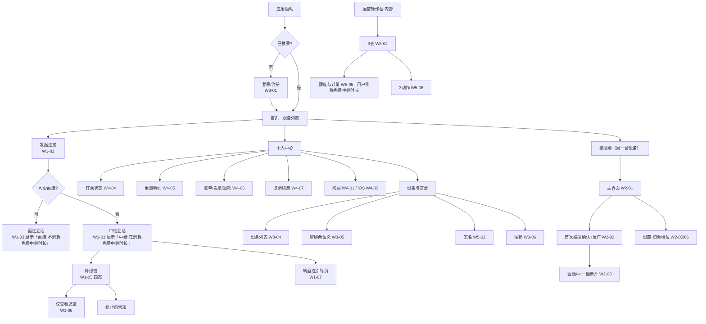

# 低保真线框稿 · 索引与 UI 需求清单

> 版本：2026-09-14 · 状态：**待评审**（低保真阶段）
> 产出：`docs/design/wireframe/`（本 README + `index.html` + 6 份线框页）
> 定位：本文是 `商业化与计费设计` §13、`账号与管理系统设计` §4/§5、`需求规划-v2-P0P3重构` §1·§2·§3 的**界面落点**。
> 🔴 **本稿不新增任何产品决策**；出现的额度 / 设备数 / 价格等数值全部来自 SSOT `成本测算表` §0，并在界面标注「必须后端下发，不得硬编码」。

---

## 0. 本轮交付的是「低保真」，先划清边界

| | 低保真（本稿） | 高保真（本稿不做） |
|---|---|---|
| 解决 | 有哪些界面 · 每屏放什么 · 层级 · 流程 · 状态 · 异常 | 好不好看 · 品牌 · 视觉语言 |
| 内容 | 灰阶方块 + 灰条 + 交叉框 + 编号标注 | 颜色 / 字号 / 间距 / 圆角 / 阴影 / 图标 / 动效 |
| 用途 | **能不能过评审：有没有漏屏、有没有违规屏、流程断没断** | 交给前端按稿还原 |
| 交付物 | 6 份 HTML 线框 + 本清单 | Design Token + 组件规格 |

⚠️ 线框内**一律灰阶**；文档中的暗红只用于标注，**不是 UI 颜色**。

---

## 1. 结论先行：这个项目一共有 **43 个需要 UI 的位置**

判定标准沿用 `商业化与计费设计` §13.1 的四类区分，本稿把它从"计费"扩展到全部端：

| 层 | 判据 | 处理 | 数量 |
|---|---|---|---|
| **① UI = 已拍板决策的执行体** 🔴 | 没有这个界面，**已拍板的决策/合规项就被违反**（例：禁止静默降码率 ⇒ 必须有「码率已降」明示） | **P0 必做**，且**不参与 ROI 排序** | 30 |
| **② UI = 主主张的可见化** 🔑 | 主张只能靠界面被相信（例：「直连不消耗免费时长」⇒ 只能靠连接模式指示器） | **P0 必做** | 3 |
| **③ UI = 常规商业化 / 管理界面** | 缺了不影响合规，只影响转化与效率 | P0 粗糙版 → P1 完整版 | 10 |
| **④ 明确不做的界面** ⚠️ | 做了会把资产变负债 | **不做**，写进红线 | 5（不做） |

> ⚠️ 上表数值为 **2026-09-14 评审后实测值**；旧版本曾写作 ① 24 / ② 6 / ③ 13，与清单不符，已订正。

🔴 **关键纪律（继承 §13.1）**：第 ①② 类界面**不是"体验优化"而是"决策的执行体"**。
**不得以「购买页更像商业化 / 更能转化」为由，把购买页排在连接模式指示器之前。**

---

## 2. 全量 UI 清单（按端 × 模块）

> 「层」= 上表分类；「帧」= 本稿线框编号，可点击跳转。
> 共 **43 个界面条目 ⇒ 46 张线框图**，层分布 **① 30 / ② 3 / ③ 10**，优先级 **P0 39 / P1 4**。
> 图比条目多 **3 张**，原因只有一个：<b>W1-05「降级链」一屏拆四态</b>（1 条目 → 4 图）。
> （W1-06 / W1-06b 是**两个独立条目**，各占一图；🔴 **W1-10 / W2-08 为 `[新增·D19]` 的音频两帧**，也是独立条目 9b / 15c。）

### 2.1 控制端（Windows / macOS）

| # | 界面 | 层 | 优先级 | 归属文档 | 帧 |
|---|---|---|---|---|---|
| 1 | 主界面（设备列表 + **常驻**连接模式指示器） | ② | P0 | v2 §1 · 商业化 §13.2#1 | [W1-01](w1-控制端-连接与额度.html#w1-01) |
| 2 | 连接中（先中继秒连 → 后台静默升级直连） | ② | P0 | v2 §1 连接建立策略 | [W1-02](w1-控制端-连接与额度.html#w1-02) |
| 3 | 会话窗口（窗口化 + 等比缩放 + 黑边 + 工具栏） | ① | P0 | v2 §1 D9 | [W1-03](w1-控制端-连接与额度.html#w1-03) |
| 4 | 免费中继余量（**默认折叠**，80% 才现） | ① | P0 | 商业化 §13.2#2 | [W1-04](w1-控制端-连接与额度.html#w1-04) |
| 5 | 降级链四态（预警 → 转直连 → 🔴降码率明示 → 终止前告知） | ① | P0 | 商业化 §13.2#3 · §8 · D11-5 | [W1-05a](w1-控制端-连接与额度.html#w1-05a) [b](w1-控制端-连接与额度.html#w1-05b) [c](w1-控制端-连接与额度.html#w1-05c) [d](w1-控制端-连接与额度.html#w1-05d) |
| 6 | 「仅查看」遮罩 · **资源式**（中继用尽且直连失败 ⇒ 画面冻结在最后一帧） | ① | P0 | 商业化 §13.2#4 | [W1-06](w1-控制端-连接与额度.html#w1-06) |
| 6b | 「仅查看」遮罩 · **权限式**（链路正常，对方收回操作权 ⇒ 画面仍在实时更新） | ① | P0 | v2 §2.3 观察模式 | [W1-06b](w1-控制端-连接与额度.html#w1-06b) |
| 7 | **「转直连」引导页** 🔴（本文唯一被称为"产品价值点"的一步） | ② | P0 | 商业化 §13.2#5 · §8② | [W1-07](w1-控制端-连接与额度.html#w1-07) |
| 8 | 显示设置（适应窗口 / 1:1 / 拉伸 + 缩放模式） | ① | P0 | v2 §1 D9 | [W1-08](w1-控制端-连接与额度.html#w1-08) |
| 9 | 断连后（中性说明；⚠️ **无促销弹窗**） | ① | P0 | 商业化 §13.4 红线⑤ | [W1-09](w1-控制端-连接与额度.html#w1-09) |
| 9b | 🔴 **音频控制条**（声音回传 / 按住说话对讲 / 纯音频模式三态）`[新增·D19]` | ① | P0 | v2 §1 **D19** · §4.4 · 商业化 §13.2**#9** | [W1-10](w1-控制端-连接与额度.html#w1-10) |

### 2.2 被控端（Windows / macOS / Android 免 Root）

| # | 界面 | 层 | 优先级 | 归属文档 | 帧 |
|---|---|---|---|---|---|
| 10 | 被控端主界面（本机 ID / 临时密码 / 状态） | ① | P0 | v2 §3.1 | [W2-01](w2-被控端.html#w2-01) |
| 11 | 首次被控确认页（**含反诈风险提示位，不得折叠**） | ① | P0 | v2 §1 E6 **A8** · §6.5 D17 | [W2-02](w2-被控端.html#w2-02) |
| 12 | 会话中 + **一键断开**（无挽留式二次确认） | ① | P0 | v2 §1 E6 **C3** | [W2-03](w2-被控端.html#w2-03) |
| 13 | 🔴 仅查看时的中性提示（**无金额/余额/充值**） | ① | P0 | 商业化 §13.4 红线② | [W2-04](w2-被控端.html#w2-04) |
| 14 | 资源档位（节能/均衡/高性能）+ 隐私屏 | ① | P0 | v2 §1 被控端 | [W2-05](w2-被控端.html#w2-05) |
| 15 | 设置总览（自启 / 无人值守 / 权限 / 更新） | ③ | P0 | v2 §3 | [W2-06](w2-被控端.html#w2-06) |
| 15b | 🔴 对方请求恢复操作（**原型跑出后补帧**：缺了它，控制端「请求控制」是死按钮） | ① | P0 | 可点击原型断点 #8 | [W2-07](w2-被控端.html#w2-07) |
| 15c | 🔴 **采音提示 + 一键静音**（🔴 **不得静默采音**；静音不得成为降级惩罚）`[新增·D19]` | ① | P0 | v2 §4.4 · 商业化 §13.4 **红线⑥** | [W2-08](w2-被控端.html#w2-08) |

### 2.3 账号（全端通用）

| # | 界面 | 层 | 优先级 | 归属文档 | 帧 |
|---|---|---|---|---|---|
| 16 | 登录 / 注册（含生物识别快捷登录） | ③ | P0 | v2 §1 认证 | [W3-01](w3-账号与设备管理.html#w3-01) |
| 17 | 找回密码 + **恢复码**（🔴 两种语义必须分开） | ① | P0 | 账号 §2 · v2 §6.2 | [W3-02](w3-账号与设备管理.html#w3-02) |
| 18 | 双重验证（2FA） | ① | P0 | v2 §1 认证 | [W3-03](w3-账号与设备管理.html#w3-03) |
| 19 | 设备列表（**三态** + 踢下线 + 「最久未连接」排序） | ① | P0 | 账号 §2.3/§2.4 · D12-1 | [W3-04](w3-账号与设备管理.html#w3-04) |
| 20 | 解绑两种语义（取消授权 ≠ 移除设备） | ① | P0 | 账号 §7 D12 铁律 | [W3-05](w3-账号与设备管理.html#w3-05) |
| 21 | 一键解绑全部 + **注销（3 步内可达 + 30 天可撤销）** | ① | P0 | v2 §1 E6 **A3** | [W3-06](w3-账号与设备管理.html#w3-06) |

### 2.4 计费与个人中心

| # | 界面 | 层 | 优先级 | 归属文档 | 帧 |
|---|---|---|---|---|---|
| 22 | 购买页 · 最小版（非 iOS，只需跑通一条路径） | ③ | P0 | 商业化 §13.2#7 | [W4-01](w4-计费与个人中心.html#w4-01) |
| 23 | 购买页 · **iOS 版对照**（🔴 零站外支付引导） | ① | P0 | §13.4 红线④ · E6 **A5** | [W4-02](w4-计费与个人中心.html#w4-02) |
| 24 | 权益对比表（4 档 × N 权益；🔴 免费项显式写「免费」） | ③ | P1 | 商业化 §13.3 | [W4-03](w4-计费与个人中心.html#w4-03) |
| 25 | 个人中心 · 订阅状态（🔴 iOS / 非 iOS 两套） | ③ | P1 | 账号 §4.1 | [W4-04](w4-计费与个人中心.html#w4-04) |
| 26 | 用量明细页（🔑 反客诉主体） | ③ | P1 | 账号 §4.2 · 商业化 §13.3 | [W4-05](w4-计费与个人中心.html#w4-05) |
| 27 | 账单 / 发票 / 退款状态（含 §4.3.1 五条联动） | ③ | P1 | 账号 §4.3 | [W4-06](w4-计费与个人中心.html#w4-06) |
| 28 | 取消续费路径（🔴 不得比开通更难、不得藏深菜单） | ① | P0 | 账号 §4.4 | [W4-07](w4-计费与个人中心.html#w4-07) |
| 29 | 续费前 5 日提醒（🔴 合规硬项） | ① | P0 | 商业化 §13.2#8 · E6 **A4** | [W4-08](w4-计费与个人中心.html#w4-08) |

### 2.5 合规（跨端）

| # | 界面 | 层 | 优先级 | 归属文档 | 帧 |
|---|---|---|---|---|---|
| 30 | 首次连接隐私告知（中继会转发 + 直连只报起止） | ① | P0 | v2 §1 E6 **A2** | [W5-01](w5-合规实名与运营台.html#w5-01) |
| 31 | 实名认证入口 + **三类触发事件** | ① | P0 | v2 §1 E6 **A6** · §6.5 D17 | [W5-02](w5-合规实名与运营台.html#w5-02) |
| 32 | 未实名降级路径（不是拦截，是降级） | ① | P0 | v2 §6.5 | [W5-03](w5-合规实名与运营台.html#w5-03) |

### 2.6 运营操作台（内部工具，非用户可见）

| # | 界面 | 层 | 优先级 | 归属文档 | 帧 |
|---|---|---|---|---|---|
| 33 | 操作台首页 · **3 查** | ③ | P0 | 账号 §5.1 · D12-6 | [W5-04](w5-合规实名与运营台.html#w5-04) |
| 34 | 查额度与计量明细（🔴 **与用户侧同源同一份数据**）<br /><span class="tiny">⚠️「额度」是本台内部用词；用户侧（W4-05）同一份数据叫「免费中继时长」</span> | ① | P0 | 账号 §5.1#2 · §4.2 | [W5-05](w5-合规实名与运营台.html#w5-05) |
| 35 | **3 动作**（调额度 / 封禁加白 / 退款跳转）+ 权限与审计 | ① | P0 | 账号 §5.1 · §5.4 | [W5-06](w5-合规实名与运营台.html#w5-06) |

### 2.7 移动端（Android 控制端）

| # | 界面 | 层 | 优先级 | 归属文档 | 帧 |
|---|---|---|---|---|---|
| 36 | 设备列表（移动端） | ③ | P0 | v2 §2.3.1 | [W6-01](w6-移动端手持.html#w6-01) |
| 37 | 手持会话（放大镜 / 双模指针 / 焦点跟随） | ① | P0 | v2 §2.3.1 | [W6-02](w6-移动端手持.html#w6-02) |
| 38 | 纯观察模式 | ③ | P0 | v2 §2.3.1 | [W6-03](w6-移动端手持.html#w6-03) |
| 39 | PC→手机（帮父母排障）控制端 | ① | P0 | v2 §1 **D10** | [W6-04](w6-移动端手持.html#w6-04) |

### 2.8 明确**不做**的界面（红线，共 5 项）

| # | 不做的界面 | 理由 | 出处 |
|---|---|---|---|
| 40 | ⚠️ 断连瞬间的**促销弹窗** | 把 D1 透明度资产直接转成「他就是在卖我流量」的负债 | §13.4 红线⑤ |
| 41 | ⚠️ 被控端任何**金额 / 余额 / 充值**字样 | 帮爸妈调手机时弹出「余额不足」= 摧毁手机被控免费钩子 | §13.4 红线② |
| 42 | ⚠️ iOS 版任何**站外支付引导** | App Store 3.1.1 拒审 | §13.4 红线④ |
| 43 | ⚠️ 常驻贴脸的**余量催费 UI** | 指示器从「告知」变「催费」，透明度资产降级为广告位 | §13.4 红线① |
| 44 | ⚠️ 用户端任何**推广位 / 活动中心 / 弹窗运营位** | P0 不做，本轮明确排除 | 本稿决定 |

---

## 3. 信息架构（IA）



---

## 4. 五条关键用户流（评审时按流走，比按屏走更容易发现断点）

### 流 1 · 首次连接（含主主张落地）——最关键
```
点「连接」→ 连接中（先中继秒连，W1-02）
→ 连上后顶部一次性提示：本次「直连」或「中继」（W1-03）
→ 若中继：常驻指示器显示「中继 · 本次剩余免费中继时长 xx 分钟」（W1-01/W1-04）
→ 首次连接前必须过隐私告知（W5-01）
```
🔴 断点检查：**若不显示「本次连接方式」，D1/D8 主主张就没有任何执行体**。

### 流 2 · 免费中继时长消耗到降级到终止（四态链）
```
余量 80% → 常驻指示器变为可见（W1-04 态 B）
→ 余量 20% → 预警横幅（W1-05 态 A）
→ 余量 0 → 转直连引导页（W1-07）+ 中止中继
→ 若直连不可用 → 🔴「画质已降低，因为中继时长用尽」明示（W1-05 态 C）
→ 仍不可用 → 终止前告知 + 转「仅查看」（W1-05 态 D / W1-06）
```
🔴 铁律：**四态一个都不能省**。省掉「码率已降」= 违反「禁止静默降码率」已拍板决策。

### 流 3 · 被控端授权（含反诈）
```
对方发起 → 本机弹「首次被控确认页」（W2-02）
→ 页面必须同时呈现：谁在连、能做什么、反诈提示 3 句（不得折叠）
→ 同意 → 会话中（W2-03），可一键断开（点一次即断，无挽留）
→ 对方进入仅查看 → 本机收中性提示（W2-04，🔴 无金额）
→ 对方请求恢复操作 → 本机收「允许操作 / 保持仅查看」（W2-07，🔴 默认保持仅查看）
```

### 流 4 · 退款（§4.3.1 五条联动）
```
订单列表 → 申请退款 → 系统硬判定「7 天内 且 中继用量 = 0」
→ 通过 → 🔴 立即回收（订阅终止 + 未用完的免费中继时长作废）
→ 查看退款状态（渠道后台回填）
→ 同账号 180 天内第 2 次 → 转人工
```

### 流 5 · 注销（3 步内可达）
```
我的 → 设置 → 账号与安全 → 注销账号（≤3 步）
→ 告知 30 天冷静期 + 期间可撤销
→ 30 天内：仅标记不删
→ 期满：级联删身份数据 + 匿名化计量/审计流水（🔴 自动任务）
```

---

## 5. 🔴 红线在界面上的落点（评审自检表）

| 红线 / 阻塞项 | 出处 | 执行体（本稿） | 缺失后果 |
|---|---|---|---|
| 禁止静默降码率 | D11-5 | W1-05 态 C | 已拍板决策被违反 |
| 全站「端到端加密」字样清零 | E6 A2 | W5-01 文案 | 合规风险 |
| 中继转发 + 直连只报起止，须明示 | E6 A2 | W5-01 | 合规风险 |
| 技术状态 ≠ 商业计数 | §13.4① | W1-01 / W1-04（状态常驻、余量折叠） | 透明度资产→广告位 |
| 🔴 计费 UI 只在控制端 | §13.4② | W2-04 全帧 | 手机被控钩子失效 |
| 🔴 免费项显式标「免费」 | §13.4③ | W4-03 表 | 钩子反向失效 |
| 🔴 iOS 零站外支付引导 | §13.4④ | W4-02 | 拒审 |
| ⚠️ 无断连促销弹窗 | §13.4⑤ | W1-09 | 资产→负债 |
| 注销 3 步内 + 30 天可撤销 | E6 A3 | W3-06 | 合规 |
| 续费前 5 日提醒 | E6 A4 | W4-08 | 合规 |
| 取消续费不得比开通更难 | 账号 §4.4 | W4-07 | 暗黑模式投诉 |
| 实名触发链路可用 | E6 A6 / D17 | W5-02 / W5-03 | 合规 |
| 反诈提示位不得折叠 | E6 A8 | W2-02 | 合规 |
| 一键断开无挽留 | E6 C3 | W2-03 | 体验红线 |
| 🔴 恢复控制需被控端应答 | 原型断点 #8 | W2-07 | 控制端「请求控制」成为死按钮 |
| 设备数 150 台 = **免费版优势行** | D15 | W4-03 | 会被截图打脸 |
| 数值不得硬编码 | §13.5 | 全帧标注「后端下发」 | ✅ **`[D18]` 已降低该风险**：报价到手 = **录一个成本参数**（非改代码 / 改文档）+ 系统自动重算下游 ⇒ 返工面从「整环境」收窄到「一次参数录入」（`成本测算表` §3.4） |

---

## 6. 低保真规范（本轮约定）

| 项 | 约定 |
|---|---|
| 颜色 | 灰阶（`#2b2b2b` / `#bdbdbd` / `#f5f5f5`）；标注层暗红仅说明 |
| 画布 | 桌面 `830×500`、窗口 `760×440`、移动 `330×620`、面板 `430×470` |
| 文字 | 灰条 = 正文；交叉框 = 图形/画面；短标签用真字（低保真允许真文案，便于评审） |
| 标注 | 屏内红圈数字 ①②③ ↔ 下方说明列表，一一对应 |
| 状态 | 每屏必须标出「正常 / 空态 / 异常 / 权限不足」中**至少覆盖到的那一种** |
| 命名 | `W{端}-{序号}`，例 `W1-05` = 控制端第 5 帧 |
| 交付 | 单页 HTML，双击可看，不依赖构建 |
| 几何 | ⚠️ `.screen` 固定高度 + `overflow:hidden` ⇒ 子元素超界是**静默裁切**。改稿后必须跑 `node tools/wireframe-selfcheck.mjs`（画布裁切 / 横向溢出 / 锚点可达 / 原型 JS 报错，退出码 `0` 才能提交；明细同时落盘到 `tools/selfcheck-report.json`，已 gitignore） |
| 交互态 | **本稿一律不含** `:hover` / `:focus` / `:disabled`，且伪按钮用 `<span>` 而非 `<button>` ⇒ **高保真阶段必须补齐**，否则键盘用户与无障碍评审过不了 |

### 6.1 术语表（全稿强制）

| 场合 | 用词 |
|---|---|
| **用户可见的一切界面** | 一律用「**免费中继时长**」 |
| **运营台 / 开发文档**（内部工具） | 可用「额度」（财务语言，用户侧不得出现） |
| **被控端**（Windows / macOS / Android 面板） | **任何位置不得出现「额度」**，且不得出现金额 / 催费 / 推销字样（红线①②的执行面） |

---

## 7. 本轮未出稿的部分（有意为之）

| 未出稿 | 原因 | 何时做 |
|---|---|---|
| 文件传输面板 / 剪贴板 | P0 但属"照抄行业惯例"的常规界面，无争议 | P1 视觉阶段补 |
| 多显示器切换 | P0 基础、P1 完整 | 与 D9 一起进视觉阶段 |
| 外接大屏 / 桌面模式（DP Alt Mode） | P1 | P1 排期 |
| Web 控制端 | P0 但为"一次性授权码免登录"单页 | 单独一稿，建议与授权码流程一起设计 |
| 弱网自动降级 P1 项 | P1 | P1 |
| 邀请 / 家庭互助白名单的用户侧入口 | 与 §9.3 政策绑定，需先定运营口径 | 待政策定稿 |

---

## 8. 六个低保真问题 · ✅ 已定案（2026-09-14，用户「按你的建议来」）

| # | 问题 | 结论 | 落点 |
|---|---|---|---|
| 1 | 「免费中继时长」还是「免费时长」？ | **统一用「免费中继时长」** | 全稿已统一（W1-04 / W2 / W6） |
| 2 | 首连提示：Toast 3 秒 vs 会话内常驻一行？ | **会话窗口内常驻一行**（Toast 会消失，主主张需要被反复看到） | W1-03 顶部提示行 |
| 3 | 余量折叠态是否显示百分比？ | **不显示百分比**，只给「约剩 xx 分钟」这类粗粒度 | W1-04 态 B |
| 4 | 仅查看时被控端是否也提示？ | **显示中性提示**（否则被控端不懂为什么操作不动了） | W2-04 |
| 5 | 运营台调额度是否强制填原因？ | **强制填写 + 超阈值需第二人复核** | W5-06 |
| 6 | 是否先把 W1/W2 做成可点击 HTML 原型？ | **✅ 已做** | `proto-流程原型.html`（见 §9） |

**顺带的措辞纪律**（来自第 1 问）：对外只用「免费中继时长」；**不用「额度」**
（额度是财务语言，会让用户以为在管钱包）。

---

## 9. 可点击原型（2026-09-14 新增）

文件：`docs/design/wireframe/proto-流程原型.html`（双击即可，仍无构建 / 无依赖）。

把 W1 + W2 的静态帧接成一条能走通的流程，**左右双端同步**：点左边控制端，右边被控端跟着变
—— 用来回答静态帧答不了的那个问题：**「按键点下去之后，下一步在哪儿？」**

内置两条自动化纪律（每次界面变化都跑一次）：

- 🔴 **被控端红线断言**：被控端面板任一时刻出现**金额或催费语言**，页面顶部立刻报警。
  判定不看死词表，而是**两级语义**：先试**金额模式**（`¥/￥/$ + 数字`、`X 元`、`X 元/月`、`售价|价格|定价|报价|立减|满减|返现|限时|促销`），
  再试**计费模式**（`余额|充值|续费|付费|支付|钱包|账单|发票|订单|购买|订购|订阅|套餐|会员|计费|扣费|欠费|额度|权益|收费|优惠|折扣`）。
- 🔴 **控制端禁用词断言**：控制端只要不在初始列表页，就再套一层**转化词模式**
  （`余额|充值|续费|付费|支付|钱包|账单|发票|购买|订购|订阅|套餐|会员|升级可|开通|限时|优惠|折扣|立减|满减`）。
- ✅ **两侧都有白名单与反例区**：短语「不需要付费 / 无需付费 / 不额外收费 / 免费中继时长 / 免费版」不算违规；
  `<code>.no-zone</code>` 里的内容（评审用的「反面例子」）不参与判定。
- ✅ **断言本身被反例验证过**：8 例正对照（该报的 4 例全报、该放行的 4 例全放行）见 §11。

**实测结论（2026-09-15）**：auto 一键跑完 ①→⑩ 全部步骤，落到「已断开」；**红线告警 0 次**；
JS 报错 0；横向溢出 0；画布静默裁切 0（八页全部通过 `tools/wireframe-selfcheck.mjs`）。

### 9.1 这条流程跑出来的 9 个断点

| # | 断点 | 处置 |
|---|---|---|
| 1 | 余量耗尽 ≠ 必须打扰用户：直连可用时只该看到一条横幅消失，**引导页只能在「直连也失败」时出现** | 已固化进原型 |
| 2 | 「已切换为直连」后又回退 ⇒ 同一行先后说两句相反的话，用户会怀疑前一句是假消息 | 待定：宣布直连前先稳定 ~10 秒，或文案改为「当前为直连（网络变化时会自动回退）」 |
| 3 | 引导页打开时画面必须是**冻结的最后一帧**（不能黑屏、不能继续动） | 需后端能力：冻结帧 + 文案告知 |
| 4 | 首连提示行：常驻 vs 淡出 | 建议：首连后常驻 ~15 秒淡出，**底部指示器常驻**（技术状态常驻、商业说明不必常驻） |
| 5 | 降码率时被控端**不告知**（画质是控制端的事，让被帮助的一方读 1080p 只会联想到「是不是要花钱」） | ✅ 已回写 W2-04 说明 |
| 6 | 「总是允许此设备」与「90 天未连接」的信任降级耦合（记住设备后是否重弹确认页） | 需与 D12-2 一起定案 |
| 7 | 对方先断开时，控制端不得模态拦人（只给一条非阻塞提示 + 重连按钮） | 已进原型 |
| 8 | 🔴 **W2 缺「允许恢复操作」**：恢复控制需双方同意，被控端原先只有「断开」⇒ 控制端「请求控制」是永远没应答的死按钮 | ✅ **已补帧 [W2-07](w2-被控端.html#w2-07)**（原型右面板可现场验证：先点「⑨b」走权限式，再点「请求恢复控制」） |
| 8b | 🔴 **「仅查看」有两种成因，不能共用一个说法**：①**资源式** = 中继用尽 + 直连失败 ⇒ 没有通道，画面冻结在最后一帧，**不得出现「请求恢复控制」**（点了也没用）；②**权限式** = 链路正常，对方主动收回操作权 ⇒ 画面仍在实时更新，「请求恢复控制」才是有效按钮 | ✅ **已拆图**：[W1-06](w1-控制端-连接与额度.html#w1-06)（资源式）/ [W1-06b](w1-控制端-连接与额度.html#w1-06b)（权限式）；原型里资源式点该按钮会主动打警告日志 |

### 9.2 边界（本原型不是高保真）

- 仍是灰阶低保真，**不含**视觉设计；数值全为示意，**真实值必须后端下发**。
- 只覆盖流 1（首次连接）、流 2（降级四态）、流 3（被控端授权）；
  **退款（流 4）与注销（流 5）未做原型**。

---

## 10. 快速开始

直接双击 `index.html`，或用浏览器打开：
`docs/design/wireframe/index.html`

想直接看流程，打开可点击原型：
`docs/design/wireframe/proto-流程原型.html`

（本稿为纯静态 HTML + CSS，无构建、无依赖、可离线查看。）

---

## 11. UI/UX 评审结论与修复状态（2026-09-15）

评审范围：本目录全部 8 个页面（`index.html` + `w1`~`w6` + `proto-流程原型.html`）。
共 **22 条 P0**（缺了就是违反已拍板决策或缺了关键状态）+ **11 条 P1**（体验完善项），已全部处置。

### 11.1 P0 六类问题（已修）

| 类别 | 问题 | 处置 |
|---|---|---|
| **① 红线执行体缺失** | 控制端会话内无「已降画质」执行体；被控端无「不得出现额度」的视觉约束 | 补齐 W1-05 四态、W2 全页措辞收紧 |
| **② 面板状态机不完整** | 被控端缺「允许恢复操作」⇒ 控制端请求控制是死按钮 | 补 [W2-07](w2-被控端.html#w2-07) |
| **③ 一个说法覆盖两种成因** | 「仅查看」把「没通道」和「对方收回操作权」混为一谈 ⇒ 假承诺 + 死按钮 | 拆成 W1-06（资源式）/ W1-06b（权限式） |
| **④ 静默裁切** | `.screen` 固定高度 + `overflow:hidden` ⇒ 5 处画面被裁掉且看不出来 | 修 5 处 + 建 `tools/wireframe-selfcheck.mjs` 永久把关（复测又揪出 7 处，含 2 个完全跑出画布的标注红圈） |
| **⑤ 计数与编号不一致** | 页面自称条目数与 `index.html` / 本 README 不一致 | 统一为 **43 个界面条目 ⇒ 46 张线框图** |
| **⑥ 术语漂移** | 「额度」「免费时长」「免费中继时长」三种写法混用；被控端出现「额度」 | 全稿统一（见 §6.1） |

### 11.2 P1（已修）

锚点可单独引用（`W1-05a`~`d`、`W1-06b`、`W2-07` 等）· 长页锚点跳转留出顶栏高度（`scroll-margin-top`）· 鼠标滚轮平滑滚动 ·
音频四态（关 / 开 / 对讲 / 纯音频）在被控端一并可见 · 被控端「一键静音」双向同步 ·
「纯音频模式画面已停传」的明示 · 原型 `auto()` 一键跑全部步骤 · 断言词表的反例自检。

### 11.3 断言的自我验证（8 例正对照，全部符合预期）

| 输入 | 期望 | 实测 |
|---|---|---|
| `余额不足` | 报警 | ✅ 报警 |
| `¥25/月 限时优惠` | 报警 | ✅ 报警 |
| `会员专享` | 报警 | ✅ 报警 |
| `1080p/30 售价 158 元/年` | 报警 | ✅ 报警 |
| `升级可享更高画质` | 报警 | ✅ 报警 |
| `免费中继时长` | 放行 | ✅ 放行 |
| `不需要付费，直连即可` | 放行 | ✅ 放行 |
| `新增一个元素` | 放行 | ✅ 放行 |

### 11.4 仍然存在的缺口（已登记，高保真阶段收）

| # | 缺口 | 原因 |
|---|---|---|
| 1 | 全稿无 `:focus` / `:hover` / `:disabled`，伪按钮是 `<span>` 不可聚焦 | 低保真阶段有意省略 ⇒ 视觉阶段必须改用 `<button>` 并补键盘态 |
| 2 | 面板开关的状态覆盖矩阵（W2-08 三开关 ⇒ 2³ 组合）未逐格出图 | 组合爆炸，建议在组件层用状态图收 |
| 3 | 低对比度标注文字（`.tiny.muted`）仅供评审 | 高保真阶段按 WCAG AA 重定色值 |
| 4 | 退款（流 4）与注销（流 5）无原型 | 只覆盖流 1~3，见 §9.2 |
