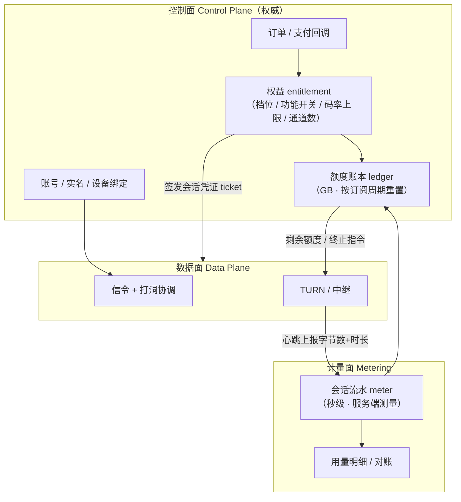
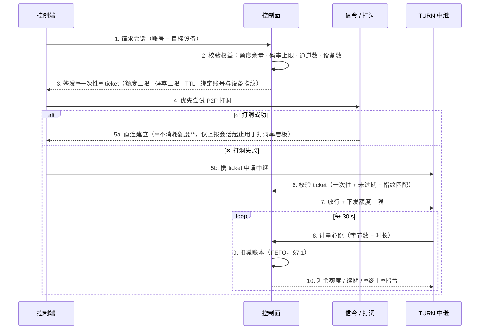

# 商业化与计费设计（定价 · 付费墙 · 技术控制）`[新增]`

> **本文回答两个问题**：① **怎么收钱**（卖什么、定什么价、免费版卡在哪）② **技术上怎么控**（钱收不到/额度拦不住就白设计）。
> **配套文档**：`成本测算表.md`（成本口径与额度推演 · §7 是本文的定量基础）· `竞品对标表.md`（价格锚点与免费版边界 · §2/§3）· `需求规划-v2-P0P3重构.md`（主主张 = 「免费额度做到对手收费档位」）
> **状态**：✅ **已拍板并登记为决策 D11（2026-09-14）** —— §11 原 5 项待确认已全部确认，结论见 §11。

---

## 0. 一页纸速览

> **一句话：卖的不是带宽，是「零边际成本的数字权益」；限的不是时长，是「会花钱的那条路」（中继）。**

| # | 结论 | 一句话理由 |
|---|---|---|
| 1 | 🔑 **付费墙只能挂在「中继」上** | 直连（P2P）**技术上无法可信计量**；中继是唯一必经我方服务器的通道 ⇒ **商业上要免费的部分，正好就是技术上量不到的部分** —— 二者天然对齐，不是巧合而是唯一自洽解（§4） |
| 2 | 🔑 **内部计量单位用 GB，对外展示单位用「分钟」** | 按「时长」限额会被高画质用户**击穿**（2K60 = 12 Mbps，成本是 1080p30 的 **3 倍**，额度消耗却一样）；按 GB 则成本与消耗**严格线性**（§5.1） |
| 3 | 免费版**必须对齐 ToDesk 免费版**，只在两点超配 | 对手免费版 = 不限时 + 4 Mbps + 30fps + 1080p + 100 台 + 1 通道 + 2 会话（竞品对标表 §3.1）；超配的两点 = **直连不限时长** 与 **手机被控免费** |
| 4 | 定价必须锚定 **¥13.2/月** | ToDesk 专业版 ¥158/年（竞品对标表 §2.1）。¥30+/月 会被瞬间比价击穿 |
| 5 | **毛利必须来自「零边际成本商品」** | 卖带宽 = 把成本转成收入。🔴 打平 MAU **必须带参数引用**（`成本测算表` §8.2 参数表）：按 `[D11-3]` 订价 **¥13.2** ⇒ **223 万（4% 转化）～1,163 万（3%）**；靠插件把 **ARPPU 抬到 ¥18** ⇒ 79 万。**均不现实** ⇒ 插件货架从 P1 就预留。（旧文写的「~685 万」**已作废**：无法用 `成本测算表` §8.1 公式复现） |
| 6 | 🔴 **额度耗尽不得直接断连** | 按「提示 → 尝试转直连 → 降码率 → 最后才断」四级降级（§8）。直接断连与 D1（透明度）主张自相矛盾 |
| 7 | 🔴 **计量裁决必须在服务端** | 客户端计时可被「改系统时间 / 篡改内存 / 重放响应」绕过 ⇒ 客户端只做**展示与预警**，不做裁决（§4） |
| 8 | 🔴 **额度是「账号」的属性，不是「设备」的** | 否则换设备即刷额度；且免安装/一次性授权码场景**必须仍绑定账号**，否则费用无法归属（§9） |

---

## 1. 卖什么：价值阶梯与边际成本

**核心判据**：**只向「零边际成本」的东西收钱；对「高边际成本」的东西设阈值，而不是设价格。**

| 层级 | 卖什么 | 我方边际成本 | 是否适合当付费点 | 说明 |
|---|---|---|---|---|
| **L1** | 画质 / 帧率（2K60 / 4K240 / 4:4:4） | 🔴 **高**（码率 × 时长） | ⚠️ 可卖，但**必须配 GB 额度** | 卖高画质 = 卖带宽，成本随画质 4 倍级跃升 |
| **L2** | 并发通道数 / 会话数 | 🔴 **高**（直接乘中继成本） | ⚠️ 同上 | 🔴 **最容易被忽略的一项**（`成本测算表` §7.5 已警示：通道数直接乘中继成本） |
| **L3** | 设备数 | ✅ **零** | ❌ **不做付费点** | 对手免费就给 **100 台**；收这个钱只掉口碑不增收入 |
| **L4** | 功能开关（手机被控 / 隐私屏 / 文件传输 / 多显示器 / 虚拟屏） | ✅ **零** | ✅ **主力付费点** | 纯软件能力，边际成本 0 |
| **L5** | 数字商品（全球节点 / 屏幕墙 / 多控一 / 大文件加速 / AI 审计） | ✅ **≈0** | ✅ **ARPPU 主力** | 对标 ToDesk 插件货架（¥9.9–233/月，竞品对标表 §2.1） |
| **L6** | 企业 / 商用授权 | — | ❌ **Out of Scope** | v2 §7 已排除（会拖垮产品定义） |

> 🔴 **反直觉但重要**：**L1/L2 看起来最好卖**（用户最愿意为「更高画质、更多并发」付钱），**却是我方毛利最薄的** ——
> 用户加一档画质，我方成本涨 4 倍；加一个并发通道，中继成本**成倍**上去。
> ⇒ **定价策略：L1/L2 定「配额制」（用 GB 额度统一兜底），L4/L5 定「货架制」（自由增购）。**

### 1.1 插件 SKU × 定价 × 渗透率 → ARPPU 桥接表 `[新增]`

> 🔴 **为什么必须补这张表**：全库有 **两个结论悬空依赖「插件能把 ARPPU 拉到 ¥18 以上」** ——
> ① `成本测算表` §8.2：ARPPU ¥18 时打平 MAU 从 223 万降到 **79 万**；
> ② **D11-1（免费版 2 GB）的成立前提**（`成本测算表` §7.4）。
> 但此前**没有任何 SKU / 渗透率测算** ⇒ 两个结论都**无法验证**。本表把「ARPPU ¥13.2 → ¥25」拆成**可检验的假设**。

**设定（`[建议]`，均可单点替换）**：ARPPU = 订价 ¥13.2 + Σ（SKU 月价 × 在**付费用户**中的渗透率）

| SKU | 对标价（竞品表 §2.1） | **建议定价** | 渗透率假设 | 贡献 ARPPU | 边际成本 | 备注 |
|---|---|---|---|---|---|---|
| — | — | **订价 ¥13.2** | 100% | **¥13.2** | 含中继成本 | `[D11-3]` 锁定，**不可动** |
| 全球节点 | ¥9.9–233/月 | **¥12/月** | 25% | +¥3.0 | ✅ ≈0（节点是固定成本） | 与「中继额度」互补，可打包 |
| 多控一（1 控 N） | 按台数 | **¥15/月** | 10% | +¥1.5 | ✅ ≈0 | 🔴 **必须自带 GB 额度**（否则成本随台数线性涨，`成本测算表` §7.5） |
| 屏幕墙 | — | **¥19/月** | 6% | +¥1.1 | ✅ ≈0 | 偏 IT / 监控场景，个人渗透率低 |
| **大文件加速**（走我方中继） | — | **¥9.9/月** | 20% | +¥2.0 | 🔴 **高**（真花流量） | 🔴 **唯一有真实边际成本的插件** ⇒ **必须自带额度封顶**，不得与订阅额度共用 |
| 高清解码包（4:4:4 / 4K） | — | **¥12/月** | 8% | +¥1.0 | 🔴 高（码率↑） | 同上，必须封顶 |
| AI 审计（会话记录整理） | — | **¥25/月** | 3% | +¥0.8 | ⚠️ 中（LLM 调用） | 成本口径见 `成本测算表` §6.1 `[需填写]` |
| **合计** | | | | **≈ ¥22.6 / 付费用户** | | ✅ **≥ ¥18 ⇒ D11-1 的 2 GB 勉强成立**（`成本测算表` §7.4） |

> 🔴 **三种读法（必须一起看）**：
> 1. **达标线**：要达到 `成本测算表` §7.4 中能覆盖 2 GB 所需的容忍度（**≥ ¥0.463**）⇒ **ARPPU ≥ ¥18**。
>    上表设定值 ¥22.6 **看似留了 25% 缓冲**，但把渗透率整体打 7 折（≈¥15.9）**就不达标** ⇒ 🔴 **结论：这张表没有想象中宽裕，渗透率是关键变量**。
> 2. **最敏感的两个 SKU = 全球节点（+¥3.0）与大文件加速（+¥2.0）**，占插件贡献的 **61%** ⇒
>    验证优先级：**先测这两项的购买意愿**（内测期用「可点但提示暂未开放」的方式测**点击率**，成本为 0）。
> 3. ⚠️ **大文件加速 / 高清解码包是「真花钱」的插件**：卖得越多、边际成本越高，**与 L1/L2 是同一个问题**（§1）⇒
>    **必须配套同款 GB 额度**，否则插件收入会被中继成本吃掉。
>
> ✅ **落地要求（写进 v2 的 P1 交付物）**：① 插件货架 + 计费框架；② **每个「真花钱」的插件都必须自带额度封顶**；
> ③ 🔴 **「插件计费框架」与「额度复核（D11-1 是否下调）」是同一个交付物，不得拆开**（`成本测算表` §8.3）。

---

## 2. 定什么价

### 2.1 锚点（不可违背）

| 锚点 | 数值 | 来源 | 对我们的约束 |
|---|---|---|---|
| 价格天花板 | ToDesk 专业版 **¥158/年 = ¥13.2/月** | 竞品对标表 §2.1 | 🔴 **个人版不得显著高于此价** |
| 月付价差 | ToDesk 连续包月 ¥24 / 单月 ¥40 | 同上 | 月付须**明显贵于年付折算**，用价差引导年付（现金流 + 降流失） |
| 免费版底线 | 不限时 + 4 Mbps + 30fps + 1080p + 100 台 + 1 通道 + 2 会话 | 竞品对标表 §3.1 | 任一项弱于对手 = 直接被打「你免费版还限时？」 |
| 插件价格带 | ¥9.9 / 次 ~ ¥233 / 月 | 竞品对标表 §2.1 | 插件定价有现成的消费者心智，**照带上架即可** |

### 2.2 档位 `[已确认 D11-3]`

| 档位 | 建议价 | 对标 | 关键权益 |
|---|---|---|---|
| **免费版** | ¥0 | ToDesk 个人版 | **直连不限时长**（对手也是，但我们写明白）+ 中继 **2 GB/月** + 4 Mbps / 30fps / 1080p + **100 台** + 1 通道 + 2 会话 + 🔴 **手机被控免费**（对手 ¥25/月） |
| **个人版（年付）** | **¥158/年**（¥13.2/月） | ToDesk 专业版 ¥158/年 | 2K / 60fps + 中继 **10 GB/月** + **3 通道** + 10 会话 + 隐私屏自定义 + 多显示器 + 1 个虚拟屏 + 手机被控增强 |
| **个人版（月付）** | ¥24/月 | ToDesk 连续包月 | 同上。**年付省 45%** —— 价差本身就是转化手段 |
| **插件货架** | ¥9.9–99 /月·项 | ToDesk 插件 | 全球节点 · 多控一 · 屏幕墙 · 大文件加速 · AI 审计（**零边际成本**，§1 L5） |

### 2.3 成本校验（额度是否给得起）

**口径**：中继 ¥0.30/GB（模型假设值）· 额度**用满**时的最坏成本

| 档位 | 中继额度 | 用满成本 | 净收入（渠道 15%） | 用满占比 | 判定 |
|---|---|---|---|---|---|
| 免费版 | 2 GB | **¥0.60** | ¥0 | — | ⚠️ 须对比 §7.4 容忍度：`成本测算表` §7.4 给出 ¥18 客单 × 4% 转化 ⇒ 容忍度 **¥0.463** ⇒ 🔴 **2 GB 只在「客单价 ≥ ¥18 且转化率 ≥ 4%」下成立**（用满概率低，但这是上界，不能装看不见） |
| 个人版 | 10 GB | **¥3.00** | ¥11.19 | **27%** | ✅ 可接受（`成本测算表` §8.2 的 $V_{\text{paid}} = ¥4.18$ 与同量级） |

> 📌 **额度数值是「上界成本」而非「预期成本」** —— 真实用户不会用满（`成本测算表` §4 轻度用户中继仅 0.87 h）。
> 但**必须先有封顶，上界才有意义**（这正是 §4「付费墙挂中继」存在的理由）。
> 🔴 **额度最终数值必须在拿到 TURN 报价（`成本测算表` §10.2 #1 #2）后重算** —— 中继单价从 ¥0.30 翻到 ¥0.80，上表全部成本 **2.7 倍**。
> 🔴 **数值权威性（SSOT）**：本文出现的 2 GB / 10 GB / ¥0.30 / 4 Mbps / ¥13.2 等**均为引用** —— 权威出处是 **`成本测算表` §0「权威数值表」**；要改数**先改 SSOT 再回头改本文**（禁止在本文单方面改数，见 §13.7）。
> 🔴 **D11-1（2 GB）成立的完整前提**：**插件 ARPPU ≥ ¥18 且转化率 ≥ 4%**（`成本测算表` §7.4）⇒ 插件桥接测算见 **§1.1**。
> 若该前提不成立，**第一个下调的就是 2 GB**（D11-3 有 ToDesk 硬上限，动不了）。

### 2.4 为什么免费版给「手机被控免费」

对手把这项卖 **¥25/月**（ToDesk 免 Root 插件），**且免费版新设备 24 h 内禁用**。
我方免费版直接给 ⇒ 这是**唯一能低成本打穿对手收费墙的点**（技术成本≈0，见 §1 L4）。
⚠️ 但**定位仍是获客钩子、不是主主张**（v2 §9.3 D8）—— 免费给不等于对外主打它。

### 2.5 主主张的「证据表」：我方免费 vs 对手收费 `[新增]`

> 🔴 **为什么必须逐条列表**：主主张 = 「**免费额度做到对手收费档位**」（v2 §0 / §9.3 D8）。
> 但按 D8 的验收条件（须过 **A 差异化 + B 权重**），**主张必须逐条可验证** ——
> 逐条核查后：**四个「可占空位」里只有两个真正属于「对手收费、我方免费」，另两个只是「同档」。**

| 可占空位（`成本测算表` §7.5） | 对手 ToDesk 免费版 | 我方免费版 | **属于哪一类** | 可否写进对外主张 |
|---|---|---|---|---|
| **直连不限时长** | 实际上**也不计时**（技术上量不到），但**未明说** | **明说 + 连接模式指示器可当场验证** | ✅ **A（差异化）** —— 差在**透明度与可验证性**，不在条款 | ✅ **可以**（表述：「直连不限时长（可当场看到）」） |
| **手机被控免费** | 🔴 **收费 ¥25/月**（且免费版新设备 24h 内禁用） | **免费** | ✅ **A（差异化）·权重高** | ✅ **可以**（最硬的一条） |
| **100 台设备** | 免费版**也是 100 台** | 100 台 | ⚪ **同档，不是差异化** | ❌ **不可以**说成「对手收费我们免费」 |
| **通道数 / 会话数** | 免费版 **1 通道 · 2 会话**；付费档更多 | **落点未定**（`成本测算表` §7.5） | ⚠️ **未定案** ⇒ 若按同档 = 同档 | 🚫 **未定案前不得主张** |
| 画质档位 | 4 Mbps / 30 fps / 1080p | **同（对齐）** | ⚪ **同档** | ❌ |
| 时长 | 「不限时不限次」 | 中继 **2 GB/月**（直连不限） | ⚠️ **对手表面上更宽** | ❌ **不得主张「我们时长更宽」** |

> 🔴 **由本表得出的三条纪律**：
> 1. **对外只能主张已定案的两项**：「直连不限时长（且可当场验证）」+「手机被控免费」。**其余一律不得暗示**；
> 2. **主主张的措辞必须收窄**为：「**对手收费的能力，我们免费**（手机被控）；**对手不提的事，我们写明并可验证**（直连不限时长）」——
>    ❌ 不得写成「免费额度全面超越对手收费档位」（这是**主张 > 证据**，对手一截图就崩，`成本测算表` §7.5 已列同款风险）；
> 3. **通道数 / 会话数若要变成第三条证据，必须先定落点并单独核算中继成本**（`成本测算表` §7.5：通道数直接乘中继成本）⇒ **列入 v2 P0 前的待办**。

### 2.6 定价可配置性：可调价 ≠ 改数字 `[新增·D14]`

> **由来（用户 2026-09-14）**：「**产品定价不应该是固定价格，应该允许后续调价**」⇒ 判断成立，且这是**刚需**不是可选项。
> 三条理由：① `[D11-3]` 自己就写了「上线前重新核对 ToDesk 现价（**对手会调价**）」② `[D11-1]` 的触发器（ARPPU 跑不出 ¥18 就下调额度）与 TURN 报价到手后的重算，**都可能必须动商业条款** ③ §14 的两个预案（对手降价 / 手机被控被免费）的全部响应动作，都以「我方可以调整商业条款」为前提。
> ⚠️ **但「允许调价」的实现方式决定了它是资产还是事故** —— 本节回答「怎么调才不出事」。

#### 2.6.1 🔴 唯一纪律：调价 = **新增一个版本**，不是修改那个数字

| 做法 | 后果 |
|---|---|
| ❌ 直接改价目表上的价格字段 | **历史订单「当时应付」无法复现** ⇒ 对账 / 退款 / 发票 / 税务 / 客诉全部失据。用户拿三个月前的订单来问「为什么扣的不是这个数」时，我方**无法自证** |
| ✅ **价格版本化**：改价 = **新增一版**（新价格 + 新权益快照 + 生效期），旧版**原地不动** | 调价能力 **100% 保留**；历史订单仍指向它下单时的那一版 |

> 🔑 **这与 §7.1（FEFO 额度账本）是同一条原理**：**账本类数据一旦落账即不可回改**。
> 一句可复述的口径：**「价格可以随时改，但改的是下一版；已经卖出去的那一版永不改动。」**

#### 2.6.2 四类调价场景（必须分开支持，不能只做一个「改价」输入框）

| # | 场景 | 典型触发 | 必须支持的能力 | 🔴 容易漏的点 |
|---|---|---|---|---|
| 1 | **新价只对新用户** | 涨价（保老用户） | 版本生效时间 + **存量按签约版本续费** | 存量续费价必须**显式**由一个字段决定（见 2.6.3 `[D14-1]` = **按旧价续**），不能靠默认行为 |
| 2 | **新价对所有人生效**（含存量续费） | 降价、成本结构变化 | **变更续费价的通知 / 确认流程** | 🔴 **静默变更续费价是红线**；降价虽无需同意，但**必须显著告知**（`[D14-2]`） |
| 3 | **限时活动价** | 促销 / 首发 | `effective_from` / `effective_to` + **到期自动回落** | 🔴 **到期必须自动回落 + 提前提醒**（`[D14-3]`），不得「到期后静默涨回」（用户会认定被偷偷涨价） |
| 4 | **渠道分价** | iOS / 安卓商店 / 官网差异 | **分价源**（多渠道各自独立定价） | 🔴 **iOS 的价格我方后台管不了** —— 价源是 App Store Connect（见 2.6.3 `[D14-4]`） |

#### 2.6.3 ✅ 四个子决策（`[D14-1]` ~ `[D14-4]`）—— **2026-09-14 已拍板**

| # | 问题 | ✅ 已拍板结论 | 理由（为什么必须显式定） |
|---|---|---|---|
| **D14-1** | **涨价时，存量「连续包月 / 连续包年」用户按旧价还是新价续费？** | ✅ **按旧价续（grandfathering）** —— 涨价**不对存量迁移**，改用**新功能**而非价格推动老用户升级（新价只对新订阅生效） | 这是**最容易变成客诉与合规风险**的一项；若不定，工程只能随手选一个默认行为 |
| **D14-2** | **降价时，存量用户是否自动享受？** | ✅ **自动享受**（降价无需同意，用户无损失），但**必须显著告知** | 若不做 ⇒ 出现「新用户比老用户便宜」的公开比价事故 |
| **D14-3** | **活动价到期后如何处理？** | ✅ **自动回落原价 + 到期前 5 日提醒**（与 `[B5]` 续费提醒**同一通道**，不新建提醒体系） | 静默涨回 = 事实上的「偷偷涨价」，直接击穿 D1 透明度资产 |
| **D14-4** | **iOS 端价格谁定？** | ✅ **Apple 定**（App Store Connect 是唯一价源）⇒ 我方后台对 iOS **只读镜像、不得编辑**，且**不上浮**（`[D11-2]` 同价约束） | 这不是「限制我方调价自由」，而是**事实**：iOS 价源不在我方手里。若后台允许编辑 iOS 价 ⇒ 必然出现「后台显示 ¥18、Apple 实扣 ¥24」的口径分裂 |

> 🔑 **四项已全部拍板 ⇒ 定价模块的开工阻塞已解除**（`renew_price_policy` 的取值已定：**默认 `PIN_TO_SIGNED_VERSION`**，仅当同一版本显式标记「含存量」时才随新价迁移）。

#### 2.6.4 🔴 五条红线（`[D14]`）

| # | 红线 | 理由 |
|---|---|---|
| 1 | ❌ **不得修改已被订单引用的价格版本**（只能新增版本） | 见 2.6.1：订单是**财务凭证** |
| 2 | ❌ **不得静默变更存量续费价**（可变更，但须**显著提醒**；降价无需确认、涨价须确认） | 续费变更的监管要求；也是客诉最集中处。**`[D14-1]` 已定：涨价不对存量迁移**（`[D14-2]`：降价自动生效但须告知） |
| 3 | ❌ **不得「只改价不改权益包」** —— 价格与权益额度（GB / 通道 / 画质）必须**同版本原子快照** | 只改价不改额度 = 毛利被静默侵蚀；只改额度不改价 = **卖一单亏一单** |
| 4 | ❌ **不得设置无依据的划线价 / 原价** | 《明码标价和禁止价格欺诈规定》：划线价须有真实依据 ⇒ **后台不得提供「自由填原价」的字段** |
| 5 | ❌ **不得只改后台不改展示**（价源必须单一化） | 后台价、App 展示价、渠道实扣价、续费实扣价**必须同源**；出现分叉即事故 |

#### 2.6.5 数据模型与权限（`[D14]`，P1 落地）

```
price_plan(plan_code, version, channel, price, currency,
           quota_snapshot,          -- 权益随价格一起快照（红线 3）
           effective_from, effective_to, status)
order(plan_code, plan_version, ...)          -- 外键锁版本（红线 1）
subscription(account, plan_code, subscribed_version, renew_price_policy)  -- D14-1 的落点
```

- ✅ **`[D14-1]` 已拍板（开工阻塞已解除）**：`renew_price_policy` **默认 = `PIN_TO_SIGNED_VERSION`（按签约版本续费）** ⇒ 涨价不对存量生效；仅当新版本显式标记「含存量」时（即 `[D14-2]` 的降价场景）才随新价迁移。
- ✅ **生成规则（防工程理解偏差）**：新建价格版本时必须**显式选择一个「存量策略」单选**（`仅新用户` / `含存量`），**不得留空、不得默认跟随** —— 留空即等价于静默变更续费价（违反红线 2）。
- **权限**：`账号与管理系统设计` §5.4 的四类角色**均不含定价能力**，而它比「额度补偿」敏感得多 ⇒ 定价变更 = **管理员 + 双人复核 + 强制填原因 + 支持预约生效 / 到期自动回落**（理由同该文 §5.5：无复核的改价工具 = 可自造折扣）。
- **时点**：属 `账号与管理系统设计` §5.3 **P1 完整运营后台**（与 `[D12-6]`「P0 不造后台」**不冲突**），且正落在「**渠道商户后台做不到、必须自研**」那一类 —— 渠道后台改不了我方 App 内的展示价与权益映射。

> ⚠️ **成本侧联动**：价格或额度任一变更 ⇒ **必须重算 `成本测算表` §8.2 打平 MAU 参数表**（`[D11-1]` 的成立前提是「ARPPU ≥ ¥18 且转化 ≥ 4%」，改价直接动这个前提）。
> 🔴 **但 `[D11-3]` 的价格上限（ToDesk 同档、不得更高）不因「可调价」而放松** —— 可调 ≠ 可涨；涨价方向本来就被锚点堵死（§2.1），D14 主要服务于**降价 / 活动价 / 结构变化**。

#### 2.6.6 ✅ 已拍板（登记为决策 **D14**，2026-09-14）

| # | 决策项 | ✅ 结论 |
|---|---|---|
| **D14** | **定价是否允许后续调整** | 🔴 **允许，且必须可调**（不是固定价格）。**实现方式 = 商品与价格版本化**（价格 + 权益额度 = 同一版本原子快照；被订单引用的版本**只可新增、不可编辑**）。四类场景必须分开支持（新价对新人 / 新价含存量续费 / 限时活动价 / 渠道分价）。落地时点 = **P1 完整运营后台**（含权限 + 双人复核 + 预约生效 + 到期自动回落） |
| **D14-1** | 涨价时存量续费策略 | ✅ **按旧价续（grandfathering）** —— 新价**只对新订阅**生效；`renew_price_policy` 默认 `PIN_TO_SIGNED_VERSION` |
| **D14-2** | 降价是否惠及存量 | ✅ **自动惠及**（无需同意），但**必须显著告知** |
| **D14-3** | 活动价到期处理 | ✅ **自动回落原价 + 到期前 5 日提醒**（复用 `[B5]` 续费提醒通道） |
| **D14-4** | iOS 价源 | ✅ **Apple（App Store Connect）唯一** ⇒ 后台**只读镜像、不得编辑**、**不上浮**（`[D11-2]`） |

---

## 3. 购买流程中必须解决的三个「归属」问题

| 问题 | 错误做法 | 正确做法 |
|---|---|---|
| **一次性授权码**（免安装控制端）算谁的额度？ | 让授权码独立成一个「临时身份」 | 🔴 **授权码必须绑定到一个账号**（发起方账号或设备所属账号），否则中继额度**无法归属与扣减** |
| 一个账号登录多台设备，额度怎么算？ | 每台设备各给一份免费额度 | 🔴 **额度是账号级**（§0-8），设备只是**入口** |
| 被控端是我的设备、控制端是别人的账号 | 由被控端扣额度 | 由**发起会话的账号（控制端）**扣 —— 因为**是他产生了中继流量**，且他才有付费动机 |

---

## 4. 🔑 核心：计费点选在哪（三处候选，只有一处可信）

| 候选计费点 | 能测到什么 | 可否作**权威**计量 | 为什么 |
|---|---|---|---|
| **客户端本地计时** | 自己的时长 | ❌ **不可信** | 改系统时间 / 篡改内存 / Hook 响应 / 直接重打包 ⇒ **绕过成本极低**。只能用于展示 |
| **信令服务器** | 会话建立与结束时刻 | ⚠️ **部分可信** | 知道「何时连上、何时断开」，**但不知道实际传了多少**；且它测不出「连上后是否真的走了中继」 |
| **TURN / 中继服务器** | 🔴 **字节数 + 时长（服务端自行测量）** | ✅ **唯一可信** | 数据**必经此处**；要绕过就得断开中继（= 不再消耗我方成本）。服务端自己数的字节，客户端改不了 |

> ### 🔑 由此得到本文最重要的一个结论
> **「直连不限时长」不是策略让步，而是技术事实。**
> 我们**无法可信地计量 P2P 直连**（流量不经过我方任何服务器）——
> ⇒ 所以**付费墙在技术上也只能挂在中继上**，与 `成本测算表` §7.3 的成本结论**完全重合**。
>
> **推论（对外口径）**：🔴 **绝不能承诺任何需要计量直连的话术**（如「直连每月送 N 小时」）——
> 那是在承诺一个**我方量不准、也执行不了**的指标。正确表述见 §5.6 与 `成本测算表` §7.5。
>
> **推论（产品）· 必须按此二分（旧表述「直连侧不做任何计量埋点（哪怕只用于统计）」已作废）**：
> - 🔴 **计量（计费裁决）不做** —— 直连不经我方服务器，本也量不到；这也正是「直连不限时长」是真话的依据；
> - ✅ **质量统计必须做** —— **会话起止 + 打洞结果 + 实际码率**（§6.1 时序 5a；`成本测算表` §10.1 #3/#11 的看板全靠它）。**若不做，D2 的「打洞率 ≥85%」永远无法验收**，成本模型也失去唯一数据源；
> - ✅ **前提是明说**：隐私政策写明「直连仅上报**会话起止与连通性结果**，**不用于计费、不采集画面内容**」——
>   主动说清**不构成负债**，反而强化 D1 透明度资产。真正会把资产变成负债的，是「**直连也在计时**」—— 而**我们不打算计时**，只统计连通性。

**为什么这不是漏洞、而是设计**：用户的省钱动机（想办法变直连）= 我方的降本动机（中继流量↓）——
利益方向一致，是**唯一不靠对抗**的成本控制设计（`成本测算表` §7.3 的正反馈环路）。

---

## 5. 计量口径（必须逐条写进用户协议）

> ⚠️ 口径模糊 = 客诉与退款纠纷的唯一来源。下面每条都建议**原文写进《服务协议》与用量明细页**。

### 5.1 🔑 内部单位 = GB；对外单位 = 「分钟」

| | 内部（成本口径） | 对外（体验口径） |
|---|---|---|
| 单位 | **GB**（与 `成本测算表` §3.1 公式同源） | **分钟**（按**当前码率实时折算**） |
| 为什么 | 成本 = GB × 单价 ⇒ **与额度消耗严格线性，任何画质下单位成本恒定** | 用户看不懂「2 GB 能干啥」；「还能用 62 分钟」看得懂 |
| 换算 | 1 GB ≈ **31 min** @ 4 Mbps / **15.5 min** @ 8 Mbps / **10.3 min** @ 12 Mbps（2K60，SSOT P5） | 展示时实时计算，**画质一升，剩余分钟数立刻变小**（用户可见、可预期）。🔴 **码率一律取 `成本测算表` §0 P5（2K60 = 12 Mbps）**；本文早期写的「16 Mbps / 7.7 min」**已作废** |

> 🔴 **为什么不能只用「时长」限额**：同一句「每月 60 分钟中继」，
> 用户在 4 Mbps 下消耗 1.93 GB（**¥0.58**），在 2K60（**12 Mbps，SSOT P5**）下消耗 5.80 GB（**¥1.74**）—— **3 倍差距**，
> 而额度计数完全一样 ⇒ **高画质用户会静默击穿成本模型**。用 GB 就没有这个问题。
> 🔴 **修正说明**：本文早期按 **16 Mbps** 写「¥4.6 / 8 倍差距」，与 `成本测算表` §3.2 的 12 Mbps 假设冲突 ⇒ **已按 SSOT P5 统一**（16 Mbps 从未出现在成本表中）。

### 5.2 起算与结束

| 场景 | 口径 |
|---|---|
| **起算点** | **中继通道建立成功即起算**（不是首帧）—— 但**连接失败不计费**（含我方侧故障、对端无响应） |
| **结束点** | 中继通道关闭（任一端断开/主动结束/被服务端终止） |
| **计量精度** | **秒级累计**，展示时**向下取整到分钟**（对用户有利 ⇒ 减少争议） |
| **计费周期** | 与**订阅周期**一致（不是自然月），避免「月中订阅额度怎么算」的争议 |

### 5.3 断线 / 重连

| 场景 | 口径 |
|---|---|
| 意外断线 | **断开即停**（不做「保留 N 分钟」的复杂规则 —— 复杂度换来的是更多客诉） |
| 重连 | **重新起算**，累计进同一额度 |
| 短暂抖动 | 服务端对 < 10 s 的中继重建做**合并**（不重复计起算点），避免网络抖动被反复计费 |

### 5.4 空闲 / 挂机（「挂机党」防御）

| 方案 | 评价 |
|---|---|
| 无操作自动暂停计时 | ❌ **不采用** —— 规则难解释（用户会问「我明明开着」），且**极易被刷**（定时微动即重置） |
| **降低码率**（画面无变化时降至极低码率） | ✅ **采用** —— 这是 `需求规划-v2` §3.4（静止画面不得持续编码）的**成本意义**：**挂机党的真实成本会被静态画面抑制**，无需额外规则 |
| 单会话时长上限（如 4 h 需续期） | ✅ 采用 —— 拦截「长期占着中继」的极端情形，且便于风控介入 |

### 5.5 一个尚未定的口径 `[需询价]`

🔴 **TURN 的「入方向流量」是否计费**（`成本测算表` §10.2 #1）决定 $k = 1$ 还是 $2$：
- 若计费 ⇒ **一次中继的流量成本翻倍** ⇒ §2.3 的额度必须同步**减半**。
- ⇒ **在拿到报价前，额度数值一律视为「待定」**。

### 5.6 权威性与透明

- 🔴 **以服务端记录为准**，客户端数字**仅作展示**；两者不一致时以服务端为准并**主动补偿**（差额退回额度）。
- ✅ **提供「中继使用明细」页**（会话时间 / 时长 / 流量 / 消耗额度）——
  这是 **D1 透明度主张的自然延伸**，且**把客诉从「你们乱扣」变成「我查一下」**。
- ✅ 显示「当前：**中继**（剩余 42 分钟）」并附一句「直连不消耗额度」⇒ 直接驱动用户配合打洞（`成本测算表` §7.3 的正反馈）。

---

## 6. 技术架构（控制面 / 数据面 / 计量面）



### 6.1 会话建立时序（关键：额度**不是**只在开始时检查一次）



> 🔴 **第 10 步是设计要点**：额度**必须能中途被收走**。
> 若只在第 2 步检查一次，用户可以「用 1 分钟额度建立会话，然后挂 10 小时」——
> **这就是「限时」类产品被绕过的标准手法**。
> 实现方式：**短周期 ticket 续期**（TURN 侧无有效 ticket 即停转发），而不是只做入口校验。

---

## 7. 权益模型与额度扣减

### 7.1 扣减顺序（FEFO）

**先扣最快过期的额度**（First-Expire-First-Out）：促销赠送额度 → 插件额度 → 订阅额度。
理由：赠送额度不结转，先扣它**对用户有利**（不浪费），也避免「赠送额度过期了用户来投诉」。

### 7.2 并发控制（最贵的一项，必须硬限制）

| 控制量 | 强制位置 | 说明 |
|---|---|---|
| 并发**通道数**（同账号同时发起的远控设备数） | 🔴 **控制面**（第 2 步拒绝） | 每个通道 = 一份中继成本，**是最容易超支的维度** |
| 每通道**会话数** | 🔴 控制面 | 对齐 ToDesk 免费版 2 会话 / 付费 10 会话 |
| 单账号**设备数** | 🔴 控制面 | 免费 100 台（对齐对手，§1 L3） |
| **码率上限** | 🔴 **TURN 侧执行**（不是客户端自觉） | 客户端限速可被绕过；**服务端限速才是真限制** |

---

## 8. 🔴 额度耗尽时怎么办：四级降级（不得直接断连）

```
① 提前预警（80% / 95%）→ 客户端横幅 + 可一键查看明细
② 尝试切换直连（重新打洞 / 建议换网络 / 建议蜂窝↔Wi-Fi）  ← 最优解，成本归零
③ 降码率延长时间（用户可选：降到 4 Mbps 继续）            ← 保住会话
④ 最后才终止中继（并明确告知：会话保留、可充值立即恢复 / 或转为「仅查看」）
```

| 反模式 | 为什么禁止 |
|---|---|
| 额度一到**直接黑屏断连** | 与 D1（透明）主张自相矛盾；远控中断的**后果可能是"我正在传文件"**级别的事故 |
| 静默降码率 | 🔴 与 D1 自相矛盾（`成本测算表` §7.5 已列为红线）⇒ 必须**明写并提示** |
| 断连后**不保留会话状态** | 用户重连要重来一遍（`需求规划-v2` §2.4 已要求断线重连不改变窗口状态） |

> 💡 **第 ② 步是产品价值点**：把「额度用尽」变成一次**打洞教育**（"要不要试试换成手机热点？通常可以直连"）。
> 用户的省钱动机 = 我方的降本动机，这是唯一不靠对抗的设计（§4）。

---

## 9. 防绕过与反滥用

### 9.1 技术绕过手法 → 防御

| 绕过手法 | 为什么有人做 | 防御 |
|---|---|---|
| 改系统时间 / 时区 | 让额度「永不重置/永不到期」 | 🔴 **权威时间在服务端**；客户端时间仅用于展示 |
| 篡改客户端（改额度、解锁画质） | 免费解锁付费功能 | 🔴 **裁决在服务端**：码率上限由 TURN 执行，功能开关由控制面下发，客户端改本地只改显示 |
| 抓包**重放** ticket | 复用他人/已结束会话的凭证 | ticket **一次性 + 短 TTL + 绑定账号与设备指纹** |
| Hook / 伪造计量上报 | 少报流量 | 计量**不在客户端做**（§4）—— 客户端根本不是计量源 |
| 自建客户端伪装接入 | 白嫖中继 | 协议鉴权 + 设备指纹 + 异常流量特征（**不是安全目标，但要有基本门槛**） |

### 9.2 商业滥用（比技术绕过更常见）

| 手法 | 防御 |
|---|---|
| **多账号刷免费额度** | 手机号实名 + 设备指纹 + 支付账号关联；**同一设备上的新账号 24 h 内不提免费额度**（直接对齐 ToDesk 风控做法，竞品对标表 §3.1） |
| **把中继当通用代理/VPN 用** | 流量特征检测（非远控管道协议 / 持续单向大流量 / 端口扫描）⇒ 限速→封禁。**这就是 ToDesk「风控断连」的实质** |
| **企业盗用个人版** | 协议写明个人版不得商用；技术侧检测「工作日 9–18 高频 + 多客户端 IP 段 + 并发异常」⇒ 提示升级企业版。⚠️ **此手段口碑风险高**（TeamViewer 因此被诟病，竞品对标表 §4）⇒ **只做温和提示，不做强制断连** |

### 9.3 一条底线

🔴 **风控不得误伤「帮爸妈调手机」这类核心钩子场景** ——
该场景特征是「低频 + 异地 + 不同网络 + 新设备」，**恰好与「多账号薅额度」特征高度重叠**。
⇒ **必须把「家庭互助」列入白名单特征**（如：被控端设备长期稳定 + 控制端账号已完成实名 + 会话时长在正常区间）。
否则**风控会直接杀死我们唯一的获客钩子**。

### 9.4 🔴 增长手段红线 `[新增·D13]`（2026-09-14）

> **前置结论：不做独立的「营销 / 增长模块」**（见 `需求规划-v2-P0P3重构.md` §7 明确不做项）。本节**不规划模块**，只约束「**将来若做增长机制**」时必须遵守的红线。
> 🔴 **为什么必须单独划红线**：竞品送授权，**边际成本 = 0**；我方送中继流量，**边际成本 = ¥0.30/GB 且随领取量线性增长**，而中继流量**正是唯一随规模线性增长的成本**（§1）⇒ **营销奖励精确瞄准我方唯一成本项**，「多账号刷邀请」等价于**直接套现**。

| # | 红线 | 为什么 |
|---|---|---|
| 1 | 🔴 **奖励形态优先级：边际成本≈0 的权益 ＞ 中继额度**。优先用「受控设备上限 / 机型白名单扩容」「优先打洞 / 优先中继带宽 / 优先进队」这类**边际成本≈0 且可回收**的权益；🔴 **不得把中继额度作为邀请 / 裂变奖励的首选形态** | 送额度 = 把 CAC 建造成**永久变动成本**（每新增一个用户、每月多一笔 ¥）；而「优先权」类权益**只在拥塞时才有成本**，且**随时可撤回**，不形成长期负债 |
| 2 | 🔴 **任何额度 / 权益发放必须：幂等 + 单账号上限 + 总预算熔断 + 进审计台账**，且**必须走计费同一份额度账本**（§7.1 FEFO 的「促销赠送额度」位），**不得形成第二套计数** | 无幂等 ⇒ 可重放刷取；无单账号上限 ⇒ 单账号刷爆；无预算熔断 ⇒ 活动跑飞无刹车；**两套账本 ⇒ 计量争议时无法自证**（§5.6「权威性与透明」直接失效） |
| 3 | 🔴 **风控必须与「帮爸妈调手机」共存** —— 邀请奖励的作弊特征（同设备多账号 / 同支付工具 / 异地新设备）与 §9.3 的**唯一获客钩子高度重叠** | 规则做错会**同时**犯两个错：**杀死钩子**（误伤家庭互助）+ **放过刷量**（§9.3 底线的直接推论） |
| ⚠️ 边界 | **渠道分成 / 分销佣金 ≠ 零成本权益** —— 它有**真实现金成本**，须在 `成本测算表` §10.1 单列；**不得与红线 1 的「零成本权益」混为一谈** | 混谈会让 CAC 被**系统性低估**（商店平台分成见 `成本测算表` §10.2 #7） |

> 🔑 **优先做的替代方案**：D8 / D10 的钩子**本身就是零成本、无作弊面的增长路径** —— 「帮爸妈调手机」是**天然双端安装**（一个用户天然带出一个新用户，见 v2 §3.6 / §9.3）。
> ⇒ **先用尽钩子，再谈买量**；且一旦引入现金奖励，被帮的人会怀疑「他是为了拿奖励才帮我」⇒ **污染钩子可信度**。

---

## 10. 支付通道与合规

| 项 | 结论 | 备注 |
|---|---|---|
| **国内 Android** | ⚠️ 各应用商店对虚拟商品普遍要求走**自家支付并分成**，比例 `[需核实]` | 国内工具类 App 主流做法 = **官网 APK + 微信/支付宝支付**，不上应用商店内购 |
| **Web / 桌面端** | ✅ 微信 / 支付宝（费率约 0.6%） | 自由度最高，**应作为主购买入口** |
| **iOS** | 🔴 数字商品**必须走 IAP**（App Store 审核指南 3.1.1），且**不得引导站外支付** | 首年 **30%**，连续订阅满一年后 **15%**；小企业计划（年收入 <$1M）**15%** ⇒ 🔴 这是 `成本测算表` §7.4 中「iOS 渠道费率 30%」那行的来源 |
| **iOS 的应对** | ✅ **上订阅，走 IAP**（`[已确认 D11-2]`）。🔴 **iOS 端不上浮定价**（受 App Store 同价与用户比价约束）⇒ 分成作为**确定性成本**接受；若净收入承压，优先走**小企业计划（15% 分成）** 而非抬价 | ✅ **D11-2 已拍板** |
| **自动续费** | 🔴 **扣费前 5 日以显著方式提醒**（《网络交易监督管理办法》第十八条）；不得默认搭售、须明示取消路径。🔴 **`[B5]` 归属已定**：月付 ¥24 = **连续包月** ⇒ **自动续费在 P0** ⇒ **「续费提醒」界面必须是 P0**（不得排 P1，否则 P0 上线即违规；见 §13.2 #8） | 合规硬要求，且**违反会被集中投诉** |
| 明码标价 | 标价须含全部费用；划线价需有依据 | 《明码标价和禁止价格欺诈规定》 |
| 退款 | 虚拟商品可"不支持无理由退款"，但**必须写明**；我方侧建议：**首次购买 7 天内未使用者可退** | 降低投诉与投诉率对应用商店评分的影响 |
| 发票 | 需支持（企业采购/报销场景） | — |

---

## 11. ✅ 已拍板（登记为决策 **D11**，2026-09-14）

> 本节原为 5 项 `[待确认]`，**用户已于 2026-09-14 全部确认**（均采纳建议方案）⇒ 正式登记为 **D11**。

| # | 决策项 | ✅ 结论 | 影响面 | 后续动作 |
|---|---|---|---|---|
| **D11-1** | **免费版中继额度数值** | 🔴 **2 GB / 月**（≙ 62 min @ 4 Mbps；**GB 是权威单位，分钟仅展示**） | 与 `成本测算表` §7.4 容忍度强绑定 | ⚠️ **拿到 TURN 报价后必须重算** —— 单价 ¥0.30 → ¥0.80 时本数值须**除以 2.7**；🔴 **报价到手前对外不得使用具体数字**；🔴 **成立前提 = 插件 ARPPU ≥ ¥18 且转化 ≥ 4%**（见下方依赖说明） |
| **D11-2** | **iOS 是否上订阅** | 🔴 **上，走 IAP**（首年 30% / 连续订阅满一年 15% / 小企业计划 15%） | iOS 侧毛利率 | ① **不上浮 iOS 定价**（同价与比价约束）② 先申请**小企业计划**把分成压到 15% ③ 提前准备 IAP 商品与收据校验 |
| **D11-3** | **个人版定价** | 🔴 **¥158 / 年**（¥13.2/月），= ToDesk 专业版同档，**不得更高**；月付 **¥24** 用价差逼年付 | 决定盈亏平衡 MAU（`成本测算表` §8.2） | 上线前**重新核对 ToDesk 现价**（对手会调价） |
| **D11-4** | **是否售卖「中继流量包」（消耗型商品）** | ⚠️ **P1 再上**；**P0 只做「订阅 + 免费额度」** | 卖 ⇒ 计量需支持**一次性额度 + 有效期** | P0 先把计量链路跑通并验证准确性，**再在验证过的度量上卖商品**（否则口径偏差直接变退款纠纷） |
| **D11-5** | **额度耗尽后是否允许「仅查看」模式** | 🔴 **允许**（⚠️ **但必须封顶或冻结，不得无成本无上限**） | 影响 §8 降级路径 | 实现四级降级：**预警 → 转直连 → 降码率 → 仅查看 → 才终止**。🔴 **旧注「仅查看几乎不消耗中继」已作废** —— 只要画面仍在编码并经中继转发，按 0.5–1 Mbps 估 **100 h/月 ≈ 6–12 GB ≈ ¥1.8–3.6**，是免费额度成本上界（¥0.60）的 **3–6 倍**；且它触发于「用户已耗尽额度」⇒ 等于**不限量免费**（直接击穿 D11-1）。✅ **二选一**：**A（推荐·零成本）** 额度耗尽即**断中继转发**，只保留**最后一张冻结帧 + 提示**；**B** 保留「看得到」的降级体验，但**必须给「仅查看」单独封顶**（`[建议]` ≤ 1 GB/月 或 ≤ 10 分钟/月）。详见 §8 与 `成本测算表` §7.2 注 |

> 🔴 **D11-1 的成本依赖（必须一起看）**：2 GB 用满成本 **¥0.60** > `成本测算表` §7.4 容忍度上界：
> - 按 **`[D11-3]` 已锁订价 ¥13.2** 复算 ⇒ 容忍度只有 **¥0.218（3% 转化）～ ¥0.293（4%）** ⇒ **2 GB 超支 2.0–2.8 倍**；
> - 即使把 **ARPPU 抬到 ¥18（必须靠插件，不是涨价）** ⇒ 容忍度 **¥0.463**，2 GB **仍略超**。
> ⇒ 🔴 **该额度成立的完整前提 = 「插件 ARPPU ≥ ¥18 且转化率 ≥ 4%」** —— 这是 D11-1 与 D11-3 的**算术依赖**，不是偏好（桥接测算见 §1.1）。
> ✅ **预先声明的触发器（不要等出事再讨论）**：**若 P0 上线 3 个月后插件 ARPPU 跑不出 ¥18，第一个要动的就是 D11-1**（D11-3 有 ToDesk 硬上限，动不了）。
> 下调顺序 **2 GB → 1 GB → 0.5 GB**，同时**保持「不限时长 + 限码率」结构不变**（这三点是 D8 主主张的载体，**只能动数字、不能动结构**）。

---

## 12. 与既有文档的联动（回写清单）

| 文档 | 位置 | 回写内容 |
|---|---|---|
| `需求规划-v2-P0P3重构.md` | §1 P0 | 新增「计费与额度控制」条目（**计量在服务端** + 付费墙在中继 + GB 额度模型），**P0 只做订阅与免费额度**，插件货架 P1。🔴 **`[B1]` 状态修正**：本行早期写「已新增」，但**当时 v2 §1 P0 表里实际没有这一行**（回写清单与正文不一致）⇒ **本轮已正式补入 v2 §1 P0 表**，现已一致 |
| | §3.4 | 静止画面降码率的**成本意义**（§5.4：这是挂机党的天然抑制器） |
| | §8 | 指向本文（原只有成本结论，现补上计费实现） |
| | §7 / §9.3 | 免费额度对外口径与 D8 红线保持（**禁止「免费不限量」**，只能是「直连不限时长」） |
| `成本测算表.md` | §7.3 / §7.5 | 指向本文 §4（**付费墙挂中继在技术上也是唯一可行点**） |
| | §10.1 / §10.2 | 新增待实测/待询价项（见下） |
| `竞品对标表.md` | §9 | 新增「各厂商**是否对 P2P 直连计时**」核实项（用于验证我们对「直连不计费」的对外口径是否已被对手污染） |
| `需求规划评审意见.md` | §7 / §6 | ✅ 已登记 **D11（已拍板）** + D11 连带影响表 + 本文回写清单 |
| `账号与管理系统设计.md` | §5.3 / §5.4 / §6 | 🔴 `[D14]` **商品与定价版本管理** = P1 完整运营后台的一条能力；**权限模型须补定价变更要求**（管理员 + 双人复核 + 预约生效） |

### 12.1 新增 `[需实测]` / `[需询价]`

| 类型 | 项目 | 用途 |
|---|---|---|
| `[需询价]` | TURN 入方向流量是否计费（$k=1$ 或 2） | 🔴 **决定全部额度数值减半与否**（§5.5） |
| `[需实测]` | 2K / 4K 档位的**实际码率**（现仅有 4 / 8 Mbps 假设） | 决定 ¥158 档 10 GB 能支撑多少分钟（§2.3） |
| `[需实测]` | 「静止画面降码率」的**实际码率下限** | 决定挂机党的真实成本（§5.4） |
| `[需核实]` | 各厂商**是否对直连计时** | 若对手都计时而我们不计，需在文案上把「**直连真的不消耗额度**」变成明确卖点（§4） |
| `[需实测]` | **插件 SKU 渗透率**（各插件在付费用户中的购买率） | 决定 ARPPU 能否到 ¥18 / ¥25 ⇒ **反向决定 D11-1（2 GB）是否成立**（§1.1 / `成本测算表` §7.4） |
| `[需核实]` | **App Store 小企业计划**申请条件与获批时点 | 决定 iOS 侧分成 30% → 15%，直接影响 iOS 毛利（§10） |

---

## 13. 计费界面（UI）：要不要设计、设计什么 `[新增]`

> **结论：需要设计，且必须与免费额度同批交付**（不是"等有资源了再补"）。
> 原因：**本文有三处已拍板结论，其执行体就是界面** —— 没有对应 UI，等于决策被违反（见 §13.1 第 1 类）。

### 13.1 三类区分（这是本节的判断核心）

| 类别 | 是什么 | 处理 | 例子 |
|---|---|---|---|
| **① UI = 红线的执行体** 🔴 | UI 缺失 ⇒ **已拍板决策被违反**，不是体验问题 | **P0 必须做，与免费额度同批** | 「不得静默降码率」⇒ 必须有一块界面**明示码率被降**；没有它，降码率就是静默的 |
| **② UI = 主主张的可见化** 🔑 | UI 是「让用户相信主主张」的唯一手段 | **P0 必须做**（主主张靠它成立） | 「直连不消耗额度」是主主张；**用户凭什么相信？** 只能靠常驻的**连接模式指示器** |
| **③ UI = 常规商业化界面** | 设计能力问题（信息架构 / 层级 / 文案） | **P1 做，先粗糙可接受** | 权益对比表、用量明细页、续费提醒 |
| **④ 不要做的界面** ⚠️ | 做了会**吃掉品牌资产** | **明确不做** | 断连瞬间的升级促销弹窗（见 §13.4 红线 5） |

> 🔑 **关键认识**：第 ① ② 类**不适用"ROI 排序"** —— 它们的成本是「不做就违反决策」，不是「做了能提升多少转化」。
> 所以**不能用"先做购买页、指示器以后再说"来排期**（这是最容易犯的排期错误：购买页看起来更"像商业化"）。

### 13.2 P0 界面清单（免费额度上线那一刻就必须存在）

| # | 界面 | 类型 | 要求（可直接作为验收项） |
|---|---|---|---|
| 1 | **连接模式指示器** 🔑 | ② | 常驻显示**当前是「直连」还是「中继」**。这是 D1 的全部内容，也是**主主张的证明位** —— 用户看到「直连」时，必须同时理解「不消耗额度」。⚠️ 措辞必须中性（技术状态），不得写成推销口吻 |
| 2 | **免费中继余量（渐进披露）** | ① | **默认不展开**，收在指示器旁一个可点开的小计数。**逼近阈值（80%）才主动出现**（此时用户确实需要决策）。🔴 措辞对外用「**免费中继时长**」，不用「额度」（"额度"在中文里带负债感） |
| 3 | **降级链四个状态** | ① | 逐级对应 §8：**预警横幅**（可点看明细）→ **转直连引导**（见 #5）→ **降码率明示**（🔴 必须写明"已从 X 降到 Y"，否则即静默降码率，违反 §8 红线）→ **终止前告知**（会话保留、可充值恢复、或转仅查看） |
| 4 | **「仅查看」遮罩** | ① | 控制端：明确说明"**画面仍在，操作已暂停**" + 恢复路径。🔴 **被控端也必须收到中性状态提示**（否则对方以为是你卡住了，反复来问）。⚠️ 两端均**不得出现金额 / 余额 / 充值入口**（见 §13.4 红线 2） |
| 5 | **「转直连」引导页（打洞教育）** | ② | 🔴 **本清单里最值得单独设计的一屏** —— §8 第 ② 步是全文档唯一被称为"产品价值点"的一步，但它此前**没有界面**。内容 = 「你现在走中继（在花免费时长）→ 换成手机热点 / 开启 UPnP 通常可以直连（**不消耗免费时长**）」。**这是用户第一次真正理解主主张的现场教学位**，不只是省钱工具 |
| 6 | **首连的「本次连接方式」提示** | ② | 会话建立后第一句话讲清"**本次：直连，不消耗免费时长**"。这是把主主张**从文案变成事实**的唯一时机（晚于此，用户已形成"肯定在偷偷计时"的预设） |
| 7 | **购买页（最小版）** | ③ | P0 只需能完成「买个人版 ¥158/年」这一条路径（D11-3）。⚠️ iOS 版另见红线 4 |
| 8 | 🔴 **续费提醒（自有渠道）** | ① | **合规硬项**：微信/支付宝代扣须**扣费前 5 日显著提醒**（§10）。**月付 ¥24 = 连续包月 ⇒ 自动续费在 P0** ⇒ 本项**不得再排 P1**（`[B5]`）。⚠️ 与红线 5 的区分：**提醒是中性合规告知（必做）**，促销弹窗不可做 |

### 13.3 P1 界面清单（可后置，但需预留位置）

| 界面 | 说明 |
|---|---|
| **权益对比表** | 4 档（免费 / 年付 / 月付 / 插件）× N 权益。🔴 **免费版那一栏必须显式写出"✅ 手机被控：免费"** —— 见红线 3。🔴 **`[D12-1]`：设备数行不得出现在付费档权益列下**（个人版 = 免费版 = 100 台 ⇒ 应写成"免费版优势行"，否则违反价值阶梯 L3 判断、且给用户"付费才给 100 台"的错觉） |
| **用量明细页** 🔑 | 每一次中继会话的**时间 / 时长 / 字节数 / 扣除量**。这不只是透明度，**它是反客诉的主体** —— 计量争议的最终解法不是客服话术，而是"你自己看得到每一笔"。§5.6 的"不一致主动补偿"也依赖它。📄 **功能与数据定义见 `账号与管理系统设计.md` §4.2**（本文只管视觉与文案）；🔴 **后台操作台（同文 §5.1）读的必须是同一份权威数据** |
| ~~**续费提醒**~~ 🔴 **已提升为 P0**（见 §13.2 #8） | 🔴 **合规硬项**：自有支付渠道（微信 / 支付宝代扣）须**扣费前 5 日显著提醒**（§10）。**`[B5]` 已定：月付 ¥24 = 连续包月 ⇒ 自动续费在 P0 ⇒ 本项必须同批交付**（否则 P0 上线即违规）；iOS IAP 的续费提醒由 Apple 承担 |
| **首次进入的免费版说明** | 一屏讲清"什么免费、什么消耗免费时长"。**放在首次而非每次**，避免打扰 |

### 13.4 🔴 五条界面红线

| # | 红线 | 为什么 |
|---|---|---|
| 1 | **技术状态与商业计数不得混为一体** | D1 的连接模式指示器是**诚实的技术告知**。一旦它旁边常驻"本月剩余 42 分钟"并与促销视觉绑定，它就从"告诉你发生了什么"变成"催你付钱"⇒ 用户会开始怀疑**指示器本身的真实性** ⇒ **透明度资产被降级成广告位**。做法：状态常驻、余量折叠、逼近阈值才出现 |
| 2 | 🔴 **计费 UI 只允许出现在控制端；被控端不得出现金额 / 余额 / 充值字样** | 额度是**控制端账号**的属性。帮爸妈调手机时，**父母的手机**上若弹出"余额不足，请充值" —— 会直接摧毁「手机被控免费」这个钩子（用户只会记住"说好的免费还要钱"）。被控端只收中性提示（"对方已暂停控制"） |
| 3 | 🔴 **免费给的东西，必须在对比表里显式标"免费"** | 手机被控是我方免费、对手卖 ¥25/月（§2.4）。若对比表把"手机被控"列在付费档权益下而免费档留空，用户会判断成"免费版没有它"⇒ **钩子反向失效**（花了成本送出去，用户却以为没送） |
| 4 | 🔴 **iOS 版不得出现任何站外支付引导**（App Store 3.1.1） | ⇒ 不得有"去官网买更便宜""扫码支付""网页版开通更划算"；🔴 **价格对比 / 权益对比页需做 iOS 与非 iOS 两套**（iOS 侧不含跨平台比价）。**不提前知道会整页返工** |
| 5 | ⚠️ **不做"断连瞬间的促销弹窗"** | 这是行业里最讨人厌的设计。D1 的透明度是**资产**；在断连那一刻弹付费窗，会把资产直接转成"他就是在卖我流量"的负债。⇒ 只做**中性状态说明 + 一个不显眼的入口** |

### 13.5 与既有决策的耦合（不得单独改动）

| 界面 | 强耦合于 | 改动界面 = 改动决策 |
|---|---|---|
| 连接模式指示器 · 首连提示 | **D1**（透明度）· **D8**（主主张 = 商业条款） | 改文案会动到主主张口径 |
| 降码率明示 · 仅查看遮罩 · 降级链 | **D11-5** · §8 四级降级 | 🔴 去掉"码率已降"提示 = 违反 §8"禁止静默降码率" |
| 免费中继时长余量 | **D11-1**（2 GB/月）· §5.1（对外分钟） | ⚠️ 数值随 TURN 报价变动 ⇒ **界面数值必须后端下发，不得硬编码** |
| 被控端不显示计费 | **D8/D10**（手机被控 = 获客钩子） | 见红线 2 |

### 13.6 本节新增的 `[需核实]`

| 项 | 用途 |
|---|---|
| 🔴 **对手是否展示"当前连接方式（直连 / 中继）"** | 若**对手也展示** ⇒ 我方指示器降为**及格线**（D1 透明度本就弱于 RustDesk 自建）；若**都不展示** ⇒ 这是**当前唯一能让用户当场验证主主张的界面**，价值极高。**结论直接决定第 ① 类界面的设计投入** |
| 对手额度耗尽时的界面处理（是否断连 / 是否弹窗） | 用于确认"四级降级"与"不弹促销窗"是**空位**还是**及格线** |

### 13.7 数值权威性：SSOT 指针 `[新增]`

> 🔴 **本文不是数值的权威出处。** 全部参数（¥0.30/GB · 2 GB · 10 GB · 4/8/12/20 Mbps · ¥13.2 · 容忍度 · 打平 MAU）
> **以《成本测算表》§0「权威数值表（SSOT）」为唯一事实源**。
> 缘由：本轮全量评审发现 **6 条硬矛盾中 4 条源于「同一参数在多处各写一遍」**（打平 MAU / 免费额度 / 码率假设 / 客单价口径）⇒ 建立三条纪律：
> 1. 🚫 **禁止在本文单方面改数**：要改先改 `成本测算表` §0，再回头改引用处（本文、v2、竞品表、账号设计）；
> 2. 本文凡出现具体数值处，均应带「**见成本测算表 §0 Pₙ**」指向；
> 3. ✅ **本文已作废的三个数字**（保留作历史记录，不得再引用）：
>    - §0-5「~685 万 MAU」→ 改用 `成本测算表` §8.2 参数表；
>    - §5.1「16 Mbps / ¥4.6 / 8 倍差距」→ 改用 SSOT P5（**2K60 = 12 Mbps ⇒ 3 倍**）；
>    - §11 D11-5「仅查看几乎不消耗中继」→ 改为「必须冻结帧或单独封顶」。

---

## 14. 竞争应对预案（对手动作 → 我方响应）`[新增]`

> **为什么现在就要写**：主战场（PC→PC 远程办公）**无技术级护城河**（D8），且我方**唯一的差异化是商业条款** ⇒
> **对手一次降价 / 一次跟进，就可能把主主张清零**。主主张既然是商业条款，就必须**假设它是会被抄的**。
> 本节的用途：**提前把「可退到哪一步」写下来**，避免临场反应（临场反应通常 = 跟进降价 = 毛利崩）。

| # | 对手可能的动作 | 触发信号（观察什么） | 🔴 我们的响应（按优先级） | 绝不做什么 |
|---|---|---|---|---|
| 1 | **ToDesk 降价 / 加大年付折扣** | `竞品对标表` §2.1 定期复核（**上线前必核**） | ① **不跟价** —— D11-3 的 ¥13.2 已是天花板位，跟价会同时击穿 `成本测算表` §7.4 容忍度；② 用**插件权益打包**变相让利（边际成本≈0）；③ 强调「直连不限时长可验证」 | ❌ 直接改 D11-3 数字（会让 D11-1 与全部模型失效） |
| 2 | **对手把「手机被控」免费** | 对手免费版条款 | ① 我方**已免费**，差异化消失 ⇒ 立即把主张重心移到「**可验证性**」（指示器 + 用量明细）；② 检查 §2.5 其余空位能否定案（**通道数**是最可能的第三条） | ❌ 无准备地应战（须**提前**定好第三条空位） |
| 3 | **对手跟进「直连不计时」并明说** | 对手文案 / 帮助中心 | ① 我方**仍有可验证性优势**（指示器 + 明细页，`竞品对标表` §9 新增核实项）；② 把「**免费中继 2 GB/月**」作为新增量（对手中继是否给量需核实） | ❌ 放弃透明度路线（那是已付成本的资产） |
| 4 | **对手对直连也开始计时**（若发生） | `竞品对标表` §9 核实项 | ① 🔴 **我方必须明确把「直连真的不消耗额度」升级为主题词**（§12.1 已列核实项）；② 不得因为对手乱来而改技术事实 | ❌ 跟着对直连计时（既做不到，也会毁灭 D1） |
| 5 | **对手免费版升级（提码率 / 加通道）** | 对手版本更新 | ① 免费码率上限若被拉到 8 Mbps，则我方 **4 Mbps 从「对齐」变成「落后」** ⇒ 这是**及格线问题**，须评估（但成本 ×2，见 `成本测算表` §5.3）；② 先看**是否只是营销表述**（很多“高清”是 4 Mbps 换名） | ❌ 无声降标（D1 资产） |
| 6 | **免费 / 开源降维打击**（如 RustDesk 自建） | `竞品对标表` §6 定期复核 | ① 承认「**自建 / 免费开源**」是我方**结构性劣势**（`竞品对标表` §6.4/§6.5）；② 差异化退到「**零配置 + 账号体系 + 手机被控**」的易用性 | ❌ 假装可以对抗自建（会失去可信度） |
| 7 | **大厂投入远控（流量免费）** | 行业动态 | ⚠️ **无有效响应** —— `成本测算表` §6.2 已说明：3 万 MAU 前胜负手是**商务拿低价流量**；若对手流量免费，则**我方模型不成立** ⇒ **这是项目级风险，应写进 v2 §10 风险表**，而不是做产品应对 | ❌ 用产品功能硬扛成本差 |

> ✅ **每季度必做的三件事**（写入运营节奏，不占开发资源）：
> ① 复核 `竞品对标表` §2.1 价格 与 §3.1 免费版条款（**价与量两栏都要看**）；
> ② 复核 §9 待核实项（尤其 **「对手是否展示连接方式」** 与 **「对手是否对直连计时」**）；
> ③ 用真实数据复算 `成本测算表` §8.2 打平 MAU（ARPPU / 转化率 / $F$ 三项），**检查 D11-1 是否已触发下调条件**。

---

## 附：一句话速查

```
收什么钱   向「零边际成本」收钱（功能开关 L4 + 数字商品 L5）；对「高边际成本」设阈值而非价格（画质 L1 / 并发 L2）
不收什么钱 设备数（对手免费给 100 台，收它只掉口碑）· 直连时长（技术上量不到）
定什么价   个人版 ¥158/年（= ToDesk 同档，不得更高）；月付 ¥24 用价差逼年付
免费版底线 对齐 ToDesk：不限时 + 4Mbps + 30fps + 1080p + 100 台 + 1 通道 + 2 会话
           两点超配 = 直连不限时长 + 手机被控免费（对手 ¥25/月）
🔑 计费点  只有 TURN 中继可信（必经我方 + 服务端自行测量）⇒ 客户端只能展示，不能裁决
🔑 计量单位 内部 GB（成本线性）/ 对外分钟（按当前码率实时折算）→ 高画质不击穿成本
🔑 扣减     额度必须能「中途被收走」（短周期 ticket 续期），不能只在会话建立时查一次
耗尽处理   预警 → 转直连 → 降码率 → 仅查看 → 才断（禁止直接黑屏断连 / 禁止静默降码率）
风控底线   不得误伤「帮爸妈调手机」（低频+异地+新设备 与「多账号薅额度」特征重叠）
--- D11 已拍板（2026-09-14）---
额度       免费版中继 2 GB/月（≈62 min @4Mbps · GB 是权威单位）· ⚠️ 待 TURN 报价重算
           🔴 成立前提 = 插件 ARPPU ≥ ¥18 且转化 ≥ 4%（§1.1 桥接表）；否则先下调 2 GB
定价       个人版 ¥158/年（¥13.2/月）· 月付 ¥24（连续包月 ⇒ 5 日续费提醒属 P0）
iOS        上订阅，走 IAP，不上浮定价；🔴 禁止引导站外支付（3.1.1）
流量包     消耗型额度包 P1 再上（P0 只做订阅 + 免费额度）
耗尽        允许「仅查看」，但必须冻结帧或单独封顶（旧注「几乎不耗中继」已作废）
--- 计费界面（§13）---
P0 必做    连接模式指示器（D1 载体 + 主主张证明位）· 首连「本次：直连，不消耗时长」
           免费中继余量（折叠，逼近 80% 才出现）· 降级链四态（含🔴「码率已降」明示）
           仅查看遮罩（双端）· 转直连引导页（打洞教育 = 主主张的现场教学位）· 购买页最小版
           🔴 续费提醒（连续包月在 P0 ⇒ 5 日提醒合规硬项）
P1         权益对比表 · 用量明细页（反客诉主体）
界面红线   ① 技术状态与商业计数分离（否则透明度资产降为广告位）
           ② 🔴 计费 UI 只在控制端；被控端无金额/余额/充值（否则杀死手机被控钩子）
           ③ 🔴 免费的必须显式标「免费」（否则钩子反向失效）
           ④ iOS 不得有站外支付引导 ⇒ 对比页需两套
           ⑤ ⚠️ 不做断连瞬间的促销弹窗
措辞       对外用「免费中继时长」，不用「额度」（额度带负债感）
--- D13 增长 / 营销（2026-09-14）---
不做      独立「营销 / 增长模块」（v2 §7 Out of Scope）
          投放 / ASO / 内容 = 运营动作，非代码模块，不进产品范围
已禁止    产品内推广位 / 活动中心 / 断连促销弹窗（§13.4 红线 1 与 5）
若要做    奖励优先用「边际成本≈0 的权益」（设备上限 / 机型白名单 / 优先队列）
          🔴 不得首选送中继额度（= 把 CAC 造成永久变动成本）
          发放须幂等 + 单账号上限 + 总预算熔断 + 进审计，走 §7.1 同一份额度账本
🔴 根因    竞品送授权边际成本 0；我们送流量 ¥0.30/GB 且线性 ⇒ 营销奖励正对唯一成本项
--- 竞争与口径（§1.1 / §2.5 / §14）---
插件桥接   订价 ¥13.2 + 插件 Σ ≈ ¥22.6/付费用户（渗透率打 7 折即不达 ¥18 ⇒ D11-1 需下调）
           最敏感两项：全球节点 +¥3.0 · 大文件加速 +¥2.0（占插件贡献 61%，优先验证）
           🔴 「真花钱」插件（大文件加速 / 高清解码）必须各自自带额度封顶
主张证据   可主张的只有 2 项：手机被控免费（对手 ¥25/月）· 直连不限时长（可当场验证）
           100 台 / 画质 / 时长为同档；通道数与会话数未定案 ⇒ 未定案前不得主张
竞争预案   对手降价 ⇒ 不跟价，用插件权益打包（§14 #1）
           手机被控被免费 ⇒ 转攻「可验证性」+ 定第三条空位（通道数）
           🔴 大厂流量免费 ⇒ 模型不成立，属项目级风险（写进 v2 §10），不是产品题
SSOT       数值唯一出处 = `成本测算表` §0；禁止在本文单方面改数（§13.7）
--- D14 定价可调（2026-09-14）---
结论       定价必须可调（不是固定价）⇒ 实现 = 商品与价格「版本化」
🔑 铁律    价格随时可改，但改的是「下一版」；已被订单引用的那一版永不改动
           价格 + 权益额度（GB/通道/画质）= 同版本原子快照（防「只改价不改额度」）
四类场景   新价对新人 · 新价含存量续费 · 限时活动价（到期自动回落）· 渠道分价
红线       ① 不改已被订单引用的版本 ② 不静默改存量续费价 ③ 不拆散「价格+权益」
           ④ 不设无依据划线价 ⑤ 后台价/展示价/渠道实扣价/续费实扣价必须同源
权限       定价变更 = 管理员 + 双人复核 + 必填原因 + 预约生效（P1 完整后台）
✅ 已拍板  D14-1 涨价**不对存量迁移**（按旧价续，新价只对新订阅）
           D14-2 降价**自动惠及存量** + 必须显著告知 · D14-3 活动价**自动回落原价** + 提前 5 日提醒
           D14-4 iOS 价源 = **Apple 唯一**（后台只读镜像、不得编辑、不上浮）
```
