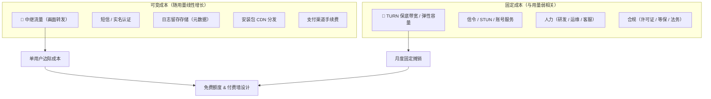

# 成本测算表（消费级远程桌面）

> 配套文档：`docs/需求规划-v2-P0P3重构.md` §8（成本模型）· `docs/竞品对标表.md` §2–§3（定价锚点与免费版战场）
>
> **本文用途**：把 v2 §8 里所有 `[待确认]` 的货币化参数，变成**可算、可调、可实测**的一张表。
> **纪律**：
> - 标注 **`[需询价]`** 的 = 必须向云厂商拿到真实报价后才可定案；
> - 标注 **`[需实测]`** 的 = 必须由自家埋点/Beta 数据回填；
> - 本文所有金额为**模型演算**，不是预算承诺。

---

## 0. 权威数值表（SSOT · 唯一事实源）`[新增]`

> 🔴 **纪律（本轮全量评审建立）**：**同一参数只允许在本表出现一次。** 其他文档（v2 / 商业化 / 竞品 / 账号设计 / 评审意见）引用这些数值时**必须写「见《成本测算表》§0」**，**不得另行抄写数字**。
> 由来：本轮全量评审发现 **6 条硬矛盾中有 4 条源于「同一参数在多处各写一遍」**（打平 MAU / 免费额度 / 码率假设 / 客单价口径）。参数要改，**只改本表**，再回头检查引用处。

| # | 参数 | **权威值** | 口径与前提 | 出处 / 状态 |
|---|---|---|---|---|
| P1 | 中继流量单价 $P$ | **¥0.30/GB** | 大流量包档；$k$=1、$f$=1.10 | §3.1 · `[需询价]` §10.2 #1 #2 |
| P2 | 计费方向系数 $k$ | **1.0** | 须确认「TURN 入方向是否计费」；=2 则全部成本翻倍 | §3.1 · `[需询价]` #1 |
| P3 | 协议开销系数 $f$ | **1.10** | `[需实测]` | §3.1 · §10.1 #2 |
| P4 | 打洞成功率 $s$ | **P0 85% → 优化后 92%** | 必须按 NAT / 运营商 / **网络环境**分桶验收；⚠️ **这是成本指标，不是体验指标**（见 v2 §5.3） | `[D2]` |
| P5 | 码率档位 $B$ | **720p30=2 · 1080p30=4 · 1080p60=8 · 2K60=12 · 4K60=20 Mbps** | 🔴 **其他文档一律不得另写数值**（商业化 §2.3 曾按 16 Mbps 推演，**以本表为准**） | §3.2 · `[需实测]` §10.1 #1 #14 |
| P6 | 单位成本 | **4 Mbps ⇒ 1.93 GB ⇒ ¥0.58/中继小时；8 Mbps ⇒ 3.87 GB ⇒ ¥1.16/中继小时** | 含 $f$、$k$=1 | §3.3 |
| P7 | **免费版中继额度** | **2 GB/月** | ⚠️ **GB 是权威单位**，「≈62 分钟」只是按 4 Mbps 折算的**展示值**；成本上界 **¥0.60**；🔴 **成立前提 = 插件 ARPPU ≥ ¥18 且转化 ≥ 4%**（§7.4） | `[D11-1]` |
| P8 | **个人版订价** | **¥158/年 = ¥13.2/月；月付 ¥24** | 🔴 **不得更高**（对齐 ToDesk 专业版年付） | `[D11-3]` |
| P9 | **客单价 / ARPPU 口径** | **订价 ¥13.2（不含插件）；ARPPU = 含插件增购的实收** | 🔴 **凡写 ¥15 / ¥18 / ¥25 处，必须标注为 ARPPU（含插件），不得当作订价** | §7.4 / §8.2 |
| P10 | 付费用户自身中继成本 $V_{\text{paid}}$ | **¥4.18/月** | 口径 = **30 h/月 @1080p60 · $s$=88%（即 3.6 h 中继）** ⇒ 3.6 × ¥1.16 = ¥4.18。⚠️ **示例值**，随 $P$/$B$/$s$ 变化 | §7.4 · §8.2 |
| P11 | 免费用户平均可变成本 $V_{\text{free}}$ | **¥0.20/月** | 示例值（远低于额度上界 ¥0.60 —— 实际少有人用满） | §8.2 |
| P12 | 固定成本 $F$ | **¥10 万/月（示例值，含两项 `[需填写]`）** | 🔴 **绝对金额（打平 MAU / 月盈亏）与 $F$ 成正比** ⇒ 引用时必须同时写出 $F$ | §6.1 |
| P13 | 渠道费率 | **微信/支付宝 0.6% · 安卓商店按合约 · iOS IAP 首年 30% / 小企业计划 15%** | 🔴 **模型统一按 15% 计**（便于可比）；iOS 侧**不得上浮定价**、**不得引导站外支付** | §2 · `[D11-2]` |
| P14 | 免费版画质上限 | **4 Mbps / 30 fps / 1080p** | 对齐 ToDesk 免费版 | 竞品表 §3.1 |
| P15 | 设备数 | **免费版 = 个人版 = 100 台** | 不作付费权益 | `[D12-1]` |

> 🔴 **本表的三条使用规则**：
> 1. **改数只改这里**，然后回头检查引用处；
> 2. 凡标 `[需询价]` / `[需实测]` 的值，**在对外材料中不得出现具体数字**；
> 3. **打平 MAU 不是本表参数**（它是**输出值**，随参数变化）⇒ 见 §8.2 的**参数表**，任何文档引用时必须带参数。

---

## 1. 结论速览（TL;DR）

| # | 结论 | 依据 |
|---|---|---|
| 1 | **中继流量是唯一随规模线性增长的成本**，也是第一大头 | §4 |
| 2 | 1080p60 中继 **1 小时 ≈ 3.87 GB**；1080p30（4Mbps）≈ **1.93 GB** | §3 |
| 3 | 打洞成功率 **85% → 92%**，重度用户月省 **¥8.13**（单用户，¥0.30/GB 假设下） | §5.2 |
| 4 | **付费墙必须挂在「中继时长」而非「总时长」** —— 直连边际成本≈0，限直连是纯损 | §7.3 |
| 5 | 免费版必须**不限时长 + 限码率**（对齐 ToDesk 4Mbps/30fps），否则体验直接被比下去 | §7.1 |
| 6 | 🔴 **打平 MAU 不是一个固定数，而是一条随参数变化的区间**：在 `[D11-3]` 允许的**订价 ¥13.2/月**下 ⇒ **¥13.2 + 4% 转化 ≈ 223 万 MAU**、**¥13.2 + 3% ≈ 1,160 万**；若靠插件把 **ARPPU 抬到 ¥18** 且转化 4% ⇒ **≈ 79 万 MAU**。**引用时必须带参数（§8.2 参数表），禁止再引用任何单一数字** —— 历史版本写过的「约 100 万」「≈685 万」「~700 万」**均已作废** | §8.2 |
| 7 | 在 MAU < 3 万时，**固定成本（保底带宽/人力）> 可变成本**，此时「优化打洞」不是主要矛盾 | §6.2 |
| 8 | **中继单价（¥/GB）的杠杆强于打洞优化**：单价从 ¥0.80 → ¥0.30 等于成本 −62.5% | §5.3 |
| 9 | 🔴 `[D8]` **本表 §7 不只是成本模型，它就是产品的主主张本体** —— 主战场（远程办公）内无技术护城河，主主张 = 「免费额度做到对手收费档位」⇒ **免费额度模型就是武器**，口径错一句就会被对手截图反打（§7.5） | §7 |
| 10 | 🔴 `[D10]` **PC→手机 升 P0 会抬高该路径的单次时长** —— 控制端换成电脑后「边看边查边做」更容易 ⇒ 手机被控**不再可以按「5–15 min 可忽略」估**；实测回填前须标注该假设（§3.2 / 10.1 #8） | §3.2 |

---

## 2. 成本结构分解



| 成本项 | 性质 | 量级 | 备注 |
|---|---|---|---|
| 中继流量 | **可变 · 最大** | 见 §4 | 唯一随规模线性增长且不可压缩的项 |
| 固定保底带宽 | **固定** | `[需询价]` | 没有保底带宽 = 高峰期连不上 |
| 短信 | 可变 | ¥0.03–0.05/条 | 注册+登录约 5 条/用户/月 → ¥0.15–0.25 |
| 实名认证 | 可变（一次性） | ¥0.5–1.5/次 | ⚠️ **按 `[D12-3]`「延迟实名」口径**：只有**触发风控 / 使用中继额度 / 跨账号连接**的用户才实名 ⇒ **实际成本 = 上值 × 实名触发率**。下表按**全量摊 12 个月**估 ¥0.04–0.13/用户/月，**这是上界**（触发率未实测 ⇒ §10.1 新增 **#19**） |
| 信令 / STUN | 固定 | 低 | 单台小机型可支撑万级并发 |
| 日志（元数据） | 可变 | ≈0 | 1 KB/会话；100 万会话/月 ≈ 1 GB |
| CDN 分发 | 可变 | ¥0.15–0.30/GB | 100 MB 包 × 100 万下载 = 100 TB ≈ ¥1.5–3 万（首发期一次性） |
| 支付渠道 | 可变 | 0.6%（微信/支付宝）~ 30%（App Store） | **iOS 内购把毛利直接砍掉三成，定价时必须单列** |
| 客服 | **线性**（非半固定） | 1 人 / 5 万 MAU（§6.3） | 消费级产品投诉集中在「连不上 / 看不清 / 被控端不听话」⇒ **与打洞成功率强相关**，是固定成本里**唯一随用户量重新增长**的一项（研发/运维是阶跃的）⇒ §6.3 单列 |

> ⚠️ **最大的隐藏成本是 iOS 内购 30%**。同样 ¥13.2/月，Android 到手约 ¥13.1，iOS 首年到手约 ¥9.2（小企业计划 15% 时 ¥11.2）。
> ⇒ **正确动作：把 iOS 分成当作确定性成本直接吃进模型** —— ① **不上浮 iOS 定价**（`[D11-2]`）② **申请 App Store 小企业计划（15%）** 把分成压到 15%。
> 🔴 **禁止动作（合规红线）**：**不得以任何形式引导 iOS 用户走站外 / 网页支付**（违反 App Store 审核指南 **3.1.1**，会导致下架 —— 见 `商业化与计费设计.md` §10 与 §13.4 红线 4）。
> 🔴 **已作废的旧表述**：早期版本此处写「或**引导 iOS 用户走网页支付**（合规前提下的唯一解）」，**该表述与已拍板红线直接冲突，已删除，不得恢复**。iOS 侧只有三条正路：**接受分成 · 申请小企业计划 · 用非数字商品另找变现**。

---

## 3. 核心公式与单位成本速查

### 3.1 公式

$$
W_{\text{relay}} \;=\; \underbrace{\frac{B \times T_{\text{relay}} \times 3600}{8 \times 1024}}_{\text{原始流量(GB)}} \times k \times f
$$

简化常数后（$B$ 单位 Mbps，$T$ 单位小时）：

$$
W_{\text{relay}} \;=\; 0.43945 \times B \times T_{\text{relay}} \times k \times f \quad (\text{GB})
$$

$$
T_{\text{relay}} \;=\; T_{\text{total}} \times (1-s) \times q
$$

$$
\text{中继成本} \;=\; W_{\text{relay}} \times P
$$

| 符号 | 含义 | 默认值 | 来源 |
|---|---|---|---|
| $B$ | 平均编码码率（Mbps） | 见 §3.2 | **`[需实测]`** |
| $T_{\text{relay}}$ | 月内**走中继**的会话时长（h） | — | 由 $T_{\text{total}}$ 与 $s$ 推出 |
| $T_{\text{total}}$ | 月内总会话时长（h） | — | **`[需实测]`** |
| $s$ | P2P 打洞成功率 | **0.85 / 0.92** | `[已确认 D2]` |
| $q$ | 中继会话画质降级系数 | 1.0（保守） | 若中继自动降码率，可设 0.5 |
| $k$ | **计费方向系数** | 1.0 | `[需询价]` 见下 |
| $f$ | 协议开销系数（UDP/RTP/加密包头） | 1.10 | **`[需实测]`** |
| $P$ | 中继流量单价（¥/GB） | 0.30 | `[需询价]` |

> 🔴 **$k$ 是必须问清楚的第一件事**：多数国内云厂商**只对出流量计费**（入流量免费）。
> 远控画面从被控端 → 中继 → 控制端，中继**出入各一份**；若只计出流量则 $k=1.0$，若双向计费则 $k=2.0$ —— **成本直接翻倍**。
> 询价时必须明确问：*「TURN 转发场景，入方向流量是否计费？」*

### 3.2 码率档位（`[需实测]`）

| 档位 | 典型编码码率 $B$ | 说明 |
|---|---|---|
| 720p30 | 2 Mbps | 免费版保守档 |
| 1080p30 | **4 Mbps** | **对齐 ToDesk 免费版带宽上限** |
| 1080p60 | **8 Mbps** | 付费主力档 |
| 2K60 | 12 Mbps | 高画质档 |
| 4K60 | 20 Mbps | 高端档 |

> ⚠️ 桌面场景（文字/表格）与视频场景（播放视频/游戏）码率差异可达 3–5 倍。
> **必须以「桌面办公 P50 + 视频 P95」两个口径分别测算**，只取平均会严重低估长尾。

> 🔴 **口径冲突提示（SSOT 纪律）**：本表假设 **2K60 = 12 Mbps / 4K60 = 20 Mbps**，而《商业化与计费设计》§2.3 的时长折算示例曾按 **16 Mbps** 推演。
> ⇒ **在 §10.1 #14 实测回填前，一律以本表 12 / 20 Mbps 为准**，其他文档引用时**不得另写数值**（权威值见 §0 P5）。

**手机作为被控端**（对应 v2 §3.6；🟡 **获客钩子**，⚠️ 非主主张，见 v2 §9.3 D8）`[需实测]`

| 项 | 差异 | 对成本的影响 |
|---|---|---|
| 分辨率 | 多为 1080×2400 竖屏（像素量≈1080p） | 与 1080p 同量级，**但 UI 变化频率低**（静态多） |
| 静态场景占比 | 看消息 / 看设置页远多于看视频 | 平均码率**可能低于桌面**，但难以靠静态优化预测 |
| 息屏串流 | 屏幕关闭仍在推流 | 无法依赖「屏幕上无变化就不发帧」降码率 |
| 场景 | 「帮爸妈调手机」单次多为 5–15 分钟 | **单次短、频次低** ⇒ 流量贡献小、但**连接成功率要求更高**（失败一次就放弃） |

> ⇒ 手机被控对**成本模型影响有限**（短会话）；真正的成本压力仍来自 PC 端长时挂机用户。
> ⚠️ 但注意：手机被控是**新场景**，初期码率只能先按 4 Mbps（1080p30 档）估，实测后回填。

> 🔴 **`[D10]` 补充：控制端换成 PC 会改变时长口径（不是码率口径）**
> 「帮父母看手机」这个场景，**控制端是手机还是电脑，被控端成本不变，但会话时长会变**：
> 子女用**电脑**连父母手机时，可以在大屏上边看边查边操作，**单次会话时长与重连次数都会上升**
> ⇒ 该路径**不再可以按「5–15 分钟可忽略」估**。
> ❓ 待实测：**PC→手机 的平均单次时长**（并入 §10.1 #8，**须按控制端分列统计**）；
> ⚠️ 实测回填前**仍按短会话估算，但必须在预测中标注该假设**（处理方式同 §3.2 外接形态）。
> ✅ 另：本节结论**不受 D9（画面显示红线）影响** —— 默认「适应窗口」无额外像素量，码率档位假设不变。

**手机作为控制端的三种形态**（对应 v2 §2.3）`[需实测]`

| 形态 | 码率口径 | 对成本的影响 |
|---|---|---|
| **手持单屏**（**默认主路径**） | 屏小对细节不敏感，**看似**可降码率 | ⚠️ **但真正的约束是文字**：降码率时**小字先糊**，而手持形态最需要看清的恰好是文字 ⇒ 🔴 **不建议盲目下调**；需先实测「最小可读字号」，再定下限（见 10.1 第 9 项） |
| 键鼠 + 手机屏（P1 中间态） | 同手持档 | 同手持档；但**会话时长会拉长**（输入变容易 ⇒ 用得久），流量随之上升 |
| 外接大屏（P1 增强） | **按 PC 档位**（1080p60 / 8 Mbps 量级） | 与 PC→PC 同量级；⚠️ **但中继占比要按更高估** —— 酒店 / 会议 / 客户现场属企业级网络（硬 NAT / 可能封 UDP），打洞成功率**最低**（见 v2 §5.3） |

> 🔴 **外接形态的真正成本含义：不是“码率变高”，而是“时长量级变了”**
> 手机会话本来按 5–15 min 估算（流量贡献可忽略）；一旦接上大屏 + 键鼠，它就从「分钟级应急」变成 **「小时级轻办公」**。
> ⇒ **单次会话流量从 < 1 GB 跃升到数 GB 量级**。若这类用户占比超过 5%，就必须把它单独作为一类用量建模。
> ❓ 关键未知：接屏用户的**占比**与**单次时长**。两者未知时，**不得**把外接形态拿入成本预测（见 10.1 第 10 项）。

**🔴 网络环境对中继成本的影响（必须打破单一 85% 假设）**

| 网络环境 | 打洞成功率 | 中继占比 | 单次会话成本倍数 |
|---|---|---|---|
| 家庭 ↔ 家庭 | 90–95% | 5–10% | 1.0×（基准） |
| 一方硬 NAT | ~85% | 15% | ~1.5× |
| **酒店 / 会议 / 客户现场**（企业级网络） | **< 5% ～ 0%** | **≈ 100%** | **~10×** |

> 🔴 **结论**：「外接大屏」这类高价值场景恰好**与高打洞率负相关** —— 场合越高档，网络越难穿透。
> ⇒ 但不必恐慌：这类会话**频次低、占比小**（估计 < 5%），对总成本影响可控；
> 🔴 **真正要防的是「把免费额度用在中继上」**（一场 3 小时会议就可能吃掉 ¥3.5）——
> 因为**全部中继都计入统一的账号级额度**（`商业化与计费设计.md` §9），免费用户成本上界才 = 额度 × 单价（§7.2）。
> 🔴 **已删除的旧建议（务必不要恢复）**：早期版本此处写「**企业/酒店网络下的中继默认不计入免费额度，或按“体验优先”单独限额**」——
> **该建议自相矛盾且是成本漏洞**：
> ① 它把**最贵的一类中继**（本节自己估算 ≈100% 走中继、单次成本 ~10×）**排除在计量之外** ⇒ 等于给「用最贵的通道」免单；
> ② 与账号级统一额度 + 免费成本上界 ¥0.60（§7.2）**直接冲突**；
> ③ 「是否企业/酒店网络」的判定依赖客户端 / SSID 特征，**用户可伪造** ⇒ 等于开了一个**不限量的免费口子**。
> ⇒ **正确动作（全部是非计量手段）**：检测到疑似企业/酒店网络时 **主动提示「当前网络较难直连，建议切塂窝或更开放的网络以节省额度」**（v2 §5.3 动作 4），成本仍由**统一额度**兜底。
> 依据：v2 §5.3（Tailscale 工程博客，级别 B）。

> 🔴 **成本口径提醒**：把手持形态的码率上限当作**产品指标**（清晰度下限）而非**成本指标**。
> 若为了省钱把免费版手持档压到 2 Mbps，会出现「能连上但看不清字」的最差体验，反而抬高流失率（而流失的成本远高于流量）。

### 3.3 单位成本速查表（¥/中继小时）

已含 $f = 1.10$、$k = 1.0$。

| 码率 | 流量/中继小时 | @P=¥0.15 | @P=¥0.30 | @P=¥0.50 | @P=¥0.80 |
|---|---|---|---|---|---|
| 2 Mbps | 0.97 GB | ¥0.15 | ¥0.29 | ¥0.48 | ¥0.77 |
| **4 Mbps** | **1.93 GB** | ¥0.29 | **¥0.58** | ¥0.97 | ¥1.55 |
| **8 Mbps** | **3.87 GB** | ¥0.58 | **¥1.16** | ¥1.93 | ¥3.09 |
| 12 Mbps | 5.80 GB | ¥0.87 | ¥1.74 | ¥2.90 | ¥4.64 |
| 20 Mbps | 9.67 GB | ¥1.45 | ¥2.90 | ¥4.83 | ¥7.74 |

> 🎯 **这张表是全文最有用的一张。**
> 「1080p60 中继 1 小时 = ¥1.16（@¥0.30/GB）」—— 记住这一个数，后面所有设计都从它推导。

**¥/GB 分档参考（`[需询价]`，须实测替换）**

| 档位 | 单价 | 典型获取方式 |
|---|---|---|
| 自建/超大户 | ¥0.10–0.15 | 自建 TURN + 机房带宽包年 |
| 大流量包 | ¥0.20–0.30 | 云厂商年度承诺用量 / 流量包 |
| 中量 | ¥0.35–0.50 | 按量付费用量折扣 |
| 公有云标价 | ¥0.70–0.90 | 无承诺按量（**最坏情况，勿以此做预算**） |

---

## 4. 单用户月度成本测算表

**测算口径**：$B = 8$ Mbps（1080p60）· $P = ¥0.30$/GB · $k = 1$ · $q = 1$ · $f = 1.10$
⇒ 中继成本 **¥1.160 / 中继小时**，流量 **3.868 GB / 中继小时**

### 4.1 主表

| 月总会话时长 $T$ | s=85% 中继h | 中继流量 GB | 成本 ¥ | s=92% 中继h | 中继流量 GB | 成本 ¥ | **省 ¥** |
|---|---|---|---|---|---|---|---|
| 5 h（轻度） | 0.75 | 2.90 | 0.87 | 0.40 | 1.55 | 0.46 | 0.41 |
| 10 h | 1.50 | 5.80 | 1.74 | 0.80 | 3.09 | 0.93 | 0.81 |
| 20 h | 3.00 | 11.60 | 3.48 | 1.60 | 6.19 | 1.86 | 1.62 |
| **30 h（中度）** | 4.50 | 17.41 | **5.22** | 2.40 | 9.28 | **2.78** | **2.44** |
| 60 h | 9.00 | 34.81 | 10.44 | 4.80 | 18.57 | 5.57 | 4.87 |
| **100 h（重度）** | 15.00 | 58.02 | **17.41** | 8.00 | 30.94 | **9.28** | **8.13** |
| 200 h（极端） | 30.00 | 116.05 | 34.81 | 16.00 | 61.89 | 18.57 | 16.24 |

### 4.2 同表按 1080p30（4 Mbps）——**成本恰为上表一半**

| 月总时长 | s=85% 成本 ¥ | s=92% 成本 ¥ |
|---|---|---|
| 5 h | 0.44 | 0.23 |
| 10 h | 0.87 | 0.46 |
| 20 h | 1.74 | 0.93 |
| 30 h | 2.61 | 1.39 |
| 60 h | 5.22 | 2.78 |
| 100 h | 8.70 | 4.64 |
| 200 h | 17.41 | 9.28 |

> 🔴 **读法（极重要）**：极端重度用户（200 h/月，且 100% 走中继）单月成本 **¥34.81**。
> 而 ToDesk 专业版年付仅 **¥13.2/月**（见竞品对标表 §2.1）。
> ⇒ **一个重度免费用户，成本可以超过一个付费用户的全部收入。**
> **免费版若不设中继额度上限，长尾会直接吃掉全部毛利。** 这就是 §7 存在的理由。

---

## 5. 敏感性分析

### 5.1 打洞成功率 $s$（30 h/月 · 1080p60 · ¥0.30/GB）

| $s$ | $(1-s)$ | 中继时长 | 流量 GB | 成本 ¥ | 相对 85% 基准 | 相对 80% 基准 |
|---|---|---|---|---|---|---|
| 80% | 0.20 | 6.00 h | 23.21 | **6.96** | +33.3% | — |
| **85%（P0 目标）** | 0.15 | 4.50 h | 17.41 | **5.22** | 基准 | −25.0% |
| 88% | 0.12 | 3.60 h | 13.92 | 4.18 | −20.0% | −40.0% |
| 90% | 0.10 | 3.00 h | 11.60 | 3.48 | −33.3% | −50.0% |
| **92%（优化目标）** | 0.08 | 2.40 h | 9.28 | **2.78** | −46.7% | −60.0% |
| 95% | 0.05 | 1.50 h | 5.80 | 1.74 | −66.7% | −75.0% |

> **每提升 1 个百分点值多少钱？** 取决于起点：
> - 从 85% 提升到 86%：省 $\frac{1}{15} = 6.67\%$
> - 从 92% 提升到 93%：省 $\frac{1}{8} = 12.5\%$
> - 从 95% 提升到 96%：省 $\frac{1}{5} = 20.0\%$
>
> ⇒ **边际收益递增**（因为分母越来越小）。这为 v2 §8「打洞优化是唯一能直接压缩第一大成本的杠杆」提供了量化支撑：
> **越往后做，每一分投入越值钱。** 不要因为 85% 之后「难做」就停手。

### 5.2 中继单价 $P$（30 h/月 · 1080p60 · s=85%）

| $P$ | 流量 GB | 月成本 ¥ | 相对标价 |
|---|---|---|---|
| ¥0.15（自建） | 17.41 | **2.61** | −82.4% |
| ¥0.30（大流量包） | 17.41 | **5.22** | −64.7% |
| ¥0.50（中量） | 17.41 | 8.70 | −41.2% |
| ¥0.80（公有云标价） | 17.41 | 13.93 | 基准 |

> 🔴 **$P$ 的杠杆 > $s$ 的杠杆。**
> 打洞从 85%→95%（+10pp，需要大量工程投入）带来 −66.7%；
> 而单价从 ¥0.80→¥0.30（一次商务谈判）带来 −62.5%。
> ⇒ **行动排序：先谈价格（商务），再优化打洞（工程）。** 商务谈判的投入产出比高得多。

### 5.3 码率 $B$（30 h/月 · s=85% · ¥0.30/GB）

| 档位 | 月成本 ¥ |
|---|---|
| 2 Mbps（720p30） | 1.30 |
| 4 Mbps（1080p30） | 2.61 |
| **8 Mbps（1080p60）** | **5.22** |
| 12 Mbps（2K60） | 7.83 |
| 20 Mbps（4K60） | 13.04 |

> ⇒ **「限码率」是比「限时长」更细、更无感的成本闸门。** 这也是 ToDesk 免费版的做法（4 Mbps 上限）。
> 对用户的心理伤害：限时长 = 「不让我用」；限码率 = 「画质差一点」。**后者被接受度高得多。**

---

## 6. 固定成本与规模阈值

### 6.1 固定成本模板（`[需询价]`）

| 项 | 月成本估计 | 备注 |
|---|---|---|
| TURN 保底带宽（1 Gbps 独享） | ¥3 万 – 8 万 | 国内独享带宽按 ¥30–80/Mbps/月估算，**必须询价** |
| 信令 / STUN / 账号服务 | ¥3,000 – 8,000 | 多台小机型 + 负载均衡 |
| 人力（研发 6 + 运维 1 + 客服 2） | `[需填写]` | 最大项，与用量无关。⚠️ **客服人力须与工单量挂钩，不得当作固定常量**（见 §6.3） |
| 合规（许可证 / 等保测评 / 法务摊销） | `[需填写]` | 年费摊月 |
| **合计 $F$（本模型假设）** | **¥10 万/月** | 🔴 **纯示例值，不是预算** —— 两项 `[需填写]` 未填 ⇒ §7.4 / §8.2 / §9 的**全部绝对金额**（含「打平 MAU」「月盈亏」）**均与 $F$ 成正比**，引用时必须同时写出 $F$ 的取值 |

### 6.2 固定 / 可变 交叉点

$$
\text{MAU}_{\text{crossover}} = \frac{F}{\text{单用户月可变成本}}
$$

以单用户月可变成本 **¥3.48**（20 h/月 · 1080p60 · s=85%）、$F = ¥10$ 万/月：

$$
\text{MAU}_{\text{crossover}} = \frac{100{,}000}{3.48} \approx 28{,}700 \text{ 用户}
$$

| MAU | 固定成本/用户 | 可变成本/用户 | 谁主导 |
|---|---|---|---|
| 1 万 | ¥10.00 | ¥3.48 | **固定成本主导** |
| 3 万 | ¥3.33 | ¥3.48 | 交叉点附近 |
| 10 万 | ¥1.00 | ¥3.48 | **可变成本主导** |
| 100 万 | ¥0.10 | ¥3.48 | 可变成本绝对主导 |

> 🎯 **战略含义**：
> **在 3 万 MAU 之前，「优化打洞省成本」的效果远不如「把保底带宽签便宜」和「把用户量做上去」。**
> v2 §8 把打洞优化列为唯一杠杆 —— 那是**规模化之后**的结论。
> 早期正确的排序是：**① 商务拿低价流量 → ② 规模摊薄固定成本 → ③ 工程优化打洞。**

### 6.3 客服产能与 SLA（P0 基线）`[新增]`

🔴 **为什么单列**：客服是固定成本里**唯一随用户量重新增长**的一项（研发/运维是阶跃的，客服是**线性**的），
且**投诉量与打洞成功率强相关** ⇒ 它是「省流量钱」与「花钱救体验」之间的**调节阀**。
若不为它定基线，「免费版体验及格线」（v2 §5.4）就没有人力支撑。

| 项 | 建议基线（`[建议]` 待确认） | 依据 |
|---|---|---|
| 工单率 | **≤ 2 单 / 100 MAU / 月** | 消费级远控投诉集中在「连不上 / 连上了看不清 / 被控端不听话」三类 |
| 首响时长 | **≤ 4 工作小时（P90）** | 账号 / 计费类问题拖一天就会引发退款与差评 |
| 解决时长 | **≤ 24 小时（P80）** | 同上 |
| 人力配比 | **1 人 / 5 万 MAU**（早期 1 人 + 兼职） | 与 §2「0.5–1 人力/10 万用户」同口径，取中值偏保守 |
| 🔴 分派红线 | **计费争议不得用话术解决** —— 必须指向「**用量明细页（用户自助）**」与「**后台计量明细（客服）**」的**同一份权威数据** | `账号与管理系统设计.md` §4.2 · `商业化与计费设计.md` §5.6 |

> ⚠️ **与打洞率的联动**：若总体打洞率 < 80%，工单率经验值会翻倍 ⇒ 客服人力**必须与 §10.1 #3 的看板联动评估**，
> **不得按「产品上线后再招人」处理**（v2 §5.4 已列为业务指标）。

---

## 7. 免费额度与付费墙设计（定量推演）

### 7.1 免费版设计的三条硬约束

| 约束 | 内容 | 来源 |
|---|---|---|
| C1 | **不限时长**（用户预期已被对手锚定：ToDesk 免费版「不限时不限次」） | 竞品对标表 §3.1 |
| C2 | **限码率**（成本 ≈ 码率 × 时长，码率是天然闸门） | 竞品对标表 §3.1 |
| C3 | **设备数 ≥ 100 台**（TeamViewer 免费仅 3 台被诟病） | 竞品对标表 §2.3 |

### 7.2 免费版中继额度 → 成本上界

**口径**：免费版码率锁 **4 Mbps**（1080p30）⇒ 中继成本 **¥0.580/中继小时**（@¥0.30/GB）

| 免费中继额度 | 小时 | 流量 GB | 成本 @¥0.30 | 成本 @¥0.80 | 体验评价 |
|---|---|---|---|---|---|
| **仅直连（0）** | 0 | 0 | **¥0** | ¥0 | 🔴 打洞失败直接连不上，投诉爆炸 |
| 20 分钟 | 0.33 | 0.64 | ¥0.19 | ¥0.52 | 太紧，正常用户会撞墙 |
| **30 分钟** | 0.50 | 0.97 | **¥0.29** | ¥0.77 | 可作为「免费额度」下界 |
| **✅ D11-1 已拍板：2 GB / 月**（≙ 62 分钟 @4 Mbps） | 1.03 | 2.00 | **¥0.60** | ¥1.60 | ✅ **已定为免费版额度**（⚠️ **待 TURN 报价重算**）。🔴 **单位口径**：**GB 是权威单位**，「分钟」只是按码率实时折算的**展示值**（`商业化与计费设计` §5.1）—— 1.93 GB ≠ 60 min，**禁止把两者当等价值写**；旧的「60 分钟/月」表述**作废** |
| 120 分钟 | 2.00 | 3.87 | ¥1.16 | ¥3.09 | 成本翻倍，需验证留存增益 |
| 240 分钟 | 4.00 | 7.74 | ¥2.32 | ¥6.19 | 接近付费用户成本，不划算 |
| **不限量（仅限码率）** | 长尾 | — | **长尾不可控** | — | 🔴 见 §4.2，重灾户 ¥17+/月 |

> **长尾风险量化**：极端免费用户（200 h/月，100% 走中继，4 Mbps）= 200 × 1.93 = **387 GB** = **¥116/月**（@¥0.30）。
> 这不是假想 —— 远控场景存在「挂机党」（远程挂游戏/挂监控/长期开着不动）。

> 🔴 **补充：「仅查看」模式（`[D11-5]`）不是零成本，必须封顶或冻结**
> 只要画面仍在**编码 + 经中继转发**，即使仅看不能操作，成本仍随字节走：按 0.5–1 Mbps 估，**100 h/月 ≈ 6–12 GB ≈ ¥1.8–3.6** —— 是免费额度成本上界（¥0.60）的 **3–6 倍**。
> 更关键的是：它的触发时机恰好是「用户**已耗尽额度**」⇒ 若仍能通过「仅查看」继续用中继，**等于不限量免费**，直接击穿 D11-1。
> ✅ **两种正确实现**（二选一，`商业化与计费设计` §8 / §11 D11-5）：
> - **A（推荐、零成本）**：额度耗尽后 **断中继转发**，只保留**最后一张冻结帧 + 「额度已用尽」提示**；
> - **B（保留“看得到”的降级体验）**：**必须给「仅查看」单独封顶**（`[建议]`：≤ 1 GB/月 或 ≤ 10 分钟/月），且**不抵扣、不赠送**。

### 7.3 🔑 关键设计：**付费墙挂在「中继时长」，不挂在「总时长」**

| 方案 | 计费维度 | 我方成本 | 用户观感 | 评价 |
|---|---|---|---|---|
| A | 限**总时长** | 直连也有成本？**没有** ⇒ 限制了零成本的部分 | 「连自己的电脑还要计时」差 | ❌ |
| B | 限**中继时长** | 直连无限 = 零成本；中继封顶 = 成本可控 | 「直连免费无限，中继限量」**可解释** | ✅ **推荐** |
| C | 限**码率**（不定量） | 成本随时长线性增长，**不可封顶** | 无感 | ⚠️ 须与 B 叠加 |

**B 的战略价值**：


> **用户的省钱动机 = 我方的降本动机。** 利益方向一致，这是唯一「不靠对抗」的成本控制设计。
> 而且这个机制**天然公示了打洞成功率**，与 D1（连接模式指示）的透明度主张互相强化：
> 用户看到「当前：中继（本月剩余 42 分钟）」→ 自然理解「直连不用额度」→ 主动配合（如换网络、开 UPnP）。

🔴 **技术侧印证（`商业化与计费设计.md` §4）**：本节结论不只是成本最优，**也是技术上唯一可行点** ——
**TURN 中继是唯一能被我方服务端自行测量字节数的环节**（客户端计时可被改时间/篘改绕过；信令服务器测不到实际流量）。
⇒ **「直连不限时长」不是策略让步，而是技术事实**（量不到的恰好就是打算免费的那部分）。
⚠️ **推论**：🔴 **不得承诺任何需要计量直连的话术**（如「直连每月送 N 小时」）。
🔴 **口径澄清（务必按此二分，不得简化为「直连侧不做任何埋点」）**：
- **计量（计费裁决）= 不做** —— 直连不经我方服务器，本也量不到；这才能保证「不限时长」是真话；
- **质量统计（会话起止 + 打洞结果 + 实际码率）= 必须做** —— 这是 `[D2]` 分桶看板（§10.1 #3）与 §3.2 码率实测的**唯一数据源**；不做则「打洞率 85%」永远无法验收；
- **前提**：在隐私政策中明示「直连仅上报会话起止与连通性结果，**不用于计费、不采集画面内容**」—— 这句话本身就是 D1 透明度资产的一部分，**不是负债**。
🔴 **历史表述已作废**：本节早期写的「**直连侧不做任何计量埋点（哪怕只用于统计）**」（及商业化 §4 同句）**已删除** —— 它与本节自己的「打洞率先公示」机制、§10.1 #3 看板直接矛盾。

### 7.4 免费成本容忍度（盈亏平衡反推）

$$
\text{免费用户成本容忍度} = \frac{\text{转化率} \times \text{付费用户毛利}}{1 - \text{转化率}}
$$

其中 **付费用户毛利 = ARPPU（含插件）× (1 − 渠道费率) − 该用户自身中继成本**

> 🔴 **口径声明（先读再读表）**：`[D11-3]` 已将个人版**订价锁死在 ¥13.2/月**（¥158/年）。因此下表里 **¥15 / ¥18 / ¥25 只能作为「含插件增购的 ARPPU」，不得当作订价**。
> 表头由「客单价」改为 **ARPPU**，并把 `[D11-3]` 允许的订价行提到最前 —— **这两行才是当前真实处境**。

| ARPPU（含插件） | 渠道费率 | 净收入 | 自身中继成本 | 毛利 | 转化率 | **免费容忍度** | 对应中继额度(4Mbps) |
|---|---|---|---|---|---|---|---|
| **¥13.2**（= `[D11-3]` 订价，不含插件） | 15% | ¥11.22 | ¥4.18 | ¥7.04 | **4%** | **¥0.293** | **≈ 30 分钟 ≈ 0.98 GB** |
| **¥13.2**（同上） | 15% | ¥11.22 | ¥4.18 | ¥7.04 | **3%** | **¥0.218** | **≈ 22 分钟 ≈ 0.72 GB** |
| ¥15（需插件 ARPPU 补足） | 15% | ¥12.75 | ¥4.18 | ¥8.57 | 3% | **¥0.265** | ≈ 27 分钟 |
| ¥15 | 15% | ¥12.75 | ¥4.18 | ¥8.57 | 5% | **¥0.451** | ≈ 47 分钟 |
| **¥18（需插件 ARPPU 补足）** | 15% | ¥15.30 | ¥4.18 | ¥11.12 | 4% | **¥0.463** | ≈ 48 分钟 |
| ¥25（插件贡献为主） | 15% | ¥21.25 | ¥4.18 | ¥17.07 | 5% | **¥0.898** | ≈ 93 分钟 |
| **¥13.2** | **30%（iOS 首年）** | ¥9.24 | ¥4.18 | ¥5.06 | 4% | **¥0.211** | ≈ 22 分钟 |

> 🔴 **本表与 D11-1 / D11-3 的关系（全库最容易错的一处，必须显式记住）**：
> - **D11-3 锁死了订价**：个人版 **¥13.2/月**，**不得更高** ⇒ 上表 ¥15 / ¥18 / ¥25 各行**均不是订价**；
> - 在 D11-3 允许的订价下，容忍度只有 **¥0.218–0.293（≈ 22–30 分钟 ≈ 0.7–1.0 GB）**；
> - 而 **D11-1 给了 2 GB（成本上界 ¥0.60）** ⇒ **超容忍度 2.0–2.8 倍**；
> - ⇒ 🔴 **结论：D11-1 的 2 GB 成立的唯一前提是「插件 ARPPU ≥ ¥18 且转化率 ≥ 4%」**。
>   **而这个前提目前没有任何数据支撑** —— 插件 SKU / 定价 / 渗透率 → ARPPU 的桥接测算见《商业化与计费设计》**§1.1 `[新增]`**（`[建议]` 值，待确认）。
> - ✅ **预先声明的触发器**：**若插件 ARPPU 跑不出 ¥18（P0 上线 3 个月后用真实数据复算），第一个要动的就是 D11-1**（D11-3 有 ToDesk 硬上限，动不了）。下调顺序：**2 GB → 1 GB → 0.5 GB**，同时保持「不限时长 + 限码率」不变。

> ⚠️ **上表是「上界」，不是「预算」。** 实际免费用户不会用满额度（§4 轻度用户仅需 0.87h 中继）。
> 真实平均成本应显著低于容忍度上界 —— **但前提是必须有一个封顶机制**，否则长尾（§7.2）会击穿一切。

### 7.5 🔴 D8 联动：本节的免费额度模型 = 主主张本体 `[新增]`

> **背景（v2 §9.3 D8）**：主战场（PC→PC 远程办公）内我方**无技术级护城河** ⇒ **能打的只有商业条款**。
> 因此 **§7 的额度设计不再是「成本控制文档」，而是产品主主张的实现体**。

| 对外可能写的话 | 风险 | 正确写法 |
|---|---|---|
| 「免费不限量」 | 🔴 **假的** —— 中继必然限额（极端用户单月 ¥116，见 §7.2）；对手一截图就崩 | 「**直连不限时长**」 |
| 「免费版不限时长」 | 🟡 歧义：用户默认「全部不需要钱」 | 「**P2P 直连不限时长；中继每月赠 N GB**」 |
| 不限量但偷降码率 | 🔴 与 D1（透明度资产）**自相矛盾**，杀品牌 | 明写码率上限（对齐 ToDesk 4 Mbps 档） |

> 💡 **可占的空位**：ToDesk 免费版卡 4 Mbps / 30 fps / **1 通道 · 2 会话** / 手机被控收费；
> TeamViewer 免费仅 3 台。⇒ 「**通道数 / 会话数 / 手机被控 / 直连不限时长**」四处都可以比对手宽。
> 但**必须先算清成本**再对外承诺（通道数直接乘中继成本，是最容易被忽略的一项）。

> 🔴 **主主张的 “证据缺口”（B6）**：上表四个可占空位中，**已定案的只有「手机被控免费」与「直连不限时长」**；
> **「通道数」与「会话数」两个落点尚未定案**（若按 ToDesk 免费版同档 = 「同档」而非「更宽」）。
> ⇒ 按 v2 §9.3 D8 「须过 A（差异化）+ B（权重）」的要求，**对外只能主张已定案的两项**；
> **逐条「我方免费 vs 对手收费」对照表见 `商业化与计费设计.md` §2.5 `[新增]`**（不得在无对照表的情况下加大主张）。

> 🔴 **额度数值必须等报价才能定案（`商业化与计费设计.md` §2.3 / §5.5）**
> 本节推演的中继额度实际上是一个**成本上界假设**，而**TURN 入方向流量是否计费（§10.2 #1）会使全部成本翻倍**。
> ⇒ 在拿到报价前，**对外不得使用具体数字**；且单价从 ¥0.30 升到 ¥0.80 时，全部额度必须**除以 2.7**。
> ✅ **D11-1 已拍板：免费版中继额度 = 2 GB/月**（成本上界 **¥0.60**）—— ⚠️ **这是「已定但待复核」的临时值**：① 报价到手后若单价上浮须同步下调 ② **成立前提是插件 ARPPU ≥ ¥18**（§7.4）。

---

## 8. 盈亏平衡与单位经济

### 8.1 模型

$$
\text{月毛利} = \text{MAU} \times \Big[ \underbrace{c \cdot A_{\text{净}}}_{\text{收入/用户}} - \underbrace{\frac{F}{\text{MAU}} - \big((1-c)V_{\text{free}} + c \cdot V_{\text{paid}}\big)}_{\text{成本/用户}} \Big]
$$

$c$ = 付费转化率 · $A_{\text{净}}$ = 客单价净收入 · $V_{\text{free}} / V_{\text{paid}}$ = 免费/付费用户平均可变成本

### 8.2 情景演算

> 🔴 **口径声明**：本项目 `[D11-3]` 已把个人版**订价锁在 ¥13.2/月** ⇒ 下表的 **¥15 / ¥18 / ¥25 均为「含插件增购的 ARPPU」，不是订价**（权威口径见 §0 P9）。
> 因此新增 **情景 ⑤（订价现况）**，它才是「不做插件时」的真实处境。

| 情景 | MAU | **ARPPU（含插件）** | 渠道 | 转化率 $c$ | $V_{\text{free}}$ | $V_{\text{paid}}$ | $F$ | 收入/用户 | 成本/用户 | **月盈亏** |
|---|---|---|---|---|---|---|---|---|---|---|
| **① 早期** | 10 万 | ¥15 | 15% | 3% | ¥0.20 | ¥4.18 | ¥10 万 | ¥0.383 | ¥1.319 | **−¥9.4 万** |
| **⑤ 订价现况** 🔴 `[新增]` | 100 万 | **¥13.2（= D11-3 订价，无插件）** | 15% | 4% | ¥0.20 | ¥4.18 | ¥20 万 | ¥0.449 | ¥0.559 | **−¥11.0 万** |
| **② 成长期** | 100 万 | ¥15 | 15% | 3% | ¥0.20 | ¥4.18 | ¥20 万 | ¥0.383 | ¥0.519 | **−¥13.7 万** |
| **③ 达标** | 100 万 | **¥18（需插件补足）** | 15% | 4% | ¥0.20 | ¥4.18 | ¥20 万 | ¥0.612 | ¥0.559 | **+¥5.3 万** |
| **④ 健康** | 100 万 | **¥25（插件贡献为主）** | 15% | 6% | ¥0.20 | ¥4.18 | ¥20 万 | ¥1.275 | ¥0.639 | **+¥63.6 万** |

> ⚠️ **本表已整体复算**：早期版本的「成本/用户」列（1.386 / 0.568 / 0.507 / 0.586）**无法用同一表的参数列复现**（反推的 $V_{\text{paid}}$ 在 ¥5.8–6.4 之间漂移）⇒ **已按参数逐行重算**。
> 🔴 **情景 ⑤ 是最该看的一行**：**在 D11-3 允许的订价下，即使 100 万 MAU + 4% 转化，仍每月亏 ¥11.0 万。**

> 🔴 **情景 ①/②/⑤ 是必须正视的现实**：订价只有 ¥13.2 且不做插件时，**100 万 MAU 仍在亏损**。
> 反推打平所需 MAU（用同一公式）：
> $$\text{MAU} = \frac{F}{c \cdot A_{\text{净}} - (1-c)V_{\text{free}} - cV_{\text{paid}}}$$

| ARPPU（含插件） | 转化率 $c$ | 渠道 | $A_{\text{净}}$ | 收入/用户 | **打平 MAU（$F$=¥20 万）** |
|---|---|---|---|---|---|
| **¥13.2（= D11-3 订价）** | 3% | 15% | ¥11.22 | ¥0.337 | **≈ 1,163 万** 🔴 |
| **¥13.2（= D11-3 订价）** | 4% | 15% | ¥11.22 | ¥0.449 | **≈ 223 万** 🔴 |
| ¥15 | 3% | 15% | ¥12.75 | ¥0.383 | **≈ 317 万** |
| ¥15 | 4% | 15% | ¥12.75 | ¥0.510 | **≈ 133 万** |
| **¥18（需插件）** | 4% | 15% | ¥15.30 | ¥0.612 | **≈ 79 万** |
| **¥25（插件贡献为主）** | 6% | 15% | ¥21.25 | ¥1.275 | **≈ 24 万** |

> 🔴 **读法（本节是唯一权威口径）**：
> - **在 D11-3 允许的订价（¥13.2）下，打平 MAU 在 223 万–1,163 万之间**（取决于转化率）——**比历史版本写的「~700 万」更差**（那套数字用的是已被 D11-3 否决的 ¥15–18 客单价）；
> - ⚠️ **打平 MAU 与 $F$ 成正比**：上表按 $F$=¥20 万；若 $F$=¥10 万则减半（例：¥18/4% ⇒ 40 万）；
> - ✅ **战略结论方向不变、且更强**：单靠个人订阅不可能打平，**必须靠插件把 ARPPU 拉起来**（§8.3 出路 1）；
> - 💡 **反向读法更有用**：ARPPU ¥25 时打平只要 **24 万 MAU** —— 这就是「**插件货架不是锦上添花，而是生死项**」的量化表达。
> - 🚫 **作废声明**：本文早期版本出现的「约 100 万 MAU」（§1 #6）、「MAU ≈ 685 万」（本节）、「~700 万 MAU」（§11）**三个数字互斥且无法由本节公式复现，均已作废**。
>   其中 685 万与本节自带的「情景 ③ = +¥10.5 万/月」亦不相容（后者反推的 MAU ≈ 79 万）。**任何文档今后引用打平 MAU 必须带 ARPPU、转化率、$F$ 三个参数。**

### 8.3 三条出路（按可行性排序）

| # | 出路 | 量化效果 | 落地动作 |
|---|---|---|---|
| 1 | **插件式增购（抄 ToDesk）** | **ARPPU ¥13.2 → ¥25**；情景 ④ 月盈 ¥63.6 万；**打平 MAU 从 223 万降到 24 万**（§8.2） | 全球节点 / 多控一 / 屏幕墙 / 高清解码包 / 大文件加速 —— 全是**零边际成本或低边际成本**的数字商品。🔴 **这是本报告唯一能让模型成立的出路**，但目前**只有价格带、没有 SKU × 渗透率测算** ⇒ 桥接表见《商业化与计费设计》**§1.1 `[新增]`**（`[建议]`）；且它**同时是 D11-1（2 GB）成立的前提**（§7.4） |
| 2 | **压 $V_{\text{paid}}$（打洞 + 降码率 + 谈价）** | s 85%→92% 省 ¥2.44/付费用户；$P$ 0.80→0.30 省 62.5% | §5 的行动清单 |
| 3 | **企业/商用授权（Out-of-scope 外溢）** | 客单价 ×10，但违背 v2 §7 定位 | ❌ **不建议现在做**，会拖垮产品定义 |

> **结论**：v2 §8 只写了「用实测成功率反推中继带宽预算与免费额度」——
> 本次测算补上了**关键的一环：单靠个人订阅无法打平，必须内置增值插件货架（从 P1 就预留计费点）。**
> 建议把这条写回 v2 §8 与 §1（P1 范围增加「增值插件计费框架」）。
> 🔴 **本轮补充（A2）**：插件货架不只是「増收项」，它是 **D11-1（免费版 2 GB）的成立前提**：
> 在 D11-3 锁定的订价下，插件 ARPPU 跑不到 ¥18，**2 GB 就必须下调**（§7.4）。
> ⇒ 因此 v2 §1 的 P1 范围里，**「插件计费框架」与「额度复核」必须写成同一个交付物**，不得拆开。

---

## 9. 打洞优化的财务回报（D2 的 ROI 量化）

**口径**：MAU 100 万 · 付费用户 4 万（4%）· 平均 30 h/月 · 1080p60 · $P$=¥0.30

| 阶段 | $s$ | 付费用户中继成本/人 | 付费用户总成本/月 | 累计节省 |
|---|---|---|---|---|
| 现状 | 85% | ¥5.22 | ¥20.9 万 | — |
| P0 目标 | 92% | ¥2.78 | ¥11.1 万 | **−¥9.8 万/月（年 ¥117 万）** |
| 继续优化 | 95% | ¥1.74 | ¥7.0 万 | **再 −¥4.1 万/月（年 ¥50 万）** |

> 免费用户的节省**不体现在成本上**（额度已封顶），而是体现在**体验与转化率**：
> 打洞成功 ⇒ 不消耗免费额度 ⇒ 用户「够用」⇒ 留存↑ ⇒ 转化基数↑。
> ⇒ **打洞优化的收益必须拆成两份记账**：付费用户 = 直接降本；免费用户 = 转化率提升。**不要只算前者。**

---

## 10. 待实测 / 待询价清单（☐ 打勾后才可定案）

### 10.1 `[需实测]`（内部埋点或 Beta 数据）

| # | 参数 | 当前假设 | 实测方法 | 状态 |
|---|---|---|---|---|
| 1 | 实际编码码率（桌面 / 视频 / 静止三种场景，1080p30/60） | 4 / 8 Mbps | Beta 端埋点上报实际发送码率 | ☐ |
| 2 | 协议开销系数 $f$ | 1.10 | 抓包对比实际网卡流量 vs 编码字节数 | ☐ |
| 3 | 打洞成功率（总体 + 分桶：NAT 类型 / 运营商 / 网络类型） | 85% | **D2 已要求建看板** | ☐ |
| 4 | 月会话时长分布（P50 / P90 / P99） | 20 h（中位） | 内测期统计 | ☐ |
| 5 | 单会话时长分布 | — | 用于判断「挂机党」占比 | ☐ |
| 6 | 长尾占比（月 >100 h 的用户比例） | 假设 1% | 决定免费额度上限 | ☐ |
| 7 | 平均画质档位选择分布 | 未定 | 用户实际选 1080p60 的比例 | ☐ |
| 8 | 手机被控场景实际码率与单次时长 | 估 4 Mbps / 5–15 min | 内测期统计（对应 v2 §3.6）。🔴 `[D10]` **须按控制端分列**：**PC→手机（子女用电脑，已升 P0）** 的单次时长预计**明显长于** 手机→手机 ⇒ 两者**分开统计，不可合并** | ☐ |
| 9 | **手持形态的码率下限**（「最小可读字号」对应的码率） | 未定 | 真机测试：断崖式降码率（8 → 4 → 2 Mbps），缩放到适配宽度后能否辨认正文文字（对应 v2 §2.3.1 / §5.2） | ☐ |
| 10 | **外接大屏用户的占比与单次时长** | 未知（估 < 5% / 小时级） | 内测期埋点：检测多屏输出（`DisplayManager`）+ 会话时长分组。**占比 > 5% 时必须单独建模**（对应 v2 §2.3.2） | ☐ |
| 11 | **分网络环境的打洞成功率**（家庭 / 一方硬 NAT / 双方硬 NAT / 封 UDP） | 90–95% / 85% / <5% / 0%（级别 B 估算，对应 v2 §5.3） | 埋点上报网络环境标签（企业 SSID 特征 / 是否封 UDP / NAT 类型）；**酒店与会议室现场实测最优先** | ☐ |
| 12 | 🔴 **被控端空闲态开销**（无会话常驻：CPU 基线 / 内存 / 是否影响待机续航） | 硬指标：**不得有恒定 CPU 基线**（v2 §3.7） | 任务管理器 / 活动监视器**静置 1 min 采样**；分 Win / Mac / Android 三类；同时对照竞品（见《竞品对标表》§9 #11） | ☐ |
| 13 | 🔴 **手机作为被控端的功耗与温升**（息屏串流 %/h 耗电、温升、**充电下能否净充电**、结束后状态还原率） | 未知 `[需实测]` | 真机实测：多品牌 ROM（MIUI / EMUI / ColorOS / OriginOS）各一台，记录 1h 息屏串流的电量曲线与温度曲线 | ☐ |
| 14 | 🔴 **2K / 4K 档位的实际码率**（现仅有 4 / 8 Mbps 两个假设值） | 未定 | Beta 埋点。⚠️ **定价直接依赖它**：2K60 若真到 16 Mbps，“个人版 10 GB/月”的时长折算会从 155 min 降到 78 min（《商业化与计费设计》§2.3） | ☐ |
| 15 | 🔴 **「静止画面降码率」的实际码率下限**（挂机党真实成本） | 未定 | 埋点上报「静止时段的实际发送码率」。这是**挂机党的天然抑制器**，决定了不做「无操作停计时」是否安全（《商业化与计费设计》§5.4） | ☐ |
| 16 | 🔴 **日志留存期限**（元数据保存多久）—— **账号注销流程的前置依赖** | 未定（`[建议]` 6 个月） | 合规确认（个保法最小必要 + 删除权）；🔴 **必须与注销冷静期联动**：`[D12-4]` 已定 **30 天软删除** ⇒ ① 保留期**不得短于 30 天**（否则无法支撑撤销注销 / 处理退款争议）② 注销后**必须可匿名化** ③ 🔴 **执行顺序已定**：**先判定是否在 30 天冷静期内** → 期内**不删只标记** → 期满**级联删除身份数据、匿名化计量与审计流水**（审计流水因合规要求不可删，故只能匿名化）。详见 `账号与管理系统设计` §2.7 / §5.5（见 `需求规划-v2-P0P3重构.md` §6.4） | ☐ |
| 17 | ⚠️ **渠道分成 / 分销佣金比例**（若有自媒体 / 代理 / 应用商店分发） | 未定 | 商务与法务确认。⚠️ 与「**零成本权益**」**不是一回事** —— 它有**真实现金成本**，须**单列进 CAC**，不得与邀请奖励的零成本权益混算（《商业化与计费设计》§9.4 的 ⚠️ 边界）；**商店平台分成**另见 §10.2 #7 | ☐ |
| 18 | 🔴 **客服工单率与首响 / 解决时长**（决定客服人力配比，基线见 **§6.3**） | 建议 ≤ 2 单/100 MAU/月 · 首响 ≤ 4h(P90) · 解决 ≤ 24h(P80) | 工单系统埋点 + **与打洞率看板联动**（打洞率 < 80% 时工单率预期翻倍）；同时输出「连不上 / 看不清 / 被控端不听话」三类占比 | ☐ |
| 19 | ⚠️ **实名认证触发率**（`[D12-3]` 延迟实名下，实际触发实名的用户占比） | 未定（按全量摊算是**上界**） | 统计三类触发事件（**触发风控 / 使用中继额度 / 跨账号连接**）的占比，用于把 §2 的 ¥0.04–0.13/用户/月 修正为实际值 | ☐ |

### 10.2 `[需询价]`（云厂商 / 商务）

| # | 项目 | 要问清楚的关键点 | 状态 |
|---|---|---|---|
| 1 | **TURN 入方向流量是否计费**（决定 $k$ = 1 还是 2） | 影响全部测算翻倍 | ☐ |
| 2 | 中继流量单价 $P$（按量 / 流量包 / 年度承诺三档） | 目标 ¥0.20–0.30 | ☐ |
| 3 | 保底独享带宽价格（1 Gbps 起）与超量计费 | 固定成本最大项 | ☐ |
| 4 | 弹性带宽的扩容时延（高峰期能否秒级扩容） | 影响保底容量设定 | ☐ |
| 5 | 境外节点（全球节点插件）单价 | 若做全球节点增值包 | ☐ |
| 6 | 短信 / 实名认证接口单价与阶梯价 | ¥0.03–0.05 / ¥0.5–1.5 | ☐ |
| 7 | 🔴 **各支付渠道费率**（微信 / 支付宝 / **iOS IAP** / 国内安卓商店分成） | 直接决定净收入：§8.2 假设渠道费 15%，而 **iOS 首年 IAP 为 30%**（详见《商业化与计费设计》§10） | ☐ |
| 8 | 🔴 **App Store 3.1.1 合规确认 + 小企业计划（15%）申请条件** | ① 确认「iOS 端不得出现任何**站外支付引导**」的落地边界（文案 / 链接 / **客服话术** / 帮助文档）② 确认小企业计划（上年营收 < 100 万美元）的申请条件与生效时点 | ☐ |

---

## 11. 一页纸速查

```
单位成本   1080p60 中继 1 小时 ≈ 3.87 GB ≈ ¥1.16（@¥0.30/GB）
           1080p30 中继 1 小时 ≈ 1.93 GB ≈ ¥0.58
           2K60 按 12 Mbps / 4K60 按 20 Mbps（P5 以本表为准，其他文档不得另写）
最强杠杆   ① 流量单价 ¥0.80→¥0.30 = −62.5%（商务）
           ② 打洞 85%→92%        = −46.7%（工程）
           ③ 码率 8→4 Mbps        = −50.0%（产品）
免费版     C1 不限时长  C2 限码率 4Mbps  C3 设备数 =100
付费墙     挂在【中继时长】，不挂【总时长】（直连边际成本≈0）
           ✅ D11-1 已拍板：**2 GB/月**（≈62 min @4Mbps，成本上界 ¥0.60 —— ⚠️ 待 TURN 报价重算）
           🔴 成立前提：插件 ARPPU ≥ ¥18 且转化 ≥ 4%（否则容忍度只有 0.7–1.0 GB，见 §7.4）
           🔴 「仅查看」不免费：不断中继则 ≈¥1.8–3.6/月·人 ⇒ 必须冻结帧或单独封顶（§7.2）
红线       免费版若「不限量中继」，极端用户单月 ¥34.8 —— 超过 ToDesk 专业版整月收入
           iOS 侧不得引导站外支付（App Store 3.1.1，§2）
规模阈值   MAU < 3 万：固定成本主导，先谈带宽价
           MAU > 10 万：可变成本主导，再优化打洞
打平门槛   🔴 必须带参数，不得写单一数字：
           ARPPU ¥13.2（D11-3 订价）⇒ 3% 转化 ≈1,163 万 / 4% ≈223 万（F=¥20万）
           ARPPU ¥18（需插件）     ⇒ 4% 转化 ≈79 万
           ARPPU ¥25（插件贡献）   ⇒ 6% 转化 ≈24 万
           （旧值 100 万 / 685 万 / ~700 万 均已作废，均无法用 §8.1 公式复现）
唯一出路   内置增值插件货架，ARPPU 拉到 ¥25 → 100 万 MAU 即可月盈 ¥63.6 万
           🔴 插件同时是 D11-1（2 GB）的前提 ⇒ 「插件计费框架 + 额度复核」是同一交付物
先做三件   ① 问云厂商「入流量是否计费」  ② 埋点实测码率与打洞率  ③ 设计 + 插件计费框架
           🔴 元阻塞：TURN 报价（§10.2 #1/#2）未到手前，全部额度与定价数值只能作为假设
```
