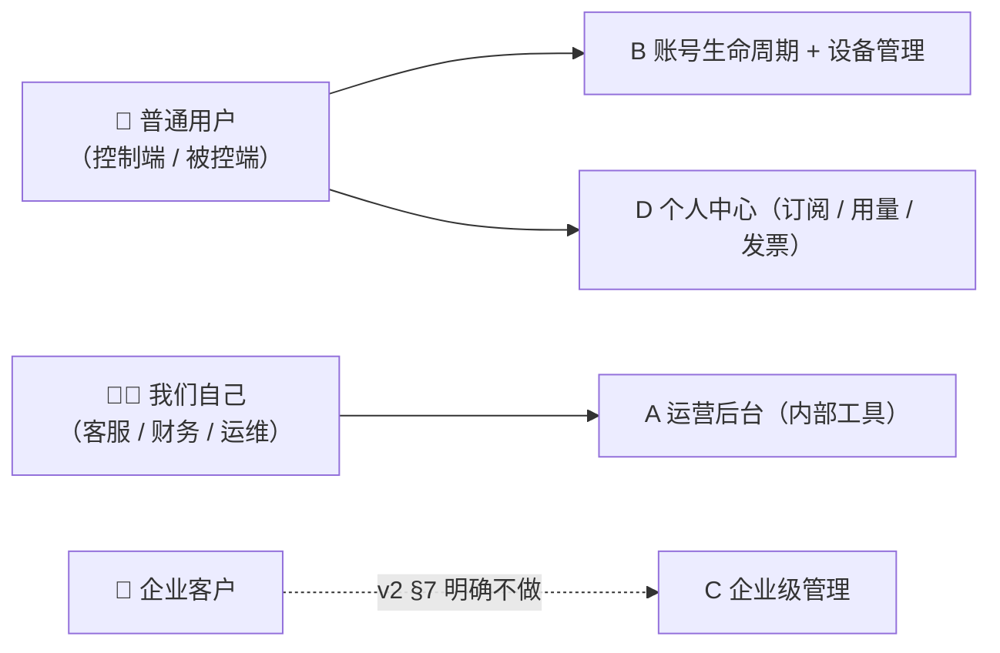

# 账号与管理系统设计（A 运营后台 · B 账号生命周期 · D 个人中心）

> 状态：✅ **已拍板并登记为决策 D12（2026-09-14）** —— §7 的 M1–M6 即 **D12-1 ~ D12-6**
> 建立 2026-09-14 · 拍板 2026-09-14
> 由来：用户提问「需要规划一个管理模块不？」，并确认范围为 **A 运营后台 + B 用户侧账号与设备管理 + D 用户个人中心**，要求**与账号生命周期（`需求规划评审意见.md` §2.5）一起规划**。
> 定位：本文件回答「**谁来管、怎么管、拿什么管**」。**计费的界面长什么样**在 `商业化与计费设计.md` §13；**花多少钱**在 `成本测算表.md`；**做什么功能**在 `需求规划-v2-P0P3重构.md`。

---

## 0. 一页纸速览

1. 🔴 **本文覆盖 A/B/D 三块，不含 C（企业级管理）** —— v2 §7 已把「企业级 IT 管理能力（域控 / 策略下发 / 审计报表）」列为明确不做。⚠️ 但**「我们自己的运营后台」≠「给企业客户的管理后台」**，别被 §7 挡住。
2. 🔑 **P0 的"管理模块"不是「后台」，是一个极小的内部操作台** —— **3 个查询 + 3 个动作**（§5.1）。完整运营后台是 P1。
3. 🔑 **后台里有两类动作，处理方式相反**：**能复用现成工具的绝不自研**（退款 / 对账 / 发票 → 支付渠道商户后台；成本看板 → Grafana）；**只有业务侧操作必须自研**（额度补偿 / 计量明细 / 风控处置）。
4. 🔴 **铁律一：涉及资金与账号权限的操作必须走工具且留审计，不得直接改库。** 否则无追溯 + 内部可无限发额度 = 内控失效。
5. 🔴 **铁律二：后台是已拍板政策的执行体**（同 §13 的逻辑）—— D11 承诺「7 天未使用可退」、计费设计 §5.6 承诺「不一致主动补偿」、§9.3 承诺「不误伤家庭互助」，**这三条承诺背后都需要一个操作工具**；没有工具 = 承诺落空 = 客诉。
6. 🔴 **B 的优先级实际高于 A** —— 看不了后台只是我们自己难受；**解不了绑 / 换不了机是用户用不了**。而 B（§2.5 账号生命周期）**至今未规划、未勾选**。
7. 🔴 **"解绑"必须拆成两种语义**，混为一谈会造成隐私事故：**① 解除设备授权**（下次连接需重新人工确认）vs **② 解除账号绑定**（设备从列表消失）—— 用户以为①，实际旧机主仍可被连（§2.4）。
8. 🔴 **账号注销（删除权）是合规硬项，不是可选项** —— 个保法删除权 + App Store 审核指南 5.1.1(v) 均要求提供账号删除入口（§2.7）。
9. ⚠️ **本机最容易漏的一条**：**被控端必须能单方面断开且不被"挽留"** —— 被控的人是隐私主体，任何"确认一下再断"都是错的（§3.4）。
10. 🔴 **本轮评审补上的三个"写了但没写完全"的洞（均会导致上线即争议）**：① **设备数计数口径**（在线还是历史？已定案，§2.3）② **`[D12-2]` "降级"降到哪**（原文只说降级，未定义目标，无法实现，见 §2.4.2）③ **退款成功后额度与订阅怎么处理**（原文只说"要有退款入口"，见 §4.3.1）。

> ✅ **本文的 6 项待拍板已于 2026-09-14 拍板，登记为决策 D12（D12-1 ~ D12-6）** —— 见 §7。

---

## 1. 三条边界（先划清，否则会写歪）

### 1.1 覆盖范围与三类使用者



| 块 | 使用者 | 本文职责 | 现状 |
|---|---|---|---|
| **A 运营后台** | 我们内部 | P0 最小操作台 + P1 完整后台 + 权限与审计 | 🔴 **全部文档此前无一处规划**（真实空白） |
| **B 账号生命周期** | 用户自助 | 找回 / 解绑 / 换机 / 上限 / 应急 / 注销 | 🟠 `评审意见` §2.5 已识别，**未做** |
| **D 个人中心** | 用户自助 | 订阅状态 / 用量明细 / 账单 / 发票 / 取消路径 | 🟡 与 `商业化与计费设计` §13.3 有重叠，见 §4.5 分工 |
| ~~C 企业级管理~~ | 企业客户 | — | ✅ **v2 §7 已明确不做** |

### 1.2 一条贯穿全文的分层：同一条政策往往两端都要

**用户自助**解决「常态、量大、不该找客服」的事；**运营工具**解决「例外、争议、必须有人担责」的事。
本文的每个功能都按这个分层写，例如「解绑」= 用户自助解绑（**主体**）+ 后台强制解绑（**补位，用于设备丢失 / 用户联系不上**）。

### 1.3 两条铁律

| # | 铁律 | 为什么 |
|---|---|---|
| **1** | 🔴 **涉及资金与账号权限的操作必须走工具 + 留审计，不得直接改库** | 早期「工程师连数据库改额度」能撑，但它**无追溯、易出错**；更现实的问题是**内部人员可无限发额度**，没有审计就无法内控。一旦接了支付，这就是财务风险 |
| **2** | 🔑 **能复用现成工具的绝不自研** | 后台是最典型的"自嗨型工作量"：造一个不如微信商户后台的退款页，纯属浪费 |
| **3** `[新增·本轮]` | 🔴 **数值不得在本文自写 —— 一律以 `成本测算表` §0（SSOT）为准** | 本轮全量评审的 6 条硬矛盾中 **4 条源于"同一参数在多处各写一遍"**（免费额度 / 打平 MAU / 码率 / 客单价）。本文涉及额度、补偿阈值、设备数等数值处，**只能引用、不得另立** |

---

## 2. B：账号生命周期 `[新增]` 🔴（填 `评审意见` §2.5 的坑）

> §2.5 原文：「『指纹免密』与『忘记密码怎么办』天然对立。缺：账号找回路径、设备解绑、解绑上限与冷却期、换机流程、账号可绑定设备数量上限、账号被锁后的应急通道。」
> 本节逐条补齐，并补一个 §2.5 漏掉的项：**账号注销**（§2.7）。

### 2.1 身份根：三个入口，一个原则

承接 v2 §6.2 三层模型（① 账号 = 身份根 → ② 设备授权 → ③ 生物识别）。

| 入口 | 用途 | 备注 |
|---|---|---|
| 密码 | 主入口 | 不强制复杂度，但强制**泄露检测**（撞库库比对）[需核实] |
| 短信 | 找回 + 双验 | ⚠️ 短信可被 SIM 劫持 ⇒ **不得作为唯一找回手段** |
| **恢复码** | 无手机 / 换号 / 短信不可用 | 🔴 见 §2.2 |

🔑 **原则：任何**单一**入口不得独立完成「找回 + 改绑手机 + 解绑全部设备」这一串动作** —— 这是标准账号劫持路径。高风险动作（改手机号 / 解绑全部设备）**必须两个入口交叉验证**。

### 2.2 🔴 恢复码的设计（§2.5 漏写，但它是整个体系的最弱一环）

| 要求 | 说明 |
|---|---|
| 默认生成，**注册时一次性展示** | 不默认生成 ⇒ 用户丢手机时无路可走；不一次性展示 ⇒ 存在服务端就是新风险 |
| **可轮换**（用后立即作废 + 用户可主动重生成） | 一次性；重复使用即刻失效 |
| 🔴 **恢复码不得单独解锁高敏感动作** | 它与短信同属"持有物"，二者不能互相替代做交叉验证 |
| 提示写入引导页 | 冷启动期用户不会主动找它 ⇒ 需在「绑定设备成功」后提示保存 |

### 2.3 设备绑定与上限

| 项 | 结论 |
|---|---|
| 上限数值 | 🔴 免费版 **≥ 100 台**（`[已确认 D11-3 关联]`，v2 §9.2 硬约束 3：TeamViewer 免费仅 3 台是它的致命伤）⇒ 我方**不得低于 100** |
| 个人版上限 | ✅ **与免费版一致 = 100 台**（`[D12-1]`）。⚠️ 结论：**两档在此项相同 ⇒ 它在权益对比表里不得作为付费权益**（详见 §2.3.1 下方注） |
| 计数口径 | 🔴 **已定案（本轮评审补）：按「授权有效设备数」计数** —— ① **在线与否不影响计数**（离线设备占配额）② **曾连接与否不影响计数** ③ 🔴 **被 90 天复核降级的设备不占配额**（`[D12-2]`；否则 100 台闲置设备会把账号直接锁死，见 §2.4.2）④ 已「移除设备」的不计数。<br>⇒ **口径必须产品与客服统一**（同一句话回答"我到底还能加几台"） |
| 超限行为 | 🔴 **不得静默拒绝连接**（同 §13 红线精神）⇒ 必须明示"已达上限，请解绑一台"并给出解绑入口。<br>🔴 **补充（本轮评审）**：超限页必须直接给出「**最久未连接**」排序（让用户在 100 台里手动找一台该删的，是二次伤害）；并要求把「闲置设备会自动释放配额」写在提示里 —— 否则 90 天复核是一条**用户永远不知道的规则** |

#### 2.3.1 ⚠️ 为什么"设备数"不该做付费墙

与 `商业化与计费设计` §1 价值阶梯一致：**设备数几乎不产生边际成本**（不连就不花中继钱）。
⇒ 把它做成付费点，**收益极低而客诉成本极高**（用户会立刻拿去和 ToDesk 的 100 台比价）。
✅ **正确做法：免费给足，用于压缩对手空间**；付费点留在**功能开关（L4）与数字商品（L5）**。

> ✅ **`[D12-1]` 拍板结果（2026-09-14）**：个人版设备数与免费版一致 = **100 台**。
> 🔴 **连带要求**：两档数值相同 ⇒ **权益对比表里"设备数"这一行不得出现在付费档的权益列下**（否则违反本节判断，且会给用户"付费才给 100 台"的错觉）。
> ✅ **正确表达：把它写成"免费版的优势行"** —— 「设备数：**我们免费版就给 100 台** vs TeamViewer 免费版 3 台」。
> ☑ **已核实（本轮，2026-09-14）**：**ToDesk 专业版 = 150 台**（**同价 ¥158/年**）⇒ 🔴 **我方付费档在此项显劣（已确认，不再是「若」）**。
> 🔴 **由此新增的落地要求**：权益对比表**不得回避该行**（用户会自己去 ToDesk 页面看到 150 台）⇒ 必须并列写出「ToDesk 150 / 我方 100」，紧邻两条真优势行（**手机被控免费** · **直连不限时长**）。
> ❓ **是否把两档都提到 150 台 = 待拍板**（`竞品对标表` §2.5 给了 A/B/C 三条路线；**拍板前对外不得出现任何设备数对比措辞**）。详见 `需求规划评审意见` **§10.5 #1**。

### 2.4 🔴 解绑 / 换机（本节最易出错处）

#### 2.4.1 必须拆成两种语义

| 语义 | 效果 | 用户常见误解 |
|---|---|---|
| **① 解除设备授权** | 该设备**下次被控 / 受控需重新人工确认**；设备仍在列表中 | — |
| **② 解除账号绑定** | 设备**从列表消失**，不能再被直接寻址 | 🔴 **用户以为做了 ②，实际只做了 ①** ⇒ 旧机主仍可能被连 |

🔴 **强制要求：界面上必须把两者分开命名**（如「**取消授权**」vs「**移除设备**」），
并在**移除设备**时明确告知「已取消该设备的全部授权」。**禁止**用一个"删除"按钮糊住两件事。

#### 2.4.2 换机流程（隐私事故高发场景）

> 场景：**旧手机卖掉 / 送人，但忘了解绑** ⇒ 新机主可能被你连上，或你的账号仍可连它。

| 要求 | 说明 |
|---|---|
| 🔴 **支持"一键解绑所有设备"** | 换机 / 疑似被盗时的核弹按钮；高风险动作 ⇒ 需交叉验证（§2.1） |
| 🔴 **设备激活需周期性复核** | ✅ **90 天**未连接的设备授权**自动降级为"需重新确认"**（`[D12-2]`）—— 这是**唯一能兜住"忘了解绑"的机制**。<br>🔴 **降级目标已定义（`[D12-2a]`，本轮评审补齐）—— 原文只写"降级"未写降到哪，等于**无法实现**：**<br>① **效果**：清空该设备授权（下次连接**必须在被控端本机人工确认一次**，与首连同强度）<br>② **记录**：设备**保留在列表中**（不删除），状态标为「**需重新确认 · 已闲置 N 天**」<br>③ 🔴 **配额**：**立即释放设备数配额**（与 §2.3 计数口径一致，否则百台闲置设备会锁死账号）<br>④ **通知**：降级**前 7 天**推一次通知（"该设备已 N 天未使用，将在 7 天后需重新确认"）—— **不通知的降级 = 用户莫名连不上**<br>⑤ **恢复**：被控端人工确认一次即回到正常授权态，**不计入 7 天冷却**（冷却期只针对"手动解绑后重绑"） |
| 冷却期 | ✅ **解绑后 7 天内该设备重新绑定需双重验证**（`[D12-2]`）—— 防止扫号后立即解绑抹痕迹 |

### 2.5 账号被锁的应急通道

- 触发锁定的原因必须**明确告知**（"密码错误 5 次" ≠ "账号异常"，后者的模糊表述会引发大量客诉）。
- 提供**申诉入口**（§5.1 的运营操作台必须有对应的**解封动作**，否则申诉无人可处理）。
- 锁定时**不得影响已建立的会话**（正在远程调试电脑时被锁，会切断用户的救援通道）。

### 2.6 实名认证的交互位置

国内强制（v2 §6.5）。🔴 **关键原则：实名不得前置成注册门槛** ——
消费级产品在注册第一步要实名，会**直接损失大量下载转化**。
⇒ ✅ **已拍板采用延迟实名**（`[D12-3]`）：**在不触发风控 / 不使用中继额度 / 不发起跨账号连接之前不要求实名**。

### 2.7 🔴 账号注销（`评审意见` §2.5 漏写，但属合规硬项）

| 项 | 结论 |
|---|---|
| 是否必须做 | 🔴 **必须**。个保法**删除权** + App Store 审核指南 **5.1.1(v)**（有账号创建的 App 必须提供账号删除入口）`[需核实条号]` |
| 入口位置 | 🔴 **必须在 App 内可达**，不得只提供"发邮件申请"（Apple 明确不接受） |
| 冷静期 | ✅ **30 天软删除**（`[D12-4]`，期间可登录撤销）—— 防误删 + 防"注销躲退款 / 躲风控" |
| 级联处理 | 订阅（**必须先确认已在渠道侧取消**，否则会继续扣费）· 额度（作废）· 设备授权（全部解除）· 日志（按保留期匿名化） |
| ⚠️ 陷阱 | **账号注销 ≠ 订阅取消**。App Store 订阅由 Apple 管理，**注销账号不会停止扣费** ⇒ 必须显式提示并给指引 |

---

## 3. B：用户侧设备与会话管理

### 3.1 设备列表

| 字段 | 说明 |
|---|---|
| 设备名 / 类型 / 平台 | 允许用户重命名（默认名要给足信息，如「Xiaomi 14 · Android」） |
| 在线状态 | 🔴 **区分三态**：在线 / 离线（最后在线时间）/ **从未连接** —— 只显示"离线"会让用户无法判断是不是坏了 |
| 授权状态 | 对应 §2.4.1 的两种语义 |
| 关联会话 | 当前是否有活动会话（可一键中断） |

### 3.2 登录设备管理 + 踢下线

🔴 **直接复用 v2 §6.2 的「Token 短时效 + 可主动吊销」**，本文只补交互面：

- 列出**登录地 / 登录时间 / 当前是否活跃**（无需精确 IP，消费级产品展示城市级即可）。
- **「退出所有设备」** 按钮（账号疑似被盗时的核弹按钮）。
- 🔴 **新设备登录必须通知已有设备**（v2 §6.2 已要求双重验证，但**通知**是让用户"发现异常"的关键，二者不能互相替代）。

### 3.3 会话可见性（双向知情）

| 端 | 应看到 | 理由 |
|---|---|---|
| 被控端 | **谁在连我**（账号标识 + 连接方式） | 隐私主体知情权；也是反诈提示的载体（v2 §6.5） |
| 控制端 | 连接方式（直连 / 中继）| 🔴 已由 `商业化与计费设计` §13.2 #1 定义 |

### 3.4 🔴 一条红线：被控端必须能单方面断开，且不被"挽留"

- 断开动作**一次点击即生效**，不得弹出「确定要断开吗？对方可能还在操作」之类的**挽留式二次确认**。
- 不得在断开时推送「升级会员可继续」类内容（同 §13.4 红线 5 的精神）。
- 理由：**被控端是隐私主体，任何延迟都是对隐私主体的不尊重**；且这一条是信任基础，与 D1 透明度是同一类资产。

---

## 4. D：用户个人中心（订阅与用量）

### 4.1 订阅状态

| 项 | 要求 |
|---|---|
| 展示 | 当前档位 · 到期时间 · 是否自动续费 · 下次扣费金额与日期 |
| 🔴 双套 | **iOS 版与非 iOS 版必须两套**（iOS 不得出现站外支付引导 / 比价），见 `商业化与计费设计` §13.4 红线 4 |
| ⚠️ 陷阱 | iOS 侧订阅状态**以 Apple 收据为准**，不得只信本地缓存（退款 / 撤销订阅后本地会撒谎） |

### 4.2 用量明细（= `商业化与计费设计` §13.3 的**数据落点**）

- 每一笔中继会话：**时间 / 时长 / 字节数 / 扣除量 / 连接方式**。
- 🔑 **它是"反客诉主体"**：计量争议的最终解法不是客服话术，而是「你自己看得到每一笔」。
- 🔴 **数据必须与后台操作台（§5.1）读的是同一份权威数据** —— 否则会出现"用户看到 10 分钟、客服看到 12 分钟"这种最坏情况。

### 4.3 账单与发票

- 账单：订单列表（时间 / 商品 / 金额 / 渠道 / 状态）。
- 发票：**必须支持**（企业采购 / 报销场景，`商业化与计费设计` §10 已列）。
- 退款入口与状态：⚠️ **退款能力初期直接用支付渠道商户后台**（§5.2），但**用户侧要有查看退款状态的入口**，否则用户只能反复找客服。

#### 4.3.1 🔴 退款与额度 / 订阅的联动规则 `[新增·本轮评审补齐]`

> **为什么必须写死**：原文只写了"要有退款入口"，**没写退款成功后额度与订阅怎么处理** ⇒ 上线后必然出现两类争议：
> 「钱退了但额度还在」（我方可直接损失）与「钱退了、额度已扣完」（用户认为被占便宜）。
> 以下五条与《商业化与计费设计》§10（7 天未使用可退）联动，**产品、客服、后台三处口径必须一致**。

| # | 规则 | 说明 |
|---|---|---|
| 1 | **退款成立的前提** | ✅ **7 天内且中继用量为 0**（D11）—— 只要用过中继流量（> 0），即不满足"未使用"；**这是硬判定依据，不是客服裁量**（判定数据取 §4.2 的同一份权威计量） |
| 2 | 🔴 **退款成功后立即回收** | 订阅状态 → 「已退款 / 已终止」；**未使用完的额度立即作废**；**不得"钱退了额度还留着"**（否则等于无限免费） |
| 3 | **已消耗流量不追偿** | 已消耗的中继成本**不向用户追加扣款**（无此能力也无比要），但**订单备注保留消耗记录**（客服追溯用） |
| 4 | 🔴 **不得用额度补偿替代退款** | 用户主张退钱时**只能用钱解决**；额度补偿**只适用于"我方故障造成的体验损失"**（§5.6）—— 混用会直接升级为投诉（"我要退款你却给我额度"），且两者在后台走的是不同权限（§5.4） |
| 5 | **退款频率限制** | 同一账号 **180 天内最多 1 次**"未使用可退"；重复请求須走人工审核 + 记录原因（防"买了退、用完再退"的时间差套利） |

> `[需核实]`（已列 §8）支付渠道是否支持**部分退款 / 多次退款 / 状态查询 API** —— 决定第 2 / 3 条是"自动回收"还是"人工操作"，也决定 §5.1 #6 是"纯跳转"还是"需回填状态"。

### 4.4 🔴 取消续费的路径（合规硬项）

- **必须明示且不得比开通更难**（`商业化与计费设计` §10 已列合规要求）。
- 🔴 **不得把取消入口藏在深层菜单** —— 这是"暗黑模式"投诉最集中的位置。
- iOS 侧：必须**显式给指引**（设置 → Apple ID → 订阅），因为**用户会来找我们而不是 Apple**。

### 4.5 与 `商业化与计费设计` §13 的分工（避免两份文档打架）

| | `商业化与计费设计` §13 | 本文 §4 |
|---|---|---|
| 管什么 | **这一屏长什么样、文案怎么写**（红线、渐进披露、措辞） | **数据从哪来、能不能删 / 改 / 导出、入口在哪** |
| 例 | 「余量默认折叠，80% 才出现」「对外叫免费中继时长不叫额度」 | 「明细的权威源是服务端计量面」「保留期 X 个月」 |
| 关系 | 前者是**设计规范**，后者是**功能与数据定义**；**改一处必须同步另一处** | |

> 🔴 落点：**用量明细页 / 订阅页**应在本节定义功能与数据，在 §13 定义视觉与文案，**两份文档都需引用对方**。

---

## 5. A：运营后台（内部工具）

### 5.1 🔑 P0 最小操作台：3 个查询 + 3 个动作

> 判断依据：**凡是已拍板政策必须有人执行的，就必须有工具**（§0 结论 5）。
> 只要这 6 项，P0 就够；**不要一开始就造后台**。

| # | 能力 | 类型 | 服务的已拍板政策 |
|---|---|---|---|
| 1 | **查用户**（账号 / 实名状态 / 设备数 / 风控状态） | 查询 | 客服基础能力（无此则一切客诉无法处理） |
| 2 | **查额度与计量明细**（该用户每一笔中继会话） | 查询 | 🔴 `商业化与计费设计` §5.6「你看得到每一笔」+ 争议处理 |
| 3 | **查订单 / 订阅状态** | 查询 | D11「7 天未使用可退」的判定依据 |
| 4 | **调整额度（补偿 / 回收）** | 动作 | 🔴 §5.6「不一致主动补偿」（**这是唯一必须自研的动作**） |
| 5 | **封禁 / 解封 / 加白名单** | 动作 | 🔴 §9.2 防滥用 + **§9.3「家庭互助白名单」的唯一落点** |
| 6 | **人工触发退款** | 动作 | 走渠道后台（见 §5.2），**本文只需提供跳转与状态回填** |

🔴 **第 5 项特别提示**：§9.3 明确"风控不得误伤帮爸妈调手机"，并给出白名单特征。
⇒ **如果没有任何加白工具，这条政策就是空文**：误伤了用户，客服只能道歉，无法恢复。

> ✅ **`[D12-6]` 拍板结果**：P0 **只自研这 3 查 3 动作**，退款 / 对账 / 发票 / 成本看板**一律复用现成工具**（§5.2）。❗**不在 P0 造完整后台**（§5.3 全部是 P1）。

### 5.2 🔑 复用现成工具（不自研）

| 需求 | 现成方案 | 结论 |
|---|---|---|
| 退款 / 对账 / 交易查询 | **微信支付商户平台 / 支付宝商户平台** | ✅ **不自研**，直接用人家的后台 |
| 成本与打洞率看板 | Grafana + 日志 / 指标查询（D2 已要求分桶看板） | ✅ **不自研**，先看板后系统 |
| 客服工单 | 第三方工单 / 甚至共享表格 | ✅ 不自研（用户量未到前） |
| 发票 | 渠道或第三方开票服务 `[需核实]` | ✅ 不自研 |

### 5.3 P1：完整运营后台

- 订单 / 退款 / 发票**闭环**（不依赖跳转渠道后台）
- 成本看板**内嵌**（中继 GB、¥、按用户 / 按地区）
- 举报与内容处置流程（`v2` §6.5 要求，但该条本身仍是 `[待确认]`）
- 订阅生命周期管理（续费提醒状态、失败重试、退订挽回 — ⚠️ **不得做成骚扰**）
- 灰度与配置下发（v2 §3.5 已有自动更新灰度；配置下发**尚未定义**）

### 5.4 🔴 权限模型（P0 就要有，哪怕只有 3 个角色）

| 角色 | 可做 | 不可做 |
|---|---|---|
| **客服** | 查询全部 · 小额额度补偿 | ❌ 退款 ❌ 封禁 |
| **风控 / 运营** | 封禁 / 解封 / 白名单 | ❌ 退款 |
| **财务** | 退款 / 发票 | ❌ 改额度上限 |
| **管理员** | 全部 + 授权 | — |

⚠️ **最小可行做法**：P0 可以只有"客服（只读 + 补偿）"和"管理员"两个角色，但**必须从第一天分开**——否则等有人滥用时再补权限，历史操作已经无法追溯。

### 5.5 🔴 操作审计（P0 必须）

| 要求 | 说明 |
|---|---|
| 记录 | 谁 / 何时 / 对谁 / 做了什么 / 改前改后值 / 原因备注 |
| 🔴 **不可删除、不可编辑** | 审计日志能被改，等于没有 |
| 额度补偿必须填**原因** | 且原因会**同步进用户的用量明细页**（"因为 X，补偿了你 Y 分钟"）—— 这同时解决了透明度与客诉 |
| 大额动作需复签 | ✅ **单次补偿 > 免费额度的 10 倍需第二人复核**（`[D12-5]`）—— 阈值先定下来，早期可只执行"必须填原因" |

### 5.6 明确不做（与 v2 §7 一致）

❌ 域控 / 组策略下发 ❌ 企业审计报表 ❌ 多租户组织架构 ❌ 企业级 SLA 看板
（理由：与个人消费级定位冲突，见 v2 §7）

---

## 6. 与既有决策的耦合（不得单独改动）

| 本文内容 | 强耦合于 | 关系 |
|---|---|---|
| 运营操作台「调整额度」 | `商业化与计费设计` §5.6 权威性与透明 | 🔴 后台改额度 = 用户能在明细页看到同一笔（**不得只改后台不改明细**） |
| 「封禁 / 加白名单」 | §9.2 防滥用 · 🔴 **§9.3 家庭互助唯一落点** | 无工具 ⇒ 政策落空 |
| 「人工退款」 | §10 退款政策 · D11「7 天未使用可退」 | 后台是执行体 |
| 个人中心用量明细 | §5.1 计量口径（GB）· §13.3 | 🔴 **同一份权威数据**，界面 / 数据分离见 §4.5 |
| 订阅页 iOS 双套 | §13.4 红线 4（3.1.1） | 改一处必须同步 |
| 设备数上限 | v2 §9.2 硬约束 3（≥100 台）· §1 价值阶梯 L3 | 🔴 **不得做付费点**（§2.3.1） |
| 账号注销 | 个保法删除权 · App Store 5.1.1(v) · `成本测算表` §10.1 **#16** | ✅ **执行顺序已定（本轮补齐）**：先判定是否在 **30 天冷静期内** → 期内**只标记不删**（可撤销注销）→ 期满**级联删除身份数据、匿名化计量与审计流水**（计量流水按监管保留但**去标识**；审计日志按 §5.5 **不可删但去标识**）⇒ 原文的"保留期未定 ⇒ 注销流程未定"**前置依赖已解除** |
| 退款 | D11「7 天未使用可退」· `商业化与计费设计` §10 | 🔴 **联动规则已定**（§4.3.1 五条）：额度随退款作废、不得用额度补偿替代退款 |
| 被控端断开不被挽留 | D1 透明度 · §13.4 红线 5 | 同类信任资产 |

---

## 7. ✅ 已拍板（登记为决策 **D12**，2026-09-14）

> M1–M6 即 **D12-1 ~ D12-6**。下表为**已生效结论**，不是建议。

| # | 决策项 | ✅ 已拍板结果 | 影响面 |
|---|---|---|---|
| **D12-1** | **个人版设备数上限** | **与免费版一致 = 100 台** —— 两档相同 ⇒ 🔴 **该行不得出现在付费档权益列**，应写成"免费版优势行"（§2.3.1） | 定价页权益对比表（§13.3）；☑ **核实项 #20 已结**：**ToDesk 专业版 = 150 台 ⇒ 我方付费档显劣已确认**（处置：对比表**正面披露该行** + 靠手机被控免费 / 直连不限时长取胜）；❓ 是否上调到 150 待拍板 |
| **D12-2** | **解绑冷却期 + 授权复核周期** | **解绑后 7 天内重绑需双重验证** + **90 天未连接自动降级为"需重新确认"** | 兜住"忘了解绑"的唯一机制（§2.4.2） |
| **D12-3** | **实名认证的时机** | **延迟实名**：仅在不触发风控 / 用中继额度 / 跨账号连接前要求 | 🔴 前置实名会直接损失注册转化 |
| **D12-4** | **账号注销冷静期** | **30 天软删除**（可登录撤销；期间不作废订阅但强制提示去 Apple 侧取消） | 合规 + 防"注销躲退款" |
| **D12-5** | **大额操作的复核阈值** | **单次补偿 > 免费额度的 10 倍需第二人复核**（阈值先定，早期可只执行"必须填原因"） | 内控 |
| **D12-6** | **P0 运营工具形态** | **自研极小操作台（§5.1 的 3 查 3 动作）+ 退款 / 看板复用现成工具**；❗**P0 不造后台** | P0 人力；这是最容易被过度建设的地方 |

> ⚠️ **D12-6 是本文最重要的一个判断**：运营后台是最典型的"自嗨型工作量"——
> 造一个不如微信商户后台的退款页，收益为零。**P0 只做"渠道后台做不到的那 3 个动作"**。

> ⚠️ **D12-1 的连带风险（拍板时已知悉）**：付费档与免费档设备数相同，**不等于可以不管对手**。
> ☑ **已核实（2026-09-14）：ToDesk 专业版 = 150 台**（¥158/年 同价）⇒ 我方付费档**在此项显劣已成事实**。⚠️ 但**「设备数不作付费点」的判断不变**（对手给得多也不构成付费理由，且几乎无边际成本）⇒ 处置改为**正面披露 + 靠其他行取胜**；❓ 是否上调到 150 台待拍板（`竞品对标表` §2.5 · `需求规划评审意见` §10.5）。
> 这**不推翻**"设备数不做付费点"的判断（对手给得比我方多也不构成付费理由），但**决定了权益对比表的措辞**。

---

## 8. 本节新增的核实与实测项

| 类型 | 项 | 用途 |
|---|---|---|
| `[需核实]` | 🔴 **各厂商的设备上限、自助解绑能力、解绑冷却期、换机流程** | 我方 §2.4 的设计基线；若对手连"一键解绑全部设备"都没有 ⇒ 这是**低成本差异点** |
| `[需核实]` | 各厂商**账号注销入口的可达性**（是否只给邮箱） | 合规对标；也是"我们更规范"的对外论据 |
| `[需核实]` | App Store 关于账号删除的确切条款号（5.1.1(v)）与个保法删除权条号（第 47 条） | 引用准确性 |
| `[需核实]` | 支付渠道是否支持**部分退款 / 多次退款**、退款状态查询 API | 决定 §5.1 #6 是"纯跳转"还是"需回填状态" |
| `[需实测]` | 短信到达率与延迟（找回链路可用性） | 找回是账号体系的生命线 |
| `[需核实]` | 发票开具的渠道能力（是否支持个人抬头 / 企业抬头 / 电子票） | `商业化与计费设计` §10 已列"需支持"，此处补"怎么支持" |
| ☑ `[已核实]` | 🔴 **各厂商"付费档"的设备数上限**（ToDesk 专业版 / 向日葵等） | **`[D12-1]` 的连带依赖**：我方付费档 = 免费档 = 100 台 ☑ **ToDesk 专业版 = 150 台 ⇒ 显劣已确认**（处置：对比表正面披露 + 靠「手机被控免费 / 直连不限时长」取胜；❓ 是否上调 150 待拍板）。⚠️ **残留**：向日葵 / AnyDesk 付费档未取到（`竞品对标表` §2.5） |

---

## 9. 回写清单（✅ D12 已拍板，本清单已可执行）

| 目标文档 | 回写内容 | 状态 |
|---|---|---|
| `需求规划评审意见.md` | §2.5 标记 ✅ 完成 + 新增 2.5a（D12-1 ~ D12-6 拍板登记）；§7 决策表新增 D12 行 | ✅ 已完成 |
| `需求规划-v2-P0P3重构.md` | §1 **P0** 补「账号生命周期最小集」（找回 / 解绑两种语义 / 一键解绑全部 / 注销入口）+ 「设备列表与踢下线」；§1 **P1** 补「运营操作台」与「个人中心（订阅 / 用量 / 发票）」；§6.2 补恢复码与高敏感动作交叉验证；变更摘要新增一条 | ✅ 已完成 |
| `商业化与计费设计.md` | §13.3 用量明细页 / 订阅页 增加指向本文 §4 的交叉引用（数据定义在本文、视觉规范在 §13）；🔴 **权益对比表补 `[D12-1]` 约束（设备数行不得出现在付费档权益列）** | ✅ 已完成 |
| `竞品对标表.md` | §9 新增待核实 #18 / #19（设备上限与解绑 / 换机策略、注销入口可达性）+ **#20（付费档设备数，`[D12-1]` 依赖）** | ✅ 全部已加 |
| `成本测算表.md` | §10.2 日志留存期限与账号注销保留期联动（注销流程的前置依赖；`[D12-4]` 为 30 天软删除） | ✅ 已加（§10.1 #16） |

### 9.1 本轮全量评审对本文的改动 `[新增]`

> 本轮对全文档集做了业务评审，共出 **6 条硬矛盾 / 10 条口径与体例 / 10 项完善缺口 / 7 项增强**。
> 其中落到本文的 **5 项**如下（其余在成本测算表 / 商业化 / v2 内完成）：

| # | 改动 | 位置 | 缘由 |
|---|---|---|---|
| 1 | 🔴 **设备数计数口径定案** = 「授权有效设备数」；离线与从未连接均计数；**降级即释放配额**；超限页给「最久未连接」排序 | §2.3 | 原文只写"必须明确"，**未定案 = 不可实现**；且与 `[D12-2]` 降级直接冲突（若降级仍占配额，百台闲置设备会锁死账号） |
| 2 | 🔴 **`[D12-2]` 降级目标定义**（效果 / 记录 / 配额 / 通知 / 恢复 五条，`[D12-2a]`） | §2.4.2 | 原文只写"自动降级"，**降到哪未写** |
| 3 | 🔴 **退款与额度联动五条规则** | §4.3.1 | 原文只写"要有退款入口"，**退款后的额度与订阅归属未写** |
| 4 | ✅ **注销执行顺序定案**（冷静期内只标记 → 期满级联删除 + 去标识保留） | §6（注销行） | 原文"保留期未定 ⇒ 注销流程未定"，依赖已解除 |
| 5 | 🔴 **本文新增铁律三：数值不得自写**（以 `成本测算表` §0 SSOT 为准） | §1.3 | 本轮 6 条硬矛盾中 **4 条源于同一参数多处各写一遍** |

---

## 附：一句话速查

```
范围      A 运营后台 + B 账号生命周期 + D 个人中心；C 企业级 = v2 §7 明确不做
铁律一    🔴 涉及资金/权限的操作必须走工具 + 留审计，不得直接改库
铁律二    🔑 能复用现成工具的绝不自研（退款/对账/发票→渠道后台；看板→Grafana）
P0 工具   🔑 不是"后台"，是 3 查 + 3 动作：查用户 / 查额度明细 / 查订单
          调额度（补偿）· 封禁解封加白 · 人工退款（跳渠道后台）
后台本质  🔴 已拍板政策的执行体：§5.6 主动补偿 · §9.3 家庭互助白名单 · D11 七天可退
          ⇒ 没有工具 = 承诺落空 = 客诉
优先级    🔴 B > A：看不了后台只是我们难受；解不了绑是用户用不了
解绑      🔴 两种语义必须分开：① 取消授权（设备还在）② 移除设备（清授权）
          换机是隐私事故高发场景 ⇒ 需"一键解绑全部" + 90 天授权复核
设备数    🔴 不做付费点（无边际成本 + 客诉成本高）⇒ 免费给足，压缩对手空间
注销      🔴 合规硬项（个保法删除权 + App Store 5.1.1(v)），App 内必须可达
          ⚠️ 注销 ≠ 取消订阅（iOS 由 Apple 管，不取消会继续扣费）
实名      🔴 延迟实名：不触发风控/不用额度/不跨账号连接前不要求（前置会掉转化）
红线      被控端必须能一次点击断开，不得挽留式二次确认（隐私主体）
权限      P0 至少分「客服（只读+小额补偿）」与「管理员」两个角色
审计      🔴 不可删不可改；补偿必须填原因，且原因同步进用户用量明细页
---
计数口径  🔴 按"授权有效设备数"计（离线/从未连接均算）；90 天降级即释放配额；超限页给"最久未连接"排序
降级目标  ✅ 清授权 + 留记录（"需重新确认·已闲置 N 天"）+ 释放配额 + 提前 7 天通知 + 确认即恢复（D12-2a）
退款联动  🔴 退款=订阅终止 + 未用额度作废；已耗流量不追偿；不得用额度补偿替代退款；180 天限 1 次
SSOT      🔴 本文不得自写数值，一律引 `成本测算表` §0（铁律三）
--- ✅ D12 已拍板（2026-09-14）---
D12-1     个人版设备数 = 免费版 = 100 台 ⇒ 🔴 不作付费权益（⚠️ ToDesk 专业版 **150 台** ⇒ 付费档**同价显劣已确认**，待拍板），写成"免费版优势行"
D12-2     解绑后 7 天内重绑需双验 + 90 天未连接自动降级为"需重新确认"（降级目标见 §2.4.2 `[D12-2a]`）
D12-3     延迟实名（不触发风控/不用额度/不跨账号连接前不要求）
D12-4     注销冷静期 30 天软删除（可登录撤销）
D12-5     单次补偿 > 免费额度的 10 倍需第二人复核
D12-6     P0 只自研 3 查 3 动作；退款/对账/发票/看板一律复用现成工具，不造后台
```

---

**建立时间**：2026-09-14 · **拍板时间**：2026-09-14 · **状态**：✅ 已拍板并登记为决策 **D12**（§7 的 M1–M6 = D12-1 ~ D12-6）
