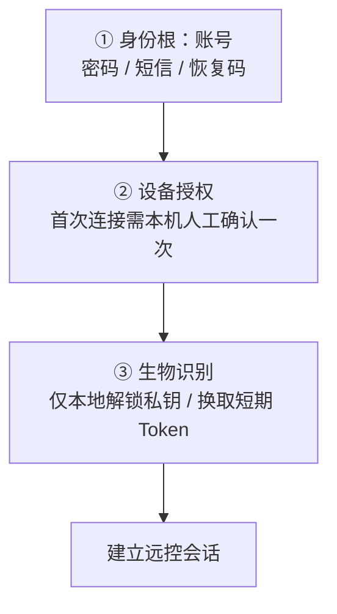
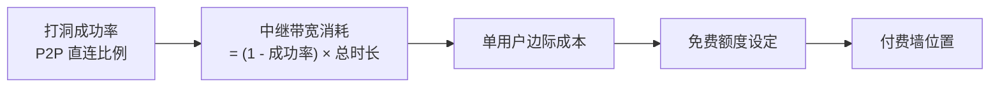

# 个人消费级远程桌面 —— 需求规划 v2（P0–P3 重构版）

> 本版基于 `docs/个人消费级远程桌面需求规划.md` 重构，配套评审见 `docs/需求规划评审意见.md`。
>
> **标注约定**
> - `[继承]` 来自原文，仅作归类与措辞修正
> - `[新增]` 原文缺失、本版补入
> - `[待确认]` 需业务/技术决策后填写，**不是已确定结论**

---

## 0. 一页纸概览

| 项 | 内容 |
|---|---|
| 产品定位 | 面向个人消费者的跨平台远程桌面。**PC 是被控主体、也是长时间会话的主力；手机是覆盖「PC 触达不到的时段」的控制端**（应急 / 触达 / 帮亲友排障） |
| **主战场** `[修正·D8]` 🔴 | **远程办公 —— 远程控制电脑桌面**：**PC→PC**（时长与收入主力）+ 手机 / 平板 →PC（碎片时段）。这是产品的**本义**，资源与指标的第一优先（§9.3） |
| **主主张 / 武器** `[修正·D8]` 🔴 | 主战场内我方**暂无技术级护城河**（D1 透明度弱于 RustDesk 自建 · D4 交互是及格线 · D6 外接不可对外主张）⇒ 能打的只有**商业条款**：「**免费额度做到对手收费档位**」。⚠️ 口径必须是「**直连不限时长**」（中继须限额，见 §8 与《成本测算表》§7.3）。 🔴 **`[B6]` 措辞已收窄（不得再写笼统版）**：主张**只允许两项** —— ① **手机被控免费**（对手 ¥25/月）② **直连不限时长**（可当场验证）； ⚠️ 100 台 / 画质档位 / 时长**均属同档，不得写成优势**；⚠️ **通道数与会话数尚未定案 ⇒ 未定案前绝对不得主张**。完整证据表见《商业化与计费设计》§2.5（每条空位都标了「✅可主张 / ⚪同档 / ⚠️未定案 / ❌劣势」） |
| 移动端形态 `[修正]` | 🔴 **身边无外接屏时，手机单屏是唯一可用的控制方式** —— 这是**默认情况** ⇒ **手持单屏为主路径，指标以此为基线**；接显示器 / 电视是 **P1 增强**（有则加分，无则不缺），见 §2.3 |
| 外接形态的价值 `[修正]` | 🟡 **P1 但权重高**：增量硬件只是一块**蓝牙键盘（~200 g）** ⇒ 「接上现场那块屏」携带成本接近零。价值不在覆盖率（低），而在 **会话从分钟级跃升到小时级** ⇒ **产生付费理由**（§2.3.2）。🔴 **已核实为空位**（2026-09-14：无一家做「自动桌面化布局」）⇒ 升为**次级差异点**；⚠️ 但 D6 仍禁止对外当主主张（DP Alt Mode 非全线 + Android 16 会逼对手跟进，窗口期 1–2 年） |
| 差异化能力 `[修正·D8]` | **① 手机作为「被控端」**（免 Root · 免收费 · 不限机型；竞品需付费或限机型，见 §3.6）—— ⚠️ **定位为「获客钩子」，不是主主张**（理由见 §9.3 D8）· **②** 连接模式透明度（零成本、可传播）· **旗帜 ③** 智能眼镜接入（制造声量，不承诺留存） |
| ~~历史表述~~ `[作废]` | ~~① 眼镜 ② 鸿蒙 ③ 手机为核心终端 ④ 手机被控为「主差异点」~~ —— ① 经核实向日葵**已有鸿蒙 NEXT 尝鲜客户端**（V1.6.0.1032198 / 2026.09，仅控制端）⇒ 鸿蒙须收窄为 L2/L3（§9.1）；② 「手机为核心**控制端**」**论证不成立**（控制端可以是 PC；长时会话主力是 PC→PC）（§9.3）；③ 🔴 **D8（2026-09-14）**：「手机被控 = 主差异点」**同样错误** —— 该结论只过了**差异化测试**，没过**权重测试**（频次 × 付费意愿撑不起收入）⇒ 降为「差异化能力 + 获客钩子」，主战场回归远程办公（§9.3） |
| 场景矩阵 | 控制端 × 被控端的四象限与各自定位，见 §9.3 |
| 🔴 **画面显示红线** `[新增·D9]` | **不得默认全屏**（默认窗口化自适应；全屏仅由用户显式触发，退出后恢复原尺寸与位置）· **不得非等比拉伸**（必须**等比缩放 + 黑边填充**，比例失真 = 0）· 不得擅自改被控端分辨率 / DPI（§2.4） |
| 🔴 **PC→手机** `[修正·D10]` | **从 P2 提升到 P0**（与 Android 被控端同批交付）—— 「**电脑帮父母看手机**」是获客钩子的**主力方向**；增量成本≈0（PC 控制端与 Android 被控端本就在 P0，此为其**交叉**）。⚠️ 仍属**获客钩子**，**不升级为主主张**（§1 / §9.3） |
| 第一优先级场景 | 远程办公（PC→PC，时长主力）· 帮亲友排障（**PC→手机** / 手机→手机 / 手机→PC）· 移动端应急操作 |
| MVP 范围 | 见 §1 P0 |
| 明确不做 | 见 §7 Out of Scope |
| **北极星指标** `[已定案·B10]` 🔴 | **周活跃远程会话数（WAUS）** = 一周内**成功建立并持续 ≥ 30 s** 的远控会话数（同一次会话去重）。 分解：**WAUS = 周活跃设备对数 × 每对周会话数**；往前再拆 = **新增安装 → 双端绑定率 → 首次连接完成率 → 周回访率 → 人均周会话数**。 🔴 **口径纪律（四条）**：① 只计**成功建成的会话**，**不计「发起次数 / 打洞尝试」**（否则会奖励失败重试）；② **直连与中继同等计入**（D1 下中继不是次等会话）；③ 数据源 = §6.1 时序 5a 的**连接元数据**（与 §5.3 分桶看板同源）⇒ **该指标在 P0 必须可出数**，否则 §5.3 打洞率与 §8 成本模型**同样无法验收**；④ 手机被控 / PC→手机 会话**单独标记**（钩子效果要看它，但不混入主口径） |

---

## 1. 范围与优先级

### P0 —— MVP（首个可发布版本）

| 模块 | 需求 | 来源 |
|---|---|---|
| 平台 | **控制端**：Win / Mac / Android（移动端交互**不做桌面 UI 移植**，见 §2.3）｜**被控端**：Win / Mac + **Android（免 Root 基础版，见 §3.6）** | [继承]+修正 |
| 账号 | 统一账号体系，设备自动绑定并出现在设备列表 | [继承] |
| **账号生命周期最小集** `[新增·D12]` | 🔴 **找回**（密码 / 短信 / **恢复码**，见 §6.2）· 🔴 **解绑两种语义必须分开**（**取消授权** vs **移除设备**）· **一键解绑全部设备** · **设备列表与踢下线**（在线 / 离线（最后在线）/ **从未连接** 三态）· 🔴 **账号注销入口（App 内可达，合规硬项）** · 个人版设备数 **= 免费版 = 100 台**（`[D12-1]`，**不作付费权益**） | [新增] |
| 连接 | P2P 打洞直连 + 中继（TURN）兜底；🔴 **中继必须支持 TCP / TLS 443**（否则封 UDP 的企业 / 酒店 / 校园网络**完全不可用**，见 §5.3） | [新增]+修正 |
| 连接建立策略 `[新增]` | **多路径并行探路**（手机 Wi-Fi + 蜂窝同时发候选）· **先中继秒连，再后台升级为直连**（保首帧，见 §5.1）· 探测总预算上限 + 退避（不得打挂客户办公室路由器，见 §5.3） | [新增] |
| 被控端 | 无人值守 / UAC 提权 / 开机自启 / 休眠唤醒 / 硬件编码 / 多显示器 / 🔴 **空闲态近零损耗 + 资源档位**（见 §3.7） | [新增]+修正 |
| 显示渲染 `[新增·D9]` | 🔴 **等比缩放不变形**（黑边填充，比例失真 = 0）· **不得默认全屏**（默认窗口化；退出全屏恢复原尺寸）· 缩放模式（适应窗口 / 原始 1:1 / 拉伸）· 高 DPI 下不模糊（见 §2.4） | [新增] |
| PC→手机 路径 `[新增·D10]` | 🔴 **PC 作为控制端连接 Android 被控端**（帮父母排障的主力方向）—— 被控端能力复用 §3.6、控制端能力复用 PC 端；净增量集中在**渲染（§2.4）+ PC 侧触控语义映射** | [新增] |
| 基础能力 | 剪贴板共享、跨系统快捷键映射、文件传输 | [继承] |
| Web 端 | 仅**控制端**，一次性质授权码模式（免登录） | [继承]+修正 |
| 认证 | 生物识别**快捷登录**（本地解锁，非免密）+ 双重验证 | [继承]+修正 |
| 安全 | **全链路传输加密（P2P 直连时端到端加密）** + 连接模式指示、隐私屏、连接授权确认、操作日志（元数据级） | [继承]+修正 |
| 合规 | 实名认证、防滥用风控、反诈提示 | [新增] |
| **计费与额度控制** `[新增·D11]` 🔴 | **P0 只做「订阅 + 免费额度」**：计量**裁决在服务端**（客户端只展示）· 付费墙**只挂中继** · 额度**内部用 GB / 对外展示分钟** · 免费中继 **2 GB/月**（⚠️ 待 TURN 报价重算；🔴 **成立前提 = 插件 ARPPU ≥ ¥18 且转化 ≥ 4%**）· 个人版 **¥158/年**（月付 ¥24）· iOS **走 IAP**。 🔴 **P0 计费界面七项必做**（它们**不是体验优化，而是已拍板决策的执行体**）：连接模式指示器 · 首连「本次：直连，不消耗时长」· 免费中继余量（折叠，80% 才现）· 降级链四态（含 🔴「码率已降」明示）· 仅查看遮罩（双端）· 转直连引导页 · 购买页最小版（见《商业化与计费设计》§13.2） 🔴 **续费提醒（自有渠道）**：月付 ¥24 = **连续包月** ⇒ **自动续费在 P0** ⇒ **扣费前 5 日提醒必须在 P0**（合规硬项，`[B5]`；原排 P1 已修正） | [新增] |
| 性能 | 满足 §5 非功能指标基线 | [新增] |

> 🔴 **关于 Android 被控端进 P0 的说明**（`[已确认 D8]`，2026-09-14）
> **定案：保留在 P0，但降为「P0 内第二优先级」，且不阻塞发版。**
> - **为什么仍在 P0**：它是**获客钩子** —— 天然「双端安装」场景（你的手机 + 父母的手机）⇒ 一个用户能带出一个新用户，钩子要早做才有口碑传播价值（见 §3.6、§9.3）。
> - **为什么不是第一优先级**：它**不是收入来源**（频次低、应急型），收入在 PC→PC 远程办公 ⇒ **不得挤占主战场资源**。
> - **限定范围**：仅「**免 Root 基础版**」（同厂商或已验证机型白名单），并预设**降级触发条件** —— 若内测阶段机型通过率 < 60%，整体降为 P1。
> - ⚠️ **风险与权重已匹配**：它身上压着三个高风险（§3.7：息屏串流采不到真实屏幕 / 充电可能快不过耗电 / 机型碎片化），**正因为不阻塞发版，才敢带着风险进 P0**。

> 🔴 **关于「PC→手机」进入 P0 的说明**（`[已确认 D10]`，2026-09-14）
> **定案：「电脑帮父母看手机」= PC→手机，从 P2 提升到 P0，与 Android 被控端同批交付。**
> - **理由 1（增量成本≈0）**：PC 控制端与 Android 被控端**本来都在 P0**，PC→手机只是这两者的**交叉** —— 被控端能力（采集 / 注入 / 授权）与控制端能力（打洞 / 渲染 / 输入映射）**全部复用**，净增量集中在渲染红线（§2.4）与 PC 侧触控语义映射。
> - **理由 2（否则钩子断在最有效的路径上）**：D8 把手机被控定为「获客钩子」，其前提是**子女这一端连得上**。而**帮父母排障时子女更可能用电脑**（大屏看得清对方在点哪里 + 键盘打字快 + 可边查资料边操作）⇒ 若 PC→手机 排在 P2，**钩子的主力方向被推迟两个版本**。
> - **理由 3（原判定已过时）**：§9.3 四象限里「PC→手机 = 少见」写在 **D8 之前**，当时语境是「手机被控 = 主差异点」；现在手机被控已重新定义为**跨端钩子**，其成立**不依赖控制端是手机还是电脑**。
> - ⚠️ **不因此升级对外主张**：PC→手机 仍属**获客钩子**，**不是主主张**；品类仍是「远程桌面 / 控制电脑桌面」（**D8 文案红线不变**）。

> 🔴 **关于画面显示红线的说明**（`[已确认 D9]`，2026-09-14）
> **定案：两条禁令进 P0，作为及格线验收项** —— ① **不得默认全屏**（不得自动抢占整个屏幕）② **不得非等比拉伸**（必须等比缩放 + 黑边填充）。
> - 来源：用户明确要求「电脑远程连接电脑，**不应该全屏或者让屏幕变形**」。
> - **为什么是及格线而不是偏好**：非等比拉伸会 ① 让文字与图形失真（长时阅读疲劳）② 让用户**误判远端控件位置与真实布局**（截图、报错、验收全对不上）⇒ 属**工具可信度**问题；自动全屏则会毁掉「左边看远方桌面、右边做本地事」这一高频工作方式。
> - 详细要求与边界情况（竖屏窄条 / 超宽屏 / 高 DPI）见 **§2.4**。

### P1 —— 体验完善

> 🔴 **计费类界面分两批（D11）**：与「免费额度」强绑定的七项**必须在 P0**（连接模式指示器 / 首连连接方式提示 / 免费中继余量折叠态 / 降级链四态 / 仅查看遮罩双端 / 转直连引导页 / 购买页最小版）——
> 🔴 **理由：它们不是「体验优化」，而是已拍板决策的执行体**（无「码率已降」提示 = 违反「禁止静默降码率」；无连接模式指示器 ⇒ 主主张无法被用户验证）。
> 详见《商业化与计费设计》§13。⚠️ **不得以「购买页更像商业化」为由把它排在指示器之前**。
> 🔴 **`[B5]` 补充**：**「续费提醒」已在 P0，不在 P1** —— 因为月付 ¥24 就是**连续包月**，自动续费随 P0 同批上线；若把提醒留在 P1，**P0 上线即违规**（《网络交易监督管理办法》第十八条：扣费前 5 日以显著方式提醒）。

- **Android 被控端进阶**（机型扩容、息屏串流稳定性、免授权一键连、横竖屏自适应）`[新增]`

- 鸿蒙移动端 / 平板专项优化 [继承]
- 多显示器完整支持、分辨率 / DPI 自适应 [新增]
- 权限精细化（仅观看 / 禁文件传输 / 限时长）[继承]
- 实时语音通话 [新增]
- 弱网自动降级（降分辨率 / 帧率 / 画质）[新增]
- iOS 作为**控制端** [继承]+修正
- 无人值守进阶（多用户切换、锁屏态连接）[新增]
- **外接显示器 / 桌面模式适配** `[新增]` 🔴 —— DeX / 华为 PC 模式 / Android 桌面模式；USB-C **DP Alt Mode 有线直出**；大屏桌面化布局、完整键鼠与右键映射、多分辨率自适应（见 §2.3.2）
- **计费界面（非 P0 部分）** `[新增]``[D11]` —— **权益对比表**（🔴 免费档须显式标「✅ 手机被控：免费」，否则钩子反向失效）· **用量明细页**（每笔中继会话的时间 / 字节数 / 扣除量 —— 🔴 **反客诉主体**：计量争议的解法不是客服话术，而是「你看得到每一笔」）。⚠️ **续费前 5 日提醒不在此处 —— 已提升到 P0**（`[B5]`，见上方 P0 「计费与额度控制」行与 §1 下方说明）
- **个人中心** `[新增·D12]` —— 订阅状态（🔴 iOS / 非 iOS **两套**）· 用量明细（🔴 与后台操作台读**同一份权威数据**）· 账单与发票 · 退款状态查看 · 🔴 **取消续费路径不得比开通更难、不得藏在深层菜单**（见《账号与管理系统设计》§4）
- **运营操作台（P1 完整版）** `[新增·D12]` —— 🔴 **P0 只需 3 查 + 3 动作**（查用户 / 查额度与计量明细 / 查订单；调额度补偿 · 封禁解封加白 · 人工退款跳渠道后台），**退款 / 对账 / 发票 / 成本看板一律复用现成工具**（渠道商户后台 / Grafana）⇒ ❗**P0 不造后台**（见《账号与管理系统设计》§5）

### P2 —— 智能眼镜桥接（路径 B）

- 眼镜作为手机的「显示 + 音频输出设备」
- USB Type-C 有线桥接 / 蓝牙无线桥接
- 触控板 / 语音输入回传
- **硬件前提**：眼镜需支持 DP Alt Mode（有线）或标准蓝牙 HID / A2DP
- 适用品类：**显示型眼镜**（Xreal / Rokid 类）

### P3 —— 长期愿景（**不做工程承诺**）

- 智能眼镜直连远程桌面（路径 A）
- **触发条件**：出现「一体机 + 开放系统 + 允许第三方运行客户端」的消费级眼镜
- ~~电脑模式（类 PC 多窗口布局）依赖手机侧桌面模式（三星 DeX / 华为 PC 模式）~~ `[修正]`：该能力已**从 P3 提升到 P1**（§1 P1 / §2.3.2），P3 仅保留**眼镜侧**对手机桌面模式的依赖
- AI 眼镜直连 PC、镜片内通知 / 日历、语音操控应用

---

### P0 发版阻塞项清单 `[新增·E6]` 🔴

> **为什么单列**：§1 P0 表是「**要做什么**」（范围），本清单是「**什么不做完就不能发版**」（闸门）。
> 二者共存的原因：P0 表里有些行可以**带着风险上线**（如 Android 被控端），但下表的项**一旦缺失就直接违规或使模型不成立**。
> 🔴 **纪律**：本清单**任一项未关闭 ⇒ 不得发版**；确需带缺口上线时，必须在发布说明里写明**缺口 + 补救时点 + 对外口径限制**（不得静默上线）。

**A. 合规硬项（不做 = 违规，不是体验问题）**

| # | 阻塞项 | 为什么阻塞 | 验收口径 |
|---|---|---|---|
| A1 | 🔴 **全站「端到端加密」字样清零**（官网 / 应用商店简介 / 隐私政策 / 投放素材 / FAQ） | D1：中继明文可见 ⇒ 该表述构成**虚假广告**（《广告法》第二十八条） | 全站检索「端到端」「E2E」→ **0 命中**（除技术文档中标注直连场景的说明）；统一改「全链路传输加密；P2P 直连时端到端加密」 |
| A2 | 🔴 **隐私政策明示两件事** | ① 中继转发会发生（用户知情）② 直连仅上报会话起止与连通性、**不用于计费、不采集画面内容**（§6.1 / §6.4） | 法律文本 + 首连弹窗双双可见；专业文案审阅通过 |
| A3 | 🔴 **账号注销入口（App 内可达）+ 30 天软删除** | `[D12-4]` + 个保法硬要求；隐藏入口 = 违规 | 前台 3 步内可达；后台可查注销中/已注销；30 天内可撤销 |
| A4 | 🔴 **扣费前 5 日续费提醒（自有渠道）** | `[B5]`：月付 ¥24 = 连续包月 ⇒ 自动续费在 P0 | 微信 / 支付宝代扣渠道均接通提醒；不得只做「App 内提醒」 |
| A5 | 🔴 **iOS 版不得出现任何站外支付引导** | App Store 审核指南 3.1.1 | iOS 包内检索：无「前往网页购买 / 更便宜」等文案；权益对比表 iOS 为**单独一套**（§13.4 红线 4） |
| A6 | **实名认证入口与触发链路可用** | `[D12-3]` 延迟实名 ⇒ **不是人人先验，但链路必须在** | 触发条件命中时可完成实名；未实名时的降级路径明确（§6.5） |
| A7 | **应用商店合规材料**（含 Android 被控端隐私权限说明） | MediaProjection / 无障碍服务属**高敏感权限**，说明不全一律驳回 | 两个权限均有一句话说明「为何需要 + 何时使用 + 如何关闭」；机型白名单与降级说明齐备 |

**B. 成本与计量（不做 = 商业模式不成立）**

| # | 阻塞项 | 为什么阻塞 | 验收口径 |
|---|---|---|---|
| B1 | 🔴 **TURN 报价到手（外部依赖，元阻塞）** | 拿不到价 ⇒ D11-1（2 GB）与全部额度数值都是假设；不能拿假设对用户承诺 | 拿到**含入方向流量的**报价单，并据此重算 SSOT §0 P1 + 免费额度 + 容忍度 |
| B2 | 🔴 **中继支持 TCP / TLS 443** | 封 UDP 的企业 / 酒店 / 校园网络下**完全不可用**（不是变慢） | 在「除 DNS 外封全部出站 UDP」的环境下能连上（真实验证，非实验室模拟） |
| B3 | 🔴 **计量裁决在服务端 + 额度中途可被收走** | 否则「用 1 分钟额度建立会话再挂 10 小时」 | 短周期 ticket 续期 + 30 s 计量心跳；客户端篡改不影响裁决 |
| B4 | 🔴 **降级链四态完整 + 仅查看必须冻结帧或单独封顶** | D11-5：旧注「仅查看几乎不耗中继」**已作废**，不做封顶 = 无成本无上限 | 四级降级可逐个触发复现；仅查看下中继流量接近 0 或纳入独立封顶 |
| B5 | **连接元数据可出数** | §5.3 打洞分桶、北极星指标 WAUS、成本模型**同源依赖它** | 分桶看板 + WAUS 可拉数；无此则三个指标全部不可验收 |

**C. 体验红线（及格线，不做会被直接判定不能用）**

| # | 阻塞项 | 为什么阻塞 | 验收口径 |
|---|---|---|---|
| C1 | 🔴 **画面比例失真 = 0 + 不得默认全屏 + 不得改被控端分辨率** | D9 两条禁令（§2.4） | 多种比例组合下比对截图：等比 + 黑边填充；全屏仅手动触发且退出恢复原位 |
| C2 | 🔴 **被控端空闲态无恒定 CPU 基线** | §3.7：被控端用户一发现就卸载，整条链路归零 | 任务管理器静置 1 min 采样，CPU 均 < 1% 且 GPU = 0 |
| C3 | 🔴 **被控端一键断开，不得挽留式二次确认** | `[D12]` 铁律；任何「再想想」弹窗都直接摧毁信任 | 点一次即断，无弹窗、无延迟 |

**D. 依赖外部确认（未关闭则 P0 范围可能变）**

| # | 阻塞项 | 不做会怎样 | 验收口径 |
|---|---|---|---|
| D1 | 🔴 **插件 ARPPU 能否到 ¥18**（`[需实测]`） | 不达 ⇒ 免费额度 2 GB 不成立 ⇒ 按预声明顺序下调（2 GB → 1 GB → 0.5 GB） | 上线 3 个月内出渗透率与 ARPPU 实数据；未出数前对外**不得写具体额度数字** |
| D2 | **Android 被控端机型通过率** | < 60% ⇒ 整体降为 P1（§1 降级触发器） | 白名单机型实测报告 |
| D3 | **手机被控的息屏串流方案与「能否净充电」** | 不成立 ⇒ 该能力与「手机被控」钩子同时崩塌 | 实测报告；不做数则不进 P0（不得先用「稍后修复」带着走） |

---

## 2. 核心体验需求

### 2.1 极简与快速 [继承]

1. **一键安装 + 统一账号**：摒弃 IP、端口映射等网络配置。注册登录同一账号后，设备自动绑定并出现在设备列表，实现跨系统互控。
2. **极速连接**：延迟目标见 §5，采用**分场景 SLA**，不再使用单一数字。
3. **Web 端免安装**：详见 §6.3。

### 2.2 跨平台生态 [继承]

1. **平台覆盖**：Win / Mac / Linux(控制端) / Android / iOS(控制端) / 鸿蒙。
2. **鸿蒙专项优化**：模拟触屏 / 模拟鼠标双模式；双指缩放、单指拖拽；远程输入法一致性；软键盘不遮挡远程画面。`[修正]` 原文「键盘遮挡输入框」表述有误。
3. **跨端一致性**：共享剪贴板、快捷键自动映射（Mac Command ↔ Win Ctrl）。

### 2.3 移动端形态与交互原则 `[修正]` 🟡

> 🔴 **前提约束（决定主次）**：**身边没有外接显示器时，手机单屏是唯一可用的控制方式。**
> 这是**默认情况**（绝大多数用户、绝大多数时间），因此**手持单屏 = P0 主路径**；
> 接显示器 / 电视只是「现场恰好有大屏」时的**增强路径（P1）**，有则加分，无则不缺。

| 路径 | 触发条件 | 输入 | 输出 | 优先级 |
|---|---|---|---|---|
| **主路径 · 手持单屏** | 身边无大屏（**默认**） | 手指触控 | 手机自带屏 | 🔴 **P0**，一切移动端指标以此为基线 |
| 增强路径 · 外接大屏 | 现场有 HDMI 屏（酒店电视 / 会议室 / 已有显示器） | 键盘 + 鼠标 | 外接显示器 / 电视 | 🟡 **P1** |

#### 2.3.1 主路径（手持单屏）原则

> 竞品普遍把桌面端 UI **缩水移植**到手机（图标缩小、光标模拟），导致手机上极难操作。
> 这是我方的**及格线要求，不构成差异点**（交互可被对手 6–12 个月复制），但不做就一定是减分项。

1. **不做桌面 UI 移植**：手持形态以「手势 + 悬浮球 + 快捷操作条」为主交互，而非缩小版桌面。
   ⚠️ **本条仅适用于手持形态** —— 接入大屏时必须切换为桌面化布局（见 2.3.2），两者不可互相否定。
2. **可达性优先**：单指可触达远程桌面任意角落（边缘拖拽 / 缩放平移），**不得出现“必须双指精确拖到屏幕外”的操作**。
3. **焦点跟随** `[新增]`（手持形态最关键的一条）：远端输入框获得焦点时，自动将该区域平移至屏幕上半部并适度放大，**避免软键盘弹出遮挡正在输入的区域**。
4. **局部放大镜** `[新增]`：精细点击前可放大确认，弥补小目标的命中率不足。
5. **双模指针** `[新增]`：触控模式（手指直接点）↔ 鼠标模式（模拟光标）可切换 —— 拖拽选中文字、右键菜单必需后者。
6. **纯观察模式** `[新增]`：只读不控，用于「帮爸妈看一眼手机怎么了」这类低介入场景。
7. **首帧优先于画质**：手持形态指标优先级为「连接成功率 > 首帧时间 > 操作延迟 > 画质」（见 §5.1）。

**🔴 必须承认手持形态的物理天花板**（避免规划出做不到的承诺）

| 项 | 换算（1080p 桌面 → 6.1" 屏，宽约 130 mm） | 后果 |
|---|---|---|
| 桌面 16px 正文 | ≈ **1.1 mm** 高 | 阅读吃力 |
| 桌面 40×40px 按钮 | ≈ **2.7 mm** | 远低于 7–9 mm 最小触控目标 ⇒ **误触率高** |

⇒ **手持形态适合「看 + 点几下」，不适合连续 1 小时以上的办公。**
这不是缺陷，而是它覆盖的场景本来就不同（§9.3）：应急、触达、帮亲友排障。

#### 2.3.2 增强路径（外接大屏）`[新增]`

> 场景：出差住酒店接房间电视 / 客户现场投影 / 会议室大屏 / 家里已有显示器 —— **无需自带屏幕**。
> 对外表述应是「**接上现场那块屏，手机就是电脑**」（用户**零额外硬件成本**），
> 而**不是**「买一块便携屏带着跑」（便携屏 + 键鼠 ≈ 1.16 kg，比 MacBook Air 只轻不到 100 g，账算不过来）。

**🔴 先分清三种硬件组合 —— 不是一个二选一**

| # | 随身硬件 | 屏幕 | 输入 | 典型场景 | 定位 |
|---|---|---|---|---|---|
| ① | 只有手机 | 6" 手机屏 | 手指 | 分钟级应急 / 帮亲友 | 🔴 **默认主路径**（保底必须可用） |
| ② | 手机 + **蓝牙键盘**（~200 g） | 6" 手机屏 | 真实键盘 | 回复消息、改配置、跑命令 | 🟡 P1，**成本极低** |
| ③ | 手机 + 蓝牙键盘 + **现场 HDMI 屏** | 现场大屏 | 键鼠 | 小时级轻办公 | 🟡 P1，**价值最高** |

> 🔑 **关键认识**：③ 的**增量硬件只是一块蓝牙键盘（约 200 g）**，不是便携屏。
> ⇒ 「接上现场那块屏」这件事的**携带成本接近零**，这是它值钱的真正原因。

**🔴 为什么它的权重应该比“锦上添花”更高**（修正上一版的排序）

| 维度 | 手持单屏（①） | 外接大屏（③） |
|---|---|---|
| 用户覆盖率 | **高**（默认情况） | **低**（身边恰好有屏 + 愿意带键盘） |
| 会话时长量级 | 分钟级（5–15 min） | **小时级**（可支撑半个工作日） |
| 付费意愿 | 低（应急，用完即走） | **高** —— 用户会算「这次不用带笔记本了」 |
| 开发成本 | **高**（要新建交互引擎：缩放平移 / 焦点跟随 / 放大镜 / 双模指针） | **低**（声明可调整尺寸 + 自适应布局 + 键鼠映射，Android 有现成能力） |

⇒ 🔴 **结论（修正）**：外接形态 **不能排在最后** —— 它的 **ROI 是本规划里最高的一项**（成本低 × 价值高）。
正确排法：**先保 PC→PC（时长主力）→ 其次做外接适配（轻、先做）→ 手持交互引擎投入重、可分期迭代**。

> ⚠️ **但权重高 ≠ 可以当对外主张**：外接能力**依赖手机硬件**（DP Alt Mode 非全线）+ 现场是否有屏，
> 写成主宣传会遇到「我的手机不支持」的客服灾难 ⇒ **对内高优先、对外只作能力说明**。

| 项 | 要求 |
|---|---|
| 触发 | 检测到外接显示（`DisplayManager` 多屏 / 系统桌面模式）→ **自动切换**为桌面化布局 |
| 布局 | 桌面化：多窗口、可见光标、右键菜单、窗口边缘拖拽调整尺寸 |
| 输入 | 完整键鼠映射（Ctrl / Alt / Win / Esc、复制粘贴、跨系统快捷键映射） |
| 指标 | **按 PC 档位要求**（§5.1）—— 大屏上「画质帧率可让步」的前提不再成立 |
| 连接方式 | 🔴 **仅承诺 USB-C → HDMI / DP 有线直出**；**不承诺无线投屏** —— Miracast / 投屏会多一跳编码 + 两跳传输，在已有延迟上再叠 50–150 ms 并二次损失画质 |
| 机型前提 | 手机 USB-C 口需支持 **DP Alt Mode**（**非全线机型**：三星 S / Note / Z Fold 全系支持；小米 / OPPO / vivo / 荣耀仅部分旗舰）⇒ 需机型白名单，做法同 §3.6 |
| 键盘接入 | **蓝牙键盘 / 鼠标优先**（不占接口）；有线键鼠需扩展坞 —— 但**USB-C 单口冲突**：接屏就占了唯一的口，加扩展坞又增重 `[需实测]` 供电是否足够 |

**🔴 必须同步承认的三项风险**（否则又是一次过度承诺）

| 风险 | 影响 |
|---|---|
| **USB-C 单口冲突** | 外接屏后就只剩蓝牙键鼠这一条路；遇蓝牙干扰环境（会场 / 百人会议室）体验会降 |
| **发热与耗电** | 同时做「投屏 + 解码 + 网络收发」——长时间会降频 / 降亮度，需给出续航与温度上限 `[待确认]` |
| **现场网络不可控** | 酒店 / 客户现场常见 NAT 严格 + 门户认证 ⇒ 打洞成功率可能**低于家庭网络**，走中继则码率受限 `[需实测]` |

> 🔴 **叙事边界**：即使 ③ 成立，也**不要宣称「以后出差不用带笔记本」**。
> 它依赖「现场恰好有屏 + 网络能穿透 + 手机不热降频」三个变量同时成立。
> 正确叙事是 **「应急与轻办公」**，而不是 **「笔记本替代」**。

> ⚠️ **Android 平台政策会逼着我们做这件事**：Android 16 起，大屏（>600dp）**取消应用限制屏幕方向与可调整尺寸的能力**（API 36 生效，API 37 取消豁免）。
> ⇒ 我方 Android 客户端在平板 / 大屏上**必然被拉伸**，不适配就是体验最差的那个。**这是 P1 而非可选项。**

> 🔴 **竞品核实结论（2026-09-14，见 `竞品对标表.md` §6.5）**：**没有一家第三方远控做「检测到外接显示 → 自动桌面化布局」。**
> 现状只有两类：(a) 跑得起来但仍是**手机界面**（TeamViewer 控制端在 DeX 里 —— 官方称支持，但历史缺陷显示不可用）；
> (b) **干脆不支持**（**被控端处于 DeX 会话**：TeamViewer **官方**明确列为 feature request；RustDesk #14704 输入完全无法注入；ToDesk 移动端仅「手动横屏 / 全屏」）。
> ⇒ 本节的「自动切换桌面化布局」是**真空位**；**但结论只到「次级差异点」为止** ——
> ⚠️ ① 空位 ≠ 可主张（DP Alt Mode 非全线 + 依赖现场有屏，**D6 裁决不变**）；
> ⚠️ ② **Android 16 起 API 37 取消大屏豁免 ⇒ 对手会被平台追着跟进，窗口期约 1–2 年**（**时间窗，不是护城河**）；
> ③ 同源收获：**「DeX 会话作为被控端」是更硬的空白**（官方 feature request + 输入注入失败）⇒ 反向印证 §3.7「息屏串流 / 输入注入属硬工程」。

> 🔴 **优先级提醒（已修正）**：资源紧张时 **先保 PC→PC**（时长主力）；
> **其次做外接适配** —— 它成本低（自适应布局，非新引擎）、价值高（付费意愿跃迁），**不该排最后**；
> 手持交互引擎（缩放/焦点跟随/放大镜/双模指针）工作量最大，**必须做但可分期迭代**（先保“能用”，再保“好用”）。

### 2.4 画面渲染与缩放保真（控制端）`[新增]` 🔴

> **来源**：用户要求「电脑远程连接电脑，**但是不应该全屏或者让屏幕变形**」（2026-09-14）。
> 本节把它落成 **两条硬红线 + 一条禁令**。它们不是偏好，而是**及格线**：一旦违反，用户会直接判定「画质差 / 不能用」。

**🔴 红线 1：不得默认全屏（不得自动抢占整个屏幕）**

| 项 | 要求 |
|---|---|
| 默认状态 | 🔴 **窗口化自适应** —— 连接成功后**不得自动进入全屏** |
| 全屏触发 | 仅由用户**显式操作**（快捷键 / 按钮）触发 |
| 退出全屏 | 恢复**进入前的窗口尺寸与位置**（不得丢失用户布局） |
| 多任务 | 用户应能「**左边看远方桌面、右边做本地事**」—— 这是远控的常见工作方式，自动全屏直接毁掉它 |
| 断线重连 | 不得改变全屏状态（保持用户当前选择） |

**🔴 红线 2：不得非等比拉伸（不得让画面变形）**

| 项 | 要求 |
|---|---|
| 缩放规则 | 🔴 **必须等比缩放**（保持被控端原始宽高比），比例失真度 = **0**（误差 < 0.5%） |
| 比例不匹配 | 用**黑边填充**（letterbox / pillarbox），**禁止非等比铺满** |
| 默认缩放模式 | **适应窗口**（等比 + 黑边） |
| 为何是红线 | ① 文字 / 圆形失真、字重不均，长时阅读疲劳；② 用户会**误判控件位置与真实布局**（截图、报错、验收全对不上）—— 这是远控工具的**可信度**问题，不是审美问题 |

**缩放模式（用户可选）**

| 模式 | 说明 | 是否默认 |
|---|---|---|
| **适应窗口** | 等比缩放 + 黑边填充 | 🔴 **默认** |
| **原始 1:1** | 像素级不缩放，超出区域滚动 —— 校对细节、看截图、验收 UI 时必需 | |
| 拉伸铺满 | 非等比填充（**必然变形**） | ⚠️ 仅用户**主动选择**才生效，且须**明确标注会变形** |

**🔴 禁令：不得擅自修改被控端分辨率 / DPI 来「凑」窗口**

- 常见做法是把被控端从 1920×1080 改成 1600×900 以匹配控制端窗口 ⇒ **打乱被控端用户的图标位置、窗口布局与外接屏配置**（这是另一种「屏幕变形」）。
- 若确需调整（提升画质 / 匹配带宽）须**被控端用户明确同意**，且**会话结束必须恢复原状**（并入 §5.2「会话结束状态还原」）。
- 默认策略：**按被控端原始分辨率采集**，缩放全部在控制端完成。

**边界情况（必须处理的三种）**

| 情况 | 问题 | 要求 |
|---|---|---|
| **PC 看手机**（竖屏 1080×2400 落在 16:9 屏上） | 等比显示后是一条**窄条**（约占屏宽 1/3）⇒ 很容易想「拉宽填满」 | 🔴 **仍然不拉伸**：靠**放大倍率（等比放大）+ 画面区域缩放跟随光标**解决，不靠变形 |
| **超宽屏 / 带鱼屏**（21:9 看 16:9 被控端） | 左右黑边很大 | 允许**等比放大到高度贴合**；黑边属正常，**不得拉伸填充** |
| **高 DPI 控制端**（Windows 125% / 150%） | 画面被系统位图放大 ⇒ 发虚 | 请求**原始像素 + GPU 缩放**，不得走系统位图放大（验收项，见 §5.2） |

> 🔴 **与 §2.3.1「不做桌面 UI 移植」的关系**：本节约束的是**画面的几何还原**（不变形），§2.3.1 约束的是**交互层**（不照搬桌面交互）。**两者不冲突：画面必须真实，交互可以重做。**
> ⚠️ **与 §2.3.2「外接大屏」的关系**：外接大屏是「**把远端 UI 改成大屏版**」，本节是「**控制端显示不得变形**」—— 一个改远端布局、一个保远端原样，**方向相反，不得混用**。

---

## 3. 被控端（Host）需求 [新增] 🔴

> 原文最大缺口。消费级远控的投诉 TOP1 全部发生在被控端。

### 3.1 无人值守

- 被控端可配置「永久允许指定账号」/「每次需确认」两档。
- 免确认授权需**首次在本机人工确认一次**（防远端静默授权）。
- 被控端本地始终可见「当前正在被谁控制」的醒目提示 + 一键断开。

### 3.2 权限与系统级访问

- Windows UAC 安全桌面弹窗：通过**系统服务 + 提权代理进程**方案支持远程点击。
- macOS 辅助功能 / 屏幕录制权限引导流程。
- 需以系统服务方式运行，才能覆盖登录界面与 UAC 场景。

### 3.3 开机自启与休眠唤醒

| 链路 | 说明 |
|---|---|
| 服务态 | 开机即可连（未登录用户） |
| 用户态 | 用户登录后可连 |
| 休眠唤醒 | Wake-on-LAN（有线优先）；无线唤醒依赖网卡支持 `[待确认]` |
| 睡眠阻断 | 提供「远控期间禁止休眠」选项 |

### 3.4 画面采集与编码

- 硬件编码：NVENC / Quick Sync / AMF / VideoToolbox；无硬编时软件编码兜底。
- **静止画面不得持续编码**：采用脏区 / 增量编码，静态桌面时编码器占用应趋近 0（红线，见 §3.7）。
- 多显示器：单屏选择 / 全屏拼接 / 独立切换。
- 分辨率与 DPI 自适应（含高 DPI 缩放）。
- 资源占用目标：见 **§3.7 被控端资源损耗**（含空闲态硬指标与会话中软指标）。

### 3.5 客户端维护

- 自动更新（分级灰度 + 失败回滚）。
- 静默升级不打断进行中的会话。

### 3.6 移动端作为被控端 `[新增]` � **差异化能力 · 获客钩子**（⚠️ **非主主张**，见 §9.3 D8）

> **本文档此前遗漏项**：§3 全部内容均为 **PC 语义**（UAC / WoL / NVENC / 多显示器）。
> 「手机控手机」是消费级真实高频场景（帮父母调手机、老手机当备用机），也是**竞品用付费墙和风控限制的能力**（见 §9.3）。
>
> 🔴 **补充（2026-09-14，`[D10]`）**：本节讲的是**被控端能力**，它与「控制端是什么」无关 ——
> **PC 也能作为控制端连过来**（「电脑帮父母看手机」）。而**帮父母排障时子女用电脑的概率更高**（大屏 + 键盘）
> ⇒ **PC→手机 已从 P2 提升到 P0**（§1），被控端侧无新增工作（仍受本节机型白名单约束）。

**技术路径（Android，免 Root）**

| 能力 | 实现方式 | 难点 |
|---|---|---|
| 屏幕采集 | **MediaProjection** API | 首次弹窗授权；部分 ROM 被杀后台 |
| 触摸注入 | **无障碍服务（AccessibilityService）** | 各厂商 ROM 权限路径不同；部分机型需额外引导 |
| 息屏串流 | 保持编码前台服务 + 前台通知 | 息屏后系统限制 CPU / 网络；需对抗省电策略 |
| 远程输入法 | 客户端侧合成输入事件 | 中文输入法一致性、不能依赖被控端输入法 |
| 横竖屏切换 | 监听旋转事件重置编码参数 | 切换瞬间易花屏 / 卡顿 |

**关键约束**

- 🔴 **iOS 不能作为被控端**（系统不允许）—— 对外宣传不得出现「iOS 被控」字样。
- 免 Root 依赖用户手动授权：**首次配置必须有人在手机旁**，宣传语不能暗示「无需任何设置」。
- 机型覆盖需分档标注：`已验证` / `可用但需引导` / `不支持`，并在产品内**可查机型列表**。
- 待机与电量：息屏串流期间的电量消耗与发热必须给出可接受上限 `[待确认]` ⇒ **细化为硬指标，见 §3.7**。

**安全底线（与 §6.5 反诈强相关）**

- 作为被控端时必须**持续显示可见提示**（通知栏 / 悬浮标识），且**不得默认开启无人值守**。
- 首次被控必须本机人工确认；授权范围限时（如单次会话 / X 小时）自动失效。

### 3.7 被控端资源损耗（常驻开销）`[新增]` 🔴

> **为什么单列一节**：§3.4 原本只有一句「空闲态内存与 CPU 占用上限 `[待确认]`」——
> 而这是**整个被控端里最容易被用户发现、且导致直接卸载**的一项。
> 关键认识：**控制端用户想要它，被控端用户往往只是“被说服”的**（父母的手机 / 公司的电脑 / 亲友的机器）。
> ⇒ 资源占用不是调优问题，而是**信任问题**；而**被控端一被卸载，整条产品链路归零**。

**三类负载必须分开定义（不能合成一个“CPU 占用”数字）**

| 负载状态 | 场景 | 用户感知 | 指标性质 |
|---|---|---|---|
| ① **空闲态**（无会话常驻） | 24×7×365 后台常驻 | 笔电待机掉电、风扇偶尔转 ⇒ **“这软件一直占着我的机器”** | 🔴 **硬指标（必须接近零）** |
| ② 会话中（被控端无人用） | 被控时机器闲着 | 风扇声、机身热 | 软指标（有上限） |
| ③ 🔴 **与用户争抢**（双方同时在用） | 用户在办公室电脑上干活，同时被远控 | 明显卡顿 ⇒ **投诉最集中** | 软指标 + 需“礼让”策略 |

**红线要求**

- 🔴 **空闲态必须事件驱动，不得轮询**：不得以固定间隔轮询屏幕 / 模拟输入 / 心跳。
- 🔴 **空闲态不得有恒定 CPU 基线**：验收口径 = 任务管理器静置 1 分钟采样，不得出现持续 ≥1% 的占用。
- **不得阻止待机 / 睡眠**（除非用户显式开启「远控期间禁止休眠」，见 §3.3）。
- **不得无会话时占用 GPU**：硬编资源应懒加载 / 有帧才初始化。
- 进程预算：服务态 + 用户态 + 提权代理（§3.2）⇒ 明确「常驻进程数 ≤ N」与内存总预算 `[待确认]`。

**被控端资源档位（建议，开发成本近零、信任收益高）**

| 档位 | 行为 | 适用 |
|---|---|---|
| 节能 | 降编码档位 / 降帧率 / 静止即停编 | 笔电、老设备、共享机器 |
| 均衡 | 默认 | 多数场景 |
| 高性能 | 满画质帧率 | 台式机 / 被控端用户主动选 |

> 🔴 关键：**档位由「被控端用户」设置，不由控制端决定** —— 这本身就是信任机制（避免“我被连上了才发现机器被吃满”）。

**手机作为被控端：损耗比 PC 严重一个量级**（而这正是获客钩子所在）

| 风险 | 机制 | 要求 |
|---|---|---|
| 省电策略杀后台 | Doze / App Standby 限制 CPU 与网络；厂商 ROM（MIUI / EMUI / ColorOS / OriginOS）后台清理 | **前台服务 + 前台通知**（Android 8+ 必需；Android 14+ 需声明 `mediaProjection` 前台服务类型）；引导加入**电池优化白名单 + 自启白名单** —— 这正是「机型分档」的实质内容（§3.6） |
| 🔴 息屏串流的技术硬点 | MediaProjection 采集的是**真实屏幕**，屏幕关闭后无内容可采 | 只能「保持屏幕常亮（调至最暗）」或走虚拟显示（合成屏，与真实 UI 不一致）⇒ **须实测出可用方案与代价** `[需实测]`（§3.6 已列该能力，此处补上代价） |
| 🔴 充电竞速 | 采集 + 硬编 + 传输同时跑，耗电可能**快于充电** | 实测充电状态下能否维持**净充电**；不能则必须在会话中主动提示并限时 `[需实测]` |
| 温升 | 被控时往往同时在充电 ⇒ 双热源 | 给出温升上限与会话时长提示 |
| 对持有者的心理冲击 | 手机在父母手里发烫 / 一直亮 / 掉电快 ⇒ **“这软件把我手机搞坏了”** | 会话结束必须**一切恢复原状**（亮度 / 息屏 / 输入法 / 无障碍开关），并给出「本次消耗」说明 |

**定位判定（套用教训 ①：能否被对手轻易复制）**

- **PC 被控端低损耗 = 及格线**（工程成熟，对手可快速对齐）。但**未实测竞品数据前不得写成“我们有对手没有”** ⇒ 见《竞品对标表》§9 #11。
- 🔴 **手机被控端低损耗 = 差异化能力（获客钩子）的组成部分**：它同时受 ① 对手在该能力上设付费墙 / 限机型（§9.3）② 省电对抗与息屏串流属硬工程 两重约束。
- ⇒ 结论：**低损耗对 PC 是被动合规项，对手机是差异化能力的必要条件** —— 不达标的后果不是“体验差一点”，而是“发烫 + 掉电 + 被卸载”。

---

## 4. 智能眼镜接入 [继承]+修正

### 4.1 品类定义 [新增]

| 品类 | 代表 | 本质 | 支持级别 |
|---|---|---|---|
| 显示型 | Xreal / Rokid | 外接显示器 | **P2 支持**（桥接） |
| AI 型 | Ray-Ban Meta | 无显示能力 | 暂不支持 |
| 一体机 | 暂无成熟消费级产品 | 独立 Android | P3 愿景 |

### 4.2 路径 B：手机桥接（**P2，可交付**）

1. **手机作为桥接中枢**：眼镜经有线（USB Type-C）或无线（蓝牙 / Wi-Fi）连接手机；手机运行客户端并与目标电脑建立远控；眼镜仅作「显示 + 音频输出」。操作经眼镜触控板 / 语音回传手机，再由手机转发。
2. **眼镜摘除后平滑降级** `[修正]`：控制权始终在手机端，摘下眼镜后自动切回手机屏幕与扬声器，**耗时 <1s**（原文「无感切换」为过度承诺，音频路由切换存在 200–500ms 中断）。

### 4.3 路径 A：眼镜直连（**P3 愿景，不做承诺**）

- 前提条件：一体机形态 + 开放系统 + 允许运行第三方客户端。
- 有线直连与「电脑模式」依赖 DP Alt Mode + 手机桌面模式（DeX / 华为 PC 模式）。
- AI 眼镜场景（通知 / 日历 / 语音操控）同理依赖上述前提。

### 4.4 音频协同 [继承]

- 支持音视频分离（画面投至大屏、声音保留眼镜端），提升私密性。

---

## 5. 非功能指标基线 [新增]

> 所有指标须可测量、可验收。口径统一为**端到端**（采集 → 编码 → 传输 → 解码 → 渲染）。

### 5.1 延迟（P95）

| 场景 | 目标 |
|---|---|
| 局域网 | < 10 ms |
| 同城公网 | < 40 ms |
| 跨地域公网 | < 100 ms |
| 智能眼镜桥接（蓝牙） | < 150 ms |

> `[修正]` 原文「低于15ms甚至3ms」无场景口径，且与 Web / 蓝牙 / Miracast 路径物理冲突，已删除。

**按控制端类型 / 形态分档** `[修正]`（手机是碎片时段 + 应急；且**无外接屏时手持单屏是唯一方式**，故以手持档为基线）

| 控制端 | 优先保证 | 可让步 | 延迟目标 |
|---|---|---|---|
| **PC** | 延迟 · 帧率 · 分辨率（长时间盯屏） | — | 同上表 |
| **手机 · 手持单屏**（默认路径） | **连接成功率 · 首帧时间 · 操作可达性** | 画质 / 帧率（小屏不敏感）——⚠️ **但「文字清晰度」不可让步** | 同城公网 < 60 ms（放宽 20 ms） |
| **手机 · 外接大屏**（P1 增强） | **按 PC 档位**（大屏上画质帧率不再是可让步项） | 连接成功率略可让步（有线直出更稳定） | 同 PC 档位 |
| **Web 端** | 秒开可用（免安装是核心价值） | 高帧率 | 同城公网 < 80 ms |
| **智能眼镜** | 音频同步 · 续航 | 画质 | < 150 ms（蓝牙瓶颈） |

### 5.2 其他指标（P0 验收目标）`[已定案]` 🔴

> 🔴 **本节已从「`[待确认]`」改为「P0 验收目标」** —— 原表大量 `[待确认]` 让 §1 的「满足 §5 非功能指标基线」变成**不可判定的需求**（无法验收）。
> 凡标 `[需实测]` 的项：**验收口径 = 出具实测报告并落到门槛值**，未出报告前**不得对外声称达标**（也不得用「后续优化」代替门槛）。
> 🔴 **码率 / 单价 / 额度类数值一律以 `成本测算表` §0（SSOT）为准**，本节不得自写第二套数值。

| 指标 | P0 验收目标 |
|---|---|
| 帧率 | **默认 1080p30**（对齐 ToDesk 免费版）· **1080p60 可选**（付费档）；实际帧率低于承诺档位时须**明示「帧率已降」**（并入四级降级链，禁止静默降标） |
| 分辨率档位 | 720p / 1080p / 2K / **4K** / 原始 —— 🔴 **码率取 SSOT P5**（2 / 4 / 8 / 12 / 20 Mbps） |
| 🔴 画面比例失真 `[新增·D9]` | **必须为 0**（等比缩放误差 < 0.5%）；**仅当用户主动选择「拉伸铺满」时才允许非等比** |
| 🔴 默认全屏策略 `[新增·D9]` | **不得自动全屏**（验收项）；退出全屏须恢复进入前的窗口尺寸与位置；断线重连不得改变全屏状态 |
| 高 DPI 清晰度 `[新增·D9]` | Windows 125% / 150% 缩放下文字不得发虚（须走**原始像素 + GPU 缩放**，不得系统位图放大） |
| PC→手机 路径可用性 `[新增·D10]` | PC 控制端对 Android 被控端的**渲染 + 触控语义映射 + 授权引导**验收清单（共用 §3.6 机型白名单） |
| 带宽占用（码率上限） | 🔴 **720p30 = 2 · 1080p30 = 4 · 1080p60 = 8 · 2K60 = 12 · 4K60 = 20 Mbps**（SSOT P5，已含 $f$=1.10 冗余）；**免费档硬性封顶 4 Mbps / 1080p / 30fps**（对齐 ToDesk 免费版，见 §9.2） |
| 首帧时间（TTFF） | **P0 门槛**：PC 热启动 **≤ 1.5 s（P80）**、冷启动 **≤ 5 s（P80）**；手机 **≤ 3 s（P80）／≤ 6 s（P95）**（走「先中继秒连再升级直连」，见 §5.3 动作 3）；中继兜底路径 **≤ 5 s（P80）** |
| 手机端连接成功率 | 🔴 **首次连接 ≥ 70%（P0）／重试后 ≥ 90%**（移动网络抖动大，两值分开统计）· PC 侧 **≥ 85% / ≥ 95%**。⚠️ **不得与打洞率混用同一张图**：**打洞率是技术指标（分桶看）**，**连接成功率是用户指标（含中继兜底）** |
| 手持形态可读性 `[新增]` | 缩放至「适配宽度」后**最小可读字号 ≥ 等效 12 px** · **误触率 < 5%** ⇒ 均为 **P0 验收项**（不达则手持主路径不成立，参见 §2.3.1 物理天花板表） |
| 手持形态可达性 `[新增]` | 单指可触达画面任意角落的覆盖率 = **100%**（含边缘区域） |
| 外接大屏适配率 `[新增]` | 支持 DP Alt Mode 的机型占比 + 桌面模式下**键鼠 / 右键 / 多窗口**可用性验收清单 |
| 移动被控端适配率 | **白名单机型内 ≥ 80% 可用**；🔴 **全量机型通过率 < 60% ⇒ 整体降为 P1**（§1 降级触发器，两处口径保持一致） |
| 断线重连 | 网络恢复后**自动重连 ≤ 5 s（P80）／≤ 15 s（P95）**；重连**不得改变全屏状态**（§2.4）；🔴 **不得重复扣额度** |
| 弱网容忍 | 丢包 **≤ 5%** 保持可用（不降级）· **5–15%** 触发降码率且**明示**「码率已降」· **> 15% 或 RTT > 300 ms** 进入仅查看 / 重连提示；手段 = FEC + ARQ + 自适应码率 |
| 打洞成功率 | **P0 ≥ 85%，优化后 ≥ 92%**（总体）；**必须按网络环境分桶**，见 §5.3 |
| 🔴 被控端空闲态占用 `[新增]` | **硬指标**：静置 1 min 采样 **CPU 均 < 1%（不得有恒定基线）** · **GPU 占用 = 0**（编码器懒加载）· 常驻进程 **≤ 3**（服务态 + 用户态 + 提权代理）· **不得影响待机 / 休眠** ⇒ 任务管理器可复现，列入 §1「P0 发版阻塞项清单」 |
| 被控端会话中占用 `[新增]` | 1080p60 硬编 **CPU ≤ 15% / GPU 编码器 ≤ 50%**；软编 **CPU ≤ 40%**；🔴 **无会话时编码器占用必须归零** |
| 🔴 被控端「与用户争抢」体验 `[新增]` | 被控端用户前台应用帧率下降 **≤ 10%**；检测到被控端有人操作 ⇒ **自动礼让**（降帧优先、降码率次之），并在控制端显示原因（不得静默降标） |
| 手机被控 · 功耗与温升 `[新增]` | 🔴 **P0 门槛：充电状态下必须净充电**（做不到则该能力不进 P0，依 §1 降级条件）；息屏串流耗电 **≤ 12%/h**、机身温升 **≤ 8 °C** `[需实测]` —— 门槛已定，**具体值以实测报告为准，未出报告不得对外声称** |
| 手机被控 · 后台存活率 `[新增]` | 息屏 **8 h 后仍可被连通的机型占比 ≥ 70%**（白名单机型内）= 机型分档的量化口径（§3.6） |
| 会话结束状态还原 `[新增]` | 亮度 / 息屏 / 输入法 / 无障碍开关全部恢复原状（目标 100%） |
| 安装包体积 | **Windows ≤ 100 MB · Android ≤ 60 MB · Mac ≤ 90 MB**（消费级敏感指标；只算安装包本体，不含运行时缓存） |
| 空闲资源占用 | ~~被控端内存 / CPU / GPU~~ ⇒ **已拆分为上面四行**，见 §3.7 |

### 5.3 打洞成功率的网络环境分桶 `[新增]` 🔴

> **为什么必须分桶**：总体成功率会把两类完全不同的用户混为一个数：
> 「家里到公司」很容易误以为是同一回事，而**酒店 / 企业 / 校园网络往往是成功率崩塌的地方**。
> 依据：Tailscale 工程博客《How NAT traversal works》（作者为联合创始人，**级别 B**：工程师实测经验，非严谨抽样统计）。

| 网络环境组合 | 期望打洞成功率 | 技术原因 |
|---|---|---|
| **家庭 ↔ 家庭**（双方均为 EIM 易 NAT） | **90–95%** | STUN 公网映射 + 同时发包即可打通 |
| **一方硬 NAT**（企业网关 / EDM NAT / 部分 CGNAT） | **~85%**（含补救） | **生日悖论**：一侧开 256 端口、另一侧随机探测 1024 个端口 → **98% 成功**，一半情形 **< 2 s** 打通 |
| 🔴 **双方均为硬 NAT** | **< 5%（实际视为失败）** | 20 s 探测成功率仅 **0.01%**；要 99.9% 需 **28 分钟** → 直接走中继 |
| 🔴 **封 UDP 的网络**（企业访客 Wi-Fi / 校园 / 机场 / 部分酒店） | **0%（无法打洞）** | 已观测案例：某高校访客 Wi-Fi **除 DNS 外封全部出站 UDP** —— 再多技巧也不通 |

**⇒ P0 必须做的四个动作**

| # | 动作 | 不做会怎样 |
|---|---|---|
| 1 | 🔴 **必须支持中继 over TCP / TLS 443**（不仅 UDP） | 在封 UDP 的网络里**完全连不上**，不是「慢一点」而是**不可用** —— 这是流失而非降速 |
| 2 | 🔴 **多路径并行探路**：手机**同时**用 Wi-Fi + 蜂窝发候选地址 | 酒店 Wi-Fi 封 UDP 时，只要切到蜂窝就能打通；不做就只能走中继 |
| 3 | **先中继秒连，再后台静默升级为直连** | 否则用户卡在「正在打洞」上，**首帧时间不可控**（与 §5.1「手机保首帧」直接冲突） |
| 4 | 🟡 **主动提示网络环境**：检测到疑似企业/酒店网络时，建议**关闭 Wi-Fi 改用蜂窝** | 同一台手机，蜂窝往往比酒店 Wi-Fi 更好打通 |

> ⚠️ **两个工程红线（生日悖论穷举的副作用）**
> - 穷举探测**形似端口扫描**，可能触发企业 IDS / IPS 告警 → 必须**限速 + 限制并发**，不得无上限探测。
> - 企业路由器**会话表容量有限**（例：Juniper SRX 300 上限 64,000 条）→ 少数用户同时穷举就可能**打挂客户所在办公室的网络**。
> ⇒ 探测必须有**总预算上限**（时间 / 包量）与**退避策略**，超限立即降级到中继。

> 🔴 **对成本模型的影响（修正一处错误结论）**：
> 酒店 / 企业网络**不是**「打洞成功率更高」，而是**恰恰相反**（员工/访客网络才是硬 NAT + 封 UDP 的重灾区）。
> ⇒ 接屏场景的中继占比**应当按更高值估算**，不能按家庭基线拍。

---

## 6. 安全、认证与合规

### 6.1 加密 [修正] 🔴 **已确认**

> **决策 D1（2026-09-14）**：中继节点**明文可见**，技术上无法对服务器隐藏内容。
> **⇒ 本产品禁止对外宣称「端到端加密」**。《广告法》第二十八条：宣传与实际情况不符且影响购买决策，构成虚假广告。

**表述分层**

| 连接模式 | 加密性质 | 对外可宣称 |
|---|---|---|
| P2P 直连 | 真端到端加密，服务器不经手内容 | ✅ 「端到端加密」 |
| 中继转发 | **传输加密**（TLS 1.3 / DTLS），服务器可解密 | ✅ 「传输加密」　❌ 不可称 E2E |

**统一对外文案**：**「全链路传输加密；P2P 直连时端到端加密」**

**技术要求**

- **握手**：非对称密钥协商（X25519 / ECDH），支持前向保密（PFS）。
- **会话**：AEAD 算法（AES-GCM 或 ChaCha20-Poly1305），会话密钥由 KDF 派生。`[修正]` 原文只说「AES-256」不够 —— 算法只是外壳，**密钥由谁生成、谁持有**才决定加密层级。
- **连接模式指示** `[新增]`：客户端显式显示当前是「直连」还是「中继」，让用户知情（也是竞品普遍缺失的体验点）。
- **国密算法支持** `[新增]` **建议列 P1**：SM2（非对称密钥交换）/ SM3（摘要）/ SM4（对称加密）可选套件。
  > 依据：竞品**向日葵已支持国密 SM2/SM3/SM4**（见 `竞品对标表.md` §8），且持有 **VPN 许可 B1-20231421**。
  > 国密在信创外溢的个人市场（国企员工自购、教育、涉密单位家属）中是可宣传的加分项，**属于我方规划此前遗漏的合规优势项**。

**中继内控要求** `[新增]` 🔴（中继明文可见的必然后果）

| 要求 | 说明 |
|---|---|
| 明文不落盘 | 仅内存转发，不得写入日志 / 磁盘 / 备份 |
| 运维审批 | 访问中继会话需审批流，全程审计，防内部人员偷看 |
| 日志边界 | 服务端仅存**连接元数据**（时间 / 设备 / 时长 / 字节数）；不得存内容 |
| 留存策略 | 日志留存期限与到期删除机制明确（个保法要求） |
| 隐私告知 | 明示告知：「为保障连接可用性，P2P 打洞失败时，您的数据将经服务器转发」 |

> 对应文案排查项：官网 / 应用商店简介 / 隐私政策 / 投放素材中的「端到端加密」字样**全部替换**，建议列为发版阻塞项。

### 6.2 认证模型 [修正] 🔴

> 原文 5.2「绑定硬件 ID / TPM 实现自动信任、彻底告别密码」是**安全漏洞**：硬件 ID 只能证明「是同一台机器」，不能证明「操作者是你」。设备被偷 / 转卖即账号失守。

**三层模型**

- 生物特征**永不上传**，仅存于 TEE / Secure Enclave。
- Token 短时效（分钟级）+ 可主动吊销。
- **表述统一**：称「快捷登录」，不称「免密登录」。
- 双重验证：新设备 / 异常地点触发。

> 🔴 **`[D12]` 补充（2026-09-14）**：**任何单一入口不得独立完成「找回 + 改绑手机 + 解绑全部设备」**（标准账号劫持路径）⇒ 高风险动作**必须两个入口交叉验证**；🔴 **恢复码不得单独解锁高敏感动作**（它与短信同属「持有物」，不能互相替代做交叉验证）。详见 `账号与管理系统设计.md` §2.1 / §2.2。

### 6.3 Web 端能力边界 [修正]

| 能力 | 支持 |
|---|---|
| 作为控制端 | ✅ |
| 作为被控端 | ❌（浏览器无法安装服务 / 驱动） |
| 登录方式 | **一次性授权码**（推荐，适配「临时借用电脑」场景），而非登录账号 |
| 🔴 授权码与账号的关系 `[B7]` | **授权码不是「无主体」凭证** —— 它必须由**已登录的账号**在**自己设备上生成**，Web 端凭码建立会话，而**会话归属生成方账号**：额度扣减、设备列表、操作日志、客诉与退款全部记在该账号上 ⇒ **不存在「免登录所以不计费 / 不限额度」的漏洞** |
| 授权码约束 | **一次性 + 短时效**（`[建议]` 未使用 5 min 失效）· **仅可用于「控制端」用途**，不得用于授予被控权限 · 生成时需二次确认（与 §6.2 高风险动作交叉验证同源）· 生成与使用均留审计 |
| 约束 | 强制 HTTPS；iOS Safari 限制；屏幕捕获需用户授权 |

> `[修正]` 原文「网页登录即可快速发起远程控制」在共用电脑场景存在账号盗用风险。
> 🔴 **`[B7]` 澄清（原两处口径冲突）**：《商业化与计费设计》§3 写「**必须绑定账号**」，本节写「**免登录**」—— **两者不矛盾，指的是不同主体**：
> **Web 端不登录**（不在别人的电脑上留下你的登录态，避免盗用），而**授权码生成方必须已登录账号**（否则计量、额度、裁决无处落地）。

### 6.4 隐私保护 [继承]

- 隐私屏 / 黑屏保护：远控期间隐藏被控端桌面内容。
- **剪贴板**：🔴 **P0 定案 = 仅在会话内内存态传递，不上云、不落盘、不跨设备保留**（与 §6.1「明文不落盘」同源；旧「是否上云 `[待确认]`」已结案）。跨设备剪贴板历史若将来要做，须**默认关 + 明示开关**，并重新过 D1 口径（**非 P0**）。
- **日志留存期限**：🔴 `[建议]` **6 个月**，到期自动删除。🔴 **与 `[D12-4]` 注销 30 天软删除的执行顺序已定**（见 `成本测算表` §10.1 #16）：先判定是否在 **30 天冷静期内** → 期内**只标记不删**（可撤销注销）→ 期满**级联删除身份数据、匿名化计量与审计流水**（计量流水按监管要求保留但去标识）。
- 🔴 **遥测边界（`[A6]` 落点）**：**直连侧只上报「会话起止 + 打洞结果 + 实际码率」**（质量统计），**不上报任何可用于计费的数据，也不采集画面内容**；此句必须在隐私政策中明写 —— 否则「连接模式指示器」的透明度主张会反过来变成不利证据。
- 最小化采集 + 明示同意。

### 6.5 合规与防滥用 [新增] 🔴

- **实名认证**：🔴 **`[D12-3]` 延迟实名已拍板** —— 注册**不强验**，**仅在触发条件命中时要求**（使用中继超过阈值 / 短时间大量连接 / 被举报 / 申诉与退款）。⇒ **P0 验收 = 触发链路与入口必须可用**（含未实名时的降级路径），不是「人人先实名」；成本按**触发率折算**（见 `成本测算表` §2 与 §10.1 #19）。
- **中继内容安全责任**：因中继明文可见，服务端对转发内容具备感知能力 ⇒ 需评估相应的**内容安全处置义务**（违法信息发现与处置流程）`[待确认]`。
- **被控端显式二次确认**（首次必确认）+ 反诈风险提示。
- **异常连接风控**：短时间大量连接、异地跳变、被举报账号等触发拦截。
- 增值电信业务许可评估 `[待确认]`。
- 应用商店合规材料准备。

---

## 7. Out of Scope（明确不做）

| 不做项 | 理由 |
|---|---|
| iOS 作为被控端 | 系统限制，App Store 审核不支持 |
| Linux 服务器运维级能力 | 超出个人消费级定位 |
| 远程打印 | 需求频次低，暂不做（除非有明确证据） |
| 智能眼镜直连（路径 A 工程承诺） | 硬件条件不具备，仅列愿景 |
| 企业级 IT 管理能力（域控 / 策略下发 / 审计报表） | 与消费级定位冲突 |
| **独立营销 / 增长模块**（邀请返现 · 裂变 · 活动中心 · 优惠券发放系统）`[新增·D13]` | 🔴 ① **与 D12-6「P0 不造后台」直接冲突** —— 「能发东西出去」的模块**必然**要求「发放 → 核销 → 对账 → 防作弊」后台 ② **奖励正对我方唯一线性成本项**（竞品送授权**边际成本 = 0**；我方送中继流量 **¥0.30/GB 且随领取量线性增长** ⇒ 「多账号刷邀请」= **直接套现**，见《商业化与计费设计》§1 §9.2）③ **0 用户时是纯负债**（产品未上线，无转化基座可承接，只多一个要维护 / 可被薅 / 要审计的系统）④ **已有零成本钩子（D8/D10 天然双端安装）尚未用尽**，且现金奖励会**污染**家庭互助场景的可信度。⚠️ 两类易混项：**投放 / ASO / 内容是运营动作而非产品模块**；**产品内推广位 / 活动中心 / 断连促销弹窗已被《商业化与计费设计》§13.4 红线 1 与 5 禁止**。⇒ 若将来要做，约束见《商业化与计费设计》**§9.4** |

---

## 8. 成本模型 [新增] 🔴

> 缺失该模型则「免费 / 不限时」的商业承诺不成立。

> 📄 **完整测算见 `docs/成本测算表.md`**（含公式、敏感性、免费额度推演、盈亏平衡）。本节只保留结论。
> 📄 **计费实现见 `docs/商业化与计费设计.md`**（定价档位 / 付费墙落点 / 计量口径 / 额度控制与防绕过）。本节只写「花多少钱」，那份写「怎么收、怎么拦」。

| 项 | 内容 |
|---|---|
| P2P 打洞成功率目标 | **P0 ≥ 85%，优化后 ≥ 92%** `[已确认 D2]`；按 NAT 类型 / 运营商 / **网络环境（家庭 / 企业 / 酒店 / 移动）**分桶统计，见 §5.3 |
| 中继带宽成本 | **¥0.30/GB**（模型假设值，区间 ¥0.15–0.80）`[需询价]` —— ⚠️ 必须问清 **TURN 入方向流量是否计费**（决定成本翻倍与否） |
| 单位成本 | **1080p60 中继 1 小时 ≈ 3.87 GB ≈ ¥1.16**；**1080p30(4Mbps) ≈ 1.93 GB ≈ ¥0.58** |
| 免费额度 | `[修正]``[已确认 D11-1]` **不限时长 + 限码率（4 Mbps / 1080p / 30fps，对齐 ToDesk 免费版）+ 中继额度 2 GB/月**（≙ **62 min @4 Mbps**；🔴 **GB 是权威计量单位，「分钟」仅为展示值** —— 旧的「60 min/月」表述已作废）；设备数 **≥100 台**；手机被控**免费**。 🔴 **成立前提（`[A2]` 必须显式写出的算术依赖）**：**插件 ARPPU ≥ ¥18 且转化 ≥ 4%** —— 在 `[D11-3]` 锁定的 ¥13.2 订价下，容忍度只有 **¥0.218（3%）～¥0.293（4%）**，而 2 GB 用满成本 **¥0.60** ⇒ **超支 2.0～2.8 倍**；即使 ARPPU 抬到 ¥18，容忍度 ¥0.463，**仍略超**。 ✅ **预声明触发器**：上线 3 个月后 ARPPU 未达 ¥18 ⇒ **第一个下调 D11-1**（顺序 2 GB → 1 GB → 0.5 GB，**结构不变**）。⚠️ **TURN 报价到手前对外不得使用具体数字** |
| 付费墙位置 | `[修正]``[已确认 D11]` **挂在「中继」而非「直连」/「总时长」** —— 🔴 **不只是成本最优，更是技术上唯一可行点**（P2P 直连不经我方服务器 ⇒ **不可估量**）；对外正确表述是「**直连不消耗额度**」（事实陈述），**不是**「免费不限量」；叠加高画质 / 高帧率 / 并发通道 / 增值插件 |
| 单用户成本上限 | 免费用户中继额度封顶后 **≤ ¥0.60/月**（2 GB × ¥0.30）；重度付费用户 **¥2.78–5.22/月**（30 h/月 @1080p60、s = 92%–85%，即 SSOT P10 的 $V_{\text{paid}}$≈¥4.18） |

**成本推算**：中继带宽消耗 ≈ `(1 − 打洞成功率) × 总会话时长 × 码率`。以 85% 为基准，**成功率每提升 1 个百分点，中继成本同比下降约 6.7%**（⚠️ 边际收益递增：92%→93% 时 1pp 值 12.5%）。

**三条杠杆的强度排序** `[修正]`（原文称打洞是「唯一」杠杆，实测不成立）

| 杠杆 | 动作 | 成本降幅 | 投入性质 |
|---|---|---|---|
| ① 中继单价 | ¥0.80 → ¥0.30 | **−62.5%** | **商务谈判**（ROI 最高，优先做） |
| ② 码率档位 | 8 → 4 Mbps | **−50.0%** | 产品策略（限码率比限时长无感） |
| ③ 打洞成功率 | 85% → 92% | **−46.7%** | 工程投入（长期复利） |

🔴 **规模阈值提示**：MAU < 3 万时**固定成本（保底带宽/人力）主导**，此时「优化打洞省成本」不如「把流量单价谈下来」和「把用户量做上去」。

🔴 **定价红线**：极端免费用户（200 h/月且 **100% 走中继** = **30 中继小时** @1080p60、s=85%）单月成本 **¥34.8**，**超过 ToDesk 专业版整月收入（¥13.2）** ⇒ 免费版**必须设中继额度上限**，否则长尾击穿毛利。

🔴 **商业模式结论（已参数化，`[A1]` 修正）**：打平 MAU **不是一个固定数**，而是随「ARPPU × 转化率」变化的区间（完整测算与参数表见 `成本测算表` §8.2）：

| ARPPU（含插件） | 转化率 | 打平 MAU | 读法 |
|---|---|---|---|
| ¥13.2（仅个人版，无插件） | 3% | **≈1,163 万** | ❌ 完全不现实 |
| ¥13.2 | 4% | **≈223 万** | ❌ 仍不现实 |
| ¥15 | 4% | ≈133 万 | ❌ |
| **¥18**（插件开始起作用） | 4% | **≈79 万** | ⚠️ **这才是“可讨论”的区间下限** |
| ¥25（插件货架成型） | 6% | ≈24 万 | ✅ 相对可做 |

> 🔴 **作废声明**：本文早期写的「打平需超 700 万 MAU」等单一数字 **已作废**（与 `成本测算表` §8.2 公式不一致）；**今后引用必须带 ARPPU / 转化率 / $F$ 三个参数**。
> ⇒ **结论不变但依据变了**：**必须从 P1 就预留增值插件计费点**（全球节点 / 多控一 / 屏幕墙 / 大文件加速等零边际成本数字商品）—— 但请注意，**`[A2]`：它不再是「锦上添花的提利项」，而是 D11-1（免费额度 2 GB）成立的前提条件**。插件 SKU → ARPPU 的桥接测算见《商业化与计费设计》§1.1（含三种读法与硬约束）。

**配套动作**

| 面 | 动作 |
|---|---|
| 技术 | 打洞优化手段排期：多 STUN / 端口预测 / UPnP · NAT-PMP / IPv6 通道 |
| 数据 | 上报 NAT 类型、运营商、打洞结果、**实际编码码率**、会话时长，建分桶看板 |
| 商业 | ~~用实测成功率反推~~ `[修正]` → **先拿流量报价（商务），再用实测成功率反推中继预算与免费额度** |
| 产品 | `[新增]` P1 增加**增值插件计费框架**（见上「商业模式结论」）。🔴 **`[A2]` 重要**：该框架与「额度复核」是**同一交付物** —— 插件货架不是 D11-1（2 GB）之外的额外收入项，而是它的**前提**（ARPPU 要到 ¥18+） |
| 🔴 计费 `[新增]``[已确认 D11]` | **P0 只做「订阅 + 免费额度」**（把计量链路跑通）；插件货架与消耗型额度包排 **P1**。🔴 **三条硬约束**：① **计量裁决在服务端**（客户端只展示，不可裁决）② **付费墙只能挂中继**（直连**技术上不可估量**——详见《商业化与计费设计》§4）③ **额度内部用 GB、对外展示用分钟**（否则高画质用户会静默击穿成本）。🔴 **另两条机制红线**：④ **额度必须能「中途被收走」**（短周期 ticket 续期 + 30s 计量心跳）⑤ **额度耗尽四级降级**（预警 → 转直连 → 降码率 → 仅查看 → 才终止；**禁止直接黑屏断连 / 禁止静默降码率**）。**已拍板数值**：免费版中继 **2 GB/月**（⚠️ 待 TURN 报价重算）· 个人版 **¥158/年** · iOS **走 IAP** |

---

## 9. 竞品与差异化 [新增]

> 原文列出的能力（账号、剪贴板、文件传输、隐私屏、权限、指纹登录）竞品均已具备。需论证迁移理由。
>
> 📄 **完整对标见 `docs/竞品对标表.md`**（含原文数据、免费版逐条限制、合规资质、待核实清单）。本节为结论摘要。

| 能力 | 向日葵 | ToDesk | AnyDesk | RustDesk | TeamViewer | 本产品 |
|---|---|---|---|---|---|---|
| 智能眼镜接入 | ❌ | ❌ | ❌ | ❌ | ❌ | **✅ 差异点（唯一空位）** |
| 鸿蒙 · **L1 控制端存在** | ⚠️ 尝鲜版 | `[需核实]` | ❌ | ❌ | ❌ | ❌ **不是差异点** |
| 鸿蒙 · **L2 被控/完整能力** | ⚠️「敬请期待」 | `[需核实]` | ❌ | ❌ | ❌ | **✅ 差异点** |
| 鸿蒙 · **L3 平板 + 眼镜桥接组合** | ❌ | ❌ | ❌ | ❌ | ❌ | **✅ 差异点** |
| 手机作为**控制端** | 一般 | 一般 | 一般 | 一般 | 一般 | ⚠️ **及格线，非差异点**（交互可被对手复制，见 §9.3） |
| 手机作为**被控端**（免 Root） | ⚠️ 部分机型 | ⚠️ 需付费：专业版赠 1 台 / 免 Root 插件 ¥25 月；**免费版新设备 24h 内禁作移动被控** | ? | ❌ | ✅ | **✅ 差异化能力 / 获客钩子**（⚠️ **非主主张**，见 §9.3 D8） |
| 连接模式指示 | ❌ | ❌ | ❌ | 部分 | ❌ | **✅ 差异点**（利用 D1 做成透明度优势） |
| 国密 SM2/SM3/SM4 | ✅ **已有** | `[需核实]` | ❌ | ❌ | ❌ | 🔴 **缺失项，建议列 P1** |
| 加密 | 传输加密 | 传输加密 | 传输加密 | 传输加密 | 传输加密 | **对齐项**（受 D1 约束，不构成差异点） |
| 免费版限制 | `[需核实]` | **不限时·4Mbps·30fps·1080P·100 台** | `[需核实]` | `[需核实]` | 3 台设备 | ⚠️ 必须同构（见下方红线） |
| 其余基础能力 | ✅ | ✅ | ✅ | ✅ | ✅ | 对齐即可 |

### 9.1 鸿蒙差异点必须收窄 `[修正]` 🔴

**核实结论**：向日葵**已有鸿蒙 NEXT 客户端**（`sunlogin.oray.com/download` → 鸿蒙NEXT 标签，**V 1.6.0.1032198 / 2026.09**），官方原文：

> 「支持发起手机和电脑远程桌面；**为了确保鸿蒙系统的兼容性和体验感，我们正在精细打磨细节，更多功能敬请期待**」

⇒ 竞品的鸿蒙版是**「尝鲜版 / 仅控制端雏形」**。因此上表已拆成 L1/L2/L3 三层。
**对外文案禁止再写「鸿蒙专项优化是我们的独特优势」这类无定语句子** —— 用户截图即可反驳。须限定为 **L2/L3**。

### 9.2 定价锚点与免费版红线 `[新增]` 🔴

| 项 | 核实值（级别 A，2026-09-14 抓取） |
|---|---|
| **ToDesk 专业版** | **¥158/年 = ¥13.2/月**（连续包月 ¥24、单月 ¥40） |
| ToDesk 游戏版 / 设计版 | ¥298/年 = ¥24.8/月 |
| ToDesk 性能版 | ¥638/年 = ¥53.2/月 |
| ToDesk 免费版 | **不限时不限次** · 带宽 **4 Mbps** · **30 FPS** · 1080P · **100 台** · 1 通道 · 2 会话 |
| TeamViewer Remote Access | NT$539/月（1 用户 · 1 通道 · **仅 3 台**设备） |

**由此得出的三条硬约束**

1. 🔴 **个人版定价不可能超过 ¥20/月** —— ¥13.2/月 是市场锚点，任何 ¥30+/月 的方案会被瞬间比价击穿。
2. 🔴 **我方免费版必须「不限时长 + 限码率」** —— 对手免费版已不限时，若我们限时，会在第一句话就输掉。
3. 🔴 **我方免费版设备数必须 ≥ 100 台** —— TeamViewer 免费仅 3 台是它在中国个人市场的致命伤。
   - ⚠️ **本轮补（2026-09-14 核实）**：**ToDesk 专业版 = 150 台**（**同价 ¥158/年**）⇒ 我方**付费档**（= 免费档 = 100 台，`[D12-1]`）在此项**同价位显劣**。
     🔴 **不变的部分**：「设备数不作付费点」的判断仍成立（对手给得多也**不构成付费理由**，且几乎无边际成本）。
     🔴 **必须变的部分**：权益对比表**不得回避该行**（用户会自己去 ToDesk 页面看到 150 台）⇒ 应并列写出「ToDesk 专业版 150 台 / 我方 100 台」，并靠「**手机被控免费**」+「**直连不限时长**」两条真优势取胜。
     ❓ **是否两档都提到 150 台待拍板**（三条路线见 `竞品对标表` §2.5 · 台账见 `需求规划评审意见` §10.5 #1）；**拍板前对外不得出现任何设备数对比措辞**

> **D1 的战术转化**：既然做不到隐藏明文，就不要装作能做到 —— 反而把**透明度**做成卖点：明确的连接模式指示 + 诚实的隐私政策表述。这在信任敏感的用户群体里是加分项。
> ⚠️ **但要注意**：面对技术型用户，RustDesk 的「服务端你自己管」是**更强**的透明度。⇒ 我方透明度必须落在 **「无需自建也能看得见」** 这个位置上。

`[待确认]` 需补充：实测延迟对比（需自测）、装机量 / DAU（需第三方报告）。**价格对比已核实完毕**（见 `竞品对标表.md` §2）。

### 9.3 手机定位论证 `[修正]` 🔴（原「手机为核心终端」论证不成立）

> **触发原因**：原文将「手机为核心控制端」列为主主张。该论证错误 —— **控制端既可以是手机，也可以是笔记本 / 台式机**；
> 而远程办公（长时会话主力）几乎不可能用手机完成。该表述会把 PC 端降为二等公民，反而自废武功。

**错误点拆解**

| 被混为一谈的说法 | 是否成立 |
|---|---|
| 手机是**最好**的控制端 | ❌ 不成立（屏幕小、无键盘、精度差） |
| 手机是**使用时长最高**的控制端 | ❌ 不成立（长时会话在 PC） |
| 手机是**PC 触达不到的时段里唯一可用**的控制端 | ✅ **仅此一条成立** |

**正确切法：控制端与被控端是两个正交维度**

| 组合 | 场景 | 定位 | 竞品现状 |
|---|---|---|---|
| PC → PC | 远程办公 | **P0 必须做好，但无差异空间** | 已成熟 |
| 手机 → PC | 应急 / 帮亲友排障 | **P0 做好体验（及格线）** | 有，但是桌面 UI 的缩水移植 |
| **手机 → 手机** | 帮父母调手机、旧机备用 | � **差异化能力 + 获客钩子**（P0 第二优先级）—— ⚠️ **非主主张**（§9.3 D8） | 需付费或限机型（见上表） |
| **PC → 手机** | **帮父母排障（子女用电脑）** | 🔴 **P0**（`[修正·D10]`，原为「少见 / P2」）—— 属**获客钩子**，⚠️ **非主主张** | 有（被控端能力相同，PC 侧是否单独计费 `[需核实]`） |
| 眼镜 → 任意 | 声量场景 | P2 | **全员空缺** |

**另一个正交维度：输出形态**（不改定位，只改指标基线）`[新增]`

| 输出形态 | 何时发生 | 定位 |
|---|---|---|
| **手机单屏**（手持） | 身边无大屏 —— **这是绝大多数情况** | 🔴 主路径，**指标基线**（§5.1） |
| 键鼠 + 手机屏 | 带了键盘但无大屏 | 🟡 P1 中间态（解决输入，不解决字号） |
| 手机外接大屏 + 键鼠 | 现场恰好有 HDMI 屏 | 🟡 P1 **价值最高**（可支撑小时级轻办公，见 §2.3.2） |

> 🔴 **不要把外接大屏当成主路径来规划**：不带屏时手机**只能**单独用；若把基线设在桌面形态，手持体验会被**系统性地做差**。
> 反之也不要把它当成**主**差异点主张 —— ~~任何 Android 应用在 DeX 里都能跑，差别只在有无专门适配，竞品 3–6 个月可跟进（待核实）~~
> ⇒ 🔴 **已核实（2026-09-14，`竞品对标表.md` §6.5）：没有一家做「检测到外接显示 → 自动桌面化布局」，是真空白**；
> 但空白**只升到「次级差异点」**：Android 16 起 **API 37 取消大屏豁免**，对手会被平台逼着适配 ⇒ **窗口期约 1–2 年**，仍是**时间窗而非护城河**。

**结论（措辞已回写 §0）**

- 手机的价值是 **「覆盖 PC 触达不到的时段」**，而不是「更好的体验」或「更高的使用时长」。
- 🔴 **控制端是谁与被控端能力无关**（`[修正·D10]`）：手机被控作为**钩子**，其成立条件是「**任一端连得上**」——
  而帮父母排障时**子女用电脑**更常见（大屏看清在点哪里 + 键盘快 + 可边查边做）⇒ **PC→手机 与 手机→手机 同为钩子路径**，
  故 PC→手机 已升到 **P0**（§1）。⚠️ 但这**不改变 D8**：两条路径都属**钩子**，都不是主主张。
- 手机作为**控制端**（远控 PC）是**及格线**（人人都有）；手机作为**被控端**（PC 远控手机）是**差异化能力**（技术难 + 竞品收费）—— 但其定位是**钩子**，见下方 D8。
- 「手机端交互不做桌面 UI 移植」是**及格线**，写入 §2.3，**不作为宣传点**。
- 指标优先级随之分档（§5.1）：手机端保「连接成功率 + 首帧」，不追高帧率。

#### D8：为什么「手机被控」不是主主张 🔴 `[修正]`（2026-09-14）

> **触发原因**：用户指出「手机应该是**控制端**吧？我们的产品本身做的是远程控制电脑桌面吧？」
> —— 这是对的，且指出了一处**方法错误**：D3 把「手机被控」从「能力」直接升为「主差异点」，**跳过了权重检验**。

**判断主主张必须过两个测试，缺一不可**

| 测试 | 问题 | 手机作为被控端 | 远程办公（PC→PC） |
|---|---|---|---|
| **A 差异化** | 对手 / PC 能不能做这件事？ | ✅ 过（对手收费 + 限机型；PC 做不了手机被控） | ❌ 不过（对手都做，且做得更久） |
| **B 权重** | 频次 × 付费意愿能否撑起收入？ | ❌ **不过**（一年几次、应急型、撑不起订阅） | ✅ 过（每周 / 每天，时长主力） |

> 🔴 **D3 只验了 A，没验 B** ⇒ 把一个低权重能力戴上了「主主张」的帽子。
> **新纪律**：任何能力升级为主主张前，**两个测试都要过**（A 过 B 不过 ⇒ 只能定位为**差异化能力 / 获客钩子**）。

**另一个风险：品类错位**

「远程桌面」在中文市场 ≈ **控制电脑**。若对外主打「手机被控」，用户会误以为我们是**手机远控软件** ⇒ 吸引来的人不是要买远程办公的那批，**转化与留存都会错位**。

**修正后的定位层级**

| 层 | 内容 | 作用 |
|---|---|---|
| **主战场**（收入 + 时长） | 远程办公：**PC→PC**（主力）+ 手机 / 平板 →PC（碎片时段） | **收钱** |
| **主主张 / 武器** | 「**免费额度做到对手收费档位**」（商业条款，非功能） | 对冲「无技术护城河」 |
| **差异化能力** | 手机作为**被控端**（免 Root / 免费 / 不限机型） | **获客钩子**（拉新，不是收入） |
| **及格线** | 加密 · 交互 · 画质 · 被控端低损耗（§3.7） | 不做会死，做了不加分 |
| **旗帜** | 智能眼镜 | 声量 |

> 💡 **钩子的逻辑比主张更强**：手机被控是天然「**双端安装**」场景（你得让父母的手机也装上）⇒ 一个用户能带出一个新用户。
> 它的商业价值在**增长**，不在**收入** —— 这正是「钩子」而非「主张」的定义。
>
> ⚠️ **但不要因为频次低就删掉它**：它仍是**唯一过 A 测试**的能力，是主战场上**唯一的不对称优势**。位置从「主张」移到「钩子」，不是降级为可选项。

**连带影响（已回写）**

| 影响面 | 动作 | 位置 |
|---|---|---|
| 范围 | P0 内降为**第二优先级、不阻塞发版**（降级触发器仍为机型通过率 < 60%） | §1 说明块 |
| 需求 | §3.6 仍需补齐（钩子要有需求支撑），但标注改为「差异化能力 · 获客钩子」 | §3.6 |
| 指标 | §3.7 的「低损耗」对手机仍是**必要条件**（发烫掉电 ⇒ 钩子直接崩塌） | §3.7 |
| 商业 | 主主张改为**商业条款** ⇒ 必须与成本模型严格对齐，口径见下方红线 | §8 / 《成本测算表》§7.3 |
| ⚠️ 风险 | **主战场的技术护城河是空的**（D1 透明度弱于 RustDesk 自建 · D4 及格线 · D6 不可主张）⇒ 必须靠条款打 | 全局 |

> 🔴 **对外口径红线**：**禁止笼统写「免费不限量」** —— 免费的是**直连时长**，中继必须限额
> （不做限额的极端用户单月中继 ¥34.8 > ToDesk 专业版整月收入，见《成本测算表》§7.3）。
> 正确表述 = 「**直连不限时长**」。
> 🔴 **同时禁止**把「手机被控」写成产品主卖点或品类定义（品类 = 远程桌面 / 控制电脑桌面）。

---

## 10. 术语表

| 术语 | 定义 |
|---|---|
| 被控端（Host） | 被远程控制的设备 |
| 控制端（Client） | 发起远程控制的设备 |
| **移动被控端** | 手机 / 平板作为**被远程控制**的一方（Android 免 Root；**iOS 不支持**） |
| **控制端 / 被控端四象限** | PC→PC、手机→PC、手机→手机、PC→手机；手机不是「核心终端」，而是**覆盖 PC 触达不到时段**的控制端（§9.3）。🔴 `[D10]` **PC→手机 已升 P0**（「电脑帮父母看手机」是获客钩子的**主力方向**，增量成本≈0） |
| **显示保真（不变形）** `[新增·D9]` | 控制端渲染的硬要求：**等比缩放 + 黑边填充**（比例失真 = 0）、**不得默认全屏**、不得擅自改被控端分辨率 / DPI（§2.4） |
| **手持形态 / 外接形态** | 手机作为控制端的两种输出路径：**单屏触控（默认主路径）** vs **接外接显示器 + 键鼠（P1 增强）**。指标按形态分档（§2.3） |
| 端到端延迟 | 采集 → 编码 → 传输 → 解码 → 渲染的总耗时（P95） |
| 传输加密 | TLS 1.3 / DTLS 链路加密，中继节点可解密（**本项目默认模式**） |
| 端到端加密（E2E） | 仅服务器不经手内容的场景成立；**本项目仅 P2P 直连时成立** |
| 连接模式指示 | 客户端展示当前为「直连」还是「中继」 |
| 快捷登录 | 本地生物识别解锁短期 Token，非免密 |
| 路径 A / B | 智能眼镜直连 / 手机桥接 |
| 🔴 **SSOT（权威数值表）** `[新增]` | 数值的唯一事实源 = `成本测算表` §0（单价 / 码率 / 额度 / 订价 / 容忍度 / 打平 MAU）。引用必须指向它，**任何文档不得单方面改数**（本轮 6 条硬矛盾中 4 条源于「同一参数在多处各写一遍」） |
| **获客钩子** `[新增·D8]` | 过了**差异化测试**但未过**权重测试**的能力（如手机被控）⇒ 价值在**拉新**不在收入，**不得当主主张**（§9.3 D8） |
| **主主张双测试** `[新增·D8]` | 任何能力升为主主张前必须同时过 **A 差异化**（对手做不了吗）与 **B 权重**（频次 × 付费意愿能撑收入吗）；只过 A ⇒ 只能定位为差异化能力 / 钩子 |

---

## 附：v1 → v2 变更摘要

| 变更 | 说明 |
|---|---|
| 已确认 | **D1** 中继明文可见 ⇒ 禁止宣称 E2E，改「传输加密 + 直连时 E2E」+ 连接模式指示 + 中继内控；**D2** 打洞成功率目标 P0 ≥85% / 优化后 ≥92%，分桶统计 |
| 新增 | 被控端需求（§3）、非功能指标（§5）、成本模型（§8）、竞品与差异化（§9）、合规防滥用（§6.5）、Out of Scope（§7） |
| 修正 | 延迟目标分场景化；加密章节重写（去除 E2E 承诺）；认证模型重写（去掉硬件 ID 免密）；Web 端改临时码；iOS 被控标注不支持；路径 A 降为愿景；键盘遮挡与无感切换表述修正 |
| 修正（本次） | 🔴 **定位纠偏**：删「手机为核心控制端」（论证不成立），改为「PC 为被控主体 / 手机覆盖 PC 触达不到的时段」；主差异点改为「**手机作为被控端**」，新增 §3.6（移动被控需求）、§2.3（移动端交互原则）、§9.3（手机定位论证）；§5.1 指标按控制端分档 |
| 修正（本次·2） | 🔴 **移动端拆形态**：以「**身边无外接屏时手机单屏是唯一方式**」为前提 ⇒ **手持单屏 = 默认主路径（指标基线）**，**外接大屏 = P1 增强**（从 P3 提升）。§2.3 重写为两形态（含焦点跟随 / 放大镜 / 双模指针 / 纯观察模式，并**承认手持形态的可读性与命中率天花板**）；§5.1 手机档拆手持 / 外接两行；§5.2 补可读性 / 可达性 / 大屏适配率指标；§9.3 补「输出形态」正交维度；§1 P1 增外接显示器适配，P3 同步修正 |
| 修正（本次·3） | 🔴 **外接形态权重上调**：澄清它是一个**高价值项而非可选项**。新增**三种硬件组合**（纯手持 / 键鼠+手机屏 / 大屏+键鼠）与**增量硬件仅蓝牙键盘（~200 g）**的关键认识；新增手持 vs 外接的**四维对比表**；**更正上一版的「外接最后做」**（其实是 ROI 最高：成本低 × 价值高）；同时补三项风险（USB-C 单口冲突 / 发热耗电 / 现场网络）与**叙事边界**（是「应急与轻办公」不是「替代笔记本」） |
| 新增（本次·4） | 🔴 **打洞成功率的网络环境分桶（新增 §5.3）**：据 Tailscale《How NAT traversal works》（级别 B）落地四档分桶 —— 家庭↔家庭 90–95% / 一方硬 NAT ~85%（生日悖论补 1024 探测 → 98%）/ **双方硬 NAT <5%** / **封 UDP 网络 = 0%**；由此推得 4 个 P0 动作（**中继必须走 TCP·TLS 443**、**多路径并行探路**、**先中继秒连再升级直连**、主动提示切蜂窝）与 2 条工程红线（探测限速避免触发 IDS；总预算上限避免打挂客户办公室路由器）；🔴 **更正成本表方向性错误**：「酒店/家庭打洞率更高」→ 实际**酒店/企业网络才是成功率最低处** |
| 新增（本次·5） | 🔴 **被控端资源损耗（新增 §3.7）**：补上 §3.4 仅一句「占用上限待确认」的空白。把负载拆成**空闲态（硬指标，必须近零）/ 会话中（软指标）/ 与用户争抢（投诉最集中）**三类；提出**资源档位由被控端用户设定**（信任机制）；手机被控专项给出四个硬点（**省电策略杀后台 / 息屏串流采集不到真实屏幕 / 充电竞速 / 温升**）；🔴 **定位判定：PC 低损耗 = 及格线，手机低损耗 = 主差异点的必要条件**（手机被控发烫掉电 = 差异点直接崩塌）；§5.2 新增 5 行指标 |
| 修正（本次·6） `[D8]` | 🔴 **定位再纠偏：主主张回归「远程办公 / 控制电脑桌面」**。用户指出「手机应该是**控制端**」—— 该质疑成立，且暴露一处**方法错误**：D3 把「手机被控」升为主差异点时**只验了差异化、没验权重**。⇒ 新增 **D8**（§9.3）：主主张必须过**两个测试**（A 差异化 / B 权重），手机被控只过 A ⇒ 降为【**差异化能力 + 获客钩子**】（钩子 = 天然双端安装，价值在拉新不在收入）；**主主张改为商业条款「免费额度做到对手收费档位」**（主战场内无技术护城河）；§1 P0 内降为**第二优先级、不阻塞发版**；新增**对外口径红线**：禁止「免费不限量」（实际是**直连不限时长**，中继限额） |
| 新增（本次·7） | 🔴 **竞品 DeX / 桌面模式适配核实（回写 §2.3.2、§9.3、§0）**：据 TeamViewer **官方**回复（讨论 #67365）「**We support DeX on one side only** —— 从 DeX 控制别的设备可以，**反过来是 feature request**」+ RustDesk #14704（**被控端在 DeX 会话内输入完全无法注入**）+ ToDesk 移动端仅「手动横屏/全屏」⇒ **无一家做「自动桌面化布局」，外接大屏是真空白**（升为**次级差异点**，⚠️ 仍受 D6 约束不得当主主张）；⚠️ 因 **Android 16 API 37 取消大屏豁免**，窗口期约 **1–2 年**（时间窗非护城河）；🔴 **意外收获**：「**DeX 会话作为被控端**」是比外接更硬的空白 ⇒ 印证 §3.7「输入注入属硬工程」 |
| 新增（本次·8） `[D9]` | 🔴 **控制端画面显示红线（新增 §2.4）**：用户要求「电脑远程连接电脑，**不应该全屏或者让屏幕变形**」⇒ 落成**两条禁令 + 一条禁止**：① 🔴 **不得默认全屏**（默认窗口化自适应；全屏仅由用户显式触发，退出后恢复进入前尺寸与位置，断线重连不改变全屏状态）② 🔴 **不得非等比拉伸**（必须等比缩放 + 黑边填充，**比例失真 = 0** —— 非等比会让文字失真、且让用户**误判远端控件位置与真实布局** ⇒ 属**工具可信度**问题）③ **不得擅自改被控端分辨率 / DPI 去「凑」窗口**（会打乱被控端用户布局，须经其同意且会话结束恢复原状）。补**三种缩放模式**（适应窗口 / 原始 1:1 / 拉伸铺满，默认「适应窗口」）与**三个边界情况**（PC 看手机竖屏窄条 ⇒ 靠放大倍率而非拉伸 / 超宽屏黑边 / 高 DPI 不得发虚）；并厘清与 §2.3.1、§2.3.2 的边界（**画面必须真实，交互可以重做**）。§0 增「画面显示红线」行、§1 P0 增「显示渲染」行、§5.2 增 3 行指标 |
| 修正（本次·9） `[D10]` | 🔴 **PC→手机 从 P2 提升到 P0**（用户：「（电脑）…可以帮父母远程看手机的问题」）⇒ ① **增量成本≈0**（PC 控制端与 Android 被控端本就在 P0，此为其**交叉**，净增量集中在渲染与 PC 侧触控语义映射）② **否则钩子断在最有效的路径上**（D8 的钩子前提是「子女这一端连得上」，而帮父母排障时**子女更可能用电脑**：大屏看得清 + 键盘快 + 可边查边做）③ §9.3 原「PC→手机 = 少见」写在 **D8 之前**，当时语境是「手机被控 = 主差异点」，现已过时（钩子成立**不依赖控制端形态**）。⚠️ **仍属获客钩子，不升级为主主张**（D8 文案红线不变）；§0 / §1 / §3.6 / §5.2 / §9.3 / §10 同步更新 |
| 新增（本次·10） `[D11]` | 🔴 **商业化与计费设计建档并拍板（新增 `docs/商业化与计费设计.md`）** —— 回答「**怎么收钱 + 技术上怎么控**」。🔴 **三条硬结论**：① **付费墙只能挂中继**（直连不经我方服务器 ⇒ **不可估量**）⇒ **「直连不限时长」是技术事实不是策略顾让**；② **内部计量用 GB、对外展示用分钟**（按时长限额会被 2K60 用户**静默击穿**：同额度消耗、成本 **3 倍** —— 口径：2K60 = 12 Mbps vs 1080p30 = 4 Mbps，SSOT P5；旧写「8 倍」源于已作废的 16 Mbps 假设）；③ **计量裁决必须在服务端**，且**额度必须能「中途被收走」**（短周期 ticket 续期 + 30s 心跳，否则「用 1 分钟额度建立会话再挂 10 小时」）。另定 **两条红线**：**额度耗尽四级降级**（预警 → 转直连 → 降码率 → 仅查看 → 才终止）· **风控不得误伤「帮爸妈调手机」**。**D11 已拍板 5 项**：免费版中继 **2 GB/月**（⚠️ 待 TURN 报价重算）· iOS **走 IAP**（不上浮定价）· 个人版 **¥158/年** · 消耗型流量包 **P1 再上** · 额度耗尽**允许「仅查看」**。§8 免费额度 / 付费墙位置 / 配套动作三行同步更新 |
| 新增（本次·11） `[D11]` | 🔴 **计费界面（UI）清单（新增 `商业化与计费设计.md` §13）**：分为四类，其中 **①UI = 红线的执行体 / ②UI = 主主张的可见化 不适用 ROI 排序**（不做即违反已拍板决策）⇒ **P0 八项必须与免费额度同批**（原七项 + 🔴 **续费提醒**，`[B5]` 合规硬项）：连接模式指示器 · 首连「本次：直连」提示 · 免费中继余量（折叠，80% 才现）· 降级链四态（含 🔴「码率已降」明示）· 仅查看遮罩（双端）· 转直连引导页（打洞教育）· 购买页最小版 · 🔴 续费提醒（自有渠道，扣费前 5 日）。🔴 **五条界面红线**：① 技术状态与商业计数分离（否则 D1 透明度资产降为广告位）② **计费 UI 只在控制端**（被控端不得出现金额/余额/充值 —— 否则杀死「帮爸妈调手机」钩子）③ **免费的必须显式标「免费」**（否则钩子反向失效）④ iOS 无站外支付引导 ⇒ 对比页需两套 ⑤ 不做断连瞬间的促销弹窗。P1：权益对比表 · 用量明细页（反客诉主体） |
| 新增（本次·12） `[D12]` | 🔴 **账号与管理系统建档并拍板（新增 `docs/账号与管理系统设计.md`）** —— 回答「**谁来管、怎么管、拿什么管**」。🔑 **核心判断：P0 的「管理模块」不是后台**，而是极小的内部操作台 = **3 查 + 3 动作**（查用户 / 查额度与计量明细 / 查订单；调额度补偿 · 封禁解封加白 · 人工退款跳渠道后台）；**完整后台是 P1，不一开始就造后台**（造一个不如微信商户后台的退款页，收益为零）。🔴 **两条铁律**：① 涉及资金与账号权限的操作**必须走工具 + 留审计，不得直接改库** ② **后台是已拍板政策的执行体**（D11 七天可退 / §5.6 主动补偿 / **§9.3 家庭互助白名单** —— 无加白工具则该政策是空文）。🔴 **B（账号生命周期）优先级高于 A（运营后台）**。🔴 **两个最易错处**：① **「解绑」必须拆两种语义**（取消授权 vs 移除设备，混用会让旧机主仍被连）② **被控端必须能一次点击断开且不得挽留式二次确认**。⚠️ **边界：「我们自己的运营后台」≠「给企业客户的管理后台」**（v2 §7 排除的是后者）。**D12 已拍板 6 项**：个人版设备数 = 免费版 = **100 台**（不作付费权益）· 解绑后 7 天重绑需双验 + **90 天**未连接自动降级 · **延迟实名** · 注销 **30 天软删除** · 单次补偿 > 免费额度 10 倍需复签 · P0 只自研极小操作台。§1 P0 增「账号生命周期最小集」行、P1 增「个人中心」与「运营操作台」两行、§6.2 补恢复码与交叉验证 |
| 新增（本次·13） `[D13]` | 🔴 **不做独立的「营销 / 增长模块」**（用户：「是否要增加一个营销模块？」）—— v2 §7 明确列为**不做项**。**最硬的理由：与 `[D12-6]`「P0 不造后台」直接冲突** —— 任何「能发东西出去」的营销模块（邀请返额度 / 优惠券 / 促销码）**必然**要求「发放 → 核销 → 对账 → 防作弊」后台。另三重理由：① **奖励正对我方唯一线性成本项** —— 竞品送授权**边际成本 = 0**，我方送中继流量**边际成本 = ¥0.30/GB 且随领取量线性增长**（`成本测算表` §1：中继流量是唯一随规模线性增长的成本）⇒ 送出去的是真金白银，且「多账号刷邀请」= **直接套现** ② **0 用户时是纯负债**（无转化基座可承接）③ **已有零成本钩子尚未用尽** —— D8/D10 的「帮爸妈调手机」= **天然双端安装**（一个用户天然带出一个新用户），且**引入现金奖励会污染其可信度**。⚠️ **同时澄清两类被误称「营销」的东西**：**投放 / ASO / 内容属运营动作（非代码模块，不进产品范围）**；**产品内推广位 / 活动中心 / 断连促销弹窗已被《商业化与计费设计》§13.4 红线 1 与 5 禁止**。⇒ 增长手段的约束写成《商业化与计费设计》**§9.4（三条红线 + 一条边界）**；`成本测算表` §10.1 新增 **#17** |
| 回写（本次·14） `[评审]` | 🔴 **业务专家全量评审回写（A1–A6 硬矛盾 + B1–B10 口径 + 完善 + 增强）**。本文（v2）改动：**§0** 主主张措辞**收窄到只允许两项**（手机被控免费 / 直连不限时长；通道数与会话数未定案前不得主张，`[B6]`）+ **北极星指标定案**（WAUS 及其分解与四条口径纪律，`[B10]`）；**§1 P0 表新增「计费与额度控制」行**（`[B1]` 曾声称已新增但实际缺失）+ **续费提醒从 P1 提升到 P0**（`[B5]`，连续包月 ⇒ 合规硬项）；**新增「P0 发版阻塞项清单」（E6）** = A 合规 7 项 / B 成本与计量 5 项 / C 体验红线 3 项 / D 外部依赖 3 项；**§5.2 从「大面积 `[待确认]`」改为「P0 验收目标」**（原状态使 P0 无法验收）+ 码率统一到 SSOT P5；**§6.3 授权码口径澄清**（`[B7]`：「Web 免登录」与「必须绑定账号」指不同主体，会话归属生成方账号）；**§6.4 结案**（剪贴板不上云 / 日志 6 个月与 D12-4 的执行顺序 / 遥测边界 `[A6]`）；**§6.5 延迟实名口径**（`[D12-3]`）；**§8 打平 MAU 参数化**（`[A1]` 作废单一数字）+ 免费额度成立前提（`[A2]`）+ 单用户成本上限修正为 ¥0.60；**§10 术语表**补 SSOT / 获客钩子 / 主主张双测试。🔴 **跨文档纪律**：数值以 `成本测算表` §0 为**唯一事实源** |
| 回写（本次·15） `[评审·二轮]` | 🔴 **业务专家第二轮全量评审落地（登记见 `需求规划评审意见.md` §9 / §10）**。本轮改动：**① 建立 SSOT 纪律** —— 数值唯一事实源 = `成本测算表` §0（本轮 6 条硬矛盾 **A1–A6** 中有 4 条源于「同一参数在多处各写一遍」）⇒ 本文、`商业化与计费设计`、`账号与管理系统设计`、`竞品对标表` 均新增「**不得自写数值**」铁律与 §0 指针；**② 口径统一** —— 码率全档回归 SSOT P5（旧 2K60=16 Mbps ⇒ 成本「8 倍」改 **3 倍**）· 免费额度以 **GB 为权威**（旧「≈60 min」改 **≙62 min**）· 打平 MAU 参数化（旧 100 万 / ~685 万 / ~700 万 **全部作废**）· 主主张措辞收窄（`[B6]`）· 续费提醒升 P0（`[B5]`）；**③ 新增交付物** —— `成本测算表` **§0 权威数值表** / **§6.3 客服产能 SLA** / **§7.5 D8 联动**、`商业化与计费设计` **§1.1 ARPPU 桥接表** / **§2.5 证据表** / **§13 计费界面** / **§14 竞争应对预案**、本文 **§1 P0 发版阻塞项清单（E6）**、本文 **§0 北极星指标 WAUS + P0 新增「计费与额度控制」行（`[B1]` 已真落）**；**④ 本轮新核实** —— 🔴 **ToDesk 专业版 = 150 台**（§9.2 硬约束 3 下方注：我方付费档**同价显劣已成事实**，处置 = 对比表正面披露 + 靠手机被控免费 / 直连不限时长取胜；❓ 是否上调到 150 台待拍板） |
| 重构 | 手机独立远控独立成章（并入 §2 核心体验）；消除重复章节；全篇按 P0–P3 组织 |
