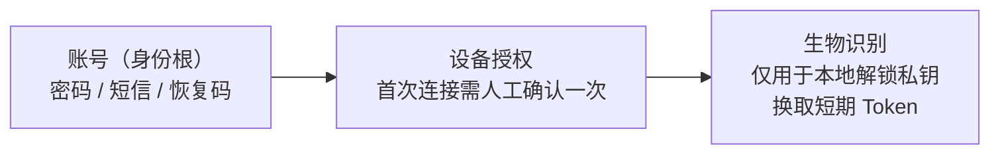

# 《个人消费级远程桌面需求规划》评审意见

- 评审对象：`docs/个人消费级远程桌面需求规划.md`
- 评审日期：2026-09-14
- 评审结论：**方向有亮点，但不具备立项条件** —— 当前文本属于「功能愿望清单」，尚不是「可交付、可排期的需求规划」。

---

## 0. 总体判断

| 维度 | 评价 |
|---|---|
| 方向与差异化 | ✅ 好。智能眼镜接入 + 鸿蒙深度优化是真差异点 |
| 完整性 | ❌ 被控端（Host）需求、成本模型、合规与防滥用 三块整块空白 |
| 一致性 | ❌ 存在 4 处硬性自相矛盾 |
| 可验证性 | ❌ 除延迟一个数字外，无任何量化指标，无法验收 |
| 可排期性 | ❌ 无优先级、无范围边界（Out of Scope）、无里程碑 |

**核心矛盾一句话**：定位是「个人消费级」，功能清单却是「企业级堆砌」；消费级真正的生死线（被控端体验、带宽成本、防滥用合规）反而全部缺失。

---

## 1. 硬伤：自相矛盾 / 逻辑不成立

### 1.1 【严重】性能目标与接入路径物理上互相打架

> 原文：`实现超低延迟（如低于15ms甚至3ms）`

| 场景 | 现实 RTT 量级 | 与 3ms 的差距 |
|---|---|---|
| 同局域网 | 1–5 ms | 可达 |
| 同城公网 | 20–40 ms | 差一个数量级 |
| 跨省 / 跨运营商 | 50–100 ms | 差两个数量级 |
| 蓝牙桥接眼镜 | 30–100 ms（蓝牙协议本身） | 差两个数量级 |
| Web 端（浏览器 JitterBuffer 保守） | 天然高于原生客户端 | 直接冲突 |

同一份文档里既承诺 3ms，又主推 Web 端直连、蓝牙桥接、Miracast 无线投屏 —— 后者**物理上不可能**达到前者。

**修改建议**
- 改为**分场景 SLA**：局域网 <10ms，同城 <40ms，跨地域 <100ms，蓝牙桥接 <150ms。
- 统一口径为「**端到端 P95 延迟**」（采集 → 编码 → 传输 → 解码 → 渲染），不是网络 RTT。二者常被混用，是最常见的验收扯皮点。
- 补充配套指标：帧率、分辨率档位、带宽占用、首帧时间（TTFF）、重连耗时、丢包恢复策略。

### 1.2 【严重】「端到端加密」的对外承诺与实际架构不符 🔴 **已确认**

> **决策（2026-09-14）**：中继节点**明文可见**。技术上做不到对服务器隐藏内容，因此**本产品不得对外宣称「端到端加密」**。

这是本次评审最需要**立刻改口**的一条，理由有三：

1. **法律风险**：架构上服务端可解密，宣传却称「端到端加密」⇒ 与实际情况不符且足以影响购买决策，构成**虚假广告**（《广告法》第二十八条）。
2. **技术表述错误**：原文 `采用 AES-256 等高强度加密算法保护链路安全` 混用了「链路加密」与「端到端加密」两个层级。AES-256 只是算法外壳，**密钥由谁生成、谁持有**才决定加密层级。
3. **表述内部冲突**：中继明文可见与「全链路操作日志」是自洽的；真正矛盾的是把二者与「端到端加密」写在**同一段**。

**正确的表述分层**

| 连接模式 | 加密性质 | 对外可宣称 |
|---|---|---|
| P2P 直连（打洞成功） | 真端到端加密，服务器不经手内容 | ✅ 可称「端到端加密」 |
| 中继转发（打洞失败） | **传输加密**（TLS 1.3 / DTLS），服务器可解密 | ✅ 「传输加密」　❌ 不可称 E2E |

**修改建议**
- 对外统一文案：**「全链路传输加密；P2P 直连时端到端加密」** —— 诚实，且不丢失卖点。
- 客户端**显示当前连接模式**（直连 / 中继）让用户知情，这也是竞品普遍缺失的体验点。
- 技术实现：握手 X25519/ECDH + 前向保密（PFS），会话 AEAD（AES-GCM 或 ChaCha20-Poly1305），密钥由 KDF 派生。
- **中继明文可见 ⇒ 必须新增内控要求**（强制项）：
  - 明文**不落盘**，仅内存转发；
  - 运维访问需**审批 + 全程审计**，防止内部人员偷看；
  - 明确日志留存期限与到期删除机制。
- 隐私政策**明示告知**：「为保障连接可用性，P2P 打洞失败时，您的数据将经服务器转发。」

### 1.3 【严重，且是安全漏洞】指纹章节信任链自相矛盾

> 原文 5.1：`在被控端手机上安装客户端后，用户只需通过手机指纹验证，即可自动生成一次性加密令牌`
> 原文 5.2：`绑定设备指纹（如硬件ID、TPM芯片标识等），实现客户端级别的自动信任…彻底告别密码输入流程`

| 问题 | 说明 |
|---|---|
| 主体写错 | 5.1 说的是「被控端手机」，但被控端主体应是电脑 |
| **把「设备识别」当成「身份认证」** | 硬件 ID / TPM 只能证明「这是同一台机器」，**不能证明「操作者是你」** |
| 后果 | 仅凭硬件绑定即免密登录 ⇒ **设备被偷 / 被转卖 = 账号直接失守**。这是漏洞，不能当卖点写 |

**正确的三层模型**

- 生物特征**永不离开设备**（TEE / Secure Enclave）。
- Token 应短期（分钟级）+ 可吊销，而非长期免密。
- 5.4 的方向是对的，**5.2 必须重写**。

### 1.4 【严重】路径 A / 路径 B 划分混乱，且路径 A 当前不可行

文档自述「当前智能眼镜算力与功能有限」，却把路径 A（眼镜直连、AI 眼镜直连 PC、语音操控 PPT）与路径 B 并列为「双路径都要做」—— **不可行路径不能与可交付路径并列进排期**。

**根本问题是「智能眼镜」未定义品类：**

| 品类 | 代表产品 | 本质 | 能否跑客户端 |
|---|---|---|---|
| 显示型（BB 光学） | Xreal / Rokid | 外接显示器 | ❌ 不能 |
| AI 型 | Ray-Ban Meta | 无显示能力 | ❌ 不能 |
| 一体机 | 暂无成熟消费级产品 | 独立 Android | ⚠️ 理论可行 |

- **路径 B（眼镜 = 外接显示 + 音频）对显示型眼镜成立** → 当前可交付。
- **路径 A 需要「一体机 + 开放系统 + 允许跑 SDK」** → 目前基本不存在，属长期愿景。
- 另：「USB Type-C 直连并切换电脑模式」**不是软件能单方面实现的**，依赖眼镜支持 **DP Alt Mode** + 手机支持桌面模式（三星 DeX / 华为 PC 模式）。必须标注硬件前提。

**修改建议**：路径 B = 可交付路径；路径 A = 长期愿景，标注触发条件，**不做工程承诺**。

---

## 2. 重大缺口（整块缺失的需求）

### 2.1 🔴 被控端（Host）需求几乎空白 —— 最大缺口

全文约 90% 是**控制端视角**。而消费级远控的投诉 TOP1 全部发生在被控端：

| 缺口 | 说明 |
|---|---|
| **无人值守** | 「公司电脑 → 家里电脑」「帮父母修电脑」是核心场景。被控端是否需要点「同意」？如何授权？ |
| **睡眠 / 唤醒** | 消费级电脑默认休眠 ⇒ 直接连不上。是否支持 Wake-on-LAN？软唤醒方案？ |
| **UAC 提权** | 远程时 Windows UAC 安全桌面弹窗无法被普通用户态进程点击。这是全行业经典难题，必须专门设计（安装为系统服务 + 提权代理进程） |
| **开机自启** | 服务态（开机即可连）与用户态（登录后可连）是两条独立链路，都要覆盖 |
| **多显示器** | 切换 / 扩展 / 镜像、分辨率与 DPI 自适应 |
| **硬件编码** | NVENC / Quick Sync / VideoToolbox / AMF。不做硬编，笔记本 CPU 直接被吃满，消费级不可接受 |
| **被控端资源占用** | 空闲内存占用、CPU 占用上限、静默升级 |
| **多用户 / 会话切换** | Windows 快速用户切换、锁屏态连接 |

> 这块不是「补充」，而是**产品的另外一半**。

### 2.2 🔴 成本模型缺失 —— 消费级的生死线

- **P2P 打洞成功率是多少？失败后走中继（TURN）的带宽费谁掏？** 中继带宽是这类产品的**第一大成本项**。
- 没有成本约束，就不敢承诺「免费 / 不限时」—— 商业上不成立。
- 缺失内容：免费额度、付费墙位置（并发数 / 时长 / 画质 / 商用授权）、单用户成本上限、打洞成功率目标。

**🔴 已确认（2026-09-14）：必须设定打洞成功率目标**。建议值如下，最终数值需实测后锁定：

| 阶段 | 目标 | 说明 |
|---|---|---|
| P0 上线 | **≥ 85%** | 移动网络 + 企业 NAT 环境下的实际值，属行业常见区间 |
| 优化后 | **≥ 92%** | 增加端口预测、多 STUN、UPnP / NAT-PMP、IPv6 通道等手段 |
| 监控要求 | 按 **NAT 类型 / 运营商 / 网络环境分桶统计** | 否则无法定位失败原因，也无法针对性优化 |

> **成本推算逻辑**：中继带宽消耗 ≈ `(1 − 打洞成功率) × 总会话时长`。
> 以 85% 为基准，成功率每提升 1 个百分点，中继成本同比下降约 **6.7%** —— 打洞成功率是**唯一能直接压缩第一大成本的杠杆**。

### 2.3 🔴 合规与资质（中国市场尤致命）

- 远控软件在国内需**强制实名认证**（ToDesk / 向日葵均如此），部分场景涉及**增值电信业务许可**。
- **防滥用机制是硬性要求**：被控端显式二次确认、反诈风险提示、异常连接拦截、异常行为风控。否则产品会被用于电信诈骗 ⇒ **应用商店下架 + 商誉毁灭**。当前文档零提及。
- 个保法：剪贴板内容是否上云？日志留存期限？需明示同意与最小化采集。
- **iOS 能力需标注清楚**：App Store 对远控类审核极严，iOS 通常**只能作为控制端**，作为被控端（控制手机屏幕）基本不可能。文档写「iPhone / Android 全平台互控」是**过度承诺**，应直接标注「iOS 作为被控端：不支持」。

### 2.4 🟠 差异化未论证

文档列出的能力 —— 账号体系、剪贴板、文件传输、隐私屏、权限管理、指纹登录 —— **竞品（向日葵 / ToDesk / AnyDesk / RustDesk / TeamViewer）全部已有**。真正独有的只有智能眼镜接入 + 鸿蒙深度优化。

**必须回答：用户凭什么从现有产品迁移过来？** 建议补一份对标表（功能 / 价格 / 延迟 / 差异点）。

### 2.5 🟠 认证与账号找回的兜底缺失

「指纹免密」与「忘记密码怎么办」天然对立。缺：账号找回路径（邮箱 / 短信 / 恢复码）、设备解绑、解绑上限与冷却期、换机流程、账号可绑定设备数量上限、账号被锁后的应急通道。

### 2.6 🟠 Web 端约束未写清

- 浏览器无法安装驱动 / 系统服务 ⇒ **Web 只能做控制端，不能做被控端**（除非用户手动授权屏幕捕获，且体验与能力受限）。
- 「临时借用电脑」场景下**强制登录账号本身有盗用风险**（共用电脑、密码被浏览器记住）。应支持**一次性授权码 / 临时码**模式，而非登录账号。
- 需写明：HTTPS 强制、iOS Safari 限制、屏幕捕获授权弹窗、剪贴板 API 权限限制。

### 2.7 🟡 其他缺失清单

- 文件传输（仅在「动态权限」里被顺带提过一次，无独立需求）
- **实时语音通话** —— 帮父母 / 同事排障时「边看边说」是刚需，竞品均有
- 远程打印
- 断网 / 弱网恢复策略、弱网自动降级（降分辨率 / 降帧率 / 降画质）
- 跨 NAT 类型兼容清单（对称型 NAT 处理）
- 安装包体积、内存占用、启动时间等消费级敏感指标
- 自动更新机制（灰度 / 回滚）

---

## 3. 结构与表述问题

| # | 位置 | 问题 |
|---|---|---|
| 1 | 第三部分 | **层级错乱**：标题是「智能眼镜与手机融合」，却把「手机独立远程连接（核心能力）」并列同级。手机独立使用与眼镜无关，应独立成章 |
| 2 | 一.1 vs 五.1 | **重复**：统一账号与指纹一键登录内容重叠 |
| 3 | 一.3 vs 二.1 | **重复**：Web 端 与 跨平台覆盖重叠 |
| 4 | 二.2 | **逻辑跳跃**：`双指缩放…解决手机远控时键盘遮挡输入框的痛点` —— 键盘遮挡输入框是本地输入法 / UI 问题，与远程画面手势无关。手机远控真正的键盘问题是「远程输入法与本地输入法不一致」以及「软键盘遮挡远程画面」 |
| 5 | 三.路径B.2 | **过度承诺**：`摘下眼镜…体验平滑过渡无感切换` —— 音频路由从眼镜切回手机扬声器存在 200–500ms 中断。应改为「自动切回，耗时 <1s」 |
| 6 | 全篇 | **缺章节**：竞品分析、用户画像与场景量化、北极星指标、**Out of Scope（不做什么）**、P0–P3 优先级、里程碑 |

---

## 4. 术语统一建议

| 术语 | 当前用法 | 建议统一为 |
|---|---|---|
| 延迟 | 「低于15ms甚至3ms」 | **端到端 P95 延迟**（采集→编码→传输→解码→渲染），并分场景给出 |
| 加密 | 「端到端加密」「AES-256 保护链路安全」 | **已确认中继明文可见 ⇒ 禁止宣称 E2E**；统一为「全链路传输加密；P2P 直连时端到端加密」 |
| 设备 | 被控端 / 控制端 / 主机 混用 | **被控端（Host）** / **控制端（Client）** |
| 智能眼镜 | 笼统称「智能眼镜」 | 按品类区分：**显示型 / AI 型 / 一体机** |
| 指纹登录 | 「一键登录」「无感认证」「免密」混用 | 区分 **快捷登录（本地解锁）** 与 **免密登录**，二者安全等级不同 |

---

## 5. 优先级重构建议（P0–P3）

> 当前文档是「愿望清单」，无法排期。建议按下表重新组织。

| 优先级 | 范围 |
|---|---|
| **P0（MVP，可发布）** | Win / Mac / Android ↔ Win / Mac 互控 · 账号体系 + 实名 · P2P 直连（目标 ≥85%）+ 中继兜底 · **被控端**无人值守 + UAC + 开机自启 + 休眠唤醒 · 硬件编码 · 剪贴板 · 文件传输 · Web 控制端（临时码，免登录） · 生物识别**快捷登录**（非免密） · **全链路传输加密 + 连接模式指示**（禁止宣称 E2E） · 防滥用（二次确认 + 风控） |
| **P1** | 鸿蒙专项优化 · 多显示器 · 隐私屏 · 权限细分 · 实时语音 · iOS 控制端 · 弱网降级 |
| **P2** | 智能眼镜**桥接**（路径 B，仅显示型眼镜） |
| **P3（愿景，不做工程承诺）** | 智能眼镜**直连**（路径 A，标注硬件前提与触发条件） |
| **明确不做** | iOS 被控 · Linux 服务器运维级能力 · 远程打印（除非有明确依据） |

---

## 6. 待办清单（可勾选）

### 6.1 必做：修掉矛盾

- [ ] 1.1 延迟目标改为分场景 SLA，口径统一为端到端 P95
- [x] 1.2 加密章节重写：~~中继可见性~~ **已确认明文可见** ⇒ 禁止宣称 E2E，改「传输加密 + 直连时 E2E」，并补中继内控要求（不落盘 / 审批审计 / 留存策略）
- [ ] 1.2b **全产品文案排查**：官网、应用商店简介、隐私政策、投放素材中的「端到端加密」字样全部替换（法律风险项，建议设为发版阻塞项）
- [ ] 1.3 重写 5.1/5.2：设备识别 ≠ 身份认证，改「快捷登录」表述
- [ ] 1.4 路径 A 降为长期愿景，标注硬件前提（DP Alt Mode / DeX）
- [ ] 1.4 明确智能眼镜品类定义（显示型 / AI 型 / 一体机）
- [ ] 3.4 修正「键盘遮挡输入框」的因果描述
- [ ] 3.5 修正「无感切换」为「自动切回，<1s」

### 6.2 必做：补关键缺口

- [ ] 2.1 新增「被控端需求」章节（无人值守 / UAC / 自启 / 唤醒 / 多显示器 / 硬编码 / 资源占用）
- [x] 2.1b 被控端资源占用已细化为独立章节：**v2 §3.7**（空闲态硬指标 / 会话中软指标 / 与用户争抢 / 资源档位 / 手机被控专项），并同步补 §5.2 五行指标与 §3.4 静止画面不得持续编码的红线
- [ ] 2.1c 🔴 **待实测回填**：被控端空闲态开销（任务管理器静置采样）与**手机被控 1h 息屏串流的耗电 / 温升 / 能否净充电** —— 后者直接决定获客钩子（差异化能力）是否成立（成本表 §10.1 #12 #13）
- [x] 2.1d 🔴 **主主张已定稿（D8）**：主战场 = 远程办公；主主张 = 「免费额度做到对手收费档位」；手机被控 = 获客钩子（非主主张）；已回写 v2 §0/§1/§3.6/§9.3、竞品表 §6/§7
- [ ] 2.2 新增「成本模型」章节（打洞成功率 → 中继带宽 → 单用户成本 → 免费额度 → 付费墙）
- [x] 2.2b 打洞成功率目标已定：**P0 ≥85%，优化后 ≥92%**，按 NAT 类型 / 运营商 / **网络环境**分桶统计（待实测锁定；分桶依据见 v2 §5.3）
- [ ] 2.3 新增「合规与安全」章节（实名 / 防滥用 / 反诈 / 个保法 / 日志留存）
- [ ] 2.3b 中继明文可见的配套义务：内控审计流程 + 隐私政策明示告知（「P2P 失败时数据经服务器转发」）
- [ ] 2.3 标注 iOS 作为被控端：不支持
- [ ] 2.4 新增「竞品对标表」，明确差异化论据
- [ ] 2.5 新增「账号生命周期」（找回 / 解绑 / 换机 / 设备上限）
- [ ] 2.6 明确 Web 端能力边界（仅控制端 + 临时码模式）
- [ ] 2.7 补充：实时语音 / 弱网降级 / 自动更新 / 跨 NAT 兼容 / 包体积指标

### 6.3 必做：结构重构

- [ ] 手机独立远控独立成章（从第三部分拆出）
- [ ] 消除重复（一.1 vs 五.1；一.3 vs 二.1）
- [ ] 新增「用户画像与核心场景」
- [ ] 新增「非功能指标表」
- [ ] 新增「Out of Scope」
- [ ] 全篇按 P0–P3 重排
- [ ] 统一术语（见第 4 节）

### 6.4 前置材料（缺了无法评估，建议先出）

- [ ] 竞品对标表（功能 / 价格 / 延迟 / 差异点）
- [ ] 成本模型测算表
- [ ] 非功能指标基线表

---

## 7. 已确认决策记录

| # | 决策项 | 结论 | 生效日期 |
|---|---|---|---|
| D1 | 中继是否可见明文 | **明文可见**（技术限制）⇒ **禁止对外宣称「端到端加密」**，改称「全链路传输加密；P2P 直连时端到端加密」 | 2026-09-14 |
| D2 | 是否设定打洞成功率目标 | **是**。目标：P0 ≥85%，优化后 ≥92%（按 NAT 类型 / 运营商分桶统计） | 2026-09-14 |
| D3 | ~~「手机为核心终端」~~ 的定位 | **修正**。手机不是「核心控制端」（控制端也可以是 PC；长时会话主力是 PC→PC）⇒ 正确定位：**PC 为被控主体，手机覆盖「PC 触达不到的时段」**（应急 / 触达 / 帮亲友）；~~对外主差异点改为「手机作为被控端」~~ ⇒ **被 D8 进一步修正**（手机被控只过差异化测试，不过权重测试） | 2026-09-14 |
| D4 | 手机端交互是否作为差异点 | **否**。移动端「不做桌面 UI 移植」是**及格线**，不写进宣传主张（交互可被对手 6–12 个月复制） | 2026-09-14 |
| D5 | 手机端「手持单屏」与「外接大屏」谁为主 | **手持单屏为主导路径**。理由：**身边无外接屏时，手机单屏是唯一可用的控制方式** ⇒ 它是**默认情况**，指标基线必须按它定；**外接显示器 / 电视为 P1 增强**（有则加分，无则不缺），**不当作差异点主张** | 2026-09-14 |
| D6 | 外接形态（外接显示器 + 键鼠）的权重 | **高**。在「手机能外接」与「不能外接」两种情况下**两者都做**（不是二选一）：不能接 ⇒ **手持必须保底可用**；能接 ⇒ **必须好用**。关键认识：**增量硬件仅为一块蓝牙键盘（~200 g）**（不是便携屏）⇒ 会话从**分钟级应急**跃升到**小时级轻办公** ⇒ **产生付费理由**。⚠️ **同时修正 v2 原排序**：外接**开发成本低（响应式布局，非新引擎）、ROI 最高，不应排最后**；手持交互引擎（新引擎）可**分期迭代** | 2026-09-14 |
| **D8** | **产品主战场与主主张到底是什么**（用户质疑：「手机应该是**控制端**吧？我们做的是远程控制电脑桌面吧？」） | 🔴 **质疑成立，且揭示一处方法错误**。**主战场 = 远程办公（远程控制电脑桌面）**：**PC→PC**（时长与收入主力）+ 手机 / 平板 →PC（碎片时段）。**主主张 = 商业条款**：「**免费额度做到对手收费档位**」（主战场内无技术护城河：D1 透明度弱于 RustDesk 自建 · D4 及格线 · D6 不可对外主张）。**手机作为被控端降为「差异化能力 + 获客钩子」**（⚠️ 非主主张）。⇐ **方法修正：主主张必须同时过两个测试**（**A 差异化**：对手 / PC 能不能做？**B 权重**：频次 × 付费意愿能否撑起收入？）—— D3 只验了 A。另：品类风险 —— 「远程桌面」在中文市场 ≈ 控制电脑，主打手机被控会被误认为手机远控软件。**P0 内手机被控降为第二优先级、不阻塞发版** | 2026-09-14 |

> ⚠️ **D6 的叙事边界（易被推错）**：外接形态**不得对外当主主张**（DP Alt Mode 非全线 + 依现场是否有屏）⇒ **对内高优先、对外只作能力说明**；
> 且**不能宣称「以后出差不用带笔记本」**（依赖现场有屏 + 网络能穿透 + 不热降频 三变量同时成立）⇒ 正确叙事是 **「应急与轻办公」**。

### D8 的连带影响（已回写 v2）

| 影响面 | 动作 | 位置 |
|---|---|---|
| 定位 | 新增「主战场」与「主主张」两行；「核心差异点」行改为「差异化能力」 | v2 §0 |
| 需求 | P0 内 Android 被控降为**第二优先级、不阻塞发版**（降级触发器仍为机型通过率 < 60%） | v2 §1 |
| 需求 | §3.6 标题由「🔴 主差异点」改为「🟡 差异化能力 · 获客钩子」 | v2 §3.6 |
| 论证 | 新增 D8 小节：**两个测试表** + 品类错位风险 + 修正后的定位层级表 + 钩子逻辑 | v2 §9.3 |
| 🔴 文案红线 | **禁止笼统写「免费不限量」** —— 免费的是**直连时长**，中继必须限额（极端用户单月中继 ¥34.8 > ToDesk 专业版整月收入）⇒ 正确表述「**直连不限时长**」 | 全部材料 |
| 🔴 文案红线 | **禁止把「手机被控」写成产品主卖点或品类定义**（品类 = 远程桌面 / 控制电脑桌面） | 全部材料 |
| ⚠️ 战略风险 | 主战场**无技术护城河** ⇒ 必须靠**商业条款**打，否则就是对手的功能子集 ⇒ 需尽快把免费额度模型定稿 | v2 §8 / 《成本测算表》§7 |

### D1 的连带影响（须一并处理）

| 影响面 | 动作 |
|---|---|
| 文案 | 官网 / 商店 / 隐私政策 / 投放素材全部排查，去除 E2E 表述 |
| 产品 | 客户端新增**连接模式指示**（直连 / 中继），让用户知情 |
| 内控 | 中继明文不落盘；运维访问审批 + 审计 |
| 合规 | 隐私政策明示「P2P 失败时数据经服务器转发」 |
| 竞品话术 | 在 §9 对标表中把「加密」从差异点降为**对齐项**（竞品同样无法宣称 E2E） |

### D2 的连带影响

| 影响面 | 动作 |
|---|---|
| 技术 | 打洞优化手段排期（多 STUN / 端口预测 / UPnP / IPv6） |
| 🔴 技术 `[新增]` | **中继必须支持 TCP / TLS 443** —— 封 UDP 的企业 / 酒店 / 校园 / 机场网络里打洞成功率 = **0%**，无 TCP 兜底则**完全不可用**（v2 §5.3） |
| 🔴 技术 `[新增]` | **多路径并行探路**（手机 Wi-Fi + 蜂窝）· **先中继秒连再静默升级直连**（保住首帧指标）· 探测总预算上限 + 退避（避免触发 IDS 或打挂客户路由器） |
| 数据 | 打点上报 NAT 类型、运营商、**网络环境（家庭 / 企业 / 酒店 / 移动 / 封 UDP）**、打洞结果，分桶看板 |
| 数据 `[新增]` | 🔴 **总体 85% 会把「酒店/企业网络 0～5%」与「家庭 90–95%」平均掉** ⇒ 总体值满足目标、体验却已在最关键场景崩盘。**看板必须先看分桶值，再看总体值**（v2 §5.3） |
| 商业 | 打洞成功率数据用于反推中继带宽预算与免费额度 |
| 商业 `[新增]` | 企业 / 酒店网络下中继占比 ≈100%（单次成本 ~10×）⇒ 建议**这类网络的中继不计免费额度或单独限额** `[待确认]` |

> 📌 **认知修正**：先前成本表曾写「酒店 / 家庭宽带打洞率通常更高」——**方向写反了**。
> 员工 / 访客网络才是**硬 NAT + 常封 UDP** 的重灾区，酒店 / 会议 / 客户现场恰恰是成功率最低处。已回写 成本表 §3.2。

### D3 的连带影响（已回写 v2）

| 影响面 | 动作 | 章节 |
|---|---|---|
| 定位 | 产品定位改为「PC 为被控主体 + 手机覆盖 PC 触达不到的时段」 | v2 §0 |
| 差异点 | 主差异点改为「手机作为被控端」；手机上「好用」降为及格线 | v2 §0 / §9 §9.3 |
| 需求 | `[新增]` **§3.6 移动端作为被控端**（免 Root / MediaProjection / 无障碍注入 / 息屏串流 / 远程输入法） | v2 §3.6 |
| 需求 | `[新增]` **§2.3 移动端交互原则**（不做桌面 UI 移植、可达性优先、首帧优先于画质） | v2 §2.3 |
| 指标 | 延迟与首帧时间**按控制端类型分档**（手机保成功率 + 首帧，不追高帧率） | v2 §5.1 / §5.2 |
| 范围 | Android 被控进 P0（**免 Root 基础版**），并预设降级触发器：机型通过率 <60% 则降 P1 | v2 §1 |
| 对外 | **措辞红线**：不得写「手机为核心控制端」；不得写「iOS 可作被控端」；不得暗示「无需任何设置」（免 Root 需人工授权） | 全部材料 |
| 竞品 | 移动被控是三家中**唯一有真实付费意愿**的空位（ToDesk 免费版禁用 / 专业版仅赠 1 台 / 免 Root 插件 ¥25 月） | `竞品对标表.md` §6.4 |

### D5 的连带影响（已回写 v2）

| 影响面 | 动作 | 章节 |
|---|---|---|
| 需求 | §2.3 重写为**两形态**：`2.3.1 手持单屏（主路径）` + `2.3.2 外接大屏（P1 增强）`；「不做桌面 UI 移植」**限定为手持形态** | v2 §2.3 |
| 需求 | 手持形态补 4 条硬要求：**焦点跟随**（软键盘不遮挡）、**局部放大镜**、**双模指针**、**纯观察模式** | v2 §2.3.1 |
| 诚实性 | 写入**手持形态物理天花板**（16px 字 ≈1.1 mm、40px 按钮 ≈2.7 mm）—— 与 D3 一致：不把它宣传成「能办公」 | v2 §2.3.1 |
| 指标 | §5.1 手机档**拆为两行**（手持按原基线、外接**按 PC 档位**）；§5.2 补可读性 / 可达性 / 大屏适配率 3 项 | v2 §5.1 / §5.2 |
| 范围 | 外接显示器 / 桌面模式适配 **从 P3 提升到 P1**（Android 16 起大屏取消方向与尺寸限制，不适配即被拉伸） | v2 §1 / §4.3 附注 |
| 成本 | 手持形态**不因省钱而下调码率**（小字先糊，恰好是手持最需要的）—— 改写为「实测最小可读字号后定」 | `成本测算表.md` §3.2 |
| 竞品 | `[需核实]` **对手是否对 DeX / 桌面模式做过专门适配** —— 决定外接大屏是「可主张」还是「及格线」 | `竞品对标表.md` §6 / §9 第 10 项 |
| 对外 | **措辞红线（追加）**：不得把「外接大屏」写成主路径；不得宣传无线投屏（Miracast 多一跳编码）；卖点措辞用「**接上现场那块屏**」而非「买块便携屏」 | 全部材料 |

### D6 的连带影响（已回写 v2）

| 影响面 | 动作 | 章节 |
|---|---|---|
| 需求 | §2.3.2 新增**三种硬件组合**（纯手持 / 键鼠+手机屏 / 大屏+键鼠），说明不是二选一 | v2 §2.3.2 |
| 定位 | 新增**手持 vs 外接四维对比**（覆盖率 / 会话时长 / 付费意愿 / 开发成本）⇒ 得出「外接不能当锦上添花」 | v2 §2.3.2 |
| 排期 | 🔴 **修正原「外接最后做」** ⇒ 正确排法：PC→PC ⇒ **外接适配（轻，先做）** ⇒ 手持交互引擎（重，分期） | v2 §2.3.2 |
| 风险 | 补三项：**USB-C 单口冲突**（接屏即占口，键鼠只能蓝牙）、**发热与耗电**（投屏+解码+收发同时跑）、**现场网络打洞率可能低于家庭** | v2 §2.3.2 |
| 成本 | 🔴 外接的真正成本含义**不是“码率变高”而是“时长量级变了”**（5–15 min → 小时级）⇒ 占比 >5% 必须单独建模；未知前**不得拿入预测** | `成本测算表.md` §3.2 / 10.1 #10 |
| 对外 | **叙事边界**：是「**应急与轻办公**」，不是「替代笔记本」；外接只作**能力说明**（DP Alt Mode 非全线） | 全部材料 |

---

## 8. 下一步

已同步产出重构版本：`docs/需求规划-v2-P0P3重构.md`（按 P0–P3 组织，标注了继承原文 / 新增 / 待确认）。
