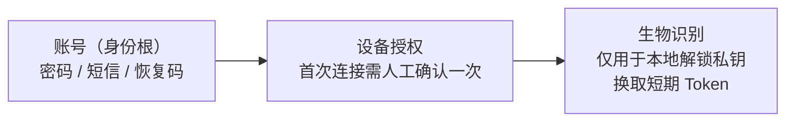

# 《个人消费级远程桌面需求规划》评审意见

- 评审对象：`docs/个人消费级远程桌面需求规划.md`
- 评审日期：2026-09-14
- 评审结论：**方向有亮点，但不具备立项条件** —— 当前文本属于「功能愿望清单」，尚不是「可交付、可排期的需求规划」。

---

## 0. 总体判断

| 维度 | 评价 |
|---|---|
| 方向与差异化 | ✅ 好。智能眼镜接入 + 鸿蒙深度优化是真差异点 |
| 完整性 | ❌ 被控端（Host）需求、成本模型、合规与防滥用 三块整块空白 |
| 一致性 | ❌ 存在 4 处硬性自相矛盾 |
| 可验证性 | ❌ 除延迟一个数字外，无任何量化指标，无法验收 |
| 可排期性 | ❌ 无优先级、无范围边界（Out of Scope）、无里程碑 |

**核心矛盾一句话**：定位是「个人消费级」，功能清单却是「企业级堆砌」；消费级真正的生死线（被控端体验、带宽成本、防滥用合规）反而全部缺失。

---

## 1. 硬伤：自相矛盾 / 逻辑不成立

### 1.1 【严重】性能目标与接入路径物理上互相打架

> 原文：`实现超低延迟（如低于15ms甚至3ms）`

| 场景 | 现实 RTT 量级 | 与 3ms 的差距 |
|---|---|---|
| 同局域网 | 1–5 ms | 可达 |
| 同城公网 | 20–40 ms | 差一个数量级 |
| 跨省 / 跨运营商 | 50–100 ms | 差两个数量级 |
| 蓝牙桥接眼镜 | 30–100 ms（蓝牙协议本身） | 差两个数量级 |
| Web 端（浏览器 JitterBuffer 保守） | 天然高于原生客户端 | 直接冲突 |

同一份文档里既承诺 3ms，又主推 Web 端直连、蓝牙桥接、Miracast 无线投屏 —— 后者**物理上不可能**达到前者。

**修改建议**
- 改为**分场景 SLA**：局域网 <10ms，同城 <40ms，跨地域 <100ms，蓝牙桥接 <150ms。
- 统一口径为「**端到端 P95 延迟**」（采集 → 编码 → 传输 → 解码 → 渲染），不是网络 RTT。二者常被混用，是最常见的验收扯皮点。
- 补充配套指标：帧率、分辨率档位、带宽占用、首帧时间（TTFF）、重连耗时、丢包恢复策略。

### 1.2 【严重】「端到端加密」的对外承诺与实际架构不符 🔴 **已确认**

> **决策（2026-09-14）**：中继节点**明文可见**。技术上做不到对服务器隐藏内容，因此**本产品不得对外宣称「端到端加密」**。

这是本次评审最需要**立刻改口**的一条，理由有三：

1. **法律风险**：架构上服务端可解密，宣传却称「端到端加密」⇒ 与实际情况不符且足以影响购买决策，构成**虚假广告**（《广告法》第二十八条）。
2. **技术表述错误**：原文 `采用 AES-256 等高强度加密算法保护链路安全` 混用了「链路加密」与「端到端加密」两个层级。AES-256 只是算法外壳，**密钥由谁生成、谁持有**才决定加密层级。
3. **表述内部冲突**：中继明文可见与「全链路操作日志」是自洽的；真正矛盾的是把二者与「端到端加密」写在**同一段**。

**正确的表述分层**

| 连接模式 | 加密性质 | 对外可宣称 |
|---|---|---|
| P2P 直连（打洞成功） | 真端到端加密，服务器不经手内容 | ✅ 可称「端到端加密」 |
| 中继转发（打洞失败） | **传输加密**（TLS 1.3 / DTLS），服务器可解密 | ✅ 「传输加密」　❌ 不可称 E2E |

**修改建议**
- 对外统一文案：**「全链路传输加密；P2P 直连时端到端加密」** —— 诚实，且不丢失卖点。
- 客户端**显示当前连接模式**（直连 / 中继）让用户知情，这也是竞品普遍缺失的体验点。
- 技术实现：握手 X25519/ECDH + 前向保密（PFS），会话 AEAD（AES-GCM 或 ChaCha20-Poly1305），密钥由 KDF 派生。
- **中继明文可见 ⇒ 必须新增内控要求**（强制项）：
  - 明文**不落盘**，仅内存转发；
  - 运维访问需**审批 + 全程审计**，防止内部人员偷看；
  - 明确日志留存期限与到期删除机制。
- 隐私政策**明示告知**：「为保障连接可用性，P2P 打洞失败时，您的数据将经服务器转发。」

### 1.3 【严重，且是安全漏洞】指纹章节信任链自相矛盾

> 原文 5.1：`在被控端手机上安装客户端后，用户只需通过手机指纹验证，即可自动生成一次性加密令牌`
> 原文 5.2：`绑定设备指纹（如硬件ID、TPM芯片标识等），实现客户端级别的自动信任…彻底告别密码输入流程`

| 问题 | 说明 |
|---|---|
| 主体写错 | 5.1 说的是「被控端手机」，但被控端主体应是电脑 |
| **把「设备识别」当成「身份认证」** | 硬件 ID / TPM 只能证明「这是同一台机器」，**不能证明「操作者是你」** |
| 后果 | 仅凭硬件绑定即免密登录 ⇒ **设备被偷 / 被转卖 = 账号直接失守**。这是漏洞，不能当卖点写 |

**正确的三层模型**

- 生物特征**永不离开设备**（TEE / Secure Enclave）。
- Token 应短期（分钟级）+ 可吊销，而非长期免密。
- 5.4 的方向是对的，**5.2 必须重写**。

### 1.4 【严重】路径 A / 路径 B 划分混乱，且路径 A 当前不可行

文档自述「当前智能眼镜算力与功能有限」，却把路径 A（眼镜直连、AI 眼镜直连 PC、语音操控 PPT）与路径 B 并列为「双路径都要做」—— **不可行路径不能与可交付路径并列进排期**。

**根本问题是「智能眼镜」未定义品类：**

| 品类 | 代表产品 | 本质 | 能否跑客户端 |
|---|---|---|---|
| 显示型（BB 光学） | Xreal / Rokid | 外接显示器 | ❌ 不能 |
| AI 型 | Ray-Ban Meta | 无显示能力 | ❌ 不能 |
| 一体机 | 暂无成熟消费级产品 | 独立 Android | ⚠️ 理论可行 |

- **路径 B（眼镜 = 外接显示 + 音频）对显示型眼镜成立** → 当前可交付。
- **路径 A 需要「一体机 + 开放系统 + 允许跑 SDK」** → 目前基本不存在，属长期愿景。
- 另：「USB Type-C 直连并切换电脑模式」**不是软件能单方面实现的**，依赖眼镜支持 **DP Alt Mode** + 手机支持桌面模式（三星 DeX / 华为 PC 模式）。必须标注硬件前提。

**修改建议**：路径 B = 可交付路径；路径 A = 长期愿景，标注触发条件，**不做工程承诺**。

---

## 2. 重大缺口（整块缺失的需求）

### 2.1 🔴 被控端（Host）需求几乎空白 —— 最大缺口

全文约 90% 是**控制端视角**。而消费级远控的投诉 TOP1 全部发生在被控端：

| 缺口 | 说明 |
|---|---|
| **无人值守** | 「公司电脑 → 家里电脑」「帮父母修电脑」是核心场景。被控端是否需要点「同意」？如何授权？ |
| **睡眠 / 唤醒** | 消费级电脑默认休眠 ⇒ 直接连不上。是否支持 Wake-on-LAN？软唤醒方案？ |
| **UAC 提权** | 远程时 Windows UAC 安全桌面弹窗无法被普通用户态进程点击。这是全行业经典难题，必须专门设计（安装为系统服务 + 提权代理进程） |
| **开机自启** | 服务态（开机即可连）与用户态（登录后可连）是两条独立链路，都要覆盖 |
| **多显示器** | 切换 / 扩展 / 镜像、分辨率与 DPI 自适应 |
| **硬件编码** | NVENC / Quick Sync / VideoToolbox / AMF。不做硬编，笔记本 CPU 直接被吃满，消费级不可接受 |
| **被控端资源占用** | 空闲内存占用、CPU 占用上限、静默升级 |
| **多用户 / 会话切换** | Windows 快速用户切换、锁屏态连接 |

> 这块不是「补充」，而是**产品的另外一半**。

### 2.2 🔴 成本模型缺失 —— 消费级的生死线

- **P2P 打洞成功率是多少？失败后走中继（TURN）的带宽费谁掏？** 中继带宽是这类产品的**第一大成本项**。
- 没有成本约束，就不敢承诺「免费 / 不限时」—— 商业上不成立。
- 缺失内容：免费额度、付费墙位置（并发数 / 时长 / 画质 / 商用授权）、单用户成本上限、打洞成功率目标。

**🔴 已确认（2026-09-14）：必须设定打洞成功率目标**。建议值如下，最终数值需实测后锁定：

| 阶段 | 目标 | 说明 |
|---|---|---|
| P0 上线 | **≥ 85%** | 移动网络 + 企业 NAT 环境下的实际值，属行业常见区间 |
| 优化后 | **≥ 92%** | 增加端口预测、多 STUN、UPnP / NAT-PMP、IPv6 通道等手段 |
| 监控要求 | 按 **NAT 类型 / 运营商 / 网络环境分桶统计** | 否则无法定位失败原因，也无法针对性优化 |

> **成本推算逻辑**：中继带宽消耗 ≈ `(1 − 打洞成功率) × 总会话时长`。
> 以 85% 为基准，成功率每提升 1 个百分点，中继成本同比下降约 **6.7%** —— 打洞成功率是**唯一能直接压缩第一大成本的杠杆**。

### 2.3 🔴 合规与资质（中国市场尤致命）

- 远控软件在国内需**强制实名认证**（ToDesk / 向日葵均如此），部分场景涉及**增值电信业务许可**。
- **防滥用机制是硬性要求**：被控端显式二次确认、反诈风险提示、异常连接拦截、异常行为风控。否则产品会被用于电信诈骗 ⇒ **应用商店下架 + 商誉毁灭**。当前文档零提及。
- 个保法：剪贴板内容是否上云？日志留存期限？需明示同意与最小化采集。
- **iOS 能力需标注清楚**：App Store 对远控类审核极严，iOS 通常**只能作为控制端**，作为被控端（控制手机屏幕）基本不可能。文档写「iPhone / Android 全平台互控」是**过度承诺**，应直接标注「iOS 作为被控端：不支持」。

### 2.4 🟠 差异化未论证

文档列出的能力 —— 账号体系、剪贴板、文件传输、隐私屏、权限管理、指纹登录 —— **竞品（向日葵 / ToDesk / AnyDesk / RustDesk / TeamViewer）全部已有**。真正独有的只有智能眼镜接入 + 鸿蒙深度优化。

**必须回答：用户凭什么从现有产品迁移过来？** 建议补一份对标表（功能 / 价格 / 延迟 / 差异点）。

### 2.5 🟠 认证与账号找回的兜底缺失

「指纹免密」与「忘记密码怎么办」天然对立。缺：账号找回路径（邮箱 / 短信 / 恢复码）、设备解绑、解绑上限与冷却期、换机流程、账号可绑定设备数量上限、账号被锁后的应急通道。

> ✅ **已完成（2026-09-14）**：见 **`账号与管理系统设计.md`** §2（含本节漏写的**账号注销**）。
> 🔴 该文补了三个 §2.5 未预见的点：① **「解绑」必须拆成两种语义**（取消授权 vs 移除设备，混用会造成隐私事故）② **换机是隐私事故高发场景** ⇒ 需「一键解绑全部」+ 90 天授权复核 ③ **账号注销 ≠ 取消订阅**。

#### 2.5a ✅ 已拍板（2026-09-14，登记为 **D12**）

| 项 | 已拍板结果 |
|---|---|
| **D12-1** 个人版设备数上限 | **与免费版一致 = 100 台** ⇒ 🔴 不作付费权益，在权益对比表里写成「免费版优势行」 |
| **D12-2** 解绑冷却期 + 授权复核 | **解绑后 7 天内重绑需双重验证** + **90 天未连接自动降级为「需重新确认」** |
| **D12-3** 实名时机 | **延迟实名**（不触发风控 / 不用中继额度 / 不跨账号连接前不要求） |
| **D12-4** 账号注销冷静期 | **30 天软删除**（可登录撤销） |
| **D12-5** 大额复核阈值 | **单次补偿 > 免费额度 10 倍需第二人复核** |
| **D12-6** P0 运营工具形态 | **自研极小操作台（3 查 + 3 动作）+ 退款 / 看板复用现成工具**；❗**P0 不造后台** |

> 🔴 **D12 的三个核心判断**：① **P0 的「管理模块」不是后台**，是 **3 查（用户 / 额度与计量明细 / 订单）+ 3 动作（调额度补偿 · 封禁解封加白 · 人工退款跳渠道后台）** ② **后台是已拍板政策的执行体** —— 无加白工具则 §9.3「家庭互助」是空文，无补偿工具则 §5.6 是空文 ③ 涉及资金与权限的操作**必须走工具 + 留审计，不得直接改库**。
> ⚠️ **边界**：本节说的是**我们自己的运营后台**，**不等于**「给企业客户的管理后台」（后者已由 v2 §7 明确不做）。

### 2.6 🟠 Web 端约束未写清

- 浏览器无法安装驱动 / 系统服务 ⇒ **Web 只能做控制端，不能做被控端**（除非用户手动授权屏幕捕获，且体验与能力受限）。
- 「临时借用电脑」场景下**强制登录账号本身有盗用风险**（共用电脑、密码被浏览器记住）。应支持**一次性授权码 / 临时码**模式，而非登录账号。
- 需写明：HTTPS 强制、iOS Safari 限制、屏幕捕获授权弹窗、剪贴板 API 权限限制。

### 2.7 🟡 其他缺失清单

- 文件传输（仅在「动态权限」里被顺带提过一次，无独立需求）
- **实时语音通话** —— 帮父母 / 同事排障时「边看边说」是刚需，竞品均有
- 远程打印
- 断网 / 弱网恢复策略、弱网自动降级（降分辨率 / 降帧率 / 降画质）
- 跨 NAT 类型兼容清单（对称型 NAT 处理）
- 安装包体积、内存占用、启动时间等消费级敏感指标
- 自动更新机制（灰度 / 回滚）

---

## 3. 结构与表述问题

| # | 位置 | 问题 |
|---|---|---|
| 1 | 第三部分 | **层级错乱**：标题是「智能眼镜与手机融合」，却把「手机独立远程连接（核心能力）」并列同级。手机独立使用与眼镜无关，应独立成章 |
| 2 | 一.1 vs 五.1 | **重复**：统一账号与指纹一键登录内容重叠 |
| 3 | 一.3 vs 二.1 | **重复**：Web 端 与 跨平台覆盖重叠 |
| 4 | 二.2 | **逻辑跳跃**：`双指缩放…解决手机远控时键盘遮挡输入框的痛点` —— 键盘遮挡输入框是本地输入法 / UI 问题，与远程画面手势无关。手机远控真正的键盘问题是「远程输入法与本地输入法不一致」以及「软键盘遮挡远程画面」 |
| 5 | 三.路径B.2 | **过度承诺**：`摘下眼镜…体验平滑过渡无感切换` —— 音频路由从眼镜切回手机扬声器存在 200–500ms 中断。应改为「自动切回，耗时 <1s」 |
| 6 | 全篇 | **缺章节**：竞品分析、用户画像与场景量化、北极星指标、**Out of Scope（不做什么）**、P0–P3 优先级、里程碑 |

---

## 4. 术语统一建议

| 术语 | 当前用法 | 建议统一为 |
|---|---|---|
| 延迟 | 「低于15ms甚至3ms」 | **端到端 P95 延迟**（采集→编码→传输→解码→渲染），并分场景给出 |
| 加密 | 「端到端加密」「AES-256 保护链路安全」 | **已确认中继明文可见 ⇒ 禁止宣称 E2E**；统一为「全链路传输加密；P2P 直连时端到端加密」 |
| 设备 | 被控端 / 控制端 / 主机 混用 | **被控端（Host）** / **控制端（Client）** |
| 智能眼镜 | 笼统称「智能眼镜」 | 按品类区分：**显示型 / AI 型 / 一体机** |
| 指纹登录 | 「一键登录」「无感认证」「免密」混用 | 区分 **快捷登录（本地解锁）** 与 **免密登录**，二者安全等级不同 |

---

## 5. 优先级重构建议（P0–P3）

> 当前文档是「愿望清单」，无法排期。建议按下表重新组织。

| 优先级 | 范围 |
|---|---|
| **P0（MVP，可发布）** | Win / Mac / Android ↔ Win / Mac 互控 · 账号体系 + 实名 · P2P 直连（目标 ≥85%）+ 中继兜底 · **被控端**无人值守 + UAC + 开机自启 + 休眠唤醒 · 硬件编码 · 剪贴板 · 文件传输 · Web 控制端（临时码，免登录） · 生物识别**快捷登录**（非免密） · **全链路传输加密 + 连接模式指示**（禁止宣称 E2E） · 防滥用（二次确认 + 风控） |
| **P1** | 鸿蒙专项优化 · 多显示器 · 隐私屏 · 权限细分 · 实时语音 · iOS 控制端 · 弱网降级 |
| **P2** | 智能眼镜**桥接**（路径 B，仅显示型眼镜） |
| **P3（愿景，不做工程承诺）** | 智能眼镜**直连**（路径 A，标注硬件前提与触发条件） |
| **明确不做** | iOS 被控 · Linux 服务器运维级能力 · 远程打印（除非有明确依据） |

---

## 6. 待办清单（可勾选）

### 6.1 必做：修掉矛盾

- [ ] 1.1 延迟目标改为分场景 SLA，口径统一为端到端 P95
- [x] 1.2 加密章节重写：~~中继可见性~~ **已确认明文可见** ⇒ 禁止宣称 E2E，改「传输加密 + 直连时 E2E」，并补中继内控要求（不落盘 / 审批审计 / 留存策略）
- [ ] 1.2b **全产品文案排查**：官网、应用商店简介、隐私政策、投放素材中的「端到端加密」字样全部替换（法律风险项，建议设为发版阻塞项）
- [ ] 1.3 重写 5.1/5.2：设备识别 ≠ 身份认证，改「快捷登录」表述
- [ ] 1.4 路径 A 降为长期愿景，标注硬件前提（DP Alt Mode / DeX）
- [ ] 1.4 明确智能眼镜品类定义（显示型 / AI 型 / 一体机）
- [ ] 3.4 修正「键盘遮挡输入框」的因果描述
- [ ] 3.5 修正「无感切换」为「自动切回，<1s」

### 6.2 必做：补关键缺口

- [ ] 2.1 新增「被控端需求」章节（无人值守 / UAC / 自启 / 唤醒 / 多显示器 / 硬编码 / 资源占用）
- [x] 2.1b 被控端资源占用已细化为独立章节：**v2 §3.7**（空闲态硬指标 / 会话中软指标 / 与用户争抢 / 资源档位 / 手机被控专项），并同步补 §5.2 五行指标与 §3.4 静止画面不得持续编码的红线
- [ ] 2.1c 🔴 **待实测回填**：被控端空闲态开销（任务管理器静置采样）与**手机被控 1h 息屏串流的耗电 / 温升 / 能否净充电** —— 后者直接决定获客钩子（差异化能力）是否成立（成本表 §10.1 #12 #13）
- [x] 2.1d 🔴 **主主张已定稿（D8）**：主战场 = 远程办公；主主张 = 「免费额度做到对手收费档位」；手机被控 = 获客钩子（非主主张）；已回写 v2 §0/§1/§3.6/§9.3、竞品表 §6/§7
- [ ] 2.2 新增「成本模型」章节（打洞成功率 → 中继带宽 → 单用户成本 → 免费额度 → 付费墙）
- [x] 2.2b 打洞成功率目标已定：**P0 ≥85%，优化后 ≥92%**，按 NAT 类型 / 运营商 / **网络环境**分桶统计（待实测锁定；分桶依据见 v2 §5.3）
- [ ] 2.3 新增「合规与安全」章节（实名 / 防滥用 / 反诈 / 个保法 / 日志留存）
- [ ] 2.3b 中继明文可见的配套义务：内控审计流程 + 隐私政策明示告知（「P2P 失败时数据经服务器转发」）
- [ ] 2.3 标注 iOS 作为被控端：不支持
- [ ] 2.4 新增「竞品对标表」，明确差异化论据
- [x] 2.4b 🔴 **竞品 DeX / 桌面模式适配已核实（2026-09-14）**：**无一家做「自动桌面化布局」**（TeamViewer **官方**称 DeX 只支持单向、被控端在 DeX 内是 feature request；RustDesk #14704 输入完全无法注入；ToDesk 仅手动横屏）⇒ 外接大屏由「⚠️ 待定」升为**次级差异点**，⚠️ 但 **D6 裁决不变不得当主主张**，且 Android 16（API 37）会逼对手跟进 ⇒ **窗口期 1–2 年**。详见 `竞品对标表.md` **§6.5** 与本文件下方「待核实项核实记录」
- [x] 2.4c 🔴 **控制端画面显示红线已定（D9，2026-09-14）**：**不得默认全屏** + **不得非等比拉伸**（等比缩放 + 黑边填充，**比例失真 = 0**）+ 不得擅自改被控端分辨率 / DPI —— 已新增 v2 **§2.4**，§0 / §1 / §5.2 同步
- [x] 2.4d 🔴 **PC→手机 已从 P2 提到 P0（D10，2026-09-14）**：「电脑帮父母看手机」是获客钩子的**主力方向**，且增量成本≈0（PC 控制端与 Android 被控端本就在 P0）⇒ v2 §1 / §9.3 / §3.6 / §5.2 同步；⚠️ **仍属钩子、非主主张**
- [x] 2.4e 🔴 **商业化与计费设计已出（2026-09-14）**：新增 **`docs/商业化与计费设计.md`** —— 回答「怎么收钱 + 技术上怎么控」。🔴 **三个关键结论**：① **付费墙只能挂中继**（直连技术上不可估量 ⇒ 与成本结论天然重合）② **内部计量用 GB、对外展示用分钟**（否则高画质用户静默击穿成本）③ **计费裁决必须在服务端**（客户端只能展示）。✅ **D11 已拍板（2026-09-14）**：5 项全部确认 ⇒ 免费版中继 **2 GB/月** · iOS **走 IAP** · 个人版 **¥158/年** · 流量包 **P1 再上** · 额度耗尽**允许「仅查看」**
- [x] 2.5 新增「账号生命周期」（找回 / 解绑 / 换机 / 设备上限）—— ✅ **已完成（2026-09-14）**：见 `账号与管理系统设计.md`（含注销 / 运营后台 / 个人中心三块），**已拍板 D12-1 ~ D12-6**（见 §2.5a）
- [ ] 2.6 明确 Web 端能力边界（仅控制端 + 临时码模式）
- [ ] 2.7 补充：实时语音 / 弱网降级 / 自动更新 / 跨 NAT 兼容 / 包体积指标

### 6.3 必做：结构重构

- [ ] 手机独立远控独立成章（从第三部分拆出）
- [ ] 消除重复（一.1 vs 五.1；一.3 vs 二.1）
- [ ] 新增「用户画像与核心场景」
- [ ] 新增「非功能指标表」
- [ ] 新增「Out of Scope」
- [ ] 全篇按 P0–P3 重排
- [ ] 统一术语（见第 4 节）

### 6.4 前置材料（缺了无法评估，建议先出）

- [ ] 竞品对标表（功能 / 价格 / 延迟 / 差异点）
- [ ] 成本模型测算表
- [ ] 非功能指标基线表

---

## 7. 已确认决策记录

| # | 决策项 | 结论 | 生效日期 |
|---|---|---|---|
| D1 | 中继是否可见明文 | **明文可见**（技术限制）⇒ **禁止对外宣称「端到端加密」**，改称「全链路传输加密；P2P 直连时端到端加密」 | 2026-09-14 |
| D2 | 是否设定打洞成功率目标 | **是**。目标：P0 ≥85%，优化后 ≥92%（按 NAT 类型 / 运营商分桶统计） | 2026-09-14 |
| D3 | ~~「手机为核心终端」~~ 的定位 | **修正**。手机不是「核心控制端」（控制端也可以是 PC；长时会话主力是 PC→PC）⇒ 正确定位：**PC 为被控主体，手机覆盖「PC 触达不到的时段」**（应急 / 触达 / 帮亲友）；~~对外主差异点改为「手机作为被控端」~~ ⇒ **被 D8 进一步修正**（手机被控只过差异化测试，不过权重测试） | 2026-09-14 |
| D4 | 手机端交互是否作为差异点 | **否**。移动端「不做桌面 UI 移植」是**及格线**，不写进宣传主张（交互可被对手 6–12 个月复制） | 2026-09-14 |
| D5 | 手机端「手持单屏」与「外接大屏」谁为主 | **手持单屏为主导路径**。理由：**身边无外接屏时，手机单屏是唯一可用的控制方式** ⇒ 它是**默认情况**，指标基线必须按它定；**外接显示器 / 电视为 P1 增强**（有则加分，无则不缺），**不当作差异点主张** | 2026-09-14 |
| D6 | 外接形态（外接显示器 + 键鼠）的权重 | **高**。在「手机能外接」与「不能外接」两种情况下**两者都做**（不是二选一）：不能接 ⇒ **手持必须保底可用**；能接 ⇒ **必须好用**。关键认识：**增量硬件仅为一块蓝牙键盘（~200 g）**（不是便携屏）⇒ 会话从**分钟级应急**跃升到**小时级轻办公** ⇒ **产生付费理由**。⚠️ **同时修正 v2 原排序**：外接**开发成本低（响应式布局，非新引擎）、ROI 最高，不应排最后**；手持交互引擎（新引擎）可**分期迭代** | 2026-09-14 |
| **D8** | **产品主战场与主主张到底是什么**（用户质疑：「手机应该是**控制端**吧？我们做的是远程控制电脑桌面吧？」） | 🔴 **质疑成立，且揭示一处方法错误**。**主战场 = 远程办公（远程控制电脑桌面）**：**PC→PC**（时长与收入主力）+ 手机 / 平板 →PC（碎片时段）。**主主张 = 商业条款**：「**免费额度做到对手收费档位**」（主战场内无技术护城河：D1 透明度弱于 RustDesk 自建 · D4 及格线 · D6 不可对外主张）。**手机作为被控端降为「差异化能力 + 获客钩子」**（⚠️ 非主主张）。⇐ **方法修正：主主张必须同时过两个测试**（**A 差异化**：对手 / PC 能不能做？**B 权重**：频次 × 付费意愿能否撑起收入？）—— D3 只验了 A。另：品类风险 —— 「远程桌面」在中文市场 ≈ 控制电脑，主打手机被控会被误认为手机远控软件。**P0 内手机被控降为第二优先级、不阻塞发版** | 2026-09-14 |
| **D9** | **控制端画面是否可以默认全屏 / 是否允许非等比拉伸**（用户要求：「电脑远程连接电脑，**不应该全屏或者让屏幕变形**」） | 🔴 **两层都要禁**。① **不得默认全屏** —— 连接后默认**窗口化自适应**，全屏仅由用户显式触发，退出全屏须恢复进入前的窗口尺寸与位置，断线重连不得改变全屏状态（理由：会毁掉「左边看远方桌面、右边做本地事」这一高频工作方式）。② **不得非等比拉伸** —— **必须等比缩放 + 黑边填充**（letterbox / pillarbox），**比例失真 = 0**（误差 < 0.5%）；非等比只在用户**主动**选择「拉伸铺满」时才允许且须标注会变形（理由：文字 / 图形失真 + 用户**误判远端控件位置与真实布局** ⇒ **工具可信度**问题，不是审美问题）。③ **不得擅自改被控端分辨率 / DPI 来「凑」窗口**（会打乱被控端用户的图标位置与布局，须经其同意且会话结束恢复原状）。补三种缩放模式（适应窗口 / 原始 1:1 / 拉伸铺满，默认适应窗口）与三个边界情况（竖屏窄条 / 超宽屏 / 高 DPI） | 2026-09-14 |
| **D10** | **「电脑帮父母看手机」= PC→手机 的优先级** | 🔴 **从 P2 提升到 P0，与 Android 被控端同批交付**。理由：① **增量成本≈0** —— PC 控制端与 Android 被控端本来都在 P0，PC→手机只是两者的**交叉**（被控端能力与控制端能力全部复用）② **否则钩子断在最有效路径上** —— D8 把手机被控定为「获客钩子」，前提是**子女这一端连得上**；而帮父母排障时**子女更可能用电脑**（大屏看清对方在点哪里 + 键盘打字快 + 可边查边做），排到 P2 等于把钩子的主力方向推迟两个版本 ③ §9.3 原「PC→手机 = 少见」写在 **D8 之前**，当时语境是「手机被控 = 主差异点」，现已过时（钩子成立**不依赖控制端形态**）。⚠️ **不因此升级对外主张** —— 仍属**获客钩子**，**非主主张**，D8 文案红线不变 | 2026-09-14 |
| **D11** | **商业化与计费设计：怎么收钱 + 技术上怎么控** | 🔴 **三个已确定的原则**：① **付费墙只能挂中继** —— 直连技术上**不可估量**（不经我方服务器）⇒ **「直连不限时长」是技术事实不是策略顾让**，且**直连侧不做任何计量埋点**（否则 D1 透明度资产会变成「你们在监控我」的负债）② **内部计量用 GB、对外展示用分钟**（按时长限额会被 2K60 用户静默击穿：同额度消耗、成本 **8 倍**）③ **计量裁决必须在服务端**（客户端计时可被改系统时间/篘改绕过；信令服务器测不到实际流量）。**另有 3 条机制红线**：④ 🔴 **额度必须能「中途被收走」**（短周期 ticket 续期 + 30s 计量心跳）—— 否则「用 1 分钟额度建立会话再挂 10 小时」⑤ 🔴 **额度耗尽四级降级**（预警 → 转直连 → 降码率 → 仅查看 → 才终止；**禁止直接黑屏断连、禁止静默降码率**）⑥ 🔴 **风控不得误伤「帮爸妈调手机」**（低频+异地+新设备 与「多账号薅额度」特征高度重叠 —— 否则风控会杀死唯一的获客钩子）。**已拍板 5 项**：**D11-1** 免费版中继 **2 GB/月**（⚠️ 待 TURN 报价重算）· **D11-2** iOS **走 IAP**（且**不上浮定价**）· **D11-3** 个人版 **¥158/年**（= ToDesk 同档，不得更高）· **D11-4** 消耗型流量包 **P1 再上**（P0 只做订阅 + 免费额度）· **D11-5** 额度耗尽**允许「仅查看」** | 2026-09-14 |
| **D12** | **账号与管理系统（运营后台 + 账号生命周期 + 个人中心）** | 🔑 **核心判断：P0 的「管理模块」不是后台，是 3 查 + 3 动作**（查用户 / 查额度与计量明细 / 查订单；调额度补偿 · 封禁解封加白 · 人工退款跳渠道后台）—— **完整后台是 P1，不一开始就造后台**。🔴 **两条铁律**：① 涉及资金与账号权限的操作**必须走工具 + 留审计，不得直接改库** ② **后台是已拍板政策的执行体**（D11 七天可退 / §5.6 主动补偿 / **§9.3 家庭互助白名单** —— 无工具则政策即空文）。🔴 **B（账号生命周期）优先级高于 A（后台）**：看不了后台只是我们难受，**解不了绑是用户用不了**。🔴 **两个最易错处**：① **「解绑」必须拆两种语义**（取消授权 vs 移除设备）否则旧机主仍可被连 ② **被控端必须一次点击断开且不得挽留**（隐私主体）。⚠️ 边界：**「我们的运营后台」≠「给企业客户的管理后台」**（v2 §7 排除的是后者）。**已拍板 6 项**：**D12-1** 个人版设备数 = 免费版 = **100 台**（不作付费权益）· **D12-2** 解绑后 7 天重绑需双验 + **90 天**未连接自动降级 · **D12-3** **延迟实名** · **D12-4** 注销 **30 天软删除** · **D12-5** 单次补偿 > 免费额度 10 倍需复签 · **D12-6** P0 只自研极小操作台 | 2026-09-14 |
| **D13** | **是否新增独立的「营销 / 增长模块」**（用户：「是否要增加一个营销模块？」） | 🔴 **不做独立模块**（v2 §7 明确列为**不做项**）。**最硬的理由：与 `[D12-6]`「P0 不造后台」直接冲突** —— 一个「能发东西出去」的营销模块（邀请返额度 / 优惠券 / 促销码）**必然**要求「发放 → 核销 → 对账 → 防作弊」后台。另三重理由：① **奖励正对我方唯一线性成本项** —— 竞品送授权**边际成本 = 0**，我方送中继流量**边际成本 = ¥0.30/GB 且随领取量线性增长**（`成本测算表` §1），且「多账号刷邀请」= **直接套现** ② **0 用户时是纯负债** —— 产品未上线、无转化基座可承接 ③ **已有零成本钩子尚未用尽** —— D8/D10 的「帮爸妈调手机」= **天然双端安装**，且**现金奖励会污染其可信度**（被帮的人会怀疑「他是为了拿奖励」）。⚠️ **同时澄清两类被误称「营销」的东西**：**投放 / ASO / 内容是运营动作**（非代码模块，不进产品范围）；**产品内推广位 / 活动中心 / 断连促销弹窗已被 §13.4 红线 1 与 5 禁止**。⇒ 改为在《商业化与计费设计》**§9.4** 写下**三条红线 + 一条边界**（奖励优先用零成本权益 / 发放须幂等+单账号上限+预算熔断+进审计 / 风控不得误伤钩子；渠道分成须单列） | 2026-09-14 |

> ⚠️ **D6 的叙事边界（易被推错）**：外接形态**不得对外当主主张**（DP Alt Mode 非全线 + 依现场是否有屏）⇒ **对内高优先、对外只作能力说明**；
> 且**不能宣称「以后出差不用带笔记本」**（依赖现场有屏 + 网络能穿透 + 不热降频 三变量同时成立）⇒ 正确叙事是 **「应急与轻办公」**。

### D8 的连带影响（已回写 v2）

| 影响面 | 动作 | 位置 |
|---|---|---|
| 定位 | 新增「主战场」与「主主张」两行；「核心差异点」行改为「差异化能力」 | v2 §0 |
| 需求 | P0 内 Android 被控降为**第二优先级、不阻塞发版**（降级触发器仍为机型通过率 < 60%） | v2 §1 |
| 需求 | §3.6 标题由「🔴 主差异点」改为「🟡 差异化能力 · 获客钩子」 | v2 §3.6 |
| 论证 | 新增 D8 小节：**两个测试表** + 品类错位风险 + 修正后的定位层级表 + 钩子逻辑 | v2 §9.3 |
| 🔴 文案红线 | **禁止笼统写「免费不限量」** —— 免费的是**直连时长**，中继必须限额（极端用户单月中继 ¥34.8 > ToDesk 专业版整月收入）⇒ 正确表述「**直连不限时长**」 | 全部材料 |
| 🔴 文案红线 | **禁止把「手机被控」写成产品主卖点或品类定义**（品类 = 远程桌面 / 控制电脑桌面） | 全部材料 |
| ⚠️ 战略风险 | 主战场**无技术护城河** ⇒ 必须靠**商业条款**打，否则就是对手的功能子集 ⇒ 需尽快把免费额度模型定稿 | v2 §8 / 《成本测算表》§7 |

### 🔴 待核实项核实记录：竞品 DeX / 桌面模式适配（2026-09-14）

> 提问：ToDesk / 向日葵在 DeX、华为 PC 模式里到底是「**桌面化布局**」还是「**被拉伸的手机界面**」？
> 因为**它的结论直接决定 v2 §2.3.2「外接大屏」是「可主张的差异点」还是「及格线（对齐项）」**。

**核实结论：无一家第三方远控做「检测到外接显示 → 自动桌面化布局」⇒ 是真空白，不是及格线。**

| 证据 | 级别 | 关键事实 |
|---|---|---|
| TeamViewer 官方社区 #67365（资深版主回复，2019-07） | **A** | 官方原话「**We support DeX on one side only** —— **from your DeX to any device** … is possible；**The other way around is currently a feature request**」⇒ 控制端在 DeX 里能跑；**被控端在 DeX 会话内 = 不支持** |
| RustDesk issue #14704（2025-04，已转 discussion #14707） | B | 被控机在 DeX 会话内共享整屏：**画面可见但输入完全无法注入**（触摸 / 键鼠全废，A11y 输入已开也不行）；换笔记本当控制端同样失败 |
| TeamViewer 社区 #29803 | C | 接上 DeX 底座后 Host 提示「Remote Control is not Activated」且激活失败 |
| TeamViewer 社区 #67365 跟帖（2020） | C | 「you can't access lower part of the screen … mouse just stop moving」 |
| ToDesk 移动端教程 / 问答 | C | 只有「**手动开横屏**」「**手动设全屏**」，无自动桌面化检测 |

**由此产生的裁决（不得越界）**

1. ✅ 外接大屏从「⚠️ 待定」升为 **次级差异点**（可对外说明，进 §9.2 差异点清单）。
2. 🔴 **但不得升为主主张** —— **D6 的裁决不变**：DP Alt Mode 非全线 + 依赖现场恰好有屏。**空位 ≠ 可主张。**
3. ⚠️ **窗口期约 1–2 年**：Android 16 起（**API 37 取消大屏豁免**）对手会被平台逼着适配 ⇒ **这是时间窗，不是护城河**。
4. 🔴 **意外收获**：**「DeX 会话作为被控端」是比外接更硬的空白**（官方 feature request + 输入注入彻底失败）⇒ 与「手机被控」同源（都卡在 Android 输入注入 / 虚拟显示）⇒ 印证 v2 §3.7「息屏串流 / 输入注入属硬工程」。
5. 📌 **残留缺口（仍待实测）**：向日葵 / AnyDesk 未取到证据；**华为 PC 模式**与 **Android 16 桌面模式**需我方真机复测（竞品表 §9 #10 状态 = ☑ 部分）。

**已回写**：竞品表新增 **§6.5**（证据表）+ §6 矩阵行 + §9 #10 + 一页纸速查 + §7 迁移理由；v2 **§0 / §2.3.2 / §9.3 / 变更摘要（本次·7）**。

### D1 的连带影响（须一并处理）

| 影响面 | 动作 |
|---|---|
| 文案 | 官网 / 商店 / 隐私政策 / 投放素材全部排查，去除 E2E 表述 |
| 产品 | 客户端新增**连接模式指示**（直连 / 中继），让用户知情 |
| 内控 | 中继明文不落盘；运维访问审批 + 审计 |
| 合规 | 隐私政策明示「P2P 失败时数据经服务器转发」 |
| 竞品话术 | 在 §9 对标表中把「加密」从差异点降为**对齐项**（竞品同样无法宣称 E2E） |

### D2 的连带影响

| 影响面 | 动作 |
|---|---|
| 技术 | 打洞优化手段排期（多 STUN / 端口预测 / UPnP / IPv6） |
| 🔴 技术 `[新增]` | **中继必须支持 TCP / TLS 443** —— 封 UDP 的企业 / 酒店 / 校园 / 机场网络里打洞成功率 = **0%**，无 TCP 兜底则**完全不可用**（v2 §5.3） |
| 🔴 技术 `[新增]` | **多路径并行探路**（手机 Wi-Fi + 蜂窝）· **先中继秒连再静默升级直连**（保住首帧指标）· 探测总预算上限 + 退避（避免触发 IDS 或打挂客户路由器） |
| 数据 | 打点上报 NAT 类型、运营商、**网络环境（家庭 / 企业 / 酒店 / 移动 / 封 UDP）**、打洞结果，分桶看板 |
| 数据 `[新增]` | 🔴 **总体 85% 会把「酒店/企业网络 0～5%」与「家庭 90–95%」平均掉** ⇒ 总体值满足目标、体验却已在最关键场景崩盘。**看板必须先看分桶值，再看总体值**（v2 §5.3） |
| 商业 | 打洞成功率数据用于反推中继带宽预算与免费额度 |
| 商业 `[新增]` | 企业 / 酒店网络下中继占比 ≈100%（单次成本 ~10×）⇒ 建议**这类网络的中继不计免费额度或单独限额** `[待确认]` |

> 📌 **认知修正**：先前成本表曾写「酒店 / 家庭宽带打洞率通常更高」——**方向写反了**。
> 员工 / 访客网络才是**硬 NAT + 常封 UDP** 的重灾区，酒店 / 会议 / 客户现场恰恰是成功率最低处。已回写 成本表 §3.2。

### D3 的连带影响（已回写 v2）

| 影响面 | 动作 | 章节 |
|---|---|---|
| 定位 | 产品定位改为「PC 为被控主体 + 手机覆盖 PC 触达不到的时段」 | v2 §0 |
| 差异点 | 主差异点改为「手机作为被控端」；手机上「好用」降为及格线 | v2 §0 / §9 §9.3 |
| 需求 | `[新增]` **§3.6 移动端作为被控端**（免 Root / MediaProjection / 无障碍注入 / 息屏串流 / 远程输入法） | v2 §3.6 |
| 需求 | `[新增]` **§2.3 移动端交互原则**（不做桌面 UI 移植、可达性优先、首帧优先于画质） | v2 §2.3 |
| 指标 | 延迟与首帧时间**按控制端类型分档**（手机保成功率 + 首帧，不追高帧率） | v2 §5.1 / §5.2 |
| 范围 | Android 被控进 P0（**免 Root 基础版**），并预设降级触发器：机型通过率 <60% 则降 P1 | v2 §1 |
| 对外 | **措辞红线**：不得写「手机为核心控制端」；不得写「iOS 可作被控端」；不得暗示「无需任何设置」（免 Root 需人工授权） | 全部材料 |
| 竞品 | 移动被控是三家中**唯一有真实付费意愿**的空位（ToDesk 免费版禁用 / 专业版仅赠 1 台 / 免 Root 插件 ¥25 月） | `竞品对标表.md` §6.4 |

### D5 的连带影响（已回写 v2）

| 影响面 | 动作 | 章节 |
|---|---|---|
| 需求 | §2.3 重写为**两形态**：`2.3.1 手持单屏（主路径）` + `2.3.2 外接大屏（P1 增强）`；「不做桌面 UI 移植」**限定为手持形态** | v2 §2.3 |
| 需求 | 手持形态补 4 条硬要求：**焦点跟随**（软键盘不遮挡）、**局部放大镜**、**双模指针**、**纯观察模式** | v2 §2.3.1 |
| 诚实性 | 写入**手持形态物理天花板**（16px 字 ≈1.1 mm、40px 按钮 ≈2.7 mm）—— 与 D3 一致：不把它宣传成「能办公」 | v2 §2.3.1 |
| 指标 | §5.1 手机档**拆为两行**（手持按原基线、外接**按 PC 档位**）；§5.2 补可读性 / 可达性 / 大屏适配率 3 项 | v2 §5.1 / §5.2 |
| 范围 | 外接显示器 / 桌面模式适配 **从 P3 提升到 P1**（Android 16 起大屏取消方向与尺寸限制，不适配即被拉伸） | v2 §1 / §4.3 附注 |
| 成本 | 手持形态**不因省钱而下调码率**（小字先糊，恰好是手持最需要的）—— 改写为「实测最小可读字号后定」 | `成本测算表.md` §3.2 |
| 竞品 | `[需核实]` **对手是否对 DeX / 桌面模式做过专门适配** —— 决定外接大屏是「可主张」还是「及格线」 | `竞品对标表.md` §6 / §9 第 10 项 |
| 对外 | **措辞红线（追加）**：不得把「外接大屏」写成主路径；不得宣传无线投屏（Miracast 多一跳编码）；卖点措辞用「**接上现场那块屏**」而非「买块便携屏」 | 全部材料 |

### D6 的连带影响（已回写 v2）

| 影响面 | 动作 | 章节 |
|---|---|---|
| 需求 | §2.3.2 新增**三种硬件组合**（纯手持 / 键鼠+手机屏 / 大屏+键鼠），说明不是二选一 | v2 §2.3.2 |
| 定位 | 新增**手持 vs 外接四维对比**（覆盖率 / 会话时长 / 付费意愿 / 开发成本）⇒ 得出「外接不能当锦上添花」 | v2 §2.3.2 |
| 排期 | 🔴 **修正原「外接最后做」** ⇒ 正确排法：PC→PC ⇒ **外接适配（轻，先做）** ⇒ 手持交互引擎（重，分期） | v2 §2.3.2 |
| 风险 | 补三项：**USB-C 单口冲突**（接屏即占口，键鼠只能蓝牙）、**发热与耗电**（投屏+解码+收发同时跑）、**现场网络打洞率可能低于家庭** | v2 §2.3.2 |
| 成本 | 🔴 外接的真正成本含义**不是“码率变高”而是“时长量级变了”**（5–15 min → 小时级）⇒ 占比 >5% 必须单独建模；未知前**不得拿入预测** | `成本测算表.md` §3.2 / 10.1 #10 |
| 对外 | **叙事边界**：是「**应急与轻办公**」，不是「替代笔记本」；外接只作**能力说明**（DP Alt Mode 非全线） | 全部材料 |

### D9 的连带影响（已回写 v2）

| 影响面 | 动作 | 章节 |
|---|---|---|
| 需求 | 🆕 **新增 §2.4「画面渲染与缩放保真（控制端）」**：两条硬红线（不得默认全屏 / 不得非等比拉伸）+ 一条禁令（不得擅改被控端分辨率）+ 三种缩放模式 + 三个边界情况 | v2 §2.4 |
| 定位 | §0 新增「**画面显示红线**」行（及格线，非差异点） | v2 §0 |
| 范围 | §1 P0 新增「**显示渲染**」行（等比不变形 / 不默认全屏 / 高 DPI 不模糊） | v2 §1 |
| 指标 | §5.2 新增 3 行：**画面比例失真（必须为 0）** · **默认全屏策略（不得自动全屏，验收项）** · **高 DPI 清晰度** | v2 §5.2 |
| 🔴 边界澄清 | **与 §2.3.1 不冲突**（画面必须真实，交互可以重做）；**与 §2.3.2 方向相反**（外接大屏 = 改远端布局；本节 = 保远端原样），不得混用 | v2 §2.4 末 |
| 成本 | ⚠️ 「原始 1:1 像素级」模式在高 DPI 屏上像素数更高 ⇒ 峰值带宽略升；但**默认「适应窗口」不变** ⇒ **不改变码率档位假设**（《成本测算表》§3.2 无需改） | `成本测算表.md` §3.2 |
| 对外 | **不得写成差异点**（竞品同样有等比缩放，且这是用户预期底线）⇒ 只做验收项，不进宣传 | 全部材料 |

### D10 的连带影响（已回写 v2）

| 影响面 | 动作 | 章节 |
|---|---|---|
| 范围 | 🔴 **PC→手机 从 P2 提到 P0**（与 Android 被控端同批交付），新增 P0 行与说明块 | v2 §1 |
| 定位 | §0 新增「PC→手机」行；「第一优先级场景」补入 PC→手机 | v2 §0 |
| 论证 | §9.3 四象限表 **PC→手机 行由「少见 / P2」改为「帮父母排障 / P0」**；结论补一条「控制端是谁与被控端能力无关」 | v2 §9.3 |
| 需求 | §3.6 补注：被控端能力与「控制端是什么」无关，PC 亦可作控制端 | v2 §3.6 |
| 指标 | §5.2 新增「PC→手机 路径可用性」验收项（渲染 + 触控语义映射 + 授权引导） | v2 §5.2 |
| 术语 | §10 四象限词条补「PC→手机 已升 P0」 | v2 §10 |
| ⚠️ 不越界 | **仍属获客钩子，非主主张**；品类仍是「远程桌面 / 控制电脑桌面」（**D8 红线不变**） | 全部材料 |
| 竞品 | 竞品表 §6.4 补注：被控端能力相同 ⇒ **PC 侧是否单独计费 `[需核实]`** | `竞品对标表.md` §6.4 |

### ✅ D11（已拍板 2026-09-14）：商业化与计费设计

> 📄 **新增文档：`docs/商业化与计费设计.md`**（定价 · 付费墙 · 计量口径 · 额度控制 · 防绕过 · 支付合规）。
> 本节登记**已确定的原则**与**已拍板的 5 项决策**。

**🔴 已确定的原则（可直接回写，不需拍板）**

| # | 原则 | 依据 |
|---|---|---|
| 1 | **付费墙只能挂中继** —— 直连技术上不可估量 ⇒ 「直连不限时长」是事实陈述而非策略顾让 | 商业化 §4 · 成本表 §7.3 |
| 2 | **内部计量 = GB；对外展示 = 分钟**（按当前码率实时折算） | 商业化 §5.1 —— 按时长限额会被 2K60 用户击穿（同额度消耗，成本 8 倍） |
| 3 | **计量裁决必须在服务端**（客户端只展示/预警） | 商业化 §4 —— 本地计时可被改时间/篘改绕过 |
| 4 | 🔴 **额度必须能「中途被收走」**（短周期 ticket 续期），不能只在校会话建立时查一次 | 商业化 §6.1 —— 否则「用 1 分钟额度建立会话再挂 10 小时」 |
| 5 | 🔴 **额度耗尽四级降级**（预警 → 转直连 → 降码率 → 才断）；**禁止直接黑屏断连 / 禁止静默降码率** | 商业化 §8 —— 与 D1 透明度主张一致 |
| 6 | 🔴 **风控不得误伤「帮爸妈调手机」**（低频+异地+新设备 与「多账号薅额度」特征重叠） | 商业化 §9.3 —— 否则风控会杀死唯一的获客钩子 |

**✅ 已拍板（5 项，登记为 D11-1 ~ D11-5）**

| # | 决策项 | ✅ 结论 | 影响 | 后续动作 |
|---|---|---|---|---|
| **D11-1** | 免费版中继额度 | 🔴 **2 GB/月**（≈60 min @4Mbps） | 与成本表 §7.4 容忍度强绑定 | 🔴 **拿到 TURN 报价后重算**（¥0.30→¥0.80 ⇒ 除以 2.7）；报价前**对外不得用具体数字** |
| **D11-2** | **iOS 是否上订阅** | 🔴 **上，走 IAP**（首年 30% / 满一年 15%） | iOS 侧毛利率 | **不上浮 iOS 定价**；先申请**小企业计划（15%）** 压分成 |
| **D11-3** | 个人版定价 | 🔴 **¥158/年**；月付 **¥24** | 打平 MAU（成本表 §8.2） | 上线前**重新核对 ToDesk 现价** |
| **D11-4** | 是否卖「中继流量包」（消耗型） | ⚠️ **P1 再上**；P0 只做订阅 + 免费额度 | 卖 ⇒ 计量需支持一次性额度 + 有效期 | 先跑通并验证计量准确性，再卖商品 |
| **D11-5** | 额度耗尽后是否允许「仅查看」模式 | 🔴 **允许** | 降级体验 | 四级降级：**预警 → 转直连 → 降码率 → 仅查看 → 才终止** |

> 🔴 **D11-1 的成本依赖**：2 GB 用满 **¥0.60** > 成本表 §7.4 容忍度 **¥0.463**（¥18 客单 × 4% 转化）⇒ 该额度**只在「客单价 ≥¥18 且转化率 ≥4%」时成立**。若 TURN 报价上浮或转化率不及预期，**第一个要动的就是 D11-1**（D11-3 有 ToDesk 硬上限，动不了）。

**连带影响（已随 D11 回写）**

| 影响面 | 动作 | 章节 |
|---|---|---|
| 范围 | v2 §1 P0 新增「计费与额度控制」条目；插件货架与消耗型额度包列入 P1 | v2 §1 / §8 |
| 成本 | 🔴 新增 2 项待实测（**2K/4K 实际码率** · **静止画面降码率下限**）；新增 1 项待询价（**各支付渠道费率**） | `成本测算表.md` §10.1 #14 #15 · §10.2 #7 |
| 竞品 | 新增 2 项待核实（**对手是否对直连计时** · **对手额度计价口径是时长还是流量**） | `竞品对标表.md` §9 #14 #15 |
| 🔴 界面 | **新增 §13 计费界面清单**：P0 七项（连接模式指示器 / 首连提示 / 余量折叠 / 降级链四态 / 仅查看遮罩双端 / 转直连引导页 / 购买页最小版）+ 五条界面红线；并新增 2 项待核实（**对手是否展示连接方式** · **对手额度耗尽的界面处理**） | `商业化与计费设计.md` §13 · `竞品对标表.md` §9 #16 #17 |
| ⚠️ 不越界 | 上述均为**技术/商业条款**，**不改主主张**（D8 仍为「免费额度做到对手收费档位」）；手机被控**免费给**也不改变其「钩子非主主张」定位 | 全部材料 |

---

## 8. 下一步

已同步产出重构版本：`docs/需求规划-v2-P0P3重构.md`（按 P0–P3 组织，标注了继承原文 / 新增 / 待确认）。

✅ **D11 已拍板（2026-09-14）**：`docs/商业化与计费设计.md` §11 的 5 项已全部确认（**免费版中继 2 GB/月 · iOS 走 IAP · 个人版 ¥158/年 · 流量包 P1 再上 · 额度耗尽允许「仅查看」**）⇒ 已回写 v2 §8、`成本测算表.md` §7.2 / §7.5 / §11、`竞品对标表.md` 附速查。⚠️ **D11-1 的 2 GB 是「待报价复核」的临时值** —— 拿到 TURN 报价后需复核。

✅ **D12 已拍板（2026-09-14）**：`docs/账号与管理系统设计.md` §7 的 6 项已全部确认（**D12-1** 个人版设备数 = 免费版 = 100 台（不作付费权益）· **D12-2** 解绑后 7 天重绑需双验 + 90 天未连接自动降级 · **D12-3** 延迟实名 · **D12-4** 注销 30 天软删除 · **D12-5** 单次补偿 > 免费额度 10 倍需复签 · **D12-6** P0 只自研极小操作台）⇒ 已回写本文 §2.5 / §2.5a / §7、v2 §1 / §6.2 / 变更摘要、`商业化与计费设计.md` §13.3、`竞品对标表.md` §9 **#20**。
⚠️ **D12-1 的连带待核实**：我方付费档设备数 = 免费档，**若对手付费档显著更高则需重定权益对比表措辞**（`竞品对标表` §9 **#20**）。
⚠️ **D12 未解决的前置依赖**：**账号注销流程依赖「日志留存期限」**（`成本测算表` §10.1 新增 #16）—— 保留期未定则注销级联无法定稿。

✅ **D13 已确定（2026-09-14）**：**不做独立的「营销 / 增长模块」**（`需求规划-v2-P0P3重构.md` §7 已列为明确不做项）。🔴 **理由中最硬的一条：它与 D12-6「P0 不造后台」直接冲突** —— 任何「能发东西出去」的营销模块必然要求「发放 → 核销 → 对账 → 防作弊」后台。另：**奖励正对我方唯一线性成本项**（竞品送授权**边际成本 0**；我方送中继流量 **¥0.30/GB 且线性** ⇒ 「多账号刷邀请」= 直接套现）；且**已有零成本钩子（D8/D10 天然双端安装）尚未用尽**，现金奖励反而会污染家庭互助场景的可信度。
⇒ 改为在 `商业化与计费设计.md` **§9.4** 写下**三条红线 + 一条边界**（奖励优先用边际成本≈0 的权益 · 发放须幂等 + 单账号上限 + 预算熔断 + 进审计 · 风控不得误伤钩子；渠道分成须单列）；`成本测算表.md` §10.1 新增 **#17 渠道分成 / 分销佣金比例**。
❓ **若你所说的是产品内的推广位 / 活动中心**：该方向**已被 §13.4 红线 1 与 5 禁止**（不做断连促销弹窗、技术状态与商业计数不得混为一体），不是「没规划」而是**已明确否掉**。
